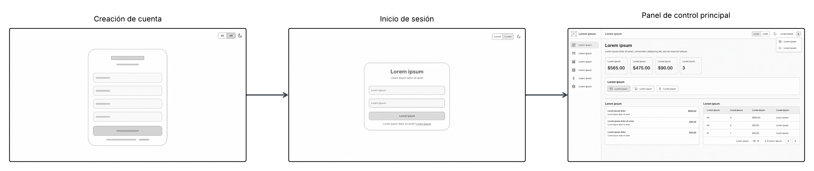
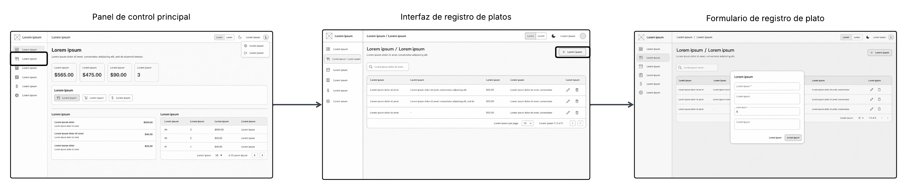
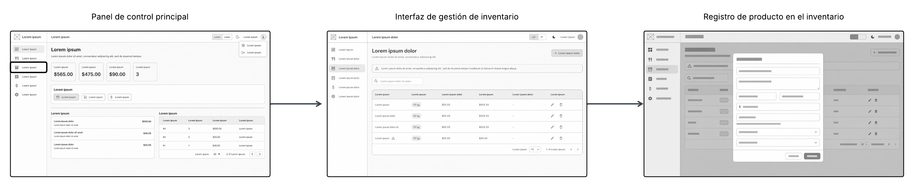
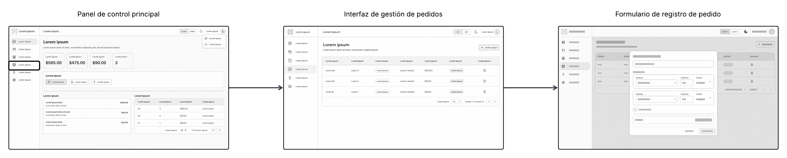
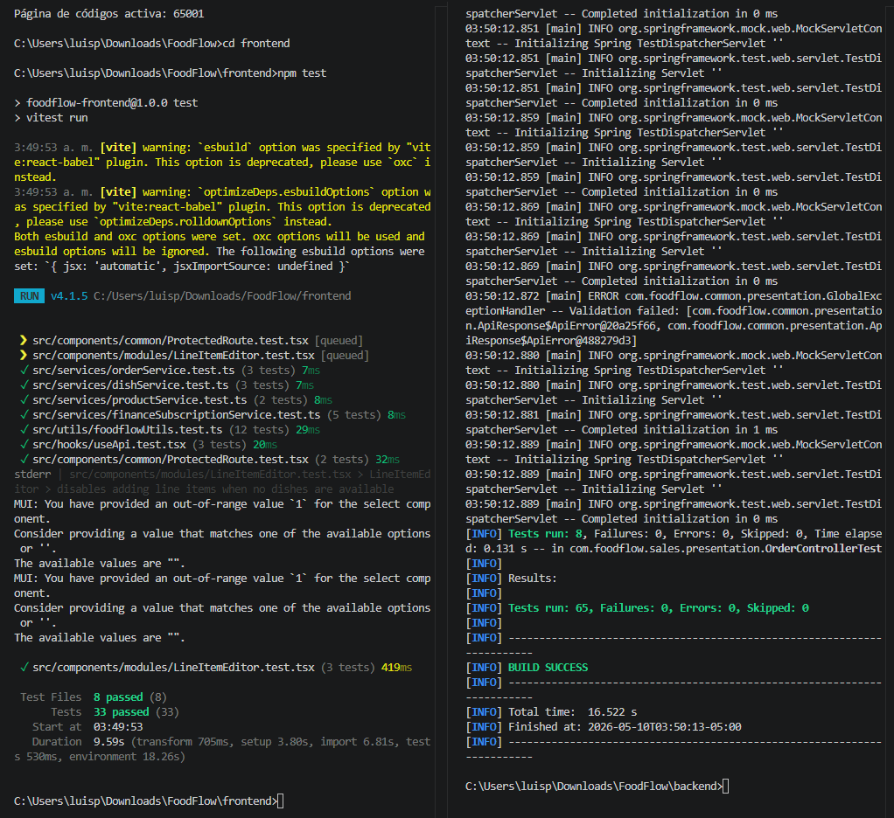
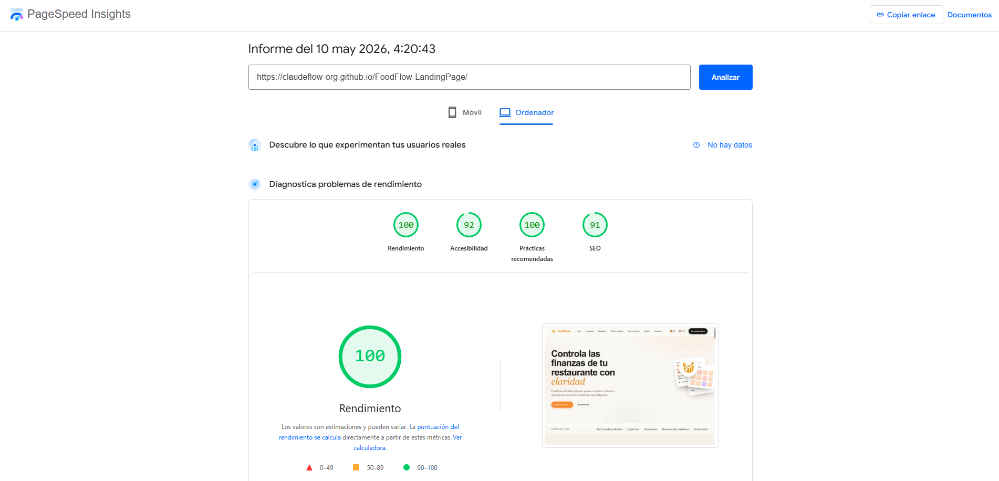
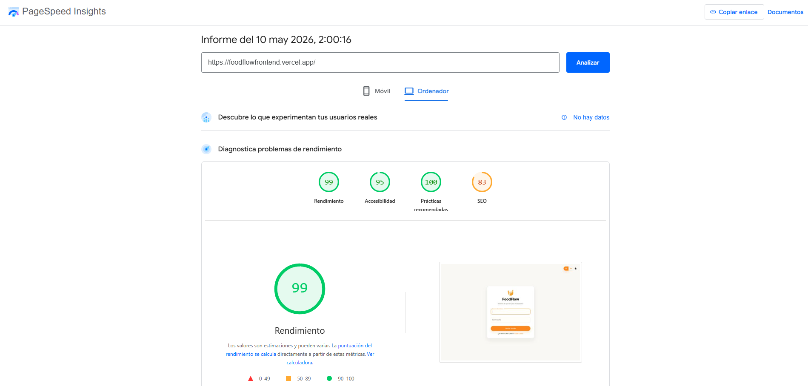

<p align="center">
  
</p>

# <p align="center">Universidad Peruana de Ciencias Aplicadas</p>
## <p align="center">Ingeniería de Software</p>
<p align="center">Periodo: 202610</p>
<p align="center">1ASI0732 | Diseño de Experimentos de Ingeniería de Software</p>
<p align="center">NRC: 17821</p>
<p align="center">Docente: Lennin Percy Cenas Vasquez</p>

---

<br>

## <p align="center">Informe del Trabajo Final</p>

<p align="center">Startup: ClaudeFlow</p>
<p align="center">Producto: FoodFlow</p>

---

<p align="center">Integrantes:</p>
<p align="center"><code>U202310308</code> - Borja Molina, Gabriel Sebastián</p>
<p align="center"><code>U202310003</code> - Lang Nassi, Werner Khalil</p>
<p align="center"><code>U202311334</code> - Rodriguez Rodriguez, Luis Piero</p>
<p align="center"><code>U202123373</code> - Román Pajuelo, Luis Gustavo</p>
<p align="center"><code>U202311532</code> - Suárez Romero, Santiago Manuel</p>
  
<br>

<p align="center"><i>Ciclo 202610</i></p>

<br>

<div style="page-break-after: always;"></div>

---

## Registro de versiones del informe
| Versión | Fecha | Autores | Descripción de la modificación |
| :--- | :--- | :--- | :--- |
| 1.0 (AV1) | 30/04/26 | - Borja Molina, Gabriel Sebastián<br>- Lang Nassi, Werner Khalil<br>- Rodriguez Rodriguez, Luis Piero<br>- Román Pajuelo, Luis Gustavo<br>- Suárez Romero, Santiago Manuel | **Capítulos I, II, III, IV y V** |

---

## Project Report Collaboration Insights

Para el desarrollo de este informe se utilizó GitHub como plataforma de colaboración y control de versiones. A continuación, se presentan algunos insights sobre la colaboración del equipo durante la elaboración del informe:

---

# Contenido

- [Registro de versiones del informe](#registro-de-versiones-del-informe)
- [Project Report Collaboration Insights](#project-report-collaboration-insights)
- [Student Outcome](#student-outcome)
- [Capítulo I: Introducción](#capítulo-i-introducción)
  - [1.1 Startup Profile](#11-startup-profile)
    - [1.1.1 Descripción de la Startup](#111-descripción-de-la-startup)
    - [1.1.2 Perfiles de integrantes del equipo](#112-perfiles-de-integrantes-del-equipo)
  - [1.2 Solution Profile](#12-solution-profile)
    - [1.2.1. Antecedentes y Problemática](#121-antecedentes-y-problemática)
      - [1.2.1.1. What](#1211-what)
      - [1.2.1.2. When](#1212-when)
      - [1.2.1.3. Where](#1213-where)
      - [1.2.1.4. Who](#1214-who)
      - [1.2.1.5. Why](#1215-why)
      - [1.2.1.6. How](#1216-how)
      - [1.2.1.7. How much](#1217-how-much)
        - [1.2.1.7.1 Estadísticas que sustentan la problemática](#12171-estadísticas-que-sustentan-la-problemática)
    - [1.2.2. Lean UX Process](#122-lean-ux-process)
      - [1.2.2.1. Lean UX Problem Statement](#1221-lean-ux-problem-statement)
      - [1.2.2.2. Lean UX Assumptions](#1222-lean-ux-assumptions)
      - [1.2.2.3. Lean UX Hypothesis Statements](#1223-lean-ux-hypothesis-statements)
      - [1.2.2.4. Minimum Viable Product](#1224-minimum-viable-product)
      - [1.2.2.5. Lean UX Canvas](#1224-lean-ux-canvas)
  - [1.3. Segmento Objetivo](#13-segmento-objetivo)
- [Capítulo II: Requirements \& Analysis](#capítulo-ii-requirements--analysis)
  - [2.1 Competidores](#21-competidores)
    - [2.1.1. Análisis competitivo](#211-análisis-competitivo)
    - [2.1.2. Estrategias y Tácticas Competitivas de FoodFlow](#212-estrategias-y-tácticas-competitivas-de-foodflow)
  - [2.2 Entrevistas](#22-entrevistas)
    - [2.2.1. Diseño de entrevistas](#221-diseño-de-entrevistas)
    - [2.2.2. Registro de entrevistas.](#222-registro-de-entrevistas)
    - [2.2.3. Análisis de entrevistas](#223-análisis-de-entrevistas)
  - [2.3 Needfinding](#23-needfinding)
    - [2.3.1 User Personas](#231-user-personas)
    - [2.3.2 User Task Matrix](#232-user-task-matrix)
    - [2.3.3 User Journey Mapping](#233-user-journey-mapping)
    - [2.3.4 Empathy Map](#234-empathy-map)
    - [2.3.5 As-is Scenario Mapping](#235-as-is-scenario-mapping)
  - [2.4 Ubiquitous Language](#24-ubiquitous-language)
- [Capítulo III: Requirements Specification](#capítulo-iii-requirements-specification)
  - [3.1 To-Be Scenario Mapping](#31-to-be-scenario-mapping)
  - [3.2 User Stories](#32-user-stories)
    - [3.2.1 Épicas del Proyecto](#321-épicas-del-proyecto)
    - [3.2.2 User Stories Detalladas](#322-user-stories-detalladas)
  - [3.3 Product Backlog](#33-product-backlog)
  - [3.4 Impact Map](#34-impact-map)
- [Capítulo IV: Product Design](#capítulo-iv-product-design)
  - [4.1 Style Guidelines](#41-style-guidelines)
    - [4.1.1. General Style Guidelines](#411-general-style-guidelines)
    - [4.1.2. Web Style Guidelines](#412-web-style-guidelines)
  - [4.2 Information Architecture](#42-information-architecture)
    - [4.2.1 Organization Systems](#421-organization-systems)
    - [4.2.2 Labeling Systems](#422-labeling-systems)
    - [4.2.3 SEO Tags and Meta Tags](#423-seo-tags-and-meta-tags)
    - [4.2.4 Searching Systems](#424-searching-systems)
    - [4.2.5 Navigation Systems](#425-navigation-systems)
  - [4.3 Landing Page UI Design](#43-landing-page-ui-design)
    - [4.3.1 Landing Page Wireframe](#431-landing-page-wireframe)
    - [4.3.2 Landing Page Mock-up](#432-landing-page-mock-up)
  - [4.4 Web Applications UX/UI Design](#44-web-applications-uxui-design)
    - [4.4.1 Web Applications Wireframes](#441-web-applications-wireframes)
    - [4.4.2 Web Applications Wireflow Diagrams](#442-web-applications-wireflow-diagrams)
    - [4.4.3 Web Applications Mock-ups](#443-web-applications-mock-ups)
    - [4.4.4 Web Applications User Flow Diagrams](#444-web-applications-user-flow-diagrams)
  - [4.5 Web Applications Prototyping](#45-web-applications-prototyping)
  - [4.6 Domain-Driven Software Architecture](#46-domain-driven-software-architecture)
    - [4.6.1 Software Architecture Context Diagram](#461-software-architecture-context-diagram)
    - [4.6.2 Software Architecture Container Diagrams.](#462-software-architecture-container-diagrams)
    - [4.6.3 Software Architecture Components Diagrams.](#463-software-architecture-components-diagrams)
      - [4.6.3.1 Bounded Context: Identity](#4631-bounded-context-identity)
      - [4.6.3.2 Bounded Context: Billing](#4632-bounded-context-billing)
      - [4.6.3.3 Bounded Context: Catalog](#4633-bounded-context-catalog)
      - [4.6.3.4 Bounded Context: Inventory](#4634-bounded-context-inventory)
      - [4.6.3.5 Bounded Context: Sales](#4635-bounded-context-sales)
      - [4.6.3.6 Bounded Context: Finance](#4636-bounded-context-finance)
  - [4.7 Software Object-Oriented Design](#47-software-object-oriented-design)
    - [4.7.1 Class Diagrams](#471-class-diagrams)
    - [4.7.1.1 Bounded Context: Identity](#4711-bounded-context-identity)
    - [4.7.1.2 Bounded Context: Catalog](#4712-bounded-context-catalog)
    - [4.7.1.3 Bounded Context: Inventory](#4713-bounded-context-inventory)
    - [4.7.1.4 Bounded Context: Sales](#4714-bounded-context-sales)
    - [4.7.1.5 Bounded Context: Finance](#4715-bounded-context-finance)
    - [4.7.1.6 Bounded Context: Billing](#4716-bounded-context-billing)
    - [4.7.2 Class Dictionary](#472-class-dictionary)
  - [4.8 Database Design](#48-database-design)
    - [4.8.1 Relational Database Diagram](#481-relational-database-diagram)
- [Capítulo V: Product Implementation](#capítulo-v-product-implementation)
  - [5.1. Software Configuration Management.](#51-software-configuration-management)
    - [5.1.1. Software Development Environment Configuration.](#511-software-development-environment-configuration)
    - [5.1.2. Source Code Management.](#512-source-code-management)
    - [5.1.3. Source Code Style Guide \& Conventions.](#513-source-code-style-guide--conventions)
    - [5.1.4. Software Deployment Configuration.](#514-software-deployment-configuration)
  - [5.2. Product Implementation \& Deployment.](#52-product-implementation--deployment)
    - [5.2.1. Sprint Backlogs.](#521-sprint-backlogs)
    - [5.2.2. Implemented Landing Page Evidence](#522-implemented-landing-page-evidence)
    - [5.2.3. Implemented Frontend-Web Application Evidence](#523-implemented-frontend-web-application-evidence)
    - [5.2.4. Acuerdo de Servicio - SaaS](#524-acuerdo-de-servicio---saas)
    - [5.2.5. Implemented Native-Mobile Application Evidence](#525-implemented-native-mobile-application-evidence)
    - [5.2.6. Implemented RESTful API and/or Serverless Backend Evidence](#526-implemented-restful-api-andor-serverless-backend-evidence)
    - [5.2.7. RESTful API documentation](#527-restful-api-documentation)
    - [5.2.8. Team Collaboration Insights](#528-team-collaboration-insights)
  - [5.3. Video About-the-Product](#53-video-about-the-product)
- [Capítulo VI: Product Verification & Validation](#capítulo-vi-product-verification--validation)
  - [6.1. Testing Suites & Validation](#61-testing-suites--validation)
    - [6.1.1. Core Entities Unit Tests](#611-core-entities-unit-tests)
    - [6.1.2. Core Integration Tests](#612-core-integration-tests)
    - [6.1.3. Core Behavior-Driven Development](#613-core-behavior-driven-development)
    - [6.1.4. Core System Tests](#614-core-system-tests)
- [Capítulo VII: DevOps Practices](#capítulo-vii-devops-practices)
  - [7.1. Continuous Integration](#71-continuous-integration)
    - [7.1.1. Tools and Practices](#711-tools-and-practices)
    - [7.1.2. Build & Test Suite Pipeline Components](#712-build--test-suite-pipeline-components)
  - [7.2. Continuous Delivery](#72-continuous-delivery)
    - [7.2.1. Tools and Practices](#721-tools-and-practices)
    - [7.2.2. Stages Deployment Pipeline Components](#722-stages-deployment-pipeline-components)
  - [7.3. Continuous Deployment](#73-continuous-deployment)
    - [7.3.1. Tools and Practices](#731-tools-and-practices)
    - [7.3.2. Production Deployment Pipeline Components](#732-production-deployment-pipeline-components)
- [Conclusiones y recomendaciones](#conclusiones-y-recomendaciones)
  - [Conclusiones](#conclusiones)
  - [Recomendaciones](#recomendaciones)
- [Bibliografía](#bibliografía)
- [Anexos](#anexos)

## Student Outcome

El curso contribuye al cumplimiento del Student Outcome ABET: ABET – EAC - Student Outcome 5 Criterio: La capacidad de funcionar efectivamente en un equipo cuyos miembros juntos proporcionan liderazgo, crean un entorno de colaboración e inclusivo, establecen objetivos, planifican tareas y cumplen objetivos. En el siguiente cuadro se describe las acciones realizadas y enunciados de conclusiones por parte del grupo, que permiten sustentar el haber alcanzado el logro del ABET – EAC - Student Outcome 5.

| Criterio específico | Acciones realizadas | Conclusiones |
|---------------------|---------------------|--------------|
| 4.c.1 Reconoce responsabilidad ética y profesional en situaciones de ingeniería de software | **Borja Molina, Gabriel Sebastián:** Redacté la introducción y añadí notas sobre manejo responsable de datos. También realicé diagramas de exploración de Bounded Contexts y Event Storming.<br>**Lang Nassi, Werner Khalil:** Conduje entrevistas garantizando consentimiento y anonimato, y limpié las transcripciones respetando la privacidad de participantes.<br>**Rodriguez Rodriguez, Luis Piero:** Definí user stories y criterios de aceptación incluyendo requerimientos de accesibilidad y validaciones para reducir sesgos en los datos.<br>**Román Pajuelo, Luis Gustavo:** Modelé los bounded contexts y establecí límites claros de responsabilidad y acceso a datos para preservar integridad y confidencialidad.<br>**Suárez Romero, Santiago Manuel:** Documenté la configuración de desarrollo y políticas de control de versiones, incluyendo recomendaciones de buenas prácticas profesionales y seguridad básica. | El equipo reforzó su compromiso con la ética y la responsabilidad en el desarrollo técnico, integrando prácticas que garantizan la protección de la información, el consentimiento informado y la correcta anonimización en el manejo de datos. Asimismo, se comprendió la importancia de diseñar requisitos inclusivos que prevengan sesgos y aseguren la accesibilidad, estableciendo límites claros de responsabilidad para mitigar riesgos de exposición de datos y adoptando estándares en la gestión de configuración y despliegue que elevan la trazabilidad y la rendición de cuentas en cada etapa del proyecto. |
| 4.c.2 Emite juicios informados considerando el impacto de las soluciones de ingeniería de software en contextos globales, económicos, ambientales y sociales | **Borja Molina, Gabriel Sebastián:** Analicé antecedentes del mercado y estimé supuestos económicos del producto, incorporando criterios de sostenibilidad financiera.<br>**Lang Nassi, Werner Khalil:** Evalué impactos sociales detectados en entrevistas y propuse mitigaciones operativas para minimizar carga administrativa en pequeños restaurantes.<br>**Rodriguez Rodriguez, Luis Piero:** Elaboré el backlog y prioricé historias que favorecen eficiencia de inventario (reducción de desperdicio) y mejoras medioambientales.<br>Román Pajuelo, Luis Gustavo: Diseñé la arquitectura de información y componentes para reducir redudancias y consumo innecesario de recursos computacionales.<br>**Suárez Romero, Santiago Manuel:** Documenté opciones de despliegue y configuración que optimizan costos y huella energética (uso de recursos, cadencias de actualización). | El equipo consolidó una visión integral en la que las decisiones técnicas y de diseño no solo responden a la eficiencia operativa y el rendimiento, sino que están intrínsecamente ligadas a la viabilidad económica y la responsabilidad ambiental. A lo largo del primer avance, se comprendió la importancia de priorizar funcionalidades y optimizar procesos para reducir el desperdicio de recursos y los costos de infraestructura, al mismo tiempo que se implementaron prácticas de despliegue equilibradas y medidas de mitigación orientadas a generar un impacto positivo y accesible para usuarios con recursos limitados. |

---

# Capítulo I: Introducción

## 1.1 Startup Profile

### 1.1.1 Descripción de la Startup

ClaudeFlow es una startup liderada por estudiantes de la Universidad Peruana de Ciencias Aplicadas (UPC), dedicada al desarrollo de soluciones digitales para la gestión financiera de restaurantes. Con el propósito de brindar a los dueños de negocios gastronómicos una herramienta accesible, intuitiva y especializada, se ha desarrollado el proyecto FoodFlow, una aplicación web orientada al monitoreo de la salud financiera del restaurante, la visualización de ingresos y gastos, el análisis de rentabilidad por plato, la gestión de inventario, el control de órdenes y la generación de reportes estratégicos. En ClaudeFlow, consideramos que una adecuada gestión financiera es fundamental para la sostenibilidad, rentabilidad y crecimiento de los restaurantes, especialmente en negocios pequeños y medianos que suelen operar con procesos manuales, hojas de cálculo o información dispersa. Por ello, FoodFlow busca convertirse en una solución tecnológica que permita transformar los datos operativos del restaurante en información clara y útil para la toma de decisiones.

**Misión:** Facilitar la gestión financiera de los restaurantes mediante una plataforma web intuitiva, accesible y especializada, que permita monitorear métricas económicas clave, analizar ingresos, gastos, inventario y ventas por plato, y optimizar la toma de decisiones estratégicas de los propietarios para mejorar la rentabilidad y reducir pérdidas operativas.

**Visión:** Convertirse en una startup referente en Latinoamérica en el desarrollo de soluciones de inteligencia financiera para restaurantes, impulsando la digitalización de pequeños y medianos negocios gastronómicos a través de herramientas tecnológicas que simplifiquen el control económico, fortalezcan la toma de decisiones basada en datos y contribuyan a la sostenibilidad financiera del sector.

### 1.1.2 Perfiles de integrantes del equipo

| Foto | Nombre | Codigo | Carrera | Acerca de | Habilidades |
| :--- | :--- | :--- | :--- | :--- | :--- |
|  | Borja Molina, Gabriel Sebastián | U202310308 | Ingeniería de Software | Estudiante en la Universidad Peruana de Ciencias Aplicadas (UPC). Enfocado en el desarrollo web y la creación de soluciones robustas orientadas al usuario. | Creativo, Amigable, Responsable, Proactivo |
|  | Lang Nassi, Werner Khalil | U202310003 | Ingeniería de Software | Estudiante de la Universidad Peruana de Ciencias Aplicadas (UPC), cursando en 7.º ciclo. Soy un estudiante que le gusta investigar cosas nuevas. | Investigador, Innovador, Analista, Cooperativo. |
|  | Rodriguez Rodriguez, Luis Piero | U202311334 | Ingeniería de Software | Estudiante de la Universidad Peruana de Ciencias Aplicadas (UPC), actualmente en 7mo ciclo, con interés en el rubro de desarrollo y análisis de datos. | Colaborativo, amigable, responsable, adaptativo |
|  | Román Pajuelo, Luis Gustavo | U202123373 | Ingeniería de Software | Estudiante de la Universidad Peruana de Ciencias Aplicadas (UPC), cursando en 7.º ciclo. Me considero un estudiante con ganas de seguir aprendiendo constantemente | Responsable, Cooperativo, Proactivo, Perseverante. |
|  | Suárez Romero, Santiago Manuel | U202311532 | Ingeniería de Software | Estudiante de la Universidad Peruana de Ciencias Aplicadas (UPC), cursando en 7.º ciclo. Soy un estudiante enfocado de desarrollo de aplicaciones fullstack y muchas ganas de aprender | Creativo, Cooperativo, Responsable, Perfeccionista |

## 1.2 Solution Profile

FoodFlow es una aplicación web diseñada para transformar la manera en que los restaurantes gestionan y analizan su información financiera y operativa. A través de una plataforma intuitiva, accesible y especializada, permite a los dueños de restaurantes visualizar ingresos, gastos, reportes, inventario, órdenes y rendimiento de platos de forma clara y centralizada. Con el objetivo de facilitar la toma de decisiones estratégicas y mejorar la rentabilidad del negocio, FoodFlow conecta la información diaria del restaurante con herramientas visuales que permiten comprender mejor su desempeño económico en un entorno digital moderno.

### 1.2.1. Antecedentes y Problemática

Con el fin de comprender con mayor claridad las necesidades de los usuarios de FoodFlow, resulta esencial examinar los antecedentes y la problemática mediante la técnica de las 5W’s & 2H’s. Según Alvarez (2020), citado por Lean Construction México, esta herramienta permite definir, estructurar y orientar un plan de acción o una estrategia detallada. Por ello, la información presentada a continuación ha sido organizada aplicando dicha metodología, con el propósito de analizar la situación actual de los dueños de restaurantes frente a la gestión financiera y operativa de sus negocios.

Las dos preguntas “H” de la técnica 5W+2H corresponden a “¿Cómo?” y “¿Cuánto?”. La pregunta “¿Cómo?” se enfoca en la manera en que se desarrollan las acciones o procesos, lo cual resulta clave para comprender y explicar una situación específica. En el contexto de FoodFlow, esta pregunta permitirá analizar cómo los dueños de restaurantes podrán adoptar la plataforma como una herramienta de apoyo para centralizar la información de su negocio, revisar ingresos y gastos, gestionar inventario, controlar órdenes, visualizar reportes y tomar decisiones estratégicas a partir de datos organizados. Esto incluye una experiencia web intuitiva, dashboards visuales, navegación clara entre módulos y funcionalidades orientadas a simplificar el monitoreo financiero diario del restaurante.

Por otro lado, la pregunta “¿Cuánto?” se centra en cuantificar la magnitud del problema y dimensionar su impacto. En este caso, los datos recopilados permitirán comprender con mayor profundidad las dificultades que enfrentan los restaurantes pequeños y medianos al gestionar sus finanzas mediante registros manuales, hojas de cálculo o sistemas poco integrados. Esto implica considerar la frecuencia con la que los dueños revisan sus ingresos y gastos, la cantidad de información dispersa entre órdenes, inventario y reportes, el tiempo invertido en consolidar datos de forma manual, el nivel de desconocimiento sobre la rentabilidad de los platos y el impacto positivo que puede generar centralizar la gestión financiera y operativa en una sola aplicación web como FoodFlow.

#### 1.2.1.1. What

##### ¿Cuál es el problema?

FoodFlow nace como respuesta a una problemática recurrente dentro del sector gastronómico: la dificultad que enfrentan los dueños de restaurantes para monitorear, interpretar y controlar adecuadamente la información financiera y operativa de sus negocios. Aunque la industria de restaurantes ha mostrado señales de crecimiento en el Perú, este avance no siempre se encuentra acompañado de una gestión interna eficiente. Según el Instituto Nacional de Estadística e Informática, la actividad de restaurantes aumentó 5.32 % en marzo de 2024 y acumuló un crecimiento de 3.03 % entre enero y marzo del mismo año, en comparación con el periodo similar de 2023 (INEI, 2024a). Asimismo, en noviembre de 2024, el sector creció 4.48 %, acumulando un incremento de 3.37 % entre enero y noviembre frente al año anterior (INEI, 2025).

Sin embargo, este crecimiento contrasta con una realidad crítica: muchos negocios gastronómicos no logran sostenerse debido a una gestión deficiente. Según lo señalado por Fernando Oré, coordinador culinario de la Universidad Le Cordon Bleu, aproximadamente el 70 % de los negocios relacionados con la venta de comida en el Perú cierran o se traspasan cada año a causa de una mala gestión (Guzmán, 2019). Esta situación evidencia que no basta con ofrecer buenos productos o contar con demanda; también es necesario disponer de herramientas que permitan controlar costos, inventario, ventas, márgenes y flujo de caja de manera constante.

Tradicionalmente, muchos restaurantes pequeños y medianos gestionan sus finanzas mediante cuadernos, hojas de cálculo, registros manuales o sistemas POS que se enfocan principalmente en ventas y facturación. Si bien estas herramientas pueden cubrir necesidades básicas, presentan limitaciones importantes al momento de obtener una visión integral del negocio. Entre las principales dificultades se encuentran la falta de reportes claros, la baja visibilidad sobre la rentabilidad por plato, la ausencia de control centralizado del inventario y la toma de decisiones basada en intuición más que en datos.

En este contexto, FoodFlow se presenta como una solución digital especializada que busca centralizar la información financiera y operativa del restaurante en una plataforma web intuitiva. A través de dashboards, reportes, gestión de inventario, control de órdenes y análisis de platos, el sistema permite que los dueños de restaurantes comprendan mejor el estado de su negocio y tomen decisiones más informadas.

##### ¿Cuál es la relación con la persona en cuestión?

Para los dueños de restaurantes, FoodFlow representa una herramienta de apoyo en la gestión diaria del negocio, ya que permite visualizar información clave sobre ingresos, gastos, órdenes, inventario y rendimiento de platos desde un entorno digital centralizado. La relación con el usuario se basa en la necesidad de reducir la incertidumbre financiera, mejorar el control operativo y facilitar la toma de decisiones estratégicas sin depender únicamente de registros manuales o conocimientos contables avanzados.

#### 1.2.1.2. When

##### ¿Cuándo sucede el problema?

El problema ocurre principalmente cuando el dueño del restaurante necesita tomar decisiones económicas u operativas y no cuenta con información clara, actualizada o integrada. Esto puede suceder en distintos momentos de la gestión diaria, semanal o mensual del negocio, especialmente cuando se requiere evaluar ventas, controlar gastos, revisar stock, identificar platos más rentables o analizar si el restaurante está generando ganancias reales.

Específicamente, esta problemática se presenta cuando:

* El dueño necesita conocer sus ingresos y pérdidas, pero la información se encuentra dispersa en hojas de cálculo, cuadernos o sistemas independientes.
* Se deben tomar decisiones sobre precios, compras o promociones sin contar con reportes financieros claros.
* El restaurante experimenta quiebres de stock o sobrecompra de insumos por falta de control de inventario.
* Se desconoce qué platos generan mayor rentabilidad o cuáles tienen menor desempeño.
* Se requiere revisar el flujo de caja, pero no existen métricas visuales que faciliten su interpretación.
* El propietario depende de terceros para comprender la situación financiera del negocio.

Estas situaciones dificultan una gestión oportuna y aumentan el riesgo de pérdidas acumuladas, decisiones poco sustentadas y menor sostenibilidad financiera.

##### ¿Cuándo utiliza el cliente el servicio?

El cliente utiliza FoodFlow cuando necesita consultar, registrar o analizar información relevante para la gestión de su restaurante. Esto puede ocurrir al iniciar la jornada, al cierre del día, durante la revisión semanal de resultados o al preparar decisiones relacionadas con compras, menú, precios y control financiero.

Asimismo, el dueño del restaurante puede usar la plataforma cuando desea visualizar reportes diarios, semanales o mensuales; revisar el estado del inventario; analizar las órdenes registradas; consultar el rendimiento de sus platos; o verificar la situación general del negocio desde el dashboard principal. De esta forma, FoodFlow se convierte en una herramienta de consulta y control continuo para la administración del restaurante.

#### 1.2.1.3. Where

##### ¿Dónde está el cliente cuando usa el producto?

FoodFlow está diseñado como una aplicación web, por lo que el usuario puede acceder a la plataforma desde un dispositivo con conexión a internet, principalmente desde una computadora o laptop. El dueño del restaurante puede utilizar el sistema desde el mismo local, una oficina administrativa, su hogar o cualquier espacio donde necesite revisar la información de su negocio.

Esta accesibilidad permite que la gestión financiera y operativa no dependa únicamente de la presencia física en el restaurante, sino que pueda realizarse desde un entorno digital que centraliza los datos más importantes del negocio.

##### ¿Dónde surge el problema?

La problemática surge principalmente dentro de los restaurantes pequeños y medianos, especialmente en aquellos donde la información financiera, las ventas, las compras y el inventario se gestionan de manera manual o poco integrada. También aparece en contextos donde el dueño no cuenta con un sistema especializado para interpretar sus datos y debe apoyarse en herramientas genéricas que no responden completamente a las necesidades del sector gastronómico.

El problema se evidencia en la administración diaria del negocio: en la caja, en la cocina, en el control de insumos, en la planificación de compras, en la revisión de ventas y en la evaluación de resultados. Cada una de estas áreas genera información valiosa, pero si no se encuentra organizada y conectada, pierde utilidad para la toma de decisiones.

#### 1.2.1.4. Who

##### ¿Quiénes están involucrados?

Los principales involucrados son los dueños de restaurantes, quienes necesitan información clara para controlar la salud financiera y operativa de su negocio. También se encuentran involucrados los administradores, encargados de caja, responsables de inventario y personal que registra órdenes o actualiza información relacionada con productos y platos.

Aunque FoodFlow está orientado principalmente al propietario del restaurante, su impacto se relaciona con todo el funcionamiento interno del negocio, ya que la información registrada sobre ventas, órdenes, inventario y platos permite construir una visión más completa del desempeño del restaurante.

##### ¿A quiénes les sucede el problema?

El problema afecta principalmente a dueños de restaurantes pequeños y medianos que no cuentan con herramientas especializadas para monitorear sus finanzas y operaciones. Este segmento suele enfrentar limitaciones de tiempo, presupuesto y conocimiento técnico, lo que dificulta la adopción de soluciones empresariales complejas o de alto costo.

Asimismo, afecta a restaurantes que dependen de registros manuales, hojas de cálculo o sistemas POS con reportes limitados. En estos casos, el propietario puede conocer cuánto vendió durante el día, pero no necesariamente comprende si sus platos son rentables, si sus gastos están controlados o si el inventario está siendo gestionado de forma eficiente.

##### ¿Quién lo utilizará?

FoodFlow será utilizado principalmente por dueños de restaurantes que buscan una herramienta sencilla, visual y especializada para gestionar su información financiera y operativa. También podrá ser empleado por administradores o responsables internos que apoyen en el registro y seguimiento de datos relacionados con órdenes, inventario, menú, reportes y perfil del negocio.

El usuario objetivo no necesariamente posee conocimientos contables avanzados, por lo que la plataforma prioriza una experiencia clara, accesible y orientada a la toma de decisiones. De esta manera, FoodFlow se adapta a propietarios que necesitan comprender rápidamente el estado de su restaurante sin recurrir a procesos complejos o herramientas demasiado técnicas.

#### 1.2.1.5. Why

##### ¿Cuál es la causa del problema?

La causa principal del problema es la falta de una gestión financiera y operativa integrada en los restaurantes pequeños y medianos. Muchos negocios del sector gastronómico se enfocan en la producción, atención al cliente y ventas diarias, pero dejan en segundo plano el análisis de costos, márgenes, inventario y rentabilidad. Esto provoca que las decisiones se tomen de manera reactiva, sin una visión clara del impacto económico que generan.

Una segunda causa es la dependencia de herramientas manuales o genéricas. El uso de cuadernos, hojas de cálculo o reportes básicos de POS puede ser útil en etapas iniciales, pero se vuelve insuficiente cuando el negocio necesita analizar tendencias, comparar periodos, identificar categorías de gasto o evaluar el rendimiento de cada plato. Según NetSuite, la gestión financiera en restaurantes implica presupuestar, controlar costos, gestionar flujo de caja, definir precios, negociar con proveedores y monitorear operaciones en un entorno de márgenes reducidos (NetSuite, 2025). Por ello, la falta de sistemas adecuados limita la capacidad del propietario para sostener la rentabilidad.

Otra causa importante se relaciona con el inventario. En restaurantes, una mala gestión de insumos puede generar sobrecompras, desperdicio, quiebres de stock, pérdidas por vencimiento o decisiones de compra poco eficientes. Sage señala que los altos costos de alimentos suelen originarse por sobreordenamiento, desperdicio, robos, control inconsistente de porciones o precios de menú inadecuados (Sage, 2025). En consecuencia, cuando el inventario no se controla de manera constante, se afecta directamente la rentabilidad del negocio.

Finalmente, la falta de visibilidad financiera provoca que muchos propietarios no identifiquen a tiempo los problemas. Pueden existir ventas constantes, pero también gastos ocultos, baja rentabilidad por plato o pérdidas acumuladas. Esta falta de claridad incrementa el riesgo de sostenibilidad y dificulta que el restaurante crezca de manera ordenada.

#### 1.2.1.6. How

##### ¿En qué condiciones los clientes utilizan nuestro producto?

Los clientes utilizan FoodFlow en condiciones relacionadas con la gestión diaria y estratégica del restaurante. Principalmente, acceden a la plataforma cuando necesitan revisar indicadores financieros, consultar reportes, registrar productos, visualizar órdenes, gestionar platos o analizar información del negocio desde un dashboard centralizado.

Estas condiciones suelen presentarse durante la operación del restaurante, al cierre de caja, en la planificación de compras, en la revisión de resultados semanales o al evaluar cambios en el menú. En todos estos casos, FoodFlow permite organizar la información y transformarla en datos visuales que facilitan la comprensión del estado financiero y operativo del negocio.

##### ¿Cómo nos conocieron los clientes?

Los clientes pueden conocer FoodFlow mediante canales digitales como redes sociales, landing page, recomendaciones, presentaciones académicas o campañas orientadas a restaurantes pequeños y medianos. Al tratarse de una solución web enfocada en la gestión financiera gastronómica, la comunicación del producto se centra en mostrar su utilidad para reducir pérdidas, controlar mejor el inventario, comprender ingresos y gastos, y tomar decisiones basadas en información clara.

##### ¿Cómo prefieren los dueños de restaurantes acceder a nuestro contenido?

Los dueños de restaurantes prefieren acceder a la información de manera rápida, visual y sencilla. Por ello, FoodFlow organiza los datos mediante dashboards, gráficos, tablas y reportes que permiten interpretar el estado del negocio sin revisar grandes volúmenes de información de forma manual.

La plataforma responde a la necesidad de contar con una experiencia intuitiva, donde el usuario pueda consultar métricas clave, alternar entre periodos de tiempo, revisar platos, órdenes e inventario, y obtener una visión general de la salud financiera del restaurante. Esta forma de acceso resulta especialmente valiosa para propietarios que necesitan información práctica y accionable.

##### ¿Qué llevó a la persona a llegar a esta situación?

El dueño de restaurante llega a esta situación debido a una combinación de factores operativos, financieros y tecnológicos. En muchos casos, el crecimiento del negocio se produce de manera rápida o informal, sin que exista una estructura adecuada para controlar costos, inventario y rentabilidad. Al inicio, los registros manuales pueden parecer suficientes, pero conforme aumentan las órdenes, los productos, los gastos y la complejidad del menú, la información se vuelve más difícil de administrar.

Además, muchos propietarios se enfocan principalmente en vender, atender clientes y mantener la calidad del servicio, dejando el análisis financiero como una actividad secundaria. Esta dinámica puede generar una falsa sensación de estabilidad, ya que vender más no siempre significa ganar más. Sin reportes claros, el dueño puede no identificar a tiempo pérdidas por insumos, platos poco rentables, compras mal planificadas o gastos que reducen el margen de utilidad.

Todo esto conduce a una gestión basada en intuición, donde las decisiones se toman a partir de la experiencia diaria, pero no necesariamente con respaldo de datos. FoodFlow busca atender esta necesidad mediante una plataforma que centraliza la información y facilita su análisis.

#### 1.2.1.7. How much

##### 1.2.1.7.1 Estadísticas que sustentan la problemática

Según el Instituto Nacional de Estadística e Informática, la actividad de restaurantes creció 5.32 % en marzo de 2024 y acumuló un incremento de 3.03 % entre enero y marzo del mismo año, en comparación con el periodo similar de 2023 (INEI, 2024a). Este crecimiento evidencia que el sector gastronómico mantiene dinamismo y continúa siendo relevante dentro de la economía peruana.

Asimismo, el INEI reportó que en noviembre de 2024 la actividad de restaurantes aumentó 4.48 %, mientras que entre enero y noviembre de ese año el sector acumuló un crecimiento de 3.37 % frente al mismo periodo de 2023 (INEI, 2025). Esto demuestra que existe una demanda activa en el mercado gastronómico, pero también una mayor necesidad de que los restaurantes gestionen sus operaciones con herramientas más eficientes.

A pesar de este crecimiento, la sostenibilidad de los negocios gastronómicos sigue siendo un desafío. Según Fernando Oré, aproximadamente el 70 % de los negocios relacionados con la venta de comida en el Perú cierran o se traspasan cada año debido a una mala gestión (Guzmán, 2019). Este dato refuerza la importancia de contar con soluciones que ayuden a los propietarios a controlar sus finanzas, operaciones e inventario de manera más organizada.

En cuanto a la gestión interna, NetSuite señala que la administración financiera en restaurantes involucra presupuestos, control de costos, manejo de flujo de caja, fijación de precios, negociación con proveedores y monitoreo de operaciones, todo dentro de una industria competitiva y de márgenes reducidos (NetSuite, 2025). Por su parte, Sage indica que los altos costos de alimentos pueden originarse por sobrecompra, desperdicio, robos, control inconsistente de porciones o precios de menú inadecuados, lo que evidencia la importancia de un inventario bien gestionado (Sage, 2025).

Estas estadísticas y referencias permiten concluir que FoodFlow responde a una problemática real: los restaurantes necesitan herramientas digitales que les permitan centralizar información, controlar sus recursos, analizar resultados y tomar decisiones basadas en datos para mejorar su rentabilidad y sostenibilidad.


### 1.2.2. Lean UX Process

En esta sección se presenta el proceso Lean UX aplicado al desarrollo de FoodFlow, con el objetivo de comprender el problema desde la perspectiva del usuario, identificar las principales necesidades del segmento objetivo y establecer hipótesis que orienten la validación de la propuesta de valor. Este proceso incluye la formulación del Lean UX Problem Statement, la definición de supuestos de negocio, usuario y solución, así como la construcción de hipótesis que permiten evaluar la viabilidad, utilidad y adopción de la plataforma.

FoodFlow se plantea como una solución digital enfocada en dueños de restaurantes pequeños y medianos que requieren mayor visibilidad sobre sus ingresos, gastos, inventario, órdenes y rendimiento de platos. A partir de este enfoque, el proceso Lean UX permite alinear las funcionalidades del producto con los problemas reales del usuario, evitando desarrollar una herramienta genérica y priorizando una experiencia simple, visual y orientada a la toma de decisiones.

#### 1.2.2.1. Lean UX Problem Statement

FoodFlow busca ofrecer un entorno digital de gestión financiera y operativa que centralice la información más relevante de un restaurante en una sola plataforma web. A través de este entorno, los dueños de restaurantes pueden visualizar ingresos y pérdidas, revisar reportes financieros, gestionar inventario, controlar órdenes y analizar el desempeño de sus platos, con el propósito de tomar decisiones más informadas y reducir la dependencia de registros manuales o herramientas dispersas.

Hemos observado un factor crítico que afecta el desempeño de muchos restaurantes pequeños y medianos: la falta de visibilidad clara, integrada y oportuna sobre la situación financiera del negocio. Actualmente, varios propietarios gestionan sus operaciones mediante cuadernos, hojas de cálculo, sistemas POS básicos o reportes aislados, lo que dificulta comprender la rentabilidad real, identificar pérdidas, controlar insumos y evaluar el comportamiento de las ventas. Esta fragmentación limita la capacidad del dueño para actuar de manera preventiva y tomar decisiones estratégicas basadas en datos.

El desafío principal consiste en diseñar una plataforma accesible, intuitiva y especializada que permita a los dueños de restaurantes monitorear sus finanzas y operaciones sin requerir conocimientos contables avanzados. FoodFlow debe ofrecer una experiencia clara, visual y práctica, capaz de transformar la información diaria del restaurante en indicadores útiles para mejorar la rentabilidad, optimizar recursos y fortalecer la sostenibilidad del negocio.

¿Cómo podemos diseñar una plataforma web de gestión financiera para restaurantes que centralice ingresos, gastos, inventario, órdenes, reportes y rendimiento de platos, permitiendo que los dueños tomen decisiones estratégicas de manera sencilla, accesible y basada en datos?

#### 1.2.2.2. Lean UX Assumptions

##### Features

* Dashboard financiero con visualización de ingresos, pérdidas y variaciones.
* Reportes financieros diarios, semanales y mensuales.
* Gestión de inventario con visualización de productos, stock, costo unitario y unidad de medida.
* Registro y administración de platos del menú.
* Gestión de órdenes con cálculo de totales y registro de información relevante.
* Visualización de platos más vendidos o con mayor rendimiento.
* Análisis de categorías de gastos mediante gráficos y reportes.
* Gestión de perfil de usuario y datos de cuenta.
* Autenticación mediante registro e inicio de sesión.
* Visualización y gestión de planes de suscripción.

##### Business Outcomes

**Generación de ingresos recurrentes:**  
FoodFlow busca operar bajo un modelo SaaS basado en planes de suscripción, permitiendo generar ingresos mensuales o periódicos a partir del uso de la plataforma por parte de restaurantes pequeños y medianos. Este modelo permite sostener la evolución del producto, mejorar la calidad del servicio y mantener una propuesta accesible para negocios que no pueden asumir los costos de soluciones empresariales complejas.

**Diferenciación en el mercado gastronómico:**  
A diferencia de herramientas contables genéricas o sistemas POS enfocados principalmente en facturación, FoodFlow se posiciona como una solución especializada en la gestión financiera y operativa de restaurantes. Su propuesta de valor se centra en ofrecer dashboards visuales, reportes financieros, control de inventario y análisis de platos en un entorno diseñado específicamente para las necesidades del sector gastronómico.

**Optimización de la toma de decisiones:**  
Uno de los principales resultados esperados es que los dueños de restaurantes puedan dejar de tomar decisiones únicamente por intuición y comiencen a apoyarse en información estructurada. Al centralizar datos de ingresos, gastos, órdenes, inventario y menú, FoodFlow permite que el usuario identifique tendencias, evalúe el rendimiento del negocio y actúe de forma más estratégica.

**Reducción de pérdidas operativas:**  
FoodFlow busca contribuir a la reducción de pérdidas asociadas a una mala gestión de inventario, desconocimiento de gastos, falta de seguimiento de órdenes o ausencia de reportes claros. Al ofrecer una visión más completa del negocio, la plataforma permite identificar áreas críticas y mejorar el control sobre los recursos del restaurante.

**Adopción en restaurantes pequeños y medianos:**  
El producto está orientado a un segmento que requiere soluciones accesibles, sencillas y de rápida implementación. Por ello, FoodFlow busca ser adoptado por restaurantes independientes, cafeterías, pastelerías y negocios gastronómicos que necesitan profesionalizar su gestión sin depender de herramientas demasiado complejas.

##### User Benefits

* Acceso a una visión centralizada de la situación financiera del restaurante desde un dashboard visual.
* Mayor claridad sobre ingresos, gastos, pérdidas y variaciones del negocio.
* Control más organizado del inventario, productos, stock y costos unitarios.
* Identificación de platos con mejor desempeño para apoyar decisiones sobre el menú.
* Registro y seguimiento de órdenes para mantener un control operativo más ordenado.
* Análisis de reportes financieros por distintos periodos de tiempo.
* Reducción del uso de registros manuales, hojas de cálculo dispersas o procesos poco integrados.
* Ahorro de tiempo en la revisión de información financiera y operativa.
* Apoyo en la toma de decisiones estratégicas relacionadas con precios, compras, platos e inventario.
* Experiencia web intuitiva, pensada para usuarios sin conocimientos contables avanzados.

##### Business Assumptions

1. Creemos que los dueños de restaurantes pequeños y medianos están dispuestos a pagar una suscripción si la plataforma les ayuda a comprender mejor sus finanzas, reducir pérdidas y mejorar la rentabilidad del negocio.
2. Creemos que los restaurantes independientes necesitan una solución más especializada que una hoja de cálculo o un sistema POS básico.
3. Creemos que el segmento inicial con mayor potencial está conformado por restaurantes pequeños, cafeterías, pastelerías y negocios gastronómicos que aún gestionan parte de su información de forma manual.
4. Creemos que la competencia principal estará conformada por sistemas POS, software contables genéricos y plataformas de gestión empresarial con mayor complejidad o costo.
5. Creemos que la adopción del producto dependerá de que el usuario perciba rápidamente valor en la visualización de reportes, control de inventario y monitoreo de indicadores financieros.
6. Creemos que la retención dependerá de la frecuencia con la que el dueño utilice el dashboard para revisar la salud financiera de su restaurante.

##### User Assumptions

1. Creemos que los dueños de restaurantes necesitan reportes claros de ingresos y pérdidas para tener un control real sobre el estado económico del negocio.
2. Creemos que los usuarios requieren identificar los platos más vendidos o con mejor desempeño para tomar decisiones sobre precios, menú y compras.
3. Creemos que los dueños valoran una plataforma visual e intuitiva porque no todos cuentan con conocimientos contables avanzados.
4. Creemos que los usuarios prefieren consultar gráficos, tarjetas de resumen y paneles consolidados antes que revisar tablas extensas o archivos dispersos.
5. Creemos que los dueños necesitan revisar información en distintos periodos de tiempo, como reportes diarios, semanales y mensuales.
6. Creemos que los usuarios buscan reducir errores derivados del registro manual y mejorar la organización de sus operaciones.

##### Solution Assumptions

1. Creemos que un dashboard con indicadores de ingresos, gastos y pérdidas permitirá al dueño comprender rápidamente la salud financiera de su restaurante.
2. Creemos que la visualización de reportes diarios, semanales y mensuales facilitará el análisis de tendencias y la toma de decisiones estratégicas.
3. Creemos que un módulo de inventario permitirá mejorar el control de productos, stock, costos y unidades de medida.
4. Creemos que la gestión de órdenes permitirá mantener un registro más organizado de las ventas realizadas.
5. Creemos que el análisis de platos ayudará al dueño a identificar patrones de consumo y oportunidades de mejora en el menú.
6. Creemos que una interfaz clara, accesible y de baja curva de aprendizaje aumentará la adopción de la plataforma.
7. Creemos que la integración de módulos financieros y operativos en una sola aplicación reducirá la dependencia de herramientas externas o procesos manuales.

##### ¿Quién es el usuario?

El usuario principal de FoodFlow es el dueño de un restaurante pequeño o mediano que necesita controlar mejor la situación financiera y operativa de su negocio. También pueden utilizar la plataforma administradores o encargados que participen en el registro de órdenes, revisión de inventario, actualización del menú o consulta de reportes. Estos usuarios buscan una herramienta sencilla, visual y especializada que les permita organizar la información del restaurante sin depender exclusivamente de hojas de cálculo, cuadernos o sistemas poco integrados.

##### ¿Dónde encaja nuestro producto, en su trabajo o en su vida?

FoodFlow se integra directamente en la gestión diaria del restaurante. El producto acompaña al usuario en momentos clave como la revisión de ingresos, el control de gastos, la actualización de inventario, el registro de órdenes, la evaluación del menú y el análisis de reportes financieros. Su función principal es convertirse en un punto central de consulta y control, permitiendo que el dueño tenga una visión clara del desempeño del negocio y pueda tomar decisiones con mayor seguridad.

##### ¿Qué problemas tiene nuestro producto y cómo se pueden resolver?

Los principales riesgos del producto están relacionados con la resistencia al cambio, la percepción de complejidad y la costumbre de seguir utilizando métodos tradicionales como Excel, cuadernos o reportes aislados. Estos problemas pueden resolverse mediante una interfaz intuitiva, una navegación sencilla entre módulos, visualizaciones claras, mensajes de validación comprensibles y una experiencia enfocada en mostrar valor desde el primer uso. De esta manera, FoodFlow debe reducir la fricción inicial y demostrar que centralizar la información permite ahorrar tiempo y mejorar la gestión del restaurante.

##### ¿Cuándo y cómo es usado nuestro producto?

FoodFlow se utiliza de forma recurrente durante la operación y administración del restaurante. El usuario puede acceder a la plataforma al inicio de la jornada para revisar el estado general del negocio, durante el día para registrar o consultar información operativa, y al cierre para analizar ingresos, gastos, órdenes e inventario. También puede emplearse en revisiones semanales o mensuales para evaluar tendencias, comparar resultados y tomar decisiones relacionadas con compras, precios, menú o planificación financiera.

##### ¿Qué características son importantes?

Las características más importantes de FoodFlow son el dashboard financiero, los reportes por periodo, la gestión de inventario, la administración del menú, el registro de órdenes, el análisis de platos, la visualización de gastos por categoría, la autenticación segura, la gestión de perfil y la visualización de planes de suscripción. Estas funcionalidades permiten que el usuario tenga una experiencia integral de control financiero y operativo sin abandonar la simplicidad necesaria para restaurantes pequeños y medianos.

##### ¿Cómo debe verse nuestro producto y cómo debe comportarse?

FoodFlow debe tener un diseño moderno, profesional, claro y visualmente ordenado. La plataforma debe priorizar la lectura rápida de indicadores, el uso de gráficos comprensibles, la navegación simple entre secciones y una distribución de información que no sobrecargue al usuario. Su comportamiento debe ser fluido, confiable y consistente, permitiendo registrar, consultar y analizar información sin procesos innecesarios. La experiencia debe transmitir control, claridad y confianza, de modo que el usuario perciba la plataforma como una herramienta práctica para gestionar mejor su restaurante.

#### 1.2.2.3. Lean UX Hypothesis Statements

##### Business Hypotheses

Creemos que, al ofrecer FoodFlow como una plataforma SaaS por suscripción para dueños de restaurantes pequeños y medianos, obtendremos ingresos recurrentes y sostenibles para la startup. Sabremos que hemos tenido éxito cuando al menos el 60 % de los usuarios de prueba se conviertan en clientes de pago después de 30 días.

Creemos que, al centralizar la gestión financiera y operativa en un solo dashboard, para dueños de restaurantes que actualmente trabajan con herramientas dispersas, obtendremos una mayor percepción de valor y uso frecuente de la plataforma. Sabremos que hemos tenido éxito cuando al menos el 70 % de los usuarios ingresen al dashboard tres o más veces por semana.

Creemos que, al posicionar FoodFlow como una solución especializada para restaurantes y no como un software contable genérico, obtendremos una mayor diferenciación frente a POS básicos y herramientas financieras tradicionales. Sabremos que hemos tenido éxito cuando los usuarios identifiquen la especialización gastronómica como una de las principales razones para adoptar la plataforma.

##### User Hypotheses

Creemos que, al mostrar reportes claros de ingresos, gastos y pérdidas, para dueños de restaurantes que necesitan comprender el estado económico de su negocio, obtendremos decisiones más rápidas y mejor sustentadas. Sabremos que hemos tenido éxito cuando el 80 % de los usuarios consulte reportes financieros semanales sin depender de herramientas externas.

Creemos que, al visualizar los platos más vendidos o con mejor desempeño, para dueños que buscan optimizar su menú, obtendremos una mejor capacidad para ajustar precios, priorizar productos y planificar compras. Sabremos que hemos tenido éxito cuando al menos el 50 % de los usuarios realice ajustes en su menú o decisiones relacionadas con platos durante los primeros dos meses de uso.

Creemos que, al incorporar una gestión de inventario clara y actualizada, para restaurantes que presentan quiebres de stock o compras poco planificadas, obtendremos una reducción de pérdidas operativas y una mejor organización de insumos. Sabremos que hemos tenido éxito cuando los usuarios reporten una disminución de al menos 30 % en pedidos no atendidos por falta de productos o insumos.

##### Solution Hypotheses

Creemos que, al consolidar reportes financieros diarios, semanales y mensuales mediante gráficos fáciles de interpretar, para dueños que necesitan analizar tendencias sin revisar grandes volúmenes de datos, obtendremos mayor claridad en el control del negocio. Sabremos que hemos tenido éxito cuando el 70 % de los usuarios valore positivamente la usabilidad de los gráficos en encuestas de satisfacción.

Creemos que, al integrar módulos de dashboard, inventario, menú, órdenes y reportes dentro de una sola aplicación web, para usuarios que actualmente trabajan con información dispersa, obtendremos una experiencia de gestión más ordenada y eficiente. Sabremos que hemos tenido éxito cuando los usuarios indiquen que la plataforma reduce el tiempo dedicado a revisar información del restaurante.

Creemos que, al diseñar una interfaz intuitiva y de baja curva de aprendizaje, para dueños de restaurantes sin conocimientos contables avanzados, obtendremos mayor adopción y menor abandono inicial. Sabremos que hemos tenido éxito cuando la mayoría de usuarios pueda completar tareas básicas como consultar reportes, revisar inventario y visualizar órdenes sin asistencia externa.

Creemos que, al incluir análisis de ventas y rendimiento de platos, para usuarios que necesitan identificar patrones de consumo, obtendremos una mejor comprensión del comportamiento del menú. Sabremos que hemos tenido éxito cuando al menos el 40 % de los usuarios consulte esta información semanalmente durante los primeros tres meses.

<div style="page-break-after: always;"></div>

#### 1.2.2.4. Minimum Viable Product

El MVP de FoodFlow debe enfocarse en validar, en el menor tiempo posible, los elementos esenciales de la propuesta de valor del producto. La pregunta principal que guía esta etapa es:

**What’s the most important thing we need to learn first?**

En el caso de FoodFlow, lo más importante es comprobar si los dueños de restaurantes consideran útil una plataforma web que centralice información financiera y operativa, permitiéndoles comprender mejor el estado de su negocio y tomar decisiones con mayor claridad.

Por ello, el MVP debe ser una versión simplificada del sistema que permita trabajar con datos iniciales o simulados, validar la interacción del usuario con los módulos principales y comprobar el interés real por las funcionalidades clave de la plataforma. Las funcionalidades prioritarias a incluir son:

**Dashboard financiero:** Permite validar si los usuarios encuentran útil visualizar en una sola pantalla indicadores como ingresos, pérdidas, variaciones y métricas generales del restaurante.

**Gestión de inventario:** Permite evaluar si los dueños de restaurantes valoran contar con una tabla organizada de productos, stock actual, costo unitario y unidad de medida para mejorar el control de insumos.

**Gestión de menú y platos:** Permite comprobar si los usuarios necesitan registrar, buscar y visualizar información de sus platos para mantener un control más claro sobre su oferta gastronómica.

**Gestión de órdenes:** Permite validar si el registro y visualización de órdenes ayuda a los usuarios a mantener un seguimiento más ordenado de las ventas realizadas.

**Reportes financieros:** Permite probar si los usuarios consideran relevante analizar ingresos, gastos y categorías en periodos diarios, semanales o mensuales para tomar decisiones basadas en datos.

De esta manera, el MVP de FoodFlow busca validar si la centralización de información financiera y operativa en una plataforma sencilla, visual y accesible responde realmente a las necesidades de los restaurantes pequeños y medianos.

#### 1.2.2.5. Lean UX Canvas


## 1.3. Segmento Objetivo

Con el objetivo de orientar adecuadamente el desarrollo de FoodFlow y asegurar que la plataforma responda a necesidades reales del mercado gastronómico, se ha definido un único segmento objetivo principal. Este segmento concentra a los usuarios que enfrentan directamente los principales problemas de gestión financiera, control operativo y toma de decisiones dentro de restaurantes pequeños y medianos.

**Segmento objetivo: Dueños de restaurantes**

Este segmento está conformado por propietarios de restaurantes pequeños y medianos que necesitan mejorar el control financiero y operativo de sus negocios. Estos usuarios son responsables de tomar decisiones relacionadas con ingresos, gastos, precios, inventario, platos, compras y rentabilidad; sin embargo, en muchos casos no cuentan con herramientas digitales especializadas que les permitan visualizar esta información de manera clara, centralizada y oportuna.

Los dueños de restaurantes suelen apoyarse en hojas de cálculo, cuadernos, reportes manuales o sistemas POS básicos para registrar parte de sus operaciones. Aunque estas herramientas pueden ser útiles para tareas específicas, no siempre permiten obtener una visión completa del estado financiero del negocio. Por ello, FoodFlow se enfoca en este segmento, ofreciendo una plataforma web que permite monitorear indicadores clave, organizar información operativa y facilitar la toma de decisiones basada en datos.

**Aspectos demográficos:**

* Sexo: Masculino y femenino
* Rango de edad: A partir de los 25 años de edad
* Ocupación: Dueños, propietarios o administradores principales de restaurantes, cafeterías, pastelerías y negocios gastronómicos independientes
* Nivel socioeconómico: clases B y C, principalmente emprendedores y pequeños empresarios con capacidad de inversión en herramientas digitales accesibles
* Nivel de conocimiento tecnológico: básico a intermedio, con disposición a utilizar plataformas web simples e intuitivas

**Aspectos geográficos:**

* Nacionalidad: Principalmente peruana, con proyección hacia el mercado latinoamericano
* Zona geográfica: Urbana
* Ubicación del negocio: Restaurantes ubicados en distritos con actividad comercial, zonas gastronómicas, áreas residenciales con oferta de comida y espacios de alta rotación de clientes

**Aspectos psicográficos:**

* Intereses: Crecimiento del negocio, control financiero, reducción de pérdidas, mejora de rentabilidad, organización del inventario y optimización del menú
* Estilo de vida: Emprendedores gastronómicos con alta carga operativa diaria, acostumbrados a tomar decisiones rápidas y resolver problemas de gestión en tiempo real
* Actitudes: Valoran la practicidad, la claridad visual, el ahorro de tiempo y las herramientas que simplifican procesos administrativos sin exigir conocimientos contables avanzados
* Necesidades: Requieren información confiable sobre ingresos, gastos, órdenes, inventario y rendimiento de platos para tomar decisiones estratégicas con mayor seguridad
* Comportamiento digital: Utilizan herramientas como Excel, sistemas POS, aplicaciones de mensajería, redes sociales y plataformas web para administrar o promocionar su negocio

Este segmento resulta estratégico para FoodFlow porque los dueños de restaurantes son quienes experimentan directamente las consecuencias de una gestión financiera poco organizada. La falta de visibilidad sobre ingresos, gastos, inventario y rentabilidad puede generar decisiones basadas en intuición, compras mal planificadas, desconocimiento de platos poco rentables y pérdidas acumuladas. En ese sentido, FoodFlow busca brindarles una solución accesible, visual y especializada que centralice la información más importante del restaurante en una sola plataforma.

Las estadísticas del sector respaldan la relevancia de este segmento. Según el Instituto Nacional de Estadística e Informática, la actividad de restaurantes en el Perú presentó un crecimiento de 5.32 % en marzo de 2024 y acumuló un incremento de 3.03 % entre enero y marzo del mismo año, en comparación con el periodo similar de 2023 (INEI, 2024). Asimismo, en noviembre de 2024, el sector restaurantes aumentó 4.48 %, acumulando un crecimiento de 3.37 % entre enero y noviembre frente al año anterior (INEI, 2025). Estos datos evidencian que el rubro gastronómico mantiene dinamismo, pero también exige una gestión más eficiente para sostener su crecimiento.

A pesar de este panorama favorable, la sostenibilidad de los negocios gastronómicos continúa siendo un reto. Según Fernando Oré, aproximadamente el 70 % de los negocios relacionados con la venta de comida en el Perú cierran o se traspasan cada año debido a una mala gestión (Guzmán, 2019). Esta situación refuerza la necesidad de soluciones como FoodFlow, orientadas a brindar mayor control financiero, reducir errores operativos y apoyar a los dueños de restaurantes en la toma de decisiones estratégicas para la continuidad de sus negocios.

---

# Capítulo II: Requirements & Analysis

## 2.1 Competidores

En el sector de las soluciones digitales para la gestión financiera, contable y operativa de negocios, existen diversas plataformas que ofrecen herramientas orientadas al control de ingresos, gastos, facturación, reportes e inventario. Sin embargo, no todas se encuentran diseñadas específicamente para las necesidades de restaurantes pequeños y medianos. Por ello, el análisis competitivo de FoodFlow se enfoca en identificar cómo se posiciona frente a herramientas consolidadas como Wave, Xero y Restaurant365, considerando su propuesta de valor, mercado objetivo, nivel de especialización, accesibilidad y funcionalidades principales.

**Wave:**  
Wave es una plataforma de contabilidad en la nube orientada principalmente a pequeños negocios, freelancers y microempresas. Su propuesta se basa en ofrecer herramientas simples para gestionar facturación, pagos, ingresos, gastos y reportes financieros desde un entorno digital accesible. Su principal fortaleza radica en la facilidad de uso y en su enfoque para usuarios que buscan llevar una contabilidad básica sin asumir altos costos iniciales. No obstante, al tratarse de una solución financiera generalista, no está enfocada específicamente en restaurantes ni contempla de forma especializada funcionalidades como análisis de rentabilidad por plato, gestión de menú, control operativo de órdenes o monitoreo de inventario gastronómico. En ese sentido, FoodFlow se diferencia al ofrecer una experiencia más contextualizada para dueños de restaurantes que necesitan comprender el desempeño económico de su negocio desde una perspectiva financiera y operativa.

**Xero:**  
Xero es un software de contabilidad en la nube dirigido a pequeñas y medianas empresas que requieren una solución financiera más robusta. Ofrece funcionalidades como conciliación bancaria, facturación, gestión de gastos, reportes contables, integración con bancos, colaboración con contadores y conexión con múltiples aplicaciones externas. Su fortaleza principal se encuentra en la amplitud de su ecosistema y en su capacidad para adaptarse a empresas con necesidades contables más avanzadas. Sin embargo, esta misma robustez puede representar una curva de aprendizaje mayor para dueños de restaurantes que no poseen conocimientos contables o que buscan una herramienta más directa para revisar ingresos, gastos, inventario y rendimiento de platos. Frente a ello, FoodFlow se posiciona como una alternativa más simple, visual y especializada, enfocada en facilitar la toma de decisiones dentro del contexto gastronómico.

**Restaurant365 (R365):**  
Restaurant365 es una plataforma integral de gestión para restaurantes que combina contabilidad, inventario, operaciones, programación de personal, costos laborales y análisis de datos. Su principal fortaleza es la especialización completa en el sector restaurantero, ya que permite administrar distintas áreas del negocio desde una misma solución. Sin embargo, su alcance está orientado principalmente a restaurantes medianos, grandes cadenas, franquicias o grupos gastronómicos con necesidades operativas más complejas y mayor capacidad de inversión. Esto puede convertirla en una herramienta costosa o sobredimensionada para restaurantes pequeños e independientes. En comparación, FoodFlow se enfoca en brindar una alternativa más ligera, accesible y fácil de implementar, dirigida a negocios gastronómicos que necesitan mejorar su control financiero sin adoptar una plataforma empresarial compleja.

A partir de este análisis, se observa que FoodFlow se ubica en un punto intermedio estratégico. Por un lado, ofrece mayor especialización gastronómica que plataformas contables generales como Wave o Xero; por otro, mantiene una propuesta más accesible y sencilla que soluciones integrales como Restaurant365. Su ventaja competitiva se centra en combinar dashboards financieros, reportes visuales, gestión de inventario, control de órdenes y análisis de platos dentro de una aplicación web pensada para dueños de restaurantes pequeños y medianos. De esta manera, FoodFlow busca diferenciarse no por ofrecer una solución contable compleja, sino por transformar la información diaria del restaurante en datos claros y útiles para la toma de decisiones.
<br>

### 2.1.1. Análisis competitivo.
<table>
  <tr>
    <th colspan="22">Competitive Analysis Landscape</th>
  </tr>
  <tr>
    <td colspan="1">¿Por qué llevar a cabo el análisis?</td>
    <td colspan="17">Este análisis se lleva a cabo con la finalidad de poder conocer la competencia y cómo FoodFlow se diferencia ante esta.</td>
  </tr>
  <tr>
    <td colspan="2"></td>
    <td>
<br>FoodFlow</td>
    <td>
<br>Wave</td>
    <td>
<br>Xero</td>
    <td>
<br>R365</td>
  </tr>
  <tr>
    <td rowspan="2">Perfil</td>
    <td>Overview</td>
    <td>FoodFlow es una aplicación web que ofrece gestión financiera especializada para restaurantes. Integra dashboards con reportes visuales y análisis de rentabilidad por plato, con un enfoque en simplicidad y accesibilidad para dueños de restaurantes</td>
    <td>Wave es una plataforma gratuita de contabilidad en la nube que ofrece facturación, gestión de ingresos/gastos, reportes financieros básicos y nómina opcional, enfocada en pequeños negocios y freelancers.</td>
    <td>Xero es un software de contabilidad en la nube para pequeñas y medianas empresas. Ofrece conciliación bancaria automática, facturación, pagos, inventario, proyectos y reportes colaborativos en tiempo real.</td>
    <td>Restaurant365 (R365) es una solución integral para la industria restaurantera, que combina contabilidad, inventario, nómina, recursos humanos y analítica avanzada en una sola plataforma.</td>
  </tr>
  <tr>
    <td>Ventaja competitiva ¿Qué valor ofrece a los clientes?</td>
    <td>FoodFlow ofrece simplicidad y accesibilidad: dashboards visuales, análisis de platos y reportes de inventario. Su propuesta de valor se centra en la inteligencia financiera especializada para restaurantes, sin ser un software contable complejo</td>
    <td>Ofrece un software gratuito e intuitivo que permite a pequeños negocios manejar sus finanzas sin conocimientos contables avanzados. Su valor clave es accesibilidad y simplicidad.</td>
    <td>Proporciona un ecosistema financiero robusto con integraciones a más de 1,000 apps, escalabilidad y colaboración en tiempo real, ideal para pymes con crecimiento acelerado.</td>
    <td>Proporciona a restaurantes un control total de operaciones: inventario, contabilidad, nómina y gestión operativa, con datos en tiempo real y optimización de costos alimentarios.</td>
  </tr>
  <tr>
    <td rowspan="2">Perfil de Marketing</td>
    <td>Mercado Objetivo</td>
    <td>Dueños de restaurantes pequeños y medianos, especialmente negocios independientes que requieren control financiero accesible, sin conocimientos contables avanzados</td>
    <td>Pequeños negocios, freelancers y microempresas que buscan soluciones de contabilidad simples y sin costo inicial.</td>
    <td>Pequeñas y medianas empresas que requieren contabilidad avanzada, integraciones y colaboración con contadores.</td>
    <td>Restaurantes medianos, grandes cadenas y franquicias con múltiples locales y necesidades avanzadas de gestión operativa y financiera.</td>
  </tr>
  <tr>
    <td>Estrategias de Marketing</td>
    <td>Publicidad digital, landing page optimizada y redes sociales.</td>
    <td>Enfoque en marketing digital, testimonios de pequeños negocios y atracción mediante la gratuidad de la plataforma.</td>
    <td>Marketing basado en partners contables, agencias financieras y presencia activa en mercados internacionales mediante integraciones y alianzas.</td>
    <td>Posicionamiento como solución “todo en uno” para restaurantes, campañas directas al sector HORECA y alianzas con POS y bancos.</td>
  </tr>
  <tr>
    <td rowspan="3">Perfil de Producto</td>
    <td>Productos y Servicios</td>
    <td>Dashboard financiero visual, análisis de ventas por plato, gestión de menú, gestión de inventario y reportes.</td>
    <td>Software de contabilidad gratuito, facturación, reportes financieros, payroll (opcional y pago).</td>
    <td>Software de contabilidad integral: facturación, inventario, conciliación bancaria, proyectos, análisis financiero, pagos integrados.</td>
    <td>Plataforma integral de gestión de restaurantes: contabilidad, inventario, compras, nómina, recursos humanos, reportes avanzados.</td>
  </tr>
  <tr>
    <td>Precios y Costos</td>
    <td>Modelo de suscripción mensual accesible para pequeños y medianos restaurantes</td>
    <td>Gratuito (se cobra por servicios extra como nómina o pagos electrónicos).</td>
    <td>Planes desde ~20 USD/mes hasta planes superiores según necesidades. Modelo SaaS con escalabilidad.</td>
    <td>Planes de suscripción elevados, orientados a cadenas y grupos de restaurantes. No es accesible para negocios muy pequeños.</td>
  </tr>
  <tr>
    <td>Canales de distribución (Web y/o Móvil)</td>
    <td>Plataforma web.</td>
    <td>Plataforma web y aplicación móvil. Integración directa con bancos y servicios de pago.</td>
    <td>Plataforma web y aplicación móvil para Android/iOS. Marketplace con más de 1,000 integraciones.</td>
    <td>Plataforma web y aplicación móvil. Integración con POS, bancos y proveedores específicos de la industria restaurantera.</td>
  </tr>
  <tr>
    <td rowspan="4">Análisis SWOT</td>
    <td>Fortalezas</td>
    <td>Especialización en finanzas para restaurantes con usabilidad sencilla, dashboards visuales y accesibilidad</td>
    <td>Plataforma gratuita, fácil de usar, ideal para pequeños negocios. Acceso sencillo a facturación y reportes básicos.</td>
    <td>Contabilidad robusta, integraciones masivas, colaboración en tiempo real y escalabilidad internacional.</td>
    <td>Especialización total en el sector restaurantero, integración de todas las áreas de negocio en una sola plataforma.</td>
  </tr>
  <tr>
    <td>Debilidades</td>
    <td>Poca experiencia en el mercado y menor reconocimiento frente a grandes competidores</td>
    <td>Limitado para negocios medianos o grandes. Pocas integraciones y soporte al cliente limitado.</td>
    <td>Más costoso que Wave, requiere curva de aprendizaje y no está especializado en restaurantes.</td>
    <td>Alto costo de implementación, complejo de usar para pequeños negocios o restaurantes independientes.</td>
  </tr>
  <tr>
    <td>Oportunidades</td>
    <td>Crecer en latino-américa como alternativa accesible, integrando inteligencia financiera en un nicho poco explotado</td>
    <td>Ampliar integraciones, mejorar soporte y penetrar mercados emergentes donde la contabilidad digital aún es baja.</td>
    <td>Crecer en LATAM y mercados emergentes, integrar más fintech y potenciar su ecosistema de pagos tras la adquisición de Melio.</td>
    <td>Expansión global en restaurantes, integración con IA para forecasting y optimización avanzada de operaciones.</td>
  </tr>
  <tr>
    <td>Amenazas</td>
    <td>Alta competencia con software contables y POS que agregan módulos financieros</td>
    <td>Competencia de software más robusto como Xero o QuickBooks. Posibles problemas regulatorios en servicios financieros.</td>
    <td>Alta competencia con QuickBooks, Wave y nuevas fintech contables. Amenaza de disrupción por IA y open banking.</td>
    <td>Competencia de otras plataformas de gestión de restaurantes y de software financiero más barato y accesible.</td>
  </tr>
</table>

<div style="page-break-after: always;"></div>

## 2.1.2. Estrategias y Tácticas Competitivas de FoodFlow

| **Competidor**                                      | **Estrategia de FoodFlow**                                                                                                                                                          | **Tácticas concretas**                                                                                                                                                                                                                                                                                                             |
|-----------------------------------------------------|-------------------------------------------------------------------------------------------------------------------------------------------------------------------------------------|------------------------------------------------------------------------------------------------------------------------------------------------------------------------------------------------------------------------------------------------------------------------------------------------------------------------------------|
| **Wave** (software gratuito para pequeños negocios) | **Diferenciación en especialización**: Wave es gratis, pero genérico. FoodFlow debe posicionarse como solución **hecha para restaurantes**, con herramientas que Wave no ofrece.    | - Campañas de marketing destacando funciones exclusivas para restaurantes (ej. “control de rentabilidad por plato” o “gestión de inventario inteligente”).<br>- Generar alianzas con asociaciones de restaurantes locales para aumentar confianza.                                                                                 |
| **Xero** (software contable robusto y global)       | **Enfoque en simplicidad y curva de aprendizaje baja**: competir con facilidad de uso frente a la complejidad y costo de Xero.                                                      | - Ofrecer **onboarding guiado** con tutoriales sencillos para dueños de restaurantes sin experiencia contable.<br>- Precio competitivo enfocado en pequeños y medianos restaurantes de LATAM.<br>- Integrar funciones de reportes financieros con ejemplos prácticos del sector gastronómico (ej. “costos por plato más vendido”). |
| **R365** (plataforma integral, cara y compleja)     | **Accesibilidad en costos + cercanía con negocios independientes**: mientras R365 apunta a grandes cadenas, FoodFlow se posiciona como la **alternativa ligera, ágil y asequible**. | - Estrategia de precios escalonados (plan para pequeños restaurantes, plan avanzado para medianas cadenas).<br>- Marketing enfocado en **“empoderar a restaurantes independientes”**.<br>- Incorporar progresivamente módulos opcionales para crecer sin perder simplicidad.                                                       |


### Estrategia Global de FoodFlow
1. **Posicionamiento claro**: “La plataforma de gestión financiera hecha a medida para restaurantes independientes y medianos”.
2. **Go-to-Market en LATAM**: aprovechar la baja digitalización financiera de restaurantes en la región para ganar mercado más rápido que competidores globales.
3. **Simplicidad como bandera**: mientras otros ofrecen robustez y complejidad, FoodFlow se mantiene ágil y fácil de usar.
4. **Construcción de comunidad**: generar una red de dueños de restaurantes que compartan experiencias y testimonios.

<div style="page-break-after: always;"></div>

## 2.2 Entrevistas
En esta sección, se presentan los resultados de las entrevistas realizadas a dueños de restaurantes para comprender sus necesidades, desafíos y expectativas en relación con la gestión financiera y operativa de sus negocios. Se incluyen citas textuales y análisis de las respuestas obtenidas.

### 2.2.1. Diseño de entrevistas

A continuación, se presentan las preguntas para las entrevistas del segmento objetivo.  
Con el fin de optimizar el tiempo y facilitar la recopilación de datos, se hará uso de Google Forms para recolectar información adicional.

#### Preguntas para el segmento "Dueños de restaurantes"

- ¿Cuántos años lleva operando su restaurante y qué tipo de comida ofrecen?
- ¿Cuál diría que es su principal reto operativo día a día?
- ¿Cómo lleva actualmente el control de sus finanzas? (Excel, cuaderno, sistema POS, contador, etc.)
- ¿Con qué frecuencia revisa los números de su negocio y qué tan fácil le resulta obtener esa información?
- ¿Tiene claridad sobre cuáles son sus platos más rentables?
- ¿Exporta información a Excel o comparte reportes financieros con alguien más?
- ¿Qué información le gustaría tener para tomar mejores decisiones sobre precios, menú o compras?
- ¿Ha tenido que quitar o cambiar platos del menú? ¿En base a qué criterios?
- ¿Cómo controla su inventario y con qué frecuencia se queda sin ingredientes importantes?
- ¿Le sería útil tener un panel donde pueda ver de un vistazo sus ganancias, pérdidas y tendencias?
- ¿Valoraría tener gráficos que muestren sus platos más y menos vendidos para hacer ajustes en su menú?
- ¿Con qué frecuencia le gustaría revisar esta información? (diaria, semanal, mensual)
- ¿Prefiere ver la información en gráficos o en tablas con números?
- ¿Estaría dispuesto a usar una aplicación web que le ayude a monitorear las finanzas de su restaurante?
- ¿Qué tan cómodo se siente usando tecnología para su negocio?
- ¿Cuánto estaría dispuesto a pagar mensualmente por una herramienta que le ayude a gestionar mejor las finanzas?
- ¿Preferiría algo muy intuitivo o no le importaría dedicar tiempo a aprender?
- ¿Si tuviera acceso a mejor información financiera, qué cambios haría en su restaurante?
- ¿Qué dudas o preocupaciones tendría antes de usar una herramienta como FoodFlow?

### 2.2.2. Registro de entrevistas.

En esta sección se aborda la información recolectada de cada entrevista incluyendo un resumen de las respuestas de los entrevistados.

#### Segmento Objetivo: Dueños de restaurantes.

- _Entrevista 1_


| Nombre               | Clara                                                                                                                           |
|----------------------|---------------------------------------------------------------------------------------------------------------------------------|
| Apellido             | Canahualpa                                                                                                                      |
| Edad                 | 49                                                                                                                              |
| Distrito             | La Molina                                                                                                                       |
| Evidencia            |  |
| Url                  | https://acortar.link/Vu9w5X |
| Inicio de entrevista | 00:00:01                                                                                                                        |
| Fin de entrevista    | 00:11:19                                                                                                                        |

- Distrito de residencia:
- Estado civil:
- Ocupación: Dueño de restaurante
- Dispositivo de preferencia: Laptop
- Canales de interacción digital: Facebook, LinkedIn

### Resumen de entrevista:

La entrevistada es Clara Canahualpa, encargada de la producción de postres en la pastelería–cafetería Horneando Amores, ubicada en La Molina, Lima. El negocio lleva alrededor de diez años en funcionamiento y su principal reto diario es lograr mayores ventas. Actualmente, el 80% de la oferta corresponde a productos dulces y el 20% a salados.
Para la gestión financiera, utilizan el sistema ODO, aunque Clara no revisa personalmente los números; esta labor la realizan dos de sus hijas. Una se encarga de la contabilidad, control de inventario y materiales, mientras que la otra gestiona al personal, siendo este último un punto crítico debido a la alta rotación en el área de salados.
En cuanto a la oferta de productos, los más rentables y demandados son el queque de arándano, tres leches (de algarrobina y coco), carrot cake, queques de plátano, crocante de chocolate y pie de limón. Clara recibe reportes diarios en Excel sobre el stock y la producción necesaria, lo que le permite planificar la elaboración de postres.
Sobre el control de inventarios, la información se obtiene principalmente del sistema ODO y de registros manuales en una pizarra. El sistema genera alertas de productos bajos en stock, siempre que la información sea cargada de forma adecuada.
Clara considera muy útil contar con paneles gráficos interactivos que muestren ventas, ganancias, pérdidas y platos más vendidos, y afirma que los consultaría cada tres o cuatro días. Respecto al costo de la plataforma, sabe que es anual y solía rondar los $1,500, aunque ahora es menor; sin embargo, este aspecto también lo maneja su hija.
En cuanto a los planes futuros, se encuentran en un proceso de relanzamiento con nuevos postres, manteniendo su estilo artesanal. Uno de los objetivos principales es fortalecer la presencia en redes sociales, para lo cual han contactado a una persona encargada de marketing digital.
En síntesis, Clara se enfoca principalmente en la producción y el control básico de personal, mientras delega las finanzas y el inventario a sus hijas. El negocio busca innovar con nuevos postres y crecer a través de una mejor estrategia de marketing digital.

- _Entrevista 2_

| Nombre               | Liliana                                                                                                                               |
|----------------------|---------------------------------------------------------------------------------------------------------------------------------------|
| Apellido             | Barrera                                                                                                                               |
| Edad                 | 52 años                                                                                                                               |
| Distrito             | Los Olivos                                                                                                                            |
| Evidencia            |  |
| Url                  | https://goo.su/bD7IT                                                                                                                  |
| Inicio de entrevista | 00:11:28                                                                                                                              |    
| Fin de entrevista    | 00:17:40                                                                                                                              |

- Distrito de residencia: Los Olivos
- Estado civil: Casada
- Ocupación: Dueño de restaurante
- Dispositivo de preferencia: Smartphone
- Canales de interacción digital: Instagram, X

### Resumen de entrevista:

La entrevistada es Liliana Barrera, dueña de un restaurante de comida criolla con 3 años de operación,
donde su principal reto diario es mantener la frescura de los ingredientes y la calidad del servicio.
Actualmente, gestiona sus finanzas en Excel con apoyo de un contador y revisa sus números semanalmente,
identificando que platos como el ceviche y el lomo saltado son los más rentables. Aunque controla el inventario manualmente,
suele quedarse sin insumos un par de veces al mes, por lo que valora la posibilidad de tener un control de inventario y contar con un panel
visual que muestre ganancias, pérdidas, tendencias y rentabilidad por plato en gráficos fáciles de interpretar. Está dispuesta a usar una aplicación web intuitiva,
pagar alrededor de S/100 mensuales por ella y aprovechar la información financiera para ajustar precios y menú; sin embargo, expresa preocupación por la facilidad de uso y
la seguridad de los datos.

- _Entrevista 3_

| Nombre               | Gonzalo                                                                                                                             |
|----------------------|-------------------------------------------------------------------------------------------------------------------------------------|
| Apellido             | Elio                                                                                                                                |
| Edad                 | 58 años                                                                                                                             |
| Distrito             | San Isidro                                                                                                                          |
| Evidencia            |  |
| Url                  | https://goo.su/bD7IT                                                                                                                |
| Inicio de entrevista | 00:17:44                                                                                                                            |
| Fin de entrevista    | 00:28:10                                                                                                                            |

- Distrito de residencia: San Isidro
- Estado civil: Conviviente
- Ocupación: Dueño de restaurante
- Dispositivo de preferencia: Laptop
- Canales de interacción digital: Facebook, LinkedIn

### Resumen de entrevista:

Gonzalo Elio es dueño de un restaurante donde principalmente ofrece cafe y postres, con 1 año y media de experiencia en el rubro.
Su mayor desafío es gestionar el inventario y las finanzas de manera eficiente. Actualmente, utiliza un sistema rudimentario
para llevar el control financiero y revisa los números mensualmente, aunque le gustaría hacerlo con mayor frecuencia.
Identifica que sus productos más rentables son los cafés y postres. Aunque no tiene un sistema formal para controlar el inventario,
suele quedarse sin ingredientes esenciales una vez al mes. Valora la idea de tener un control de inventario y
un panel visual que le permita monitorear ganancias, pérdidas y tendencias de manera sencilla.
Está dispuesto a usar una aplicación web, pagar alrededor de S/300 mensuales y aprovechar la información
financiera para optimizar precios y menú.
Sin embargo, expresa preocupación por la seguridad de los datos y la facilidad de uso de la herramienta.


### 2.2.3. Análisis de entrevistas
El análisis de las tres entrevistas revela que, a pesar de las diferencias en tamaño, experiencia y tipo de negocio, todos los entrevistados comparten retos similares relacionados con la gestión de inventarios y la necesidad de contar con información financiera clara y accesible. Clara Canahualpa, con un negocio de mayor trayectoria, utiliza un sistema más estructurado pero depende de sus hijas para la revisión de finanzas e inventario, lo que la aleja de la toma directa de decisiones. Gonzalo Elio, con menor tiempo en el rubro, enfrenta dificultades en el control de insumos y finanzas, usando métodos rudimentarios que limitan la eficiencia de su gestión. Liliana Barrera, en cambio, trabaja con Excel y apoyo de un contador, lo que le permite tener mayor control, aunque aún enfrenta problemas de quiebres de stock.

En los tres casos se evidencia la necesidad de una herramienta digital que facilite el control financiero y de inventario, especialmente mediante paneles gráficos y un sistema de gestión de inventario que ayuden a evitar pérdidas y mejorar la planificación. También coinciden en que contar con información clara les permitiría ajustar precios, introducir nuevos productos y tomar mejores decisiones estratégicas. Las diferencias surgen en la disposición de inversión, pues mientras Gonzalo está dispuesto a pagar un monto relativamente alto por una solución web, Liliana considera un pago más reducido y Clara ya invierte en un sistema, aunque no se involucra directamente en los costos. Finalmente, tanto Gonzalo como Liliana expresan preocupación por la seguridad de los datos y la facilidad de uso, lo que refuerza la importancia de diseñar soluciones intuitivas y confiables.

#### Estadísticas de entrevistas

Además de las entrevistas personales, a cada entrevistado se le compartió un enlace al formulario realizado con el objetivo de conocer su personalidad a detalle. A continuación se demuestran las estadísticas a las respuestas obtenidas


Enlace al formulario: https://forms.fillout.com/t/xcdy5bB5ZKus

## 2.3 Needfinding

En esta sección se presenta el análisis detallado de la información recolectada durante las entrevistas realizadas a los distintos perfiles involucrados en la gestión financiera de restaurantes. El objetivo principal del proceso de Needfinding ha sido identificar necesidades reales, motivaciones, frustraciones y patrones de comportamiento de los usuarios para guiar el diseño de una solución centrada en ellos.<br>
Los artefactos incluidos User Persona, User Task Matrix, User Journey Maps, Empathy Mapping y As-Is Scenario Mapping, permiten visualizar, sintetizar y comprender de manera estructurada la experiencia actual de los usuarios, sus tareas clave, emociones, puntos de dolor y oportunidades de mejora. Este análisis constituye la base para el diseño de soluciones alineadas con sus contextos y objetivos reales.

<div style="page-break-after: always;"></div>

### 2.3.1 User Personas


<div style="page-break-after: always;"></div>

### 2.3.2 User Task Matrix

En esta sección, se presenta la matriz de tareas de los usuarios, que muestra las actividades realizadas por los dueños junto con su frecuencia e importancia. Esta matriz ayuda a identificar las tareas clave y
su relevancia para cada tipo de usuario.

Para ello, usamos el user persona creado en la sección anterior tomando a Sofía Ríos, segmento: Dueños de restaurantes

| Actividades                                  | Sofía Ríos (Dueña de restaurante) - Frecuencia / Importancia |
|----------------------------------------------|--------------------------------------------------------------|
| Revisar caja diaria manualmente              | Siempre / Alta                                               |
| Hacer cálculos de ganancias en papel/Excel   | Siempre / Alta                                               | 
| Contar efectivo y arqueo de caja             | Con Frecuencia / Alta                                        | 
| Calcular costos de platos manualmente        | Con Frecuencia / Alta                                        | 
| Anotar productos faltantes en papel          | Con Frecuencia / Media                                       | 
| Calcular necesidades de compra mentalmente   | Siempre / Alta                                               | 
| Contar inventario físicamente                | Siempre / Alta                                               | 
| Identificar platos populares por observación | Siempre / Alta                                               |
| Organizar facturas y comprobantes físicos    | Con Frecuencia / Media                                       |

Sofía representa a una dueña de restaurante experimentada enfocada en la optimización operativa y el
mejoramiento de la eficiencia del negocio. Su enfoque está en actividades estratégicas como el manejo financiero
y la gestión de inventario, que realiza con alta frecuencia e importancia.

<div style="page-break-after: always;"></div>

### 2.3.3 User Journey Mapping

***Segmento objetivo: Dueños de restaurantes***
<p align="center">
  
</p>

### 2.3.4 Empathy Map
Esta sección presenta el Empathy Map desarrollado para el User Persona. El proceso de elaboración incluyó la reflexión colaborativa del equipo en torno a la experiencia, necesidades, pensamientos, emociones y percepciones de cada usuario. Este mapa permite profundizar en la comprensión de sus contextos y motivaciones, respondiendo preguntas clave sobre lo que ven, escuchan, piensan, sienten, dicen y hacen. A partir de este análisis, se identificaron sus Pains y Gains, los cuales servirán como base para el diseño de una propuesta de valor relevante. <br>

#### Segmento Objetivo: Dueños de restaurantes. <br>


<div style="page-break-after: always;"></div>

### 2.3.5 As-is Scenario Mapping

| FASES | Control financiero | Revision de inventario | Gestion de ordenes | Gestion del menu | Reportes financieros |
| :--- | :--- | :--- | :--- | :--- | :--- |
| **DOING** | Registra ingresos y egresos manualmente en cuadernos, hojas de calculo o apuntes separados. | Cuenta productos en almacen de forma manual y revisa el stock cuando necesita comprar. | Toma pedidos manualmente y calcula totales a mano, con calculadora o revisando precios uno por uno. | Actualiza platos disponibles en pizarras, cartas impresas o avisando verbalmente al personal. | Suma manualmente ventas, compras y gastos para conocer el resultado del dia o de la semana. |
| **THINKING** | No tengo una vista clara y rapida de cuanto gano, cuanto gasto y cual es mi balance. | No siempre se con exactitud que productos estan bajos o cuando debo reponerlos. | Puedo equivocarme al sumar, olvidar un producto o perder tiempo en horas de alta demanda. | El personal puede confundirse con platos disponibles, precios o cambios recientes del menu. | La informacion financiera me sirve, pero toma tiempo ordenarla y puede tener errores. |
| **FEELING** | Inseguro y ansioso porque las finanzas dependen de calculos manuales. | Preocupado por quedarme sin insumos o comprar tarde. | Presionado por el riesgo de errores en pedidos y cobros. | Frustrado por la desorganizacion y la comunicacion manual con el equipo. | Cansado e inseguro sobre la precision de los reportes. |

### 2.4 Ubiquitous Language

| Término | Definición |
| :--- | :--- |
| **Dueño de restaurante** | Propietario o administrador principal de un negocio gastronómico pequeño o mediano, y usuario principal de la plataforma. |
| **Dashboard financiero** | Panel visual centralizado que muestra un resumen rápido de ingresos, pérdidas, porcentajes de variación y el estado general del negocio. |
| **Inventario** | Registro digital de productos e ingredientes que permite controlar el stock actual, costo unitario y unidad de medida. |
| **Menú** | Catálogo digital gestionable de los platos ofrecidos por el restaurante, que detalla nombre, descripción, precio e ingredientes. |
| **Órdenes** | Registro operativo de los pedidos de los clientes, que asocia los platos solicitados a una mesa específica y calcula automáticamente el precio total. |
| **Rentabilidad por plato** | Indicador que clasifica y muestra los platos más populares y vendidos para ayudar en la toma de decisiones sobre precios y compras. |
| **Reporte financiero** | Consolidado visual de datos económicos que permite analizar ingresos y gastos filtrados por períodos (diario, semanal, mensual). |
| **Quiebre de stock** | Situación operativa en la que el restaurante se queda sin ingredientes importantes, generando pedidos no atendidos. |
| **Categoría de gasto** | Clasificación específica de los egresos del restaurante, utilizada en los reportes para identificar áreas de optimización de costos. |
| **Plan de suscripción** | Modelo de servicio SaaS que determina el nivel de acceso (ej. Básico, Premium) a las funcionalidades de la plataforma mediante un pago recurrente. |

<hr>

# Capítulo III: Requirements Specification

## 3.1 To-Be Scenario Mapping

Este es el escenario futuro (To-Be) que describe cómo los usuarios interactuarán con el sistema propuesto para satisfacer
sus necesidades y alcanzar sus objetivos. El escenario To-Be se basa en la comprensión de los problemas actuales y las
oportunidades de mejora identificadas en el escenario As-Is. El objetivo es proporcionar una visión clara de cómo el
sistema debe funcionar para mejorar la experiencia del usuario y cumplir con los requisitos del negocio.

Esta es la descripción del escenario futuro (To-Be) para el dueño de un restaurante, después de implementar la solución
tecnológica. Esta solución está diseñada para mejorar las operaciones del restaurante, aumentar la eficiencia, las
ventas y finanzas del negocio.

| FASES | Control financiero | Revision de inventario | Gestion de ordenes | Gestion del menu | Reportes financieros |
| :--- | :--- | :--- | :--- | :--- | :--- |
| **DOING** | Visualiza ingresos, egresos, balance y graficos desde un dashboard financiero por periodos. | Registra productos, categorias, niveles de stock y alertas de bajo inventario desde el sistema. | Crea, consulta, cancela y actualiza el estado de las ordenes desde el modulo de pedidos. | Administra platos, descripciones, precios e ingredientes de forma digital. | Consulta reportes financieros diarios, semanales o mensuales generados bajo demanda por el sistema. |
| **THINKING** | Puedo entender mejor mis finanzas sin hacer todos los calculos manualmente, aunque debo actualizar y revisar los datos en el sistema. | Tengo una vista mas ordenada del stock y puedo identificar productos bajos, aunque la reposicion sigue dependiendo de mi decision. | Ahorro tiempo al registrar pedidos y totales en la aplicacion, aunque el avance de estados sigue siendo manual. | El menu esta centralizado y es mas facil mantenerlo actualizado, aunque la disponibilidad no se calcula automaticamente con el inventario. | Puedo revisar resumenes financieros rapidamente, aunque no se generan ni envian automaticamente cada manana. |
| **FEELING** | Tengo mayor claridad y control sobre el negocio para tomar decisiones con informacion mas ordenada. | Me siento mas organizado y con menos incertidumbre sobre el inventario disponible. | Trabajo con menos presion porque las ordenes quedan registradas y los totales se calculan en el sistema. | Siento mayor control sobre la oferta de platos y reduzco la confusion del equipo. | Ahorro tiempo frente al registro manual y tengo mas confianza en los numeros consultados. |

<div style="page-break-after: always;"></div>

## 3.2 User Stories

Para la planeación y desarrollo del proyecto, se han definido las siguientes épicas y user stories que describen las funcionalidades clave del sistema desde la perspectiva del usuario final, en este caso, el dueño de un restaurante.

### Epics

| ID | Titulo | Descripcion |
| :--- | :--- | :--- |
| **EP01** | Dashboard | Permite visualizar un resumen financiero por periodo, ordenes recientes, platos mas vendidos y accesos rapidos a modulos principales. |
| **EP02** | Inventory | Permite gestionar productos de inventario, categorias, stock, costo unitario, proveedor y alertas de bajo stock. |
| **EP03** | Menu Management | Permite gestionar digitalmente los platos del menu, incluyendo creacion, busqueda, edicion, eliminacion y visualizacion de datos del plato. |
| **EP04** | Orders | Permite registrar ordenes, seleccionar platos, calcular totales, consultar ordenes existentes, marcar entregas, cancelar y eliminar ordenes. |
| **EP05** | Reports | Permite consultar reportes financieros por periodo, con ingresos, egresos, utilidad, comparacion con periodo anterior, platos con mayores ingresos y desglose de gastos. |
| **EP06** | Settings and Subscription | Permite gestionar datos de perfil, seguridad, planes de suscripcion y preferencias visuales como idioma y tema. |
| **EP07** | Authentication | Permite registrar usuarios, iniciar sesion, cerrar sesion y proteger rutas privadas mediante autenticacion. |

### User Stories

| Epic / Story ID | Titulo | Descripcion | Criterios de Aceptacion | Relacionado con |
| :--- | :--- | :--- | :--- | :--- |
| **US01** | Visualizar resumen financiero en dashboard | Como dueno de restaurante, quiero ver ingresos, egresos, utilidad y cantidad de ordenes para conocer rapidamente el estado general del negocio. | Given que estoy autenticado y entro al dashboard<br>When selecciono un periodo diario, semanal o mensual<br>Then veo tarjetas con ingresos, egresos, utilidad y total de ordenes del periodo. | EP01 |
| **US02** | Identificar platos mas vendidos | Como dueno de restaurante, quiero ver los platos mas vendidos para reconocer que productos tienen mejor rendimiento. | Given que existen ordenes entregadas<br>When consulto el dashboard<br>Then veo una lista de hasta cinco platos principales con cantidad vendida e ingresos generados. | EP01 |
| **US03** | Consultar ordenes recientes y accesos rapidos | Como dueno de restaurante, quiero ver ordenes recientes y botones de acceso rapido para moverme con facilidad entre modulos. | Given que estoy en el dashboard<br>When existen ordenes en el periodo<br>Then veo una tabla de ordenes recientes y acciones para ir a menu, ordenes y reportes. | EP01 |
| **US04** | Visualizar inventario actual | Como dueno de restaurante, quiero ver mis productos con stock, unidad de medida, costo unitario, valor total, categoria y proveedor para controlar el inventario. | Given que estoy en inventario<br>When hay productos registrados<br>Then veo una tabla con la informacion principal de cada producto. | EP02 |
| **US05** | Registrar producto en inventario | Como dueno de restaurante, quiero registrar productos con stock, costo, unidad, umbral de bajo stock, categoria y proveedor para mantener actualizado mi inventario. | Given que estoy en inventario<br>When completo los datos requeridos y guardo<br>Then el producto aparece en la tabla y queda disponible para reportes de gastos. | EP02 |
| **US06** | Editar y eliminar productos | Como dueno de restaurante, quiero modificar o eliminar productos existentes para corregir datos del inventario. | Given que tengo productos registrados<br>When edito o elimino un producto desde sus acciones<br>Then la tabla se actualiza y la eliminacion requiere confirmacion. | EP02 |
| **US07** | Buscar productos del inventario | Como dueno de restaurante, quiero buscar productos por nombre, categoria o proveedor para encontrar informacion rapidamente. | Given que estoy en inventario<br>When escribo en el buscador<br>Then la tabla muestra solo los productos que coinciden con el texto ingresado. | EP02 |
| **US08** | Gestionar categorias de productos | Como dueno de restaurante, quiero crear, renombrar y eliminar categorias para organizar mis productos. | Given que abro la gestion de categorias<br>When creo, edito o elimino una categoria<br>Then la lista de categorias se actualiza y puedo asignarlas a productos. | EP02 |
| **US09** | Detectar productos con bajo stock | Como dueno de restaurante, quiero que el sistema marque productos con stock bajo para saber que debo revisar o reponer. | Given que un producto tiene stock menor o igual al umbral configurado<br>When consulto inventario<br>Then veo una alerta general y un indicador visual en el producto. | EP02 |
| **US10** | Visualizar menu completo | Como dueno de restaurante, quiero ver los platos registrados con nombre, descripcion, precio e ingredientes para controlar mi oferta. | Given que estoy en gestion de menu<br>When hay platos registrados<br>Then veo una tabla con los datos principales y acciones disponibles. | EP03 |
| **US11** | Registrar nuevo plato | Como dueno de restaurante, quiero agregar platos al menu para mantener actualizada mi oferta. | Given que estoy en gestion de menu<br>When completo nombre, precio e ingredientes y guardo<br>Then el plato se registra y aparece en la lista. | EP03 |
| **US12** | Buscar platos existentes | Como dueno de restaurante, quiero buscar platos por nombre para encontrar rapidamente un elemento del menu. | Given que tengo platos registrados<br>When escribo en el buscador<br>Then se muestran solo los platos cuyo nombre coincide con la busqueda. | EP03 |
| **US13** | Editar y eliminar platos | Como dueno de restaurante, quiero actualizar o eliminar platos para mantener el menu correcto. | Given que tengo platos registrados<br>When uso las acciones de editar o eliminar<br>Then el plato se actualiza o se elimina despues de confirmar. | EP03 |
| **US14** | Visualizar ordenes existentes | Como dueno de restaurante, quiero ver las ordenes registradas con numero, mesa, tipo, cantidad de items, total y estado para llevar control operativo. | Given que estoy en ordenes<br>When existen ordenes registradas<br>Then veo una tabla ordenada con la informacion principal de cada orden. | EP04 |
| **US15** | Crear nueva orden | Como dueno de restaurante, quiero crear ordenes seleccionando platos y cantidades para registrar ventas del restaurante. | Given que estoy en ordenes<br>When indico mesa, agrego platos y cantidades, y guardo<br>Then la orden queda registrada con estado pendiente. | EP04 |
| **US16** | Calcular total automaticamente | Como dueno de restaurante, quiero que el sistema calcule el total de la orden para evitar sumas manuales. | Given que agrego platos y cantidades a una orden<br>When modifico los items<br>Then el sistema muestra el total calculado automaticamente. | EP04 |
| **US17** | Cambiar estado de una orden | Como dueno de restaurante, quiero marcar una orden pendiente como entregada para reflejar su avance. | Given que una orden esta pendiente<br>When presiono la accion de entregar<br>Then el estado cambia a entregada y se considera para los ingresos financieros. | EP04 |
| **US18** | Cancelar o eliminar una orden | Como dueno de restaurante, quiero cancelar o eliminar ordenes para corregir registros operativos. | Given que una orden existe<br>When cancelo una orden pendiente o elimino una orden<br>Then el estado cambia a cancelada o la orden se elimina despues de confirmar. | EP04 |
| **US19** | Visualizar reportes financieros por periodo | Como dueno de restaurante, quiero consultar ingresos, egresos, utilidad y cantidad de ordenes para analizar el rendimiento financiero. | Given que estoy en finanzas<br>When se cargan los datos del periodo<br>Then veo metricas financieras y graficos de ingresos, egresos y utilidad. | EP05 |
| **US20** | Navegar entre periodos financieros | Como dueno de restaurante, quiero cambiar entre reportes diarios, semanales y mensuales para analizar distintos rangos de tiempo. | Given que estoy en finanzas<br>When selecciono Daily, Weekly o Monthly<br>Then las metricas y graficos se actualizan al periodo elegido. | EP05 |
| **US21** | Analizar gastos por categoria | Como dueno de restaurante, quiero ver el desglose de gastos por categoria para identificar donde se concentra el gasto. | Given que existen compras de inventario registradas<br>When consulto el reporte financiero<br>Then veo categorias con monto, porcentaje y representacion visual. | EP05 |
| **US22** | Analizar platos con mayores ingresos | Como dueno de restaurante, quiero ver los platos con mayor ingreso para tomar decisiones sobre el menu. | Given que existen ordenes entregadas<br>When consulto finanzas<br>Then veo un grafico con los platos principales por ingresos generados. | EP05 |
| **US23** | Comparar con periodo anterior | Como dueno de restaurante, quiero ver variaciones frente al periodo anterior para entender si mis ingresos o gastos subieron o bajaron. | Given que estoy en finanzas<br>When consulto un reporte<br>Then veo indicadores de variacion para ingresos y egresos cuando hay datos disponibles. | EP05 |
| **US24** | Visualizar perfil de usuario | Como dueno de restaurante, quiero ver mi nombre, correo y plan actual para revisar la informacion de mi cuenta. | Given que estoy autenticado<br>When entro a Settings y Profile<br>Then veo mis datos principales y el plan de suscripcion asociado. | EP06 |
| **US25** | Actualizar datos del perfil | Como dueno de restaurante, quiero actualizar mi nombre y correo para mantener mi cuenta al dia. | Given que estoy en Profile<br>When cambio nombre o correo y guardo<br>Then el sistema actualiza los datos o muestra un error si no puede guardarlos. | EP06 |
| **US26** | Cambiar contrasena | Como dueno de restaurante, quiero cambiar mi contrasena desde la seccion de seguridad para mantener protegida mi cuenta. | Given que estoy en Security<br>When ingreso contrasena actual, nueva contrasena y confirmacion<br>Then el sistema actualiza la contrasena si los datos son validos. | EP06 |
| **US27** | Visualizar planes de suscripcion | Como dueno de restaurante, quiero ver planes disponibles con precio y beneficios para comparar opciones. | Given que estoy en Subscription<br>When se cargan los planes<br>Then veo planes Free, Standard y Premium con sus precios y beneficios. | EP06 |
| **US28** | Cambiar plan de suscripcion | Como dueno de restaurante, quiero seleccionar otro plan para actualizar mi suscripcion dentro del sistema. | Given que estoy en Subscription<br>When selecciono un plan y confirmo<br>Then el plan se actualiza y se muestra como plan actual. | EP06 |
| **US29** | Configurar idioma y tema | Como usuario, quiero cambiar idioma y tema visual para adaptar la interfaz a mi preferencia. | Given que estoy en la aplicacion<br>When uso los controles de idioma o tema<br>Then la interfaz cambia entre espanol e ingles o entre tema claro y oscuro. | EP06 |
| **US30** | Iniciar sesion | Como dueno de restaurante, quiero iniciar sesion con correo y contrasena para acceder a mis datos. | Given que tengo una cuenta<br>When ingreso credenciales validas<br>Then el sistema me autentica y me redirige al dashboard. | EP07 |
| **US31** | Crear cuenta nueva | Como dueno de restaurante, quiero registrarme con nombre, correo y contrasena para comenzar a usar FoodFlow. | Given que estoy en registro<br>When completo datos validos y confirmo la contrasena<br>Then el sistema crea la cuenta y me permite entrar a la aplicacion. | EP07 |
| **US32** | Cerrar sesion y proteger rutas | Como usuario autenticado, quiero cerrar sesion y que las paginas privadas esten protegidas para cuidar mi informacion. | Given que estoy autenticado<br>When cierro sesion<br>Then vuelvo al login y las rutas privadas requieren autenticacion. | EP07 |

<div style="page-break-after: always;"></div>

## 3.3 Product Backlog

| Orden | User Story Id | Titulo | Descripcion | Story Points |
| :--- | :--- | :--- | :--- | :--- |
| 1 | US30 | Iniciar sesion | Como dueno de restaurante, quiero iniciar sesion con correo y contrasena para acceder a mis datos. | 5 |
| 2 | US31 | Crear cuenta nueva | Como dueno de restaurante, quiero registrarme con nombre, correo y contrasena para comenzar a usar FoodFlow. | 5 |
| 3 | US32 | Cerrar sesion y proteger rutas | Como usuario autenticado, quiero cerrar sesion y que las rutas privadas requieran autenticacion. | 3 |
| 4 | US01 | Visualizar resumen financiero en dashboard | Como dueno de restaurante, quiero ver ingresos, egresos, utilidad y cantidad de ordenes para conocer el estado general del negocio. | 8 |
| 5 | US19 | Visualizar reportes financieros por periodo | Como dueno de restaurante, quiero consultar ingresos, egresos, utilidad y cantidad de ordenes desde finanzas. | 8 |
| 6 | US20 | Navegar entre periodos financieros | Como dueno de restaurante, quiero cambiar entre reportes diarios, semanales y mensuales. | 5 |
| 7 | US21 | Analizar gastos por categoria | Como dueno de restaurante, quiero ver el desglose de gastos por categoria para identificar donde se concentra el gasto. | 5 |
| 8 | US14 | Visualizar ordenes existentes | Como dueno de restaurante, quiero ver ordenes registradas con numero, mesa, items, total y estado. | 5 |
| 9 | US15 | Crear nueva orden | Como dueno de restaurante, quiero crear ordenes seleccionando platos y cantidades. | 8 |
| 10 | US16 | Calcular total automaticamente | Como dueno de restaurante, quiero que el sistema calcule el total de la orden para evitar sumas manuales. | 5 |
| 11 | US17 | Cambiar estado de una orden | Como dueno de restaurante, quiero marcar ordenes pendientes como entregadas. | 3 |
| 12 | US04 | Visualizar inventario actual | Como dueno de restaurante, quiero ver productos con stock, unidad, costo, valor, categoria y proveedor. | 5 |
| 13 | US05 | Registrar producto en inventario | Como dueno de restaurante, quiero registrar productos con sus datos principales para mantener el inventario actualizado. | 5 |
| 14 | US08 | Gestionar categorias de productos | Como dueno de restaurante, quiero crear, renombrar y eliminar categorias de productos. | 5 |
| 15 | US09 | Detectar productos con bajo stock | Como dueno de restaurante, quiero ver alertas cuando un producto esta por debajo de su umbral de stock. | 3 |
| 16 | US10 | Visualizar menu completo | Como dueno de restaurante, quiero ver los platos registrados con nombre, descripcion, precio e ingredientes. | 5 |
| 17 | US11 | Registrar nuevo plato | Como dueno de restaurante, quiero agregar platos al menu para mantener actualizada mi oferta. | 5 |
| 18 | US13 | Editar y eliminar platos | Como dueno de restaurante, quiero actualizar o eliminar platos para mantener el menu correcto. | 5 |
| 19 | US02 | Identificar platos mas vendidos | Como dueno de restaurante, quiero ver los platos mas vendidos para reconocer que productos tienen mejor rendimiento. | 5 |
| 20 | US03 | Consultar ordenes recientes y accesos rapidos | Como dueno de restaurante, quiero ver ordenes recientes y accesos directos desde el dashboard. | 3 |
| 21 | US22 | Analizar platos con mayores ingresos | Como dueno de restaurante, quiero ver los platos que generan mayores ingresos en finanzas. | 5 |
| 22 | US23 | Comparar con periodo anterior | Como dueno de restaurante, quiero ver variaciones frente al periodo anterior para ingresos y egresos. | 3 |
| 23 | US06 | Editar y eliminar productos | Como dueno de restaurante, quiero modificar o eliminar productos existentes para corregir el inventario. | 5 |
| 24 | US07 | Buscar productos del inventario | Como dueno de restaurante, quiero buscar productos por nombre, categoria o proveedor. | 3 |
| 25 | US12 | Buscar platos existentes | Como dueno de restaurante, quiero buscar platos por nombre para encontrar informacion rapidamente. | 3 |
| 26 | US18 | Cancelar o eliminar una orden | Como dueno de restaurante, quiero cancelar o eliminar ordenes para corregir registros operativos. | 3 |
| 27 | US24 | Visualizar perfil de usuario | Como dueno de restaurante, quiero ver mi nombre, correo y plan actual. | 3 |
| 28 | US25 | Actualizar datos del perfil | Como dueno de restaurante, quiero actualizar mi nombre y correo. | 5 |
| 29 | US26 | Cambiar contrasena | Como dueno de restaurante, quiero cambiar mi contrasena desde seguridad. | 5 |
| 30 | US27 | Visualizar planes de suscripcion | Como dueno de restaurante, quiero ver planes disponibles con precio y beneficios. | 3 |
| 31 | US28 | Cambiar plan de suscripcion | Como dueno de restaurante, quiero seleccionar otro plan y actualizar mi suscripcion. | 5 |
| 32 | US29 | Configurar idioma y tema | Como usuario, quiero cambiar idioma y tema visual para adaptar la interfaz a mi preferencia. | 2 |

## 3.4 Impact Map


<div style="page-break-after: always;"></div>

---

# Capítulo IV: Product Design

## 4.1 Style Guidelines

FoodFlow busca transformar la manera en que los dueños de restaurantes gestionan, interpretan y utilizan la información financiera y operativa de sus negocios. Para ello, funciona como una aplicación web especializada que centraliza métricas clave, reportes, inventario, órdenes y análisis de platos dentro de una experiencia visual clara, accesible y orientada a la toma de decisiones. Además de facilitar el control diario del restaurante, FoodFlow permite que los propietarios identifiquen oportunidades de mejora, reduzcan errores administrativos y comprendan con mayor precisión la salud financiera de su negocio.

Esta sección presenta una Guía de Estilo integral y estructurada, diseñada para unificar los elementos visuales, de interacción y composición que conforman la plataforma FoodFlow. El propósito es establecer una identidad de producto coherente con su misión: simplificar la gestión financiera de restaurantes mediante una herramienta digital intuitiva, organizada y confiable. Al definir recursos clave como tipografía, paleta de colores, espaciado, componentes visuales y tono comunicacional, la plataforma garantiza consistencia en cada pantalla. Esto no solo mejora la navegación y facilita la lectura de información financiera, sino que también refuerza la percepción de FoodFlow como una solución moderna, profesional y accesible para negocios gastronómicos.

### 4.1.1. General Style Guidelines

El diseño de FoodFlow se sustenta en una Guía de Estilo integral y estructurada, cuyo objetivo es proyectar una identidad visual coherente con los valores del producto: claridad financiera, simplicidad operativa, accesibilidad y confianza. Esta sección define los principales lineamientos visuales de la plataforma, abordando aspectos como Branding, Logotipo, Paleta de Colores, Tipografía, Iconografía, Espaciado y Lenguaje aplicado.

La implementación actual del frontend se basa en Material UI (MUI), utilizando componentes reutilizables, tokens visuales del tema y una estructura responsiva que permite mantener consistencia entre pantallas. Esta decisión favorece una interfaz ordenada, modular y adaptable, especialmente adecuada para una aplicación que presenta información financiera, operativa y analítica mediante dashboards, cards, tablas y gráficos.

Todas las decisiones de diseño se basan en el principio de claridad funcional. FoodFlow prioriza que el usuario pueda comprender rápidamente el estado de su restaurante, identificar métricas relevantes y ejecutar acciones sin fricción. Por ello, cada elemento visual cumple una función específica: jerarquizar información, facilitar la lectura, reducir la carga cognitiva y guiar al usuario hacia las secciones más importantes del sistema.

#### Logotipo

El Branding de FoodFlow busca transmitir profesionalismo, control y confianza, valores fundamentales para una plataforma enfocada en la gestión financiera de restaurantes. La identidad de marca se expresa principalmente a través del nombre “FoodFlow”, el cual comunica la idea de flujo organizado de información dentro del negocio gastronómico: ingresos, gastos, órdenes, inventario, platos y reportes.

<p align="center">
  
</p>

El logotipo y la identidad textual de FoodFlow deben mantener una presencia clara y reconocible dentro de la interfaz, especialmente en la landing page, la barra superior y los espacios de navegación principal. Su uso debe ser consistente, evitando variaciones visuales que puedan debilitar la identidad del producto. En la aplicación web, el branding se complementa con el uso de componentes MUI, tarjetas de métricas, navegación lateral y una estructura visual limpia que refuerza la percepción de una herramienta seria, moderna y confiable.

#### Paleta de Colores 

La paleta de colores general de FoodFlow se basa en tonos cálidos, gastronómicos y terrosos. Su propósito es transmitir cercanía, confianza, limpieza visual y una identidad relacionada con el sector gastronómico. El sistema utiliza principalmente naranjas como colores de acción y marca, tonos crema para fondos claros y amigables, marrones oscuros para estructura y legibilidad, y un acento verde natural para equilibrar la calidez visual.

##### Paleta Principal

- **Naranja FoodFlow (#F2811D, RGB 242, 129, 29):**  
  Color principal de la marca. Se utiliza en botones principales, llamadas a la acción, enlaces destacados, elementos seleccionados, acentos interactivos y componentes clave de conversión.

- **Naranja Claro (#FF833A, RGB 255, 131, 58):**  
  Variante luminosa del color principal. Se emplea en estados hover, efectos visuales, gradientes, advertencias suaves y elementos que requieren mayor energía visual.

- **Naranja Suave (#FFB072, RGB 255, 176, 114):**  
  Acento cálido de menor intensidad. Se utiliza en fondos sutiles, detalles decorativos, títulos destacados y elementos visuales de apoyo.

- **Naranja Profundo (#D96510, RGB 217, 101, 16):**  
  Variante más intensa del naranja. Se usa para estados activos, contrastes fuertes, profundidad visual y elementos que necesitan mayor presencia dentro de la interfaz.

- **Terracota (#C45C3E, RGB 196, 92, 62):**  
  Color secundario cálido. Refuerza la sensación artesanal y gastronómica de la marca, siendo utilizado en acentos, estados destacados, gráficos y elementos de apoyo visual.

##### Paleta Secundaria

- **Crema Base (#FAF8F5, RGB 250, 248, 245):**  
  Fondo principal del sistema. Aporta limpieza, suavidad y una experiencia visual clara tanto en la aplicación como en la landing page.

- **Arena Suave (#F5F0E8, RGB 245, 240, 232):**  
  Fondo secundario utilizado para secciones alternas, tablas, bloques informativos, superficies suaves y separación visual entre contenidos.

- **Blanco Cálido (#FFF9F3, RGB 255, 249, 243):**  
  Fondo luminoso de apoyo. Se utiliza en áreas destacadas, contenedores claros y contrastes suaves que mantienen la identidad cálida de FoodFlow.

- **Blanco Tarjeta (#FFFFFF, RGB 255, 255, 255):**  
  Color destinado a tarjetas, formularios, modales, bloques de contenido y superficies que requieren mayor claridad y limpieza visual.

- **Tinta (#1A1612, RGB 26, 22, 18):**  
  Color principal para textos. Se utiliza en títulos, contenido relevante y elementos que requieren máxima legibilidad.

- **Espresso (#2D2620, RGB 45, 38, 32):**  
  Color estructural oscuro. Se emplea en fondos de alto impacto, datos, gráficos, encabezados, navegación y elementos que necesitan jerarquía visual.

- **Gris Cálido (#6B5F52, RGB 107, 95, 82):**  
  Color para texto secundario. Se utiliza en descripciones, etiquetas, navegación secundaria, contenido complementario y elementos de menor jerarquía.

- **Verde Salvia (#7D9A7D, RGB 125, 154, 125):**  
  Acento natural y fresco. Se utiliza de forma sutil para equilibrar la calidez de los tonos naranjas, aportar sensación de frescura y reforzar la relación con ingredientes, cocina y sostenibilidad.

<p align="center">
  
</p>

#### Tipografía 

La selección tipográfica de FoodFlow prioriza la claridad, la legibilidad y una sensación moderna, cálida y profesional. El sistema combina fuentes sans serif limpias para la interfaz con una tipografía editorial de apoyo en la landing page, generando una jerarquía visual clara sin perder cercanía.

##### Para Logo y Títulos

Se utiliza principalmente la fuente **Inter** en pesos medios y altos. Su estructura geométrica, limpia y contemporánea permite construir encabezados sólidos, navegación clara y una identidad visual confiable. En FoodFlow, Inter refuerza la sensación de orden, control y eficiencia dentro de una plataforma pensada para gestión gastronómica.

##### Para Texto Regular

Se emplea la familia tipográfica **DM Sans** en pesos **Regular, Medium, SemiBold y Bold**. Esta fuente aporta una lectura cómoda en interfaces, formularios, tarjetas, descripciones y bloques de contenido. Su estilo amigable y moderno ayuda a que la experiencia se sienta accesible, directa y fácil de usar.

##### Para Acentos Editoriales en la Landing Page

La landing page incorpora Playfair Display como fuente complementaria para frases destacadas, palabras clave y acentos visuales. Su carácter más expresivo y elegante aporta contraste frente a las fuentes sans serif, elevando el tono visual de la marca sin afectar la claridad general.

<p align="center">
  
</p>

#### Iconografía 

La iconografía de FoodFlow está diseñada para ser clara, funcional y fácil de reconocer, apoyando la gestión visual de platos, productos, órdenes, finanzas y acciones administrativas dentro de la plataforma.

##### Estilo:
Los iconos utilizan principalmente un estilo moderno de tipo Material Design en el frontend, con formas simples, limpias y escalables. En la landing page se refuerza este lenguaje con iconos SVG de línea tipo outline, manteniendo una apariencia ligera, profesional y coherente con la identidad visual de FoodFlow.

##### Tamaño Sugerido:
Se establece un tamaño base de 24 píxeles para iconos principales de navegación, acciones y módulos. También se utilizan tamaños menores como 16 px para indicadores secundarios o checks, y 20 px para botones compactos o llamadas a la acción.

##### Propósito:
El set iconográfico cubre las principales funcionalidades de FoodFlow: gestión gastronómica (platos, restaurante, inventario y productos), operaciones (órdenes, recibos, carrito y búsqueda), finanzas (dinero, métricas y tendencias), acciones administrativas (agregar, editar, eliminar, cerrar) y estados del sistema (alertas, confirmaciones, planes y suscripciones). En la landing page, los iconos también ayudan a comunicar beneficios, planes, redes sociales e interacción comercial de forma rápida y visual.

#### Espaciado 

Aunque FoodFlow no declara una escala de espaciado única como variable global, su diseño mantiene una lógica modular y consistente tanto en el frontend como en la landing page. El objetivo es lograr una interfaz ordenada, clara y cómoda para la gestión diaria de restaurantes.

##### Principio de Base:
FoodFlow sigue una estructura visual cercana a la escala de 8 puntos: 8px, 16px, 24px, 32px y valores relacionados. Esta lógica se refleja en márgenes, paddings, separación entre tarjetas, formularios, botones, tablas y bloques de contenido. Gracias a esta proporción, los elementos mantienen una alineación armónica y una lectura visual limpia en distintos tamaños de pantalla.

##### Legibilidad y Agrupación:
El espaciado se utiliza para agrupar información relacionada, como campos de formularios, métricas del dashboard, tarjetas de productos, órdenes, planes y secciones informativas de la landing page. Esto permite que cada bloque tenga suficiente aire visual y que el usuario pueda identificar rápidamente qué elementos pertenecen a una misma acción o categoría.

##### Experiencia de Uso:
En FoodFlow, el espacio no solo cumple una función estética, sino también operativa. Los botones, controles, listas y tarjetas tienen separación suficiente para facilitar la interacción táctil y evitar una interfaz saturada. Esto es especialmente importante en una plataforma de gestión gastronómica, donde la rapidez, la claridad y la lectura inmediata de datos son esenciales.

##### Responsive Design

FoodFlow utiliza los breakpoints por defecto de **Material UI** en el frontend para adaptar la interfaz a distintos tamaños de pantalla. Esta decisión permite que la plataforma mantenga una estructura clara tanto en vistas compactas como en pantallas de escritorio.

| Media Query | Dispositivo |
|------------|-------------|
| 0px (`xs`) | Web compacto / móvil |
| 600px (`sm`) | Web regular / tablet |
| 900px (`md`) | Web amplio |
| 1200px (`lg`) | Web escritorio |
| 1536px (`xl`) | Web escritorio amplio |

Con estas convenciones se definen los puntos en los que el layout cambia de forma significativa. Por ejemplo, el **Drawer** de navegación se comporta como menú móvil en pantallas pequeñas y como barra lateral fija desde `sm`. Del mismo modo, los bloques del dashboard, finanzas y configuraciones pasan de columnas verticales en `xs` a filas o grillas más amplias en `md` y `lg`.

En la landing page, FoodFlow complementa este enfoque con media queries propias, principalmente en **980px** y **620px**, para reorganizar secciones, navegación, hero, tarjetas y contenido promocional en pantallas medianas y móviles.

Este enfoque responsivo permite que FoodFlow conserve una experiencia consistente, priorizando siempre la claridad de la información, la lectura rápida de datos y una navegación cómoda en cualquier dispositivo.

#### Tono de Comunicación y Lenguaje Aplicado

El tono de comunicación de FoodFlow se define como claro, profesional, cercano y orientado a la acción. La plataforma busca transmitir confianza a dueños, administradores y equipos gastronómicos, acompañándolos en la gestión diaria de sus restaurantes de forma simple y eficiente.

FoodFlow utiliza un estilo directo y accesible, evitando mensajes demasiado técnicos o complejos. Su comunicación está pensada para usuarios que necesitan tomar decisiones rápidas sobre platos, inventario, órdenes, finanzas y rendimiento del negocio. Por eso, el tono prioriza la utilidad, la claridad y la rapidez de comprensión.

En cuanto al Lenguaje Aplicado, se emplean frases breves, instrucciones concretas y términos familiares para el entorno gastronómico y administrativo. La plataforma comunica beneficios de manera práctica, destacando cómo ayuda a ahorrar tiempo, organizar operaciones y entender mejor el estado del restaurante.

El estilo se mantiene amigable pero funcional, combinando cercanía con profesionalismo. FoodFlow no busca sonar excesivamente corporativo, sino como una herramienta confiable que entiende las necesidades reales de un negocio gastronómico: controlar costos, gestionar pedidos, revisar métricas y mantener todo en orden.

Este enfoque comunicativo crea una experiencia ordenada, eficiente y confiable, alineada con los valores de FoodFlow: simplificar la gestión gastronómica, mejorar la toma de decisiones y ayudar a que los restaurantes operen con mayor claridad y control.

## 4.2 Information Architecture

La arquitectura de información es fundamental para definir la manera en que se organizan los diferentes componentes de FoodFlow, permitiendo que los dueños de restaurantes puedan interactuar con la plataforma de forma clara, intuitiva y eficiente. Al tratarse de una aplicación orientada a la gestión financiera y operativa, resulta indispensable estructurar adecuadamente módulos como Dashboard, Menu / Dishes, Inventory, Orders, Finance y Settings, de modo que el usuario pueda encontrar rápidamente la información que necesita para monitorear el estado de su negocio.

Una correcta organización de la información permite reducir la carga cognitiva del usuario, mejorar la navegación entre secciones y facilitar la interpretación de datos clave como ingresos, gastos, órdenes, inventario y rendimiento de platos. Por ello, FoodFlow prioriza una arquitectura visual ordenada y funcional, orientada a retener la atención del usuario, simplificar la consulta de métricas y fomentar el uso constante de la aplicación como herramienta de apoyo para la toma de decisiones.

### 4.2.1 Organization Systems

Las representaciones mostradas en esta sección se estructuran por niveles y agrupaciones funcionales, con el propósito de evidenciar de forma visual cómo se relacionan los distintos elementos que componen el sistema. Esta forma de organización permite comprender con mayor facilidad la distribución de los componentes, sus dependencias y el rol que cumple cada uno dentro de la experiencia general de FoodFlow.

Asimismo, ordenar la información mediante una lógica visual clara favorece una lectura más sencilla del sistema y facilita que los usuarios identifiquen rápidamente las secciones, flujos y módulos disponibles. De esta manera, la arquitectura presentada contribuye a una experiencia de uso más intuitiva, coherente y orientada a la navegación eficiente dentro de la plataforma.

#### Landing Page Structure Diagram

<p align="center">
  
</p>

#### Web Application Navigation Diagram

<p align="center">
  
</p>

### 4.2.2 Labeling Systems

La interfaz de FoodFlow ha sido estructurada para ofrecer una experiencia clara, ordenada y orientada a la acción, permitiendo que los dueños de restaurantes accedan rápidamente a la información financiera y operativa que necesitan consultar. Su diseño busca reducir la complejidad de la gestión diaria mediante una navegación directa hacia módulos clave como dashboard, inventario, órdenes, reportes, menú, suscripciones y configuración de cuenta.

Para lograr una experiencia intuitiva, se han definido etiquetas breves, reconocibles y funcionales, capaces de comunicar el propósito de cada sección sin generar confusión en el usuario. Estas denominaciones permiten que la plataforma mantenga una navegación consistente, facilite la localización de herramientas específicas y refuerce la comprensión general del sistema. A continuación, se describen las principales etiquetas utilizadas dentro del proyecto.

#### Landing Page

<p align="center">
  
</p>

Al ingresar a la landing page de **FoodFlow**, el usuario se encontrará primero con el encabezado principal. En esta sección de la pantalla encontrará las etiquetas **“Inicio”**, **“Funciones”**, **“Beneficios”**, **“Sobre nosotros”**, **“Cómo funciona”**, **“Planes”**, **“Contacto”**, **“ES/EN”** y el botón **“Comenzar ahora”**.

- **Inicio:** Esta etiqueta provee un acceso rápido a la sección principal de la landing page. Permite que el usuario regrese fácilmente al primer bloque del sitio, donde se presenta FoodFlow como una solución para controlar las finanzas y operaciones de un restaurante.

- **Funciones:** Esta etiqueta dirige al usuario a la sección donde se describen los módulos principales de FoodFlow, como gestión de platos, inventario, órdenes, reportes financieros y control operativo del restaurante.

- **Beneficios:** Esta etiqueta permite acceder a la sección en la que se explican las ventajas de usar FoodFlow, destacando la organización de datos, el ahorro de tiempo, la reducción de pérdidas y la toma de decisiones informadas.

- **Sobre nosotros:** Esta etiqueta brinda una ruta hacia la sección institucional, donde se presenta a **ClaudeFlow** como startup y a **FoodFlow** como proyecto enfocado en mejorar la gestión financiera de restaurantes pequeños y medianos.

- **Cómo funciona:** Esta etiqueta lleva al usuario a una explicación simple del proceso de uso de FoodFlow, mostrando cómo pasar de registros dispersos a una gestión más clara mediante pasos ordenados.

- **Planes:** Esta etiqueta dirige a la sección de planes disponibles. Su propósito es permitir que el usuario compare las opciones ofrecidas por FoodFlow y elija la alternativa que mejor se adapte a las necesidades de su restaurante.

- **Contacto:** Esta etiqueta funciona como acceso directo a la sección de contacto, donde el usuario puede comunicarse con el equipo para solicitar información, resolver dudas, pedir una demostración o consultar sobre los planes.

- **ES/EN:** Esta etiqueta permite alternar el idioma del sitio web entre español (**ES**) e inglés (**EN**), adaptando el contenido de la landing page según la preferencia del usuario.

- **Comenzar ahora:** Esta etiqueta corresponde al botón principal de llamada a la acción. Su función es guiar al usuario hacia la sección de planes para iniciar el proceso de elección o exploración del servicio.

#### Web Application

Para la interfaz web de FoodFlow, se identifican dos sistemas principales de etiquetado y navegación: el encabezado superior y el menú lateral izquierdo. Ambos permiten que el usuario mantenga una navegación clara dentro de la plataforma de gestión gastronómica.

<p align="center">
  
</p>

El encabezado superior funciona como una barra de estado, contexto y accesos rápidos. Esta sección ayuda al usuario a reconocer en qué módulo se encuentra y a controlar opciones generales de la aplicación.

- **LOGO:** Ubicado en la parte izquierda, representa la identidad visual de FoodFlow. Funciona como ancla de marca y refuerza la presencia del sistema dentro de la interfaz.

- **PANEL:** Esta etiqueta indica la sección actual en la que se encuentra el usuario. En este caso, corresponde al dashboard principal, donde se presenta información general del restaurante.

- **ES/EN:** Esta etiqueta permite alternar el idioma de la interfaz entre español e inglés, adaptando la experiencia según la preferencia del usuario.

- **MODO OSCURO:** Representado por el ícono de luna, permite cambiar la apariencia visual de la plataforma para mejorar la comodidad de lectura según el contexto de uso.

- **USUARIO:** A la derecha se muestra el nombre del usuario y su avatar. Esta etiqueta permite identificar la sesión activa y acceder a opciones relacionadas con la cuenta.

<p align="center">
  
</p>

El menú lateral izquierdo funciona como el principal sistema de navegación global del frontend de FoodFlow. Permite acceder de forma constante a los módulos más importantes de la plataforma, manteniendo visibles las secciones críticas de gestión.

- **PANEL:** Representado por un ícono de cuadrícula, etiqueta la pantalla principal o dashboard. Sirve como punto central para revisar métricas, resumen financiero y estado general del restaurante.

- **MENÚ / PLATOS:** Esta etiqueta dirige al módulo de gestión de platos. Permite administrar los productos gastronómicos ofrecidos por el restaurante, incluyendo información relacionada con preparación, costos o disponibilidad.

- **INVENTARIO:** Representado por un ícono de caja o almacén, etiqueta el módulo de control de productos e insumos. Su propósito es ayudar al usuario a revisar existencias, detectar bajo stock y organizar recursos operativos.

- **ÓRDENES:** Esta etiqueta dirige al módulo de gestión de pedidos. Permite visualizar, crear y controlar órdenes del restaurante, manteniendo organizada la operación diaria.

- **FINANZAS:** Representada por el ícono de dólar, esta etiqueta da acceso al módulo financiero. Su función es permitir el seguimiento de ingresos, gastos, rentabilidad y métricas económicas clave.

- **CONFIGURACIÓN:** Representada por el ícono de engranaje, esta etiqueta permite acceder a las opciones generales del sistema, preferencias de cuenta, suscripción y ajustes del usuario.

Este sistema de etiquetado asegura que las áreas esenciales de FoodFlow estén siempre disponibles para el usuario, facilitando una navegación rápida, ordenada y orientada a la gestión eficiente del restaurante.

### 4.2.3 SEO Tags and Meta Tags

#### Landing Page

##### Title

En la landing page de FoodFlow, el tag `title` define el nombre que aparece en la pestaña del navegador. En la página principal se utiliza únicamente el nombre del producto para mantener una identificación directa y simple.

```html
<title>FoodFlow</title>
```

En las páginas secundarias se agrega el nombre de la sección antes de la marca, permitiendo que el usuario identifique con mayor claridad dónde se encuentra.

```html
<title>Ayuda | FoodFlow</title>
```

```html
<title>Preguntas Frecuentes | FoodFlow</title>
```

##### Meta Tags

Los meta tags presentes en la landing page corresponden a configuraciones base del documento HTML. Estos permiten que el sitio cargue correctamente caracteres especiales, sea responsive y mantenga el idioma inicial en español.

```html
<html lang="es">
```

```html
<meta charset="UTF-8">
```

```html
<meta name="viewport" content="width=device-width, initial-scale=1.0">
```

El meta tag `charset` permite mostrar correctamente tildes, ñ y caracteres propios del idioma español. El meta tag `viewport` adapta la visualización del sitio a diferentes tamaños de pantalla.

##### Description

En el código actual de FoodFlow no se encuentra implementado un meta tag explícito de descripción. Sin embargo, por el enfoque del producto, una descripción SEO adecuada sería:

```html
<meta name="description" content="FoodFlow es una solución web para la gestión financiera y operativa de restaurantes, diseñada para controlar ingresos, gastos, inventario, órdenes y rentabilidad.">
```

Esta descripción resume el propósito principal de la plataforma y comunica rápidamente su valor a usuarios y motores de búsqueda.

##### Keywords

Actualmente, FoodFlow no incluye un meta tag de `keywords` en el HTML. Una propuesta alineada al contenido de la landing page sería:

```html
<meta name="keywords" content="FoodFlow, gestión de restaurantes, finanzas para restaurantes, inventario, órdenes, rentabilidad por plato, reportes financieros, control operativo">
```

Estas palabras clave están relacionadas con las funciones principales del producto y con los términos que un usuario podría utilizar para buscar una solución similar.

##### Author

El código actual no incluye un meta tag de autor. Considerando que la landing identifica a ClaudeFlow como startup responsable del proyecto, una implementación adecuada sería:

```html
<meta name="author" content="ClaudeFlow">
```

Este tag permite identificar al equipo o entidad responsable del contenido de la landing page.

##### Favicon

La landing page sí define un favicon, usando el símbolo visual de FoodFlow. Este recurso aparece en la pestaña del navegador y ayuda a reforzar el reconocimiento de marca.

```html
<link rel="icon" href="public/assets/images/foodflow-mark.png" type="image/png">
```

#### Frontend Web Application

En el frontend principal de FoodFlow, el archivo HTML base también utiliza el nombre del producto como título de la aplicación.

```html
<title>FoodFlow</title>
```

También se declaran los meta tags esenciales para codificación e interfaz responsive:

```html
<meta charset="UTF-8" />
```

```html
<meta name="viewport" content="width=device-width, initial-scale=1.0" />
```

Además, el frontend carga las fuentes principales de la interfaz mediante enlaces a Google Fonts:

```html
<link rel="preconnect" href="https://fonts.googleapis.com" />
<link rel="preconnect" href="https://fonts.gstatic.com" crossorigin />
<link href="https://fonts.googleapis.com/css2?family=DM+Sans:wght@400;500;600;700;800&family=Inter:wght@600;700;800&display=swap" rel="stylesheet" />
```

Estos enlaces no son meta tags SEO directamente, pero forman parte de la configuración del documento y aseguran que la identidad visual de FoodFlow se mantenga consistente en la aplicación web.

### 4.2.4 Searching Systems

En la aplicación web de FoodFlow, los sistemas de búsqueda visibles están orientados a facilitar la gestión de información dentro de los módulos con mayor volumen de datos. Su función principal es ayudar al usuario a encontrar rápidamente platos o productos específicos sin revisar manualmente toda la tabla.

#### Menú / Platos

<p align="center">
  
</p>

En el módulo **Menú / Platos**, el usuario encuentra una barra de búsqueda ubicada debajo del encabezado de la sección. Esta barra incluye el placeholder **“Buscar platos...”** y un ícono de lupa, indicando claramente que se puede ingresar un término de búsqueda.

El sistema permite buscar platos por su **nombre**. Al escribir en el campo, la tabla se actualiza para mostrar únicamente los platos que coinciden con el término ingresado.

Los resultados se presentan en una tabla con información como:

- Nombre del plato.
- Descripción.
- Precio.
- Ingredientes.
- Acciones disponibles.

Si no existen coincidencias, la interfaz muestra un estado vacío con el mensaje **“No se encontraron platos”**, acompañado de una recomendación para intentar con otro término de búsqueda.

#### Inventario

<p align="center">
  
</p>

En el módulo **Inventario**, FoodFlow también presenta una barra de búsqueda visible con el placeholder **“Buscar productos...”** y un ícono de lupa.

Este sistema permite encontrar productos o insumos utilizando distintos criterios visibles para el usuario, como:

- Nombre del producto.
- Categoría.
- Proveedor.

Los resultados se muestran dentro de una tabla organizada, donde el usuario puede revisar datos importantes como stock, costo unitario, valor total, proveedor y acciones disponibles.

Además, el módulo complementa la búsqueda con indicadores visuales de bajo stock, ayudando a que el usuario no solo encuentre productos, sino que también identifique rápidamente cuáles requieren atención.

Si la búsqueda no obtiene resultados, se muestra el mensaje **“No se encontraron productos”**, junto con una indicación para probar con otro término.

#### Presentación de Resultados

Los resultados de búsqueda en FoodFlow se presentan mediante tablas paginadas. Esto permite que, incluso cuando existan muchos registros, el usuario pueda navegar la información de forma ordenada.

La tabla incluye controles visibles para definir cuántas filas se muestran por página, con opciones como **5, 10, 25 o todos los registros**.

En conjunto, los sistemas de búsqueda de FoodFlow hacen que la gestión de platos e inventario sea más rápida, clara y eficiente, reduciendo el tiempo necesario para encontrar información clave dentro de la plataforma.

### 4.2.5 Navigation Systems

El sistema de navegación de FoodFlow se basa en una arquitectura simple y persistente, diseñada para que el usuario pueda acceder rápidamente a los módulos principales de gestión del restaurante desde cualquier sección de la aplicación web.

#### Navegación Persistente: Sidebar Lateral

<p align="center">
  
</p>

El principal sistema de navegación del frontend de FoodFlow es el **sidebar lateral izquierdo**. Este menú permanece visible durante el uso de la plataforma y funciona como punto central de acceso a las áreas críticas del sistema.

Su ubicación fija en el lado izquierdo permite que el usuario mantenga una referencia constante de la estructura de la aplicación, reduciendo la necesidad de regresar a una pantalla inicial para cambiar de módulo.

#### Estructura del Sidebar

El sidebar organiza la navegación mediante una combinación de **iconos** y **labels textuales**, lo que facilita el reconocimiento rápido de cada sección.

**Panel:** Dirige al dashboard principal de FoodFlow. Esta sección funciona como punto de inicio y permite visualizar métricas generales del restaurante.

**Menú / Platos:** Permite acceder al módulo de gestión de platos, donde el usuario puede administrar la oferta gastronómica del restaurante.

**Inventario:** Dirige al módulo de productos e insumos. Su función es facilitar el control de stock, costos y proveedores.

**Órdenes:** Permite ingresar al módulo de gestión de pedidos, donde se pueden visualizar y administrar las órdenes del restaurante.

**Finanzas:** Dirige al módulo financiero de la plataforma, orientado al análisis de ingresos, gastos, rentabilidad y desempeño económico.

**Configuración:** Permite acceder a las opciones generales del sistema, perfil del usuario y ajustes relacionados con la cuenta.

#### Estado Activo

El sidebar utiliza un estado visual activo para indicar la sección en la que se encuentra el usuario. En la imagen, la opción **Panel** aparece resaltada con un fondo cálido y color naranja, lo que ayuda a reforzar la orientación dentro de la interfaz.

Este recurso permite que el usuario identifique rápidamente su ubicación actual dentro de la plataforma y evita confusiones al navegar entre módulos.

#### Función General

El sistema de navegación de FoodFlow prioriza la claridad y la eficiencia. Al concentrar los accesos principales en un único sidebar, la aplicación mantiene una experiencia ordenada, coherente y fácil de aprender.

Este enfoque permite que las funciones esenciales de gestión gastronómica estén siempre disponibles, favoreciendo una navegación rápida entre análisis, inventario, platos, órdenes, finanzas y configuración.

## 4.3 Landing Page UI Design

La propuesta de diseño para la interfaz de usuario (UI) de la Landing Page de FoodFlow representa la materialización visual de su arquitectura de información y de su enfoque centrado en el usuario. Desde el primer contacto, la interfaz está diseñada para comunicar una identidad profesional, clara y confiable, alineada con el propósito principal de la plataforma: ayudar a los restaurantes a gestionar mejor sus finanzas, optimizar sus operaciones y tomar decisiones basadas en datos.

La estructura de la Landing Page se organiza en secciones clave como Inicio, Funciones, Beneficios, Sobre nosotros, Cómo funciona, Planes, Términos y Condiciones, Política de Privacidad, Ayuda, Preguntas frecuentes y Contacto. Esta distribución permite una navegación ordenada e intuitiva, guiando al visitante desde la presentación general del producto hasta la comprensión de sus funcionalidades, beneficios, modelo de suscripción y canales de soporte.

A nivel visual, FoodFlow emplea una jerarquía clara, componentes modernos, tipografías legibles y una paleta de colores adecuada. Estos elementos permiten transmitir confianza, accesibilidad y eficiencia, reforzando la propuesta de valor del producto. Además, la Landing Page está disponible en español e inglés, lo que amplía su alcance comunicacional y facilita que distintos usuarios puedan comprender la plataforma desde su idioma de preferencia.

### 4.3.1 Landing Page Wireframe

La primera sección de la landing page presenta una descripción breve y directa sobre el propósito de FoodFlow. En la parte superior se ubica un encabezado fijo que acompaña al usuario durante todo el recorrido de la página, facilitando el acceso a las secciones principales. Asimismo, se incluyen dos botones de acción que permiten redirigir al visitante de manera más rápida hacia opciones relevantes, junto con el logotipo de la aplicación y una animación ligera que refuerza la identidad visual del producto.

<p align="center">
  
</p>

La siguiente sección presenta los principales problemas que enfrentan actualmente los restaurantes. Cada problema se organiza en tarjetas visuales acompañadas de íconos representativos, lo que permite comunicar de forma clara las dificultades asociadas al control de ingresos, gastos, inventario y toma de decisiones.

<p align="center">
  
</p>

Posteriormente, la landing page introduce a FoodFlow como una solución frente a los problemas previamente identificados. Esta sección destaca la propuesta de valor de la aplicación, acompañada por el logotipo del producto y una animación sutil que ayuda a reforzar la presentación visual de la plataforma.

<p align="center">
  
</p>

A continuación, se presentan las principales funciones de FoodFlow, explicando cómo cada una contribuye a resolver las necesidades actuales de los restaurantes. Esta sección permite que el visitante comprenda de manera general el alcance de la plataforma y su utilidad dentro de la gestión diaria del negocio.

<p align="center">
  
</p>

Luego, se profundiza en el propósito de cada función, detallando qué problema específico ayuda a resolver dentro del restaurante. Esta sección busca mostrar con mayor claridad el valor práctico de la plataforma, relacionando sus funcionalidades con beneficios concretos para el usuario.

<p align="center">
  
</p>

La siguiente sección resume el proceso de inicio en tres pasos simples, con el objetivo de demostrar que FoodFlow puede ser utilizado de manera rápida y sencilla. Esta estructura facilita que el visitante comprenda cómo comenzar a usar la aplicación sin enfrentarse a procesos complejos.

<p align="center">
  
</p>

Posteriormente, se realiza una comparación entre FoodFlow y otros métodos tradicionales que suelen emplear los restaurantes para organizar su información, como hojas de cálculo, registros manuales o herramientas no especializadas. Esta sección permite evidenciar las ventajas de utilizar una plataforma centralizada frente a alternativas dispersas o poco eficientes.

<p align="center">
  
</p>

Luego, se presenta la sección “Sobre nosotros”, donde se explica el origen de FoodFlow y la motivación detrás de su creación. Esta parte permite comunicar la identidad del equipo, la problemática que impulsó el desarrollo de la solución y el compromiso de la startup con la mejora de la gestión financiera en restaurantes.

<p align="center">
  
</p>

A continuación, se muestran los planes de suscripción que ofrece FoodFlow. Esta sección permite que el visitante compare las opciones disponibles, revise sus beneficios y evalúe cuál se adapta mejor a las necesidades de su restaurante.

<p align="center">
  
</p>

La última sección principal corresponde al formulario de contacto. En este espacio, el visitante puede comunicarse con el equipo de FoodFlow ante cualquier consulta, duda o solicitud de información adicional, facilitando un canal directo de interacción con la plataforma.

<p align="center">
  
</p>

Finalmente, al completar el recorrido de la página, el usuario llega al pie de página. En esta sección se incluyen enlaces a redes sociales, accesos rápidos para volver a distintas partes de la landing page, y enlaces relacionados con aspectos legales, ayuda, términos y condiciones, política de privacidad y soporte al usuario.

<p align="center">
  
</p>

### 4.3.2 Landing Page Mock-up

Los mockups de la landing page de FoodFlow presentan una representación más cercana a la interfaz final del sitio, incorporando los elementos visuales definidos en la guía de estilo, como la paleta de colores, la tipografía, los componentes gráficos y la jerarquía visual. Esta versión permite validar cómo la estructura planteada en los wireframes se transforma en una experiencia más clara, profesional y atractiva para el usuario, manteniendo el enfoque de comunicar la propuesta de valor de FoodFlow como una solución financiera para restaurantes.

La primera sección del mockup corresponde al hero principal de la landing page. En esta vista se presenta de forma directa la propuesta de valor de FoodFlow: ayudar a los restaurantes a controlar sus finanzas con mayor claridad. La composición utiliza un encabezado superior con navegación hacia las secciones principales, selector de idioma en español e inglés, botón de acción “Comenzar ahora” y el logotipo del producto. Además, se incorpora una ilustración visual relacionada con reportes y métricas financieras, reforzando el enfoque de la plataforma como una solución moderna para centralizar ingresos, gastos, inventario, órdenes y reportes.

<p align="center">
  
</p>

La segunda sección del mockup expone los principales problemas que enfrentan los restaurantes al gestionar su información financiera y operativa de forma dispersa. Mediante tarjetas visuales con íconos representativos, se presentan situaciones como el uso de cuadernos, hojas de cálculo desconectadas, POS enfocados solo en ventas, inventario manejado por memoria, reportes tardíos y decisiones tomadas por intuición. Esta sección busca generar identificación con el usuario, mostrando que vender todos los días no necesariamente significa ganar dinero de manera sostenible.

<p align="center">
  
</p>

La tercera sección introduce a FoodFlow como la solución centralizada frente a los problemas previamente descritos. El diseño combina un mensaje claro con una composición visual circular alrededor del logotipo, donde se destacan módulos clave como ingresos, inventario, órdenes, menú y reportes. Esta representación refuerza la idea de que FoodFlow funciona como un único punto de control para comprender el estado del negocio, permitiendo que el dueño del restaurante acceda a información financiera y operativa de forma organizada, visual y accionable.

<p align="center">
  
</p>

La cuarta sección presenta las principales funcionalidades de FoodFlow mediante una interfaz de fondo oscuro y tarjetas modulares. Esta decisión visual permite generar contraste y destacar los módulos más importantes de la plataforma, como finanzas centralizadas, reportes claros, inventario, control de órdenes, platos estrella, gestión de menú, perfil y suscripciones. Cada tarjeta resume una funcionalidad concreta y comunica cómo la aplicación responde a las preguntas que un dueño de restaurante se realiza durante la gestión diaria de su negocio.

<p align="center">
  
</p>

La quinta sección profundiza en los beneficios que FoodFlow ofrece al usuario, organizándolos en una cuadrícula numerada de fácil lectura. Cada tarjeta presenta un beneficio específico, como claridad de ingresos y gastos, mejor control de inventario, reducción de desperdicio, órdenes ordenadas, decisiones más rápidas, reemplazo de hojas de cálculo frágiles, ahorro de tiempo administrativo, análisis de rentabilidad por plato y uso sin necesidad de conocimientos contables. Esta estructura permite comunicar el valor práctico de la plataforma de manera ordenada y visualmente atractiva.

<p align="center">
  
</p>

La sexta sección resume el proceso de adopción de FoodFlow en tres pasos simples: registrar el restaurante, centralizar la información y decidir con datos. El diseño utiliza tarjetas amplias conectadas visualmente, lo que facilita comprender el flujo inicial de uso de la plataforma. Esta sección transmite que FoodFlow no requiere instalaciones complejas ni procesos extensos, sino que está pensado para que el dueño del restaurante pueda empezar a organizar su negocio de forma rápida, clara y progresiva.

<p align="center">
  
</p>

La séptima sección muestra una comparación entre FoodFlow, un software contable tradicional y un POS convencional. Mediante una tabla clara y estructurada, se evalúan características como enfoque gastronómico, inventario por insumo, rentabilidad por plato, lenguaje sin jerga contable y precio accesible. Esta sección cumple una función estratégica dentro de la landing page, ya que evidencia cómo FoodFlow se diferencia de herramientas genéricas al estar diseñado específicamente para restaurantes y no para auditores o procesos contables complejos.

<p align="center">
  
</p>

La octava sección corresponde a “Sobre nosotros”, donde se presenta la relación entre ClaudeFlow y FoodFlow. El contenido explica que ClaudeFlow es la startup impulsora del producto y que FoodFlow nace como una solución orientada a ordenar la gestión financiera gastronómica. Visualmente, se utiliza una composición de dos columnas: a la izquierda se desarrolla el contexto del proyecto y a la derecha se refuerza la conexión entre startup y producto mediante tarjetas informativas. Esta sección aporta credibilidad, identidad y propósito a la propuesta.

<p align="center">
  
</p>

La novena sección presenta los planes de suscripción de FoodFlow mediante tres tarjetas comparativas: Free, Standard y Premium. Cada plan muestra su precio mensual, descripción y beneficios incluidos, permitiendo que el usuario evalúe cuál se adapta mejor a las necesidades de su restaurante. El plan Standard se destaca visualmente como recomendado, utilizando un fondo oscuro y un llamado de atención diferenciado. Esta jerarquía ayuda a guiar la decisión del visitante sin perder claridad en la comparación de opciones.

<p align="center">
  
</p>

La décima sección corresponde al bloque de contacto y llamada a la acción final. El diseño utiliza un contenedor amplio con fondo degradado en tonos naranjas, reforzando la identidad visual del producto y generando un cierre llamativo antes del footer. En esta sección se invita al usuario a comenzar a gestionar su restaurante con datos y no con intuición. Además, se incluye un formulario con campos para nombre, correo, teléfono y mensaje, facilitando que el visitante pueda comunicarse directamente con el equipo de FoodFlow.

<p align="center">
  
</p>

Finalmente, la última sección muestra el footer de la landing page. Este bloque organiza la información complementaria en columnas, incluyendo la identidad de FoodFlow, enlaces del producto, secciones legales, recursos de ayuda y accesos a redes sociales. También se mantiene el selector de idioma en español e inglés, reforzando la disponibilidad bilingüe de la plataforma. El diseño oscuro del pie de página genera un cierre visual sólido y permite concentrar accesos importantes sin sobrecargar el resto de la página.

<p align="center">
  
</p>

## 4.4 Web Applications UX/UI Design

El diseño UX/UI de la aplicación web de FoodFlow se desarrolló considerando como principios principales la claridad, la accesibilidad y la eficiencia en la gestión de información financiera y operativa. Al tratarse de una plataforma orientada a dueños de restaurantes, la experiencia visual se enfocó en reducir la complejidad de uso y facilitar el acceso rápido a módulos clave como dashboard, inventario, menú, órdenes, finanzas, perfil y suscripciones.

La propuesta busca que el usuario pueda interpretar datos importantes de su negocio sin depender de conocimientos contables avanzados. Para ello, se priorizó una navegación lateral clara, componentes visuales consistentes, tarjetas de métricas, tablas organizadas, formularios simples y gráficos comprensibles. Asimismo, se incorporó una jerarquía tipográfica legible, contraste adecuado entre elementos y una paleta visual alineada con la identidad de FoodFlow, permitiendo que la interacción con la plataforma sea fluida, ordenada y orientada a la toma de decisiones.

### 4.4.1 Web Applications Wireframes

Los wireframes de FoodFlow representan la base estructural de la aplicación web antes de aplicar la identidad visual final, colores, branding y componentes de alta fidelidad. Esta etapa permite definir la distribución de los módulos principales, la jerarquía de información, la ubicación de los elementos interactivos y la organización general de cada pantalla sin distraerse con detalles estéticos. A través de estos esquemas, se valida que la experiencia del usuario sea clara, ordenada y funcional para dueños de restaurantes que necesitan gestionar información financiera y operativa desde una sola plataforma.

En esta propuesta estructural se prioriza una navegación lateral persistente, una barra superior de contexto, áreas de contenido amplias, formularios centralizados, tablas de datos y tarjetas de métricas. Cada wireframe permite visualizar cómo se organizarán las funciones principales de FoodFlow, tales como autenticación, dashboard, menú, inventario, órdenes, finanzas, perfil, seguridad y suscripciones.

**Pantalla de registro**

La pantalla de registro plantea una estructura centrada para la creación de nuevas cuentas dentro de FoodFlow. El formulario se ubica en el centro de la pantalla dentro de un contenedor independiente, permitiendo que el usuario complete sus datos de manera ordenada y sin elementos distractores. La disposición vertical de los campos facilita un flujo progresivo para ingresar nombre completo, correo electrónico, contraseña y confirmación de contraseña.

El wireframe también contempla un botón principal para finalizar el registro y un enlace inferior para retornar al inicio de sesión en caso el usuario ya cuente con una cuenta. Esta estructura busca que el proceso de incorporación sea simple, directo y fácil de comprender desde el primer uso de la plataforma.

<p align="center">
  
</p>

**Pantalla de inicio de sesión**

La pantalla de inicio de sesión funciona como el acceso principal a la aplicación web. Su composición se basa en un formulario centralizado con los campos esenciales para autenticación: correo electrónico y contraseña. Al mantener estos elementos dentro de una tarjeta aislada, el wireframe dirige la atención del usuario hacia la acción principal de ingresar al sistema.

Además, se incluye un enlace inferior hacia la pantalla de registro, permitiendo que los nuevos usuarios puedan crear una cuenta sin abandonar el flujo de acceso. Esta pantalla establece una estructura limpia y funcional para validar credenciales y permitir el ingreso a los módulos internos de FoodFlow.

<p align="center">
  
</p>

**Pantalla de dashboard con menú de usuario**

Este wireframe presenta la vista principal del dashboard, incorporando la navegación lateral, la barra superior, las tarjetas de métricas y el menú desplegable del usuario. La pantalla está diseñada para ofrecer una lectura rápida del estado general del restaurante, mostrando indicadores clave en la parte superior y secciones de consulta en la zona inferior.

La estructura incluye tarjetas para métricas financieras y operativas, una sección de acciones rápidas y dos bloques principales para visualizar platos destacados y órdenes recientes. El menú de usuario, ubicado en la parte superior derecha, permite acceder a opciones relacionadas con la cuenta, como configuración o cierre de sesión, sin interferir con el contenido principal del dashboard.

<p align="center">
  
</p>

**Pantalla de menú y platos**

La pantalla de menú y platos organiza la información gastronómica del restaurante mediante una tabla principal. El wireframe contempla una navegación lateral fija, un encabezado de sección, una breve descripción del módulo, un campo de búsqueda y un botón para agregar nuevos platos.

La tabla permite visualizar información relevante de cada plato, como nombre, descripción, precio, ingredientes y acciones disponibles. Esta estructura facilita que el dueño del restaurante consulte, busque y mantenga actualizado su menú desde una vista clara y ordenada.

<p align="center">
  
</p>

**Pantalla de agregar nuevo plato**

El wireframe de agregar nuevo plato muestra un modal central sobre la pantalla de menú. Esta decisión estructural permite que el usuario realice la acción de creación sin abandonar el contexto actual. El fondo de la pantalla se mantiene visible, pero queda en segundo plano para concentrar la atención en el formulario.

El formulario incluye campos para registrar los datos principales del plato, como nombre, descripción, precio e ingredientes. En la parte inferior se ubican las acciones para cancelar o confirmar el registro. Esta organización permite crear nuevos elementos del menú de manera directa, manteniendo un flujo de trabajo simple y controlado.

<p align="center">
  
</p>

**Pantalla de inventario**

La pantalla de inventario está diseñada para administrar productos e insumos del restaurante. El wireframe plantea una estructura con encabezado de módulo, botón de acción para agregar productos, aviso informativo sobre stock bajo, campo de búsqueda y una tabla central para listar los productos registrados.

La tabla organiza datos como producto, stock, costo unitario, valor total, proveedor y acciones. Esta disposición permite revisar rápidamente el estado del inventario y detectar productos que requieren atención. El diseño prioriza la claridad operativa, facilitando el control de existencias y costos asociados a los insumos.

<p align="center">
  
</p>

**Pantalla de agregar nuevo producto**

El wireframe de agregar producto utiliza un modal central para registrar nuevos insumos dentro del inventario. La pantalla principal queda atenuada, mientras el formulario concentra la interacción del usuario. Esta estructura evita cambios de pantalla innecesarios y mantiene al usuario dentro del flujo de inventario.

El formulario contempla campos para nombre del producto, descripción, stock, unidad de medida, costo unitario, umbral de stock bajo, categoría y proveedor. Esta organización permite capturar información suficiente para administrar existencias, costos y alertas operativas. En la parte inferior se incluyen las acciones de cancelar o crear el producto.

<p align="center">
  
</p>

**Pantalla de órdenes**

La pantalla de órdenes presenta una tabla de gestión para consultar los pedidos registrados en el restaurante. El wireframe incluye el encabezado del módulo, una descripción breve, un botón para crear una nueva orden y una tabla central con la información principal de cada registro.

La tabla contempla columnas para número de orden, mesa, tipo, cantidad de ítems, total, estado y acciones. Esta distribución permite que el usuario identifique rápidamente el estado de cada pedido y realice acciones de gestión cuando sea necesario. La paginación inferior contribuye a mantener la tabla organizada cuando existan múltiples registros.

<p align="center">
  
</p>

**Pantalla de creación de orden**

El wireframe de creación de orden muestra un modal enfocado en registrar pedidos de forma estructurada. El formulario permite ingresar el identificador de la mesa y agregar uno o más ítems a la orden. Cada ítem se organiza en bloques que contemplan selección de plato, cantidad y precio asociado.

La parte inferior del modal reserva un espacio para mostrar el total de la orden, lo cual permite validar el monto antes de confirmar el registro. Esta estructura busca reducir errores manuales y facilitar la creación de pedidos desde una interfaz clara, manteniendo al usuario dentro del contexto de órdenes.

<p align="center">
  
</p>

**Pantalla de finanzas**

La pantalla de finanzas organiza los reportes y métricas analíticas del restaurante. En la parte superior se ubican tarjetas de resumen que permiten consultar indicadores principales como ingresos, gastos, ganancia y órdenes. También se contempla un selector de periodo para alternar entre vistas de análisis.

El contenido principal se distribuye en gráficos y bloques analíticos. La sección superior presenta una visualización comparativa de ingresos y gastos, mientras que la zona inferior divide el análisis entre platos principales por ingresos y desglose de gastos. Esta estructura facilita que el usuario interprete el comportamiento financiero del restaurante desde una vista centralizada.

<p align="center">
  
</p>

**Pantalla de configuración: perfil**

El wireframe de configuración en la pestaña de perfil permite gestionar los datos personales del usuario. La pantalla incluye una navegación por pestañas, separando la información del perfil de otras opciones de configuración. Dentro del contenido principal se presenta una tarjeta con campos editables para datos básicos de la cuenta.

La estructura contempla campos para nombre, correo electrónico y suscripción actual, junto con un botón para guardar los cambios. Esta organización permite que el usuario revise y actualice su información de manera clara, sin mezclarla con configuraciones de seguridad o suscripción.

<p align="center">
  
</p>

**Pantalla de configuración: seguridad**

La pestaña de seguridad está diseñada para gestionar el cambio de contraseña. El wireframe presenta un formulario dentro de una tarjeta independiente, solicitando la contraseña actual, la nueva contraseña y la confirmación de la nueva contraseña.

Esta estructura favorece un proceso lineal y fácil de comprender. Al separar la seguridad del resto de configuraciones, se evita sobrecargar la pantalla y se permite que el usuario complete la actualización de credenciales de manera controlada. El botón de acción se ubica al final del formulario, reforzando la secuencia natural del proceso.

<p align="center">
  
</p>

**Pantalla de configuración: suscripción**

El wireframe de suscripción organiza los planes disponibles en tarjetas comparativas. La pantalla mantiene la navegación lateral y la estructura de pestañas de configuración, pero enfoca el contenido principal en la presentación de opciones de pago y beneficios.

Cada tarjeta representa un plan distinto, mostrando precio, periodicidad, lista de beneficios y botón de acción. Esta distribución permite comparar alternativas de manera rápida y ordenada. La estructura está pensada para que el usuario pueda revisar las diferencias entre planes y elegir la opción que mejor se adapte a las necesidades de su restaurante.

<p align="center">
  
</p>

### 4.4.2 Web Applications Wireflow Diagrams

- Registro de cuenta en la plataforma

<p align="center">
  
</p>

- Registro de plato en el menú

<p align="center">
  
</p>

- Registro de producto en inventario

<p align="center">
  
</p>

- Registro de pedido

<p align="center">
  
</p>

### 4.4.3 Web Applications Mock-ups

La etapa de mockups representa la consolidación visual de las pantallas principales de la aplicación web FoodFlow, trasladando la estructura funcional definida previamente hacia una propuesta de alta fidelidad. En esta fase se evidencia la aplicación de la identidad visual del producto, el uso de la paleta cálida en tonos naranjas, la jerarquía tipográfica, los componentes de navegación lateral, las tarjetas de métricas, las tablas de información y los formularios modales. El objetivo de estos mockups es mostrar cómo FoodFlow ofrece una experiencia clara, moderna y funcional para que los dueños de restaurantes gestionen sus finanzas, inventario, platos, órdenes, perfil y suscripciones desde una sola plataforma.

**Pantalla de inicio de sesión**

La pantalla de inicio de sesión funciona como el primer punto de acceso a la aplicación web de FoodFlow. Su diseño utiliza una composición limpia y centrada, colocando el formulario principal dentro de una tarjeta blanca con bordes redondeados y sombra suave, lo que genera una sensación de orden y enfoque. Los campos de Email y Password permiten que el usuario ingrese sus credenciales de forma directa, mientras que el botón principal “Sign In” destaca mediante el color naranja característico de la marca, guiando visualmente la acción principal.

En la parte superior derecha se incorporan controles para alternar entre español e inglés, así como un botón de cambio de modo visual. Esto refuerza la accesibilidad de la interfaz y permite adaptar la experiencia al idioma y preferencia visual del usuario. La pantalla mantiene un diseño minimalista, evitando distracciones y priorizando el proceso de autenticación.

<p align="center">
  
</p>

**Pantalla de registro**

La pantalla de registro mantiene la misma línea visual del inicio de sesión, pero amplía el formulario para permitir la creación de una nueva cuenta. La tarjeta central incluye los campos Full Name, Email, Password y Confirm Password, organizados de manera vertical para facilitar la lectura y el llenado progresivo de la información. El título “FoodFlow” se mantiene como elemento principal de identidad, acompañado por un subtítulo que indica claramente el propósito de la pantalla.

El botón “Sign Up” utiliza nuevamente el naranja como color de acción principal, reforzando la coherencia visual del sistema. En la parte inferior se incluye el enlace hacia la pantalla de inicio de sesión, permitiendo que los usuarios que ya tienen una cuenta regresen fácilmente al flujo de acceso. La composición general transmite simplicidad, claridad y confianza durante el proceso de creación de cuenta.

<p align="center">
  
</p>

**Pantalla de dashboard con menú de usuario**

Este mockup muestra el dashboard principal con el menú de usuario desplegado desde la parte superior derecha. La pantalla conserva la estructura del panel, las métricas financieras, acciones rápidas, platos con más ingresos y órdenes recientes, mientras que el menú flotante ofrece accesos a configuración y cierre de sesión.

La presencia de este menú permite centralizar acciones relacionadas con la cuenta sin ocupar espacio permanente dentro de la interfaz. Su diseño compacto y ubicado junto al avatar del usuario facilita el acceso rápido a opciones personales. Esta interacción refuerza la usabilidad del sistema al mantener disponibles las funciones de sesión de manera discreta y ordenada.

<p align="center">
  
</p>

**Pantalla de menú: listado de platos**

La pantalla de menú y platos muestra la información registrada sobre la oferta gastronómica del restaurante. En la parte superior se incluye un buscador que permite localizar platos específicos por nombre, mientras que el botón “Agregar plato” facilita la creación de nuevos registros. La tabla presenta columnas para nombre, descripción, precio, ingredientes y acciones.

Este diseño permite revisar de manera clara cada plato del menú, sus componentes principales y su precio de venta. Las acciones de edición y eliminación permiten mantener el catálogo actualizado. La organización de esta pantalla favorece la gestión diaria del menú y ayuda a mantener una oferta ordenada para la operación del restaurante.

<p align="center">
  
</p>

**Pantalla de menú: agregar nuevo plato**

El modal de agregar nuevo plato permite registrar platos dentro del menú del restaurante. El formulario solicita nombre, descripción, precio e ingredientes, datos necesarios para mantener una oferta gastronómica organizada y actualizada. La estructura del modal es sencilla y se enfoca en los campos esenciales para la creación del plato.

El fondo oscurecido permite separar visualmente el proceso de registro del contenido principal. Los botones “Cancelar” y “Crear” facilitan la confirmación o anulación de la acción. Esta pantalla permite que el dueño del restaurante mantenga control sobre su menú y agregue nuevos platos de forma rápida.

<p align="center">
  
</p>

**Pantalla de inventario: listado de productos**

La pantalla principal de inventario permite administrar los insumos y existencias del restaurante. En la parte superior se muestra una alerta que informa la existencia de productos con stock bajo, lo que ayuda al usuario a identificar situaciones que requieren atención. También se incluye un campo de búsqueda para localizar productos de manera rápida.

La tabla de inventario presenta columnas como producto, stock, costo unitario, valor total, proveedor y acciones. Los niveles de stock se muestran mediante etiquetas visuales, facilitando la lectura del estado de cada insumo. Las acciones de edición y eliminación permiten mantener la información actualizada. Esta pantalla contribuye a mejorar el control de compras, existencias y costos asociados al inventario.

<p align="center">
  
</p>

**Pantalla de inventario: agregar nuevo producto**

El modal de agregar producto permite registrar nuevos insumos dentro del inventario del restaurante. La pantalla oscurece el fondo para concentrar la atención en el formulario, el cual solicita datos como nombre del producto, descripción, stock, unidad de medida, costo unitario, umbral de stock bajo, categoría y proveedor.

Esta organización permite capturar información operativa y financiera relevante para el control del inventario. El campo de umbral de stock bajo resulta especialmente útil para identificar productos que requieren reposición. Los botones “Cancelar” y “Crear” permiten cerrar el modal o confirmar el registro, manteniendo un flujo de interacción claro y directo.

<p align="center">
  
</p>

**Pantalla de órdenes: listado general**

La pantalla de órdenes presenta una tabla con el historial de pedidos registrados en el sistema. Cada fila muestra información clave como número de orden, mesa, tipo, cantidad de ítems, total, estado y acciones disponibles. Esta estructura permite que el usuario consulte rápidamente el estado de las órdenes y realice acciones como eliminación cuando sea necesario.

El botón “Nueva orden” se ubica en la parte superior derecha, destacando la acción principal del módulo. La tabla mantiene una distribución amplia y limpia, con paginación inferior para organizar los registros. Esta pantalla permite controlar las órdenes del restaurante de forma centralizada y ordenada.

<p align="center">
  
</p>

**Pantalla de órdenes: creación de nueva orden**

El mockup de creación de orden muestra un modal centrado sobre la pantalla de órdenes, utilizando un fondo oscurecido para enfocar la atención del usuario en la acción actual. El formulario permite ingresar la mesa o identificador de la orden y seleccionar los ítems correspondientes, indicando el plato, cantidad y precio asociado.

La interfaz calcula el total de la orden y lo muestra de manera destacada en la parte inferior, evitando cálculos manuales y reduciendo posibles errores. También se incluyen acciones para agregar nuevos ítems, cancelar el proceso o crear la orden. Este diseño facilita el registro de pedidos de manera ordenada, visual y alineada con la operación diaria de un restaurante.

<p align="center">
  
</p>

**Pantalla de finanzas**

La pantalla de finanzas centraliza la información analítica del restaurante mediante reportes financieros y visualizaciones. En la parte superior se presentan tarjetas de resumen para ingresos totales, gastos totales, ganancia y órdenes. A la derecha se encuentran los filtros de periodo Diario, Semanal y Mensual, permitiendo que el usuario cambie el alcance temporal del análisis.

El contenido principal incluye gráficos de ingresos y gastos por categoría, platos principales por ingresos y desglose de gastos. Esta organización permite interpretar el rendimiento financiero desde diferentes perspectivas, combinando indicadores numéricos con visualizaciones gráficas. La pantalla está diseñada para facilitar decisiones basadas en datos, ayudando al dueño del restaurante a identificar tendencias, costos y fuentes de ingreso relevantes.

<p align="center">
  
</p>

**Pantalla de configuración: perfil**

La pestaña de perfil permite al usuario revisar y actualizar su información personal dentro de FoodFlow. El formulario muestra campos como nombre, correo electrónico y suscripción actual, organizados en una tarjeta limpia y de fácil lectura. La sección de suscripción se presenta como un campo informativo, permitiendo al usuario reconocer rápidamente el plan asociado a su cuenta.

El botón “Guardar cambios” utiliza el color naranja como acción principal, manteniendo coherencia con el resto de la aplicación. Esta pantalla cumple una función administrativa esencial, ya que permite que el usuario mantenga actualizados sus datos personales y revise información relevante de su cuenta desde un único espacio.

<p align="center">
  
</p>

**Pantalla de configuración: seguridad**

La pestaña de seguridad está enfocada en la actualización de contraseña del usuario. La interfaz presenta un formulario contenido en una tarjeta blanca, con campos para ingresar la contraseña actual, la nueva contraseña y la confirmación de la nueva contraseña. Esta distribución permite que el proceso sea claro, lineal y fácil de completar.

El botón de cambio de contraseña aparece deshabilitado mientras no se cumplan las condiciones necesarias, lo que comunica visualmente que la acción requiere información válida antes de ejecutarse. Esta pantalla prioriza la seguridad de la cuenta sin sobrecargar al usuario, manteniendo una experiencia simple y consistente con el resto de la sección de configuración.

<p align="center">
  
</p>

**Pantalla de configuración: suscripción**

La vista de configuración en la pestaña de suscripción permite al usuario revisar los planes disponibles dentro de FoodFlow. La pantalla mantiene la navegación lateral y la barra superior, mientras que el contenido central se organiza en tres tarjetas principales: Gratis, Estándar y Premium. Cada tarjeta muestra el precio mensual, los beneficios incluidos y un botón para mejorar el plan.

El diseño facilita la comparación entre planes, presentando los límites y beneficios de cada opción de forma clara. El uso del color naranja en precios, íconos de verificación y botones de acción refuerza la jerarquía visual y orienta la atención hacia las decisiones de suscripción. Esta pantalla está pensada para que el dueño del restaurante pueda evaluar rápidamente qué plan se ajusta mejor a sus necesidades operativas.

<p align="center">
  
</p>

**Pantalla de dashboard en modo oscuro**

La versión oscura del dashboard conserva la misma organización funcional, pero adapta la interfaz a una estética de alto contraste. El fondo oscuro permite destacar los componentes principales mediante tonos naranjas, marrones y bordes sutiles, manteniendo la identidad visual de FoodFlow sin perder legibilidad. Esta variante resulta útil para usuarios que prefieren trabajar en ambientes de baja iluminación o desean una experiencia visual más cómoda.

Las tarjetas financieras resaltan ingresos, gastos, ganancia y órdenes totales con colores cálidos y contrastes marcados. Las acciones rápidas se mantienen visibles mediante botones naranjas y contornos definidos. Asimismo, las secciones de platos con más ingresos y órdenes recientes se presentan en contenedores oscuros con separadores claros, conservando la lectura ordenada de la información.

<p align="center">
  
</p>

**Pantalla principal en inglés (i18n)**

Esta pantalla muestra la pantalla principal de FoodFlow traducido completamente al inglés, demostrando la capacidad de internacionalización (i18n) de la plataforma. La estructura general, las tarjetas de métricas, la navegación lateral y las secciones de acciones rápidas mantienen su disposición original, pero todos los textos, etiquetas y módulos se adaptan al idioma seleccionado mediante el control ubicado en la barra superior.

Esta funcionalidad asegura que la aplicación sea accesible para un público más amplio y facilita su adopción por parte de usuarios internacionales o equipos de trabajo multilingües. Al igual que en su contraparte en español, la interfaz permite monitorear de forma clara los ingresos, gastos, platos populares y órdenes recientes, conservando la misma consistencia visual, jerarquía y experiencia de usuario sin importar el idioma configurado.

<p align="center">
  
</p>

### 4.4.4 Web Applications User Flow Diagrams

- Registro de cuenta en la plataforma

<p align="center">
  
</p>

- Registro de platos (menú) en la plataforma

<p align="center">
  
</p>

- Registro de productos (inventario) en la plataforma

<p align="center">
  
</p>

- Registro de órdenes (pedidos) en la plataforma

<p align="center">
  
</p>

## 4.5 Web Applications Prototyping

[https://www.figma.com/proto/gv3UOYrPRwONOcieRKHNyw/FoodFlow---Prototype?node-id=0-1&t=kgUNblXo9QLdzQM3-1](https://www.figma.com/proto/gv3UOYrPRwONOcieRKHNyw/FoodFlow---Prototype?node-id=0-1&t=kgUNblXo9QLdzQM3-1)

## 4.6 Domain-Driven Software Architecture

#### Strategic-Level Domain-Driven Design

En esta sección se introduce el proceso de Domain-Driven Design a nivel estratégico aplicado a FoodFlow. Este enfoque permitió conceptualizar el sistema a partir de la lógica propia del negocio gastronómico, considerando procesos como la gestión financiera, el control de inventario, la administración del menú, el registro de órdenes, los reportes y las suscripciones. A partir de ello, se buscó modelar una arquitectura coherente, alineada con las necesidades reales de los dueños de restaurantes y con los límites funcionales del producto.

Para este propósito, se identificaron los principales subconjuntos del sistema con responsabilidades claras y delimitadas, conocidos como Bounded Contexts. Estos contextos permiten separar adecuadamente las áreas del dominio, evitando mezclar reglas de negocio distintas dentro de un mismo módulo. Asimismo, se emplearon herramientas como EventStorming, para visualizar el flujo de eventos relevantes del negocio, y Bounded Context Canvas, para definir formalmente cada contexto, sus responsabilidades y relaciones. De esta manera, FoodFlow cuenta con una base arquitectónica más ordenada y sólida para representar su dominio de gestión financiera y operativa para restaurantes.

#### Event Storming


##### Paso 1: Identificación de Eventos de Dominio (Domain Events)
En la primera fase del taller se identificaron los Eventos de Dominio como hechos relevantes ya ocurridos en el negocio y expresados en pasado. Para FoodFlow se catalogaron eventos tales como “Usuario registrado”, “Usuario autenticado”, “Perfil actualizado”, “Plato registrado”, “Plato actualizado”, etc. La selección de estos eventos se creó a partir de la evidencia del código y se hizo sin introducir por ahora restricciones técnicas, con el objetivo de acordar un lenguaje común y delimitar el alcance funcional del sistema.

<p align="center">
  
</p>

##### Paso 2: Definición de Líneas de Tiempo (Timelines)
Una vez listados los eventos, se organizaron cronológicamente para construir narrativas operativas representativas del dominio. Este ordenamiento permite identificar causalidades y ramificaciones y detectar eventos faltantes o escenarios no cubiertos por las reglas de negocio observadas en las capas de servicio.

<p align="center">
  
</p>

##### Paso 3: Identificación de Comandos (Commands)
Los comandos representan las intenciones que provocan eventos y sirven como puntos de entrada del sistema. Cada comando se corresponde con llamadas a la API y controladores visibles en el repositorio, al modelar la relación comando-evento se clarifican responsabilidades de la API y las validaciones a aplicar en la capa de aplicación.

<p align="center">
  
</p>

##### Paso 4: Sistemas Externos (External Systems)
Para FoodFlow el ecosistema externo principal es la aplicación web SPA (cliente React) que actúa como productor de comandos y consumidor de read models, la base de datos relacional usada por los repositorios JPA como almacenamiento de estado, y los servicios transversales de infraestructura.

<p align="center">
  
</p>

##### Paso 5: Actores y Políticas (Actors & Policies)
Los actores humanos principales son el Administrador/dueño del restaurante y el personal operativo (meseros/cajeros) que, en la implementación actual, actúan bajo cuentas autenticadas.
Las políticas de negocio automáticas detectadas incluyen verificación de unicidad de correo, restricción de acceso y visibilidad de productos, platos e inventario y validaciones de integridad.

<p align="center">
  
</p>

##### Paso 6: Puntos de dolor (Pain Points)
Del análisis se identifican posibles debilidades dentro del flujo de uso del sistema, áreas de incertidumbre y riesgos en el procesamiento. La realización de esta identificació permite priorizar esfuerzos de desarrollo y diseño de mecanismos de contingencia y respuesta ante su aparición.

<p align="center">
  
</p>

##### Paso 7: Modelos de Lectura (Read Models)
Los read models definen vistas optimizadas para consulta que la interfaz necesita antes de emitir comandos. Estos modelos deben construirse pensando en los flujos de uso del usuario final y en mantener trazabilidad entre eventos y la proyección usada por el cliente.

<p align="center">
  
</p>

#### Candidate Context Discovery

Con la base establecida en el Event Storming, se inició la fase de Candidate Context Discovery para definir los límites lógicos de FoodFlow. El objetivo fue descomponer la complejidad de la plataforma de gestión de restaurantes en Bounded Contexts preliminares, cada uno responsable de una faceta del negocio, de modo que la autonomía y la coherencia de las reglas de negocio queden garantizadas.
A partir de los eventos identificados se propusieron los siguientes candidatos: identity (autenticación y perfil), billing (gestión de suscripciones y planes), catalog (definición y mantenimiento del menú), inventory (control de productos e insumos), sales (registro y manejo de órdenes) y finance (cálculo de métricas y reportes financieros).

<p align="center">
  
</p>

<p align="center">
  
</p>

<p align="center">
  
</p>

<p align="center">
  
</p>

<p align="center">
  
</p>

<p align="center">
  
</p>

#### Domain Message Flows Modelling

Tras definir los Bounded Contexts, se utilizó Domain Storytelling para modelar gráficamente la interacción y el flujo de mensajes entre ellos. Esta técnica transforma los procesos en narrativas dinámicas que validan la arquitectura de FoodFlow, asegurando que la colaboración entre actores y sistemas cumpla con los objetivos reales del producto.

<p align="center">
  
</p>

<p align="center">
  
</p>

<p align="center">
  
</p>

<p align="center">
  
</p>

#### Bounded Context Canvases

En esta sección se presentan los lienzos detallados para los Bounded Context identificados. Cada canvas actúa como un contrato estratégico que define la misión, el lenguaje ubicuo y las decisiones críticas de los módulos que integran la solución de FoodFlow.

<p align="center">
  
</p>

<p align="center">
  
</p>

<p align="center">
  
</p>

<p align="center">
  
</p>

<p align="center">
  
</p>

<p align="center">
  
</p>

### 4.6.1 Software Architecture Context Diagram

El diagrama de contexto muestra una vista de alto nivel de las relaciones entre el sistema de software FoodFlow, su usuario principal y los sistemas de soporte necesarios para su funcionamiento.

En el caso de FoodFlow, el actor principal es el Restaurant Owner, quien utiliza la plataforma para gestionar la información financiera y operativa de su restaurante. Desde el sistema, el usuario puede administrar platos, productos de inventario, órdenes, reportes financieros, perfil de usuario y suscripciones.

Asimismo, el sistema se relaciona con una base de datos PostgreSQL, utilizada para almacenar la información persistente del negocio, incluyendo usuarios, suscripciones, platos, productos, órdenes y detalles de órdenes. No se consideran servicios externos adicionales como pasarelas de pago, servicios de correo o APIs de terceros, ya que no se encuentran implementados en el código fuente analizado.

<p align="center">
  
</p>

### 4.6.2 Software Architecture Container Diagrams.

El diagrama de contenedores muestra una vista general de las aplicaciones y fuentes de datos que forman parte de la ejecución del sistema FoodFlow.

<p align="center">
  
</p>

### 4.6.3 Software Architecture Components Diagrams.

Los diagramas de componentes muestran una vista más detallada de los principales módulos internos de la API RESTful de FoodFlow. Estos diagramas representan la organización del backend según los Bounded Contexts identificados en el código fuente, siguiendo una estructura basada en Domain-Driven Design.

Cada Bounded Context agrupa componentes relacionados con una responsabilidad específica del dominio. En general, cada contexto está organizado en controladores, servicios de aplicación y repositorios. Los controladores reciben las solicitudes HTTP, los servicios coordinan la lógica de negocio y los repositorios se encargan de acceder a la persistencia mediante Spring Data JPA.

#### 4.6.3.1 Bounded Context: Identity

Este contexto se encarga de la gestión de identidad y autenticación de usuarios. Incluye el registro, inicio de sesión, generación de tokens JWT, consulta de perfil, actualización de datos personales y cambio de contraseña.

<p align="center">
  
</p>

#### 4.6.3.2 Bounded Context: Billing

Este contexto gestiona las suscripciones del usuario. Permite consultar los planes disponibles, registrar una suscripción, cancelar una suscripción activa y consultar el plan actual asociado al usuario autenticado.

<p align="center">
  
</p>

#### 4.6.3.3 Bounded Context: Catalog 

Este contexto administra el catálogo de platos del restaurante. Permite crear, listar, buscar, actualizar y eliminar platos, incluyendo información como nombre, descripción, precio e ingredientes.

<p align="center">
  
</p>

#### 4.6.3.4 Bounded Context: Inventory 

Este contexto gestiona los productos del inventario del restaurante. Permite registrar productos, consultar existencias, actualizar niveles de stock, administrar costos unitarios y eliminar productos del inventario.

<p align="center">
  
</p>

#### 4.6.3.5 Bounded Context: Sales

Este contexto se encarga de la gestión de órdenes. Permite crear órdenes con sus respectivos detalles, calcular el monto total de venta, listar órdenes registradas y eliminar órdenes. Además, utiliza información del contexto de catálogo para validar los platos incluidos en cada orden.

<p align="center">
  
</p>

#### 4.6.3.6 Bounded Context: Finance

Este contexto se encarga del análisis financiero y la generación de reportes. Calcula ingresos, gastos, utilidad neta, variaciones por periodo, platos más vendidos y desglose de gastos. Para ello, utiliza datos provenientes de los contextos de ventas e inventario.

<p align="center">
  
</p>

## 4.7. Software Object-Oriented Design

### 4.7.1. Class Diagrams

#### 4.7.1.1. Bounded Context: Identity

<p align="center">
  
</p>

Este diagrama de clases UML detalla la capa de dominio del contexto Identity. La clase User, como raíz del agregado, encapsula la información del usuario (nombre, email, contraseña, imagen de perfil) y orquesta la lógica de actualización de datos personales y credenciales. Se compone de un UserId (ValueObject) y se valida mediante los objetos de valor inmutables Email y Password, los cuales aplican reglas de formato y longitud mínima respectivamente. La interfaz UserRepository define el contrato de persistencia, mientras que PasswordEncoder y JwtTokenProvider son servicios de infraestructura abstraídos como interfaces para mantener el dominio desacoplado de la implementación de seguridad y JWT.

#### 4.7.1.2. Bounded Context: Catalog

<p align="center">
  
</p>

Este diagrama de clases UML representa la capa de dominio del contexto Catalog. La entidad Dish, como raíz del agregado, encapsula toda la información de un platillo del menú (nombre, descripción, precio, ingredientes) y garantiza la validez de sus datos a través de reglas dentro de updateDetails(). El identificador DishId se modela como un objeto de valor inmutable. La interfaz DishRepository define las operaciones de persistencia, incluyendo búsquedas filtradas por usuario y nombre, manteniendo el dominio desacoplado de la base de datos. CatalogApplicationService orquesta los casos de uso del contexto, validando precios positivos y unicidad de nombres por usuario.

#### 4.7.1.3. Bounded Context: Inventory

<p align="center">
  
</p>

Este diagrama de clases UML muestra la estructura del Domain Layer del contexto Inventory. La entidad Product, como raíz del agregado, modela un insumo del inventario con su nivel de stock, costo unitario y unidad de medida, encapsulando la lógica de actualización mediante updateDetails(). El ProductId se modela como un objeto de valor inmutable que asegura la identidad. La interfaz ProductRepository define el contrato para la persistencia, manteniendo la lógica del dominio desacoplada de los detalles de la infraestructura. El InventoryApplicationService valida invariantes como stock no negativo, costo positivo y unicidad del nombre del producto por usuario.

#### 4.7.1.4. Bounded Context: Sales

<p align="center">
  
</p>

Este diagrama de clases UML muestra el diseño de la capa de dominio del contexto Sales. La entidad Order, como raíz del agregado, asegura la consistencia transaccional de una venta. Está compuesta por un OrderId (ValueObject) y una lista de OrderLineItem, modelado como objeto de valor inmutable que captura el snapshot del platillo (dishId, nombre, precio unitario, cantidad) en el momento de la venta. La relación de composición indica que los OrderLineItem no pueden existir fuera de un Order. La lógica de negocio principal (calculateTotal(), addLineItem()) se encapsula en la raíz del agregado. El SalesApplicationService colabora con el contexto Catalog (vía DishRepository) para obtener los precios actualizados al momento de crear la orden.

#### 4.7.1.5. Bounded Context: Finance

<p align="center">
  
</p>

Este diagrama de clases UML detalla la capa de dominio del contexto Finance. La clase FinancialReport actúa como raíz del agregado, encapsulando un reporte financiero completo para un período determinado. Se compone de un objeto FinancialMetrics (entidad que calcula ingresos, gastos, beneficio neto y sus variaciones porcentuales respecto al período anterior), una lista de TopDish (objetos de valor inmutables que representan los platillos más vendidos) y una lista de ExpenseCategory (objetos de valor que desglosan los gastos por categoría con su porcentaje calculado). El enum ReportPeriod encapsula la lógica temporal para calcular rangos de fechas (diario, semanal, mensual). El FinanceApplicationService es un servicio de aplicación que actúa como Anti-Corruption Layer, consumiendo datos de los contextos Sales (OrderRepository) e Inventory (ProductRepository) para sintetizar reportes y métricas.

#### 4.7.1.6. Bounded Context: Billing

<p align="center">
  
</p>

Este diagrama de clases UML detalla la capa de dominio del contexto Billing. La clase Subscription es la raíz del agregado, encapsulando el ciclo de vida completo de una suscripción de usuario, con métodos como cancel() que aplica reglas de negocio (no permite cancelar dos veces) e isActive() que evalúa la vigencia. Su identidad se modela mediante un SubscriptionId (ValueObject basado en UUID). El enum SubscriptionPlan centraliza la información de los tres planes disponibles (FREE, STANDARD, PREMIUM) junto con sus precios y beneficios; mientras que SubscriptionStatus define los estados posibles (ACTIVE, CANCELLED, EXPIRED). La interfaz SubscriptionRepository define el contrato de persistencia, y el BillingApplicationService orquesta los casos de uso garantizando que un usuario no pueda tener dos suscripciones activas simultáneamente.

### 4.7.2. Class Dictionary

#### 4.7.2.1. Bounded Context: Identity

##### Domain Layer

**User (Entity / Aggregate Root):** Representa un usuario registrado en FoodFlow (dueño de un restaurante). Es la raíz del agregado del contexto.

* Atributos: id, name, email, password, profileImageUrl, createdAt, updatedAt.
* Métodos: updateProfile(name, email), updatePassword(newPassword), updateProfileImageUrl(imageUrl).

**UserId (ValueObject):** Identificador único e inmutable del usuario.

* Atributos: value.
* Métodos: of(value), empty().

**Email (ValueObject):** Representa un correo electrónico válido que cumple un patrón regex.

* Atributos: value.
* Métodos: of(value), validación interna en el constructor.

**Password (ValueObject):** Representa una contraseña válida con longitud mínima de 6 caracteres.

* Atributos: value.
* Métodos: of(value), validación interna en el constructor.

**UserRepository (Repository):** Define operaciones para persistir y recuperar usuarios.

* Métodos: save(user), findById(id), findByEmail(email), existsByEmail(email), delete(id).

##### Application Layer

**IdentityApplicationService (Application Service):** Orquesta los casos de uso de autenticación y gestión de perfil.

* Métodos: register(request), login(request), getProfile(userId), updateProfile(userId, request), updatePassword(userId, request).

**PasswordEncoder (Service Interface):** Contrato para el encriptado/verificación de contraseñas.

* Métodos: encode(rawPassword), matches(raw, encoded).

**JwtTokenProvider (Service Interface):** Contrato para generación y validación de tokens JWT.

* Métodos: generateToken(email, userId), getEmailFromToken(token), getUserIdFromToken(token), validateToken(token).

##### Interface Layer

**AuthController (Controller):** Gestiona las peticiones HTTP de registro y login (/api/auth).

* Métodos: register(request), login(request).

**UserController (Controller):** Gestiona las peticiones HTTP del perfil del usuario autenticado (/api/users).

* Métodos: getProfile(userAuth), updateProfile(userAuth, request), updatePassword(userAuth, request).

##### Infrastructure Layer

**UserRepositoryImpl (Repository Impl):** Implementa UserRepository usando JPA.

**JwtTokenProviderImpl (Service Impl):** Implementación de JwtTokenProvider con la librería JJWT.

**PasswordEncoderImpl (Service Impl):** Implementación de PasswordEncoder (BCrypt).

**JwtAuthenticationFilter (Filter):** Filtro Spring Security que extrae el JWT del header.

**SecurityConfig (Configuration):** Configuración de Spring Security.

#### 4.7.2.2. Bounded Context: Catalog

##### Domain Layer

**Dish (Entity / Aggregate Root):** Representa un platillo del menú del restaurante.

* Atributos: id, name, description, price, ingredients, userId, createdAt, updatedAt.
* Métodos: updateDetails(name, description, price, ingredients).

**DishId (ValueObject):** Identificador único e inmutable del platillo.

* Atributos: value.
* Métodos: of(value), empty().

**DishRepository (Repository):** Define las operaciones de persistencia para platillos.

* Métodos: save(dish), findById(id), findByUserId(userId), findByUserIdAndNameContaining(userId, name), delete(id), existsByUserIdAndName(userId, name).

##### Application Layer

**CatalogApplicationService (Application Service):** Orquesta los casos de uso del catálogo.

* Métodos: addDish(userId, request), getAllDishes(userId), searchDishes(userId, name), getDishById(userId, dishId), updateDish(userId, dishId, request), deleteDish(userId, dishId).

##### Interface Layer

**DishController (Controller):** Gestiona las peticiones HTTP del menú de platillos (/api/dishes).

* Métodos: addDish(userAuth, request), getAllDishes(userAuth, search), getDishById(userAuth, id), updateDish(userAuth, id, request), deleteDish(userAuth, id).

##### Infrastructure Layer

**DishRepositoryImpl (Repository Impl):** Implementa DishRepository mediante JPA.

**DishJpaEntity (JPA Entity):** Mapeo a la tabla dishes.

**DishJpaRepository (Spring Data Repository):** Provee operaciones CRUD nativas de Spring Data.

**DishMapper (Mapper):** Convierte entre Dish (dominio) y DishJpaEntity (infraestructura).

#### 4.7.2.3. Bounded Context: Inventory

##### Domain Layer

**Product (Entity / Aggregate Root):** Representa un insumo o producto en el inventario del restaurante.

* Atributos: id, name, stockLevel, unitCost, unitOfMeasure, userId, createdAt, updatedAt.
* Métodos: updateDetails(name, stockLevel, unitCost, unitOfMeasure).

**ProductId (ValueObject):** Identificador único e inmutable del producto.

* Atributos: value.
* Métodos: of(value), empty().

**ProductRepository (Repository):** Define las operaciones de persistencia para productos.

* Métodos: save(product), findById(id), findByUserId(userId), delete(id), existsByUserIdAndName(userId, name).

##### Application Layer

**InventoryApplicationService (Application Service):** Orquesta los casos de uso del inventario.

* Métodos: addProduct(userId, request), getAllProducts(userId), getProductById(userId, productId), updateProduct(userId, productId, request), deleteProduct(userId, productId).

##### Interface Layer

**ProductController (Controller):** Gestiona las peticiones HTTP del inventario (/api/products).

* Métodos: addProduct(userAuth, request), getAllProducts(userAuth), getProductById(userAuth, id), updateProduct(userAuth, id, request), deleteProduct(userAuth, id).

##### Infrastructure Layer

**ProductRepositoryImpl (Repository Impl):** Implementa ProductRepository mediante JPA.

**ProductJpaEntity (JPA Entity):** Mapeo a la tabla products.

**ProductJpaRepository (Spring Data Repository):** Provee operaciones CRUD nativas de Spring Data.

**ProductMapper (Mapper):** Convierte entre Product y ProductJpaEntity.

#### 4.7.2.4. Bounded Context: Sales

##### Domain Layer

**Order (Entity / Aggregate Root):** Representa una orden de venta realizada por el restaurante a un cliente. Es la raíz del agregado.

* Atributos: id, userId, tableIdentifier, orderDate, lineItems, totalAmount.
* Métodos: calculateTotal(), addLineItem(item).

**OrderId (ValueObject):** Identificador único e inmutable de la orden.

* Atributos: value.
* Métodos: of(value), empty().

**OrderLineItem (ValueObject):** Representa un platillo dentro de una orden con la cantidad y precio congelados al momento de la venta.

* Atributos: dishId, dishName, unitPrice, quantity.
* Métodos: getLineTotal(), equals(o), hashCode().

**OrderRepository (Repository):** Define las operaciones de persistencia para órdenes.

* Métodos: save(order), findById(id), findByUserId(userId), findByUserIdAndDateBetween(userId, start, end), delete(id).

##### Application Layer

**SalesApplicationService (Application Service):** Orquesta los casos de uso del proceso de ventas. Colabora con el contexto Catalog para resolver platillos.

* Métodos: createOrder(userId, request), getAllOrders(userId), getOrderById(userId, orderId), deleteOrder(userId, orderId).

##### Interface Layer

**OrderController (Controller):** Gestiona las peticiones HTTP relacionadas con órdenes (/api/orders).

* Métodos: createOrder(userAuth, request), getAllOrders(userAuth), getOrderById(userAuth, id), deleteOrder(userAuth, id).

##### Infrastructure Layer

**OrderRepositoryImpl (Repository Impl):** Implementa OrderRepository mediante JPA.

**OrderJpaEntity (JPA Entity):** Mapeo a la tabla orders.

**OrderLineItemJpaEntity (JPA Entity):** Mapeo a la tabla order_line_items (relación @OneToMany con OrderJpaEntity).

**OrderJpaRepository (Spring Data Repository):** Provee operaciones CRUD nativas de Spring Data.

**OrderMapper (Mapper):** Convierte entre Order y OrderJpaEntity incluyendo sus line items.

#### 4.7.2.5. Bounded Context: Finance

##### Domain Layer

**FinancialReport (Aggregate Root):** Encapsula un reporte financiero para un período específico. Es la raíz del agregado.

* Atributos: period, startDate, endDate, metrics, topDishes, expenseBreakdown.

**FinancialMetrics (Entity):** Encapsula los indicadores financieros calculados (ingresos, gastos, utilidad neta y sus variaciones).

* Atributos: totalIncome, totalExpenses, netProfit, incomeVariation, expensesVariation.
* Métodos: calculateVariations(previous).

**TopDish (ValueObject):** Representa un platillo top en ventas para un período.

* Atributos: dishId, dishName, quantitySold, totalRevenue.

**ExpenseCategory (ValueObject):** Representa un desglose de gasto por categoría con su monto y porcentaje.

* Atributos: name, amount, percentage.
* Métodos: calculatePercentage(totalExpenses).

**ReportPeriod (Enum / ValueObject):** Encapsula la lógica de períodos temporales para reportes.

* Valores: DAILY, WEEKLY, MONTHLY.
* Métodos: getPeriodStart(ref), getPeriodEnd(ref), getPreviousPeriodStart(ref), getPreviousPeriodEnd(ref).

##### Application Layer

**FinanceApplicationService (Application Service):** Orquesta el cálculo del dashboard y los reportes financieros, integrando datos de los contextos Sales e Inventory.

* Métodos: getDashboard(userId), getFinancialReport(userId, periodStr).

##### Interface Layer

**FinanceController (Controller):** Gestiona las peticiones HTTP del dashboard y reportes (/api/finance).

* Métodos: getDashboard(userAuth), getFinancialReport(userAuth, period).

##### Infrastructure Layer

Este contexto no tiene infraestructura propia: reutiliza repositorios de Sales (OrderRepository) e Inventory (ProductRepository). Es un Customer/Supplier que actúa como agregador de datos en tiempo real.

#### 4.7.2.6. Bounded Context: Billing

##### Domain Layer

**Subscription (Entity / Aggregate Root):** Representa la suscripción de un usuario a un plan de FoodFlow.

* Atributos: id, userId, plan, status, startDate, endDate, cancellationDate, stripeSubscriptionId.
* Métodos: cancel(), isActive().

**SubscriptionId (ValueObject):** Identificador único basado en UUID.

* Atributos: value.
* Métodos: of(value), generate(), empty().

**SubscriptionPlan (Enum / ValueObject):** Cataloga los planes disponibles con su precio y beneficios.

* Valores: FREE (0.0), STANDARD (29.99), PREMIUM (79.99).
* Atributos: displayName, monthlyPrice, benefits.
* Métodos: fromDisplayName(displayName).

**SubscriptionStatus (Enum):** Estados del ciclo de vida de la suscripción.

* Valores: ACTIVE, CANCELLED, EXPIRED.

**SubscriptionRepository (Repository):** Define las operaciones de persistencia para suscripciones.

* Métodos: save(subscription), findById(id), findByUserId(userId), findAllActive().

##### Application Layer

**BillingApplicationService (Application Service):** Orquesta los casos de uso de suscripción y facturación.

* Métodos: getAvailablePlans(), subscribe(userId, request), cancelSubscription(userId), getCurrentSubscription(userId).

##### Interface Layer

**SubscriptionController (Controller):** Gestiona las peticiones HTTP de planes y suscripciones (/api/subscriptions).

* Métodos: getPlans(), subscribe(userAuth, request), cancel(userAuth), getCurrent(userAuth).

##### Infrastructure Layer

**SubscriptionRepositoryImpl (Repository Impl):** Implementa SubscriptionRepository mediante JPA.

**SubscriptionJpaEntity (JPA Entity):** Mapeo a la tabla subscriptions.

**SubscriptionJpaRepository (Spring Data Repository):** Provee operaciones CRUD nativas de Spring Data.

**SubscriptionMapper (Mapper):** Convierte entre Subscription y SubscriptionJpaEntity.

**SubscriptionPlanEnum / SubscriptionStatusEnum (JPA Enums):** Representaciones persistentes de los enums del dominio.

## 4.8 Database Design

### 4.8.1 Relational Database Diagram

<p align="center">
  
</p>

El diseño de base de datos de **FoodFlow** está construido sobre una base de datos relacional PostgreSQL y se genera desde las entidades JPA implementadas en el backend. La estructura actual se organiza alrededor de los bounded contexts desarrollados en el sistema: **Identity**, **Billing**, **Catalog**, **Inventory**, **Sales** y **Finance**.

El modelo persistente está compuesto por las tablas `users`, `subscriptions`, `dishes`, `products`, `orders` y `order_line_items`. Estas tablas permiten almacenar la información principal del sistema, como usuarios, suscripciones, platos del menú, productos de inventario y órdenes registradas. Asimismo, existen relaciones lógicas mediante identificadores como `user_id` y `dish_id`, además de una relación explícita entre órdenes y sus ítems mediante `order_id`.

#### 4.8.1.1. Bounded Context: Identity

El bounded context de **Identity** se encarga de la gestión de usuarios, autenticación y perfil dentro de FoodFlow. Su tabla principal en la base de datos es `users`, la cual almacena la información necesaria para identificar a cada usuario del sistema.

La tabla `users` contiene atributos como `id`, `name`, `email`, `password`, `profile_image_url`, `created_at` y `updated_at`. El atributo `id` funciona como identificador único del usuario, mientras que `email` cuenta con una restricción de unicidad para evitar registros duplicados. El campo `password` almacena la contraseña procesada por el backend para permitir el inicio de sesión seguro.

Esta tabla actúa como entidad central del sistema, ya que otros bounded contexts dependen del usuario autenticado para asociar información específica del restaurante. Por ello, tablas como `subscriptions`, `dishes`, `products` y `orders` incluyen el atributo `user_id`, permitiendo separar los datos pertenecientes a cada usuario.

#### 4.8.1.2. Bounded Context: Billing

El bounded context de **Billing** gestiona las suscripciones de los usuarios dentro de FoodFlow. Su representación persistente se encuentra en la tabla `subscriptions`, donde se almacena el plan activo o cancelado asociado a un usuario.

La tabla `subscriptions` contiene los atributos `id`, `user_id`, `plan`, `status`, `start_date`, `end_date`, `cancellation_date` y `stripe_subscription_id`. El atributo `id` es una cadena generada como identificador único de la suscripción. El campo `plan` utiliza valores definidos en el backend como `FREE`, `STANDARD` y `PREMIUM`, mientras que `status` representa el estado de la suscripción con valores como `ACTIVE`, `CANCELLED` y `EXPIRED`.

La relación con el usuario se establece mediante `user_id`, que vincula una suscripción con el usuario propietario. En la implementación actual no existe una tabla independiente para planes de suscripción, ya que los planes se definen como enumeraciones dentro del código del backend.

#### 4.8.1.3. Bounded Context: Catalog

El bounded context de **Catalog** administra los platos del menú del restaurante. Su tabla principal es `dishes`, encargada de almacenar la información de cada plato registrado por el usuario.

La tabla `dishes` contiene los atributos `id`, `name`, `description`, `price`, `ingredients`, `user_id`, `created_at` y `updated_at`. El atributo `name` identifica el plato, `description` permite registrar información adicional, `price` almacena el precio de venta y `ingredients` guarda los ingredientes asociados al plato.

Cada plato pertenece lógicamente a un usuario mediante el campo `user_id`. Esta relación permite que cada dueño de restaurante gestione únicamente los platos de su propio menú. Además, la tabla `dishes` se relaciona lógicamente con `order_line_items` mediante el atributo `dish_id`, ya que las órdenes registran qué platos fueron incluidos en cada venta.

#### 4.8.1.4. Bounded Context: Inventory

El bounded context de **Inventory** se encarga de la gestión de productos e insumos disponibles en el restaurante. Su tabla principal es `products`, donde se registra la información de stock y costos.

La tabla `products` contiene los atributos `id`, `name`, `stock_level`, `unit_cost`, `unit_of_measure`, `user_id`, `created_at` y `updated_at`. El atributo `stock_level` representa la cantidad disponible del producto, `unit_cost` registra el costo unitario y `unit_of_measure` define la unidad de medida utilizada, como unidades, kilogramos o litros.

La relación con el usuario se realiza mediante `user_id`, lo que permite mantener inventarios separados por cada dueño de restaurante. Esta información también es utilizada por el bounded context de **Finance** para calcular gastos a partir del valor del inventario registrado.

#### 4.8.1.5. Bounded Context: Sales

El bounded context de **Sales** modela la gestión de órdenes de clientes. Su diseño se basa en dos tablas principales: `orders` y `order_line_items`. Esta separación permite representar una orden como agregado principal y sus platos vendidos como elementos asociados.

La tabla `orders` contiene los atributos `id`, `user_id`, `table_identifier`, `order_date` y `total_amount`. El campo `table_identifier` permite identificar la mesa o referencia de la orden, mientras que `order_date` registra la fecha de creación y `total_amount` almacena el monto total calculado por el backend.

La tabla `order_line_items` contiene los atributos `id`, `dish_id`, `dish_name`, `unit_price`, `quantity` y `order_id`. Cada registro representa un plato incluido dentro de una orden. La relación entre `orders` y `order_line_items` es de uno a muchos: una orden puede contener varios ítems, pero cada ítem pertenece a una sola orden.

El campo `dish_name` se almacena junto con `dish_id` para conservar el nombre del plato dentro del detalle de la orden. Además, el subtotal de cada ítem no se guarda como columna, ya que se calcula dinámicamente en el backend multiplicando `unit_price` por `quantity`.

#### 4.8.1.6. Bounded Context: Finance

El bounded context de **Finance** no cuenta con tablas propias en la base de datos actual. Su funcionamiento se basa en procesar información ya existente en los bounded contexts de **Sales** e **Inventory**.

Para calcular ingresos, el sistema utiliza los datos de `orders` y `order_line_items`, principalmente el monto total de las órdenes y los platos vendidos. Para calcular gastos, utiliza la información de `products`, considerando el stock disponible y el costo unitario de cada producto. Con estos datos, el backend genera métricas como ingresos totales, gastos totales, utilidad neta, variaciones por período, platos más vendidos y desglose de gastos.

Esta decisión mantiene el bounded context de **Finance** como un contexto de consulta y análisis, sin duplicar datos financieros en tablas adicionales. De esta manera, los reportes se construyen a partir de la información operacional ya persistida en el sistema.

# Capítulo V: Product Implementation

## 5.1. Software Configuration Management.

### 5.1.1. Software Development Environment Configuration.

| Tipo de Herramienta  | Herramienta Utilizada                         | Propósito                              |
|----------------------|-----------------------------------------------|----------------------------------------|
| IDE                  | Visual Studio Code / WebStorm / IntelliJ Idea | Desarrollo frontend y backend          |
| Control de versiones | Git + GitHub                                  | Versionamiento y trabajo colaborativo  |
| Testing              | Gherkin                                       | Acceptance Tests                       |
| API Client           | Postman / Swagger                             | Validación de endpoints                |
| Base de Datos        | Postgres                                      | Almacenamiento persistente             |
| Documentación        | Swagger (OpenAPI)                             | Generación automática de documentación |
| Gestión de proyecto  | Trello                                        | Control ágil de tareas y User Stories  |
| Herramiente de diseño| Figma                                         | Diseño UX/UI de la plataforma          |
| Despliegue           | GitHub Pages                                  | Despliegue de la landing page          |
| Despliegue           | Vercel                                        | Despliegue del frontend                |
| Despliegue           | Render                                        | Despliegue del backend                 |


**Configuraciones adicionales:**  
El entorno de desarrollo utiliza variables `.env`, dependencias gestionadas con `npm`, y scripts configurados para automatizar pruebas y despliegues.

---

### 5.1.2. Source Code Management.

La administración del código fuente constituye un elemento clave para asegurar un desarrollo ordenado, colaborativo y trazable dentro del proyecto FoodFlow. En esta sección se define la estrategia que seguirá el equipo para organizar los repositorios, controlar los cambios realizados durante el desarrollo y mantener un historial claro de las modificaciones aplicadas al producto. Para ello, se utilizará GitHub como plataforma principal de versionamiento y colaboración, permitiendo que los integrantes del equipo trabajen de manera coordinada sobre los distintos componentes del proyecto.

Con el propósito de mantener una estructura de trabajo consistente, se empleará el flujo de trabajo GitFlow, el cual permite separar adecuadamente las ramas de desarrollo, funcionalidades y versiones estables. Asimismo, se establecerán convenciones para la creación de ramas, redacción de mensajes de commit y publicación de versiones mediante Semantic Versioning. Esta combinación permitirá gestionar el avance del proyecto de forma organizada, reducir conflictos durante la integración de cambios y facilitar la identificación de versiones funcionales del sistema.

Para mejorar la organización del proyecto y separar adecuadamente los entregables, se trabajará con repositorios específicos en GitHub. Cada repositorio cumplirá una finalidad concreta dentro del desarrollo, documentación y control de calidad de FoodFlow, permitiendo mantener una gestión más clara del ciclo de trabajo y de los archivos asociados a cada parte del proyecto.

#### Report

Este repositorio estará dedicado al almacenamiento, edición y control de versiones del informe final del proyecto FoodFlow. Contendrá los documentos en formato Markdown relacionados con la investigación, análisis, diseño, arquitectura, implementación y conclusiones del proyecto. Su uso permitirá registrar los avances del informe, mantener evidencia del trabajo colaborativo y conservar un historial de cambios sobre la documentación académica.

La existencia de un repositorio específico para el reporte permite separar el desarrollo del producto de la elaboración del informe, evitando mezclar código fuente con documentación extensa. De esta forma, el equipo puede revisar, corregir y actualizar los capítulos del informe de manera organizada, garantizando una presentación coherente y alineada con los entregables del curso.

<p align="center">
  
</p>

Link del repositorio del reporte: [https://github.com/ClaudeFlow-Org/FoodFlow-Report](https://github.com/ClaudeFlow-Org/FoodFlow-Report)

#### Landing Page

Este repositorio estará enfocado en el desarrollo de la Landing Page de FoodFlow, la cual funciona como el principal punto de presentación del producto ante potenciales usuarios. En él se almacenarán los archivos correspondientes a la interfaz informativa del proyecto, incluyendo recursos HTML, CSS, JavaScript, imágenes, estilos, componentes visuales y demás elementos frontend necesarios para comunicar la propuesta de valor de la plataforma.

La Landing Page tiene como objetivo explicar de manera clara qué es FoodFlow, qué problemas resuelve, cuáles son sus funciones principales, qué beneficios ofrece a los restaurantes y qué planes de suscripción se encuentran disponibles. Por ello, este repositorio permitirá gestionar de forma independiente los cambios visuales, ajustes de contenido, mejoras de navegación y elementos orientados a la conversión de visitantes en usuarios interesados en la aplicación.

<p align="center">
  
</p>

Link del repositorio de la landing page: [https://github.com/ClaudeFlow-Org/FoodFlow-LandingPage](https://github.com/ClaudeFlow-Org/FoodFlow-LandingPage)

#### Frontend 

Este repositorio estará destinado al desarrollo de la aplicación web principal de FoodFlow. En él se gestionará el código correspondiente a las vistas internas del sistema. También incluirá componentes reutilizables, configuración de rutas, estilos, lógica de presentación y recursos necesarios para la experiencia de usuario dentro de la plataforma.

La separación de este repositorio permite mantener un control más preciso sobre la evolución funcional del producto, diferenciando la aplicación operativa de la landing page informativa. De esta manera, el equipo puede trabajar de forma más ordenada sobre los módulos que permiten a los dueños de restaurantes consultar información financiera y operativa de su negocio.

<p align="center">
  
</p>

Link del repositorio del frontend: [https://github.com/ClaudeFlow-Org/FoodFlow-Frontend](https://github.com/ClaudeFlow-Org/FoodFlow-Frontend)

#### Backend 

Este repositorio estará orientado al desarrollo de los servicios backend y endpoints REST utilizados por FoodFlow. Su propósito será centralizar la lógica de negocio, la conexión con la base de datos, la gestión de entidades, la validación de datos y las operaciones necesarias.

Al mantener el backend en un repositorio independiente, se facilita la organización de responsabilidades técnicas, la documentación de endpoints, las pruebas de integración y el despliegue de servicios. Además, permite que el frontend consuma la información de manera estructurada a través de una API clara y mantenible.

<p align="center">
  
</p>

Link del repositorio del backend: [https://github.com/ClaudeFlow-Org/FoodFlow-Backend](https://github.com/ClaudeFlow-Org/FoodFlow-Backend)

#### Links de los repositorios:

- Link del repositorio del reporte: [https://github.com/ClaudeFlow-Org/FoodFlow-Report](https://github.com/ClaudeFlow-Org/FoodFlow-Report)
- Link del repositorio de la landing page: [https://github.com/ClaudeFlow-Org/FoodFlow-LandingPage](https://github.com/ClaudeFlow-Org/FoodFlow-LandingPage)
- Link del repositorio del frontend: [https://github.com/ClaudeFlow-Org/FoodFlow-Frontend](https://github.com/ClaudeFlow-Org/FoodFlow-Frontend)
- Link del repositorio del backend: [https://github.com/ClaudeFlow-Org/FoodFlow-Backend](https://github.com/ClaudeFlow-Org/FoodFlow-Backend)

### Workflow de control de versiones

Para mantener un proceso de desarrollo ordenado y facilitar la integración de cambios dentro de FoodFlow, se utilizará un flujo de trabajo basado en ramas dentro de GitHub. Este esquema permitirá organizar el avance del proyecto, separar el código estable del código en desarrollo y reducir conflictos durante la colaboración entre los integrantes del equipo.

En el caso de FoodFlow, el workflow se simplifica al uso de dos ramas principales: `main` y `develop`. Esta estructura resulta adecuada para el alcance del proyecto, ya que permite mantener una rama estable para entregas finales y una rama de trabajo donde se integran los cambios antes de ser aprobados.

#### Estructura de ramas

| Nombre de la rama | Descripción |
|-------------------|-------------|
| **Main Branch (`main`)** | Es la rama principal del repositorio y contiene la versión estable del proyecto. En esta rama solo se integrarán cambios previamente revisados, probados y aprobados desde `develop`. Su propósito es conservar una versión funcional y lista para presentación o despliegue. |
| **Develop Branch (`develop`)** | Es la rama destinada al desarrollo e integración de avances. En ella se incorporan las modificaciones realizadas durante la construcción del proyecto, permitiendo validar nuevas funcionalidades, ajustes visuales, correcciones y mejoras antes de fusionarlas con `main`. |

#### Flujo de trabajo aplicado

El equipo trabajará principalmente sobre la rama `develop`, donde se realizarán los cambios relacionados con nuevas funcionalidades, ajustes de interfaz, correcciones de errores, documentación o mejoras generales del proyecto. Una vez que los cambios hayan sido revisados y se confirme que no afectan la estabilidad del sistema, estos serán integrados en la rama `main`.

Este flujo permite mantener una separación clara entre el entorno de desarrollo y la versión estable del proyecto. De esta manera, `develop` funciona como un espacio de integración y prueba, mientras que `main` conserva el estado final y validado de FoodFlow.

#### Convenciones para nombres de ramas

Debido a que el proyecto utiliza únicamente las ramas `main` y `develop`, no se aplicará una estructura extensa de ramas como `feature/*`, `hotfix/*` o `release/*`. Sin embargo, se mantendrá una convención clara en el uso de las ramas existentes:

* `main`: rama estable del proyecto.
* `develop`: rama de integración y desarrollo.

Esta decisión simplifica el flujo de trabajo del equipo y se ajusta al alcance académico del proyecto, permitiendo una gestión más directa del código sin perder control sobre las versiones principales.

#### Convenciones de commits

Para mantener claridad y consistencia en el historial de cambios, se utilizará el estándar **Conventional Commits**. Esta convención permite identificar rápidamente el tipo de modificación realizada en cada commit, facilitando la revisión del avance del proyecto y la comprensión del trabajo realizado por cada integrante.

Cada mensaje de commit deberá incluir un tipo de cambio seguido de una descripción breve y clara de la modificación realizada.

#### Tipos de commits utilizados

| Tipo de commit | Uso |
|----------------|-----|
| **feat:** | Se utiliza cuando se agrega una nueva funcionalidad, sección o componente al proyecto. |
| **fix:** | Se utiliza cuando se corrige un error funcional, visual o de comportamiento. |
| **docs:** | Se utiliza cuando se realizan cambios en la documentación del proyecto. |
| **style:** | Se utiliza para ajustes de formato, estilos visuales o cambios que no afectan la lógica del sistema. |
| **refactor:** | Se utiliza cuando se reorganiza o mejora el código sin modificar su comportamiento externo. |
| **test:** | Se utiliza cuando se agregan o modifican pruebas. |
| **chore:** | Se utiliza para tareas de mantenimiento, configuración o ajustes menores del proyecto. |

#### Ejemplos de commits

feat: agregar sección de planes en landing page
fix: corregir redirección al dashboard
docs: actualizar descripción del proyecto FoodFlow
style: mejorar espaciado de tarjetas de beneficios
refactor: reorganizar componentes del layout principal
chore: actualizar configuración del proyecto

### 5.1.3. Source Code Style Guide & Conventions.

Este capítulo define las convenciones de estilo y organización adoptadas para el desarrollo de **FoodFlow**, una aplicación web orientada a la gestión financiera y operativa de restaurantes. El proyecto integra una **Landing Page** desarrollada con HTML, CSS y JavaScript, un **Frontend** construido con React, TypeScript y Vite, y un **Backend** implementado con Java 17, Spring Boot, Maven, PostgreSQL, Spring Security, JWT, JPA, Lombok y OpenAPI/Swagger.

Para mantener una base de código coherente, legible y escalable, FoodFlow toma como referencia buenas prácticas de la industria como Google HTML/CSS Style Guide, MDN JavaScript Guidelines, TypeScript ESLint Recommended Rules, React Guidelines, Spring Boot Best Practices, Java Code Conventions y principios de Clean Architecture y Domain-Driven Design.

**Principios generales**

- El código fuente debe escribirse con nombres descriptivos en inglés.
- Los textos visibles para el usuario deben gestionarse mediante internacionalización cuando pertenezcan a la aplicación principal.
- La indentación debe ser consistente según el lenguaje: 2 espacios en HTML, CSS, JavaScript, TypeScript, TSX y YAML; 4 espacios en Java y XML.
- Se debe priorizar código claro, modular, reutilizable y fácil de mantener.
- Se debe aplicar el principio DRY para evitar duplicación innecesaria.
- Se deben separar responsabilidades entre interfaz, estado, servicios, dominio, persistencia y configuración.
- Se debe evitar incluir secretos, tokens o credenciales reales dentro del repositorio.
- Antes de integrar cambios, se debe ejecutar validación local mediante `npm run lint`, `npm run build` y, para backend, compilación Maven.

**Arquitectura y organización del proyecto**

FoodFlow organiza su sistema en dos grandes bloques: frontend y backend.

En el **frontend**, la aplicación se estructura por responsabilidad:

- `components`: componentes reutilizables de interfaz.
- `components/common`: elementos compartidos como tablas, alertas, botones, diálogos y estados vacíos.
- `components/layout`: estructura general de navegación y layout.
- `components/modules`: componentes asociados a módulos de negocio.
- `pages`: vistas principales de autenticación, dashboard, platos, productos, órdenes, finanzas y configuración.
- `hooks`: hooks personalizados para encapsular lógica de carga y operaciones.
- `services`: servicios encargados de comunicarse con la API.
- `types`: contratos TypeScript compartidos.
- `utils`: funciones auxiliares de validación, formato y cálculo.
- `store`: estado global gestionado con Zustand.
- `i18n`: traducciones y proveedor de internacionalización.
- `theme`: configuración visual y modo de tema.

En el **backend**, el paquete base `com.foodflow` se divide por bounded contexts:

| Bounded Context en Backend | Paquete / Módulo | Controller | Nombre en Swagger | Base Path |
|---|---|---|---|---|
| `billing` | `com.foodflow.billing` | `SubscriptionController` | `Subscriptions` | `/api/subscriptions` |
| `identity` | `com.foodflow.identity` | `AuthController` | `Authentication` | `/api/auth` |
| `identity` | `com.foodflow.identity` | `UserController` | `User Profile` | `/api/users` |
| `sales` | `com.foodflow.sales` | `OrderController` | `Orders` | `/api/orders` |
| `catalog` | `com.foodflow.catalog` | `DishController` | `Menu / Dishes` | `/api/dishes` |
| `inventory` | `com.foodflow.inventory` | `ProductController` | `Inventory / Products` | `/api/products` |
| `finance` | `com.foodflow.finance` | `FinanceController` | `Finance & Reports` | `/api/finance` |
| `common` | `com.foodflow.common` | No tiene controller de negocio | No aparece como grupo principal | N/A |

Cada contexto mantiene una separación por capas:

- `presentation`: controladores REST y configuración expuesta.
- `application`: servicios de caso de uso y DTOs de entrada/salida.
- `domain`: entidades, value objects, reglas de negocio y contratos de repositorio.
- `infrastructure`: entidades JPA, repositorios Spring Data, mappers, seguridad e implementaciones técnicas.

Esta organización permite mantener bajo acoplamiento, mejorar la mantenibilidad y facilitar la evolución de cada módulo sin afectar innecesariamente al resto del sistema.

**HTML**

El código HTML debe mantener una estructura semántica, accesible y compatible con HTML5.

- Incluir siempre `<!doctype html>` al inicio del documento.
- Definir `lang="es"` o el idioma correspondiente en la etiqueta `<html>`.
- Declarar `charset`, `viewport` y `title` dentro del `<head>`.
- Usar etiquetas semánticas como `<nav>`, `<main>`, `<section>`, `<article>`, `<footer>` y `<form>`.
- Nombrar clases, IDs y atributos personalizados en kebab-case.
- Usar comillas dobles para atributos.
- Incluir `alt` descriptivo en imágenes informativas.
- Usar `aria-label` cuando un botón o enlace dependa de íconos.
- Cargar CSS en el `<head>` y JavaScript antes del cierre de `</body>`, salvo justificación técnica.
- Evitar estilos en línea; los estilos deben centralizarse en archivos CSS o en el sistema de estilos del framework usado.

**CSS**

El CSS de FoodFlow debe mantener una estructura modular, responsive y basada en tokens visuales.

- Usar 2 espacios de indentación.
- Escribir selectores en minúsculas y kebab-case.
- Utilizar variables CSS en `:root` para colores, sombras, radios y valores reutilizables.
- Finalizar declaraciones con punto y coma.
- Mantener un orden lógico de propiedades: layout, box model, tipografía, color, efectos visuales y animaciones.
- Agrupar estilos por sección funcional.
- Ubicar media queries cerca del bloque relacionado o al final del archivo cuando correspondan a ajustes globales.
- Evitar selectores excesivamente anidados.
- Priorizar unidades relativas y layouts responsive con `grid`, `flex`, `clamp`, `minmax` y media queries.

**JavaScript**

La Landing Page utiliza JavaScript para internacionalización, navegación móvil, modales legales, filtros de FAQ y animaciones de aparición.

- Usar `const` por defecto y `let` solo cuando exista reasignación.
- Evitar `var`.
- Usar camelCase para funciones y variables.
- Usar UPPER_SNAKE_CASE para constantes globales como `I18N` o `LEGAL_CONTENT`.
- Mantener funciones pequeñas y con una sola responsabilidad.
- Usar `addEventListener` para manejar eventos del DOM.
- Validar la existencia de elementos antes de manipularlos.
- Usar `dataset` para leer atributos `data-*`.
- Evitar lógica de negocio compleja en scripts de presentación.

**TypeScript y React**

El frontend principal sigue convenciones de React con TypeScript estricto.

- Usar archivos `.tsx` para componentes y páginas.
- Usar archivos `.ts` para servicios, tipos, hooks, utilidades y configuración.
- Nombrar componentes en PascalCase: `ProductsPage`, `DataTable`, `MainLayout`.
- Nombrar hooks con el prefijo `use`: `useProducts`, `useOrders`, `useAuth`.
- Nombrar variables, funciones y métodos en camelCase.
- Nombrar interfaces y tipos en PascalCase: `Product`, `CreateProductRequest`, `ApiResponse`.
- Usar imports absolutos con el alias `@/` para rutas dentro de `src`.
- Usar `type` imports cuando solo se importen tipos.
- Preferir `const` sobre `let`.
- Evitar `any`; si es inevitable, debe justificarse y limitarse.
- Centralizar llamadas HTTP en servicios como `productService`, `orderService` o `authService`.
- Encapsular estados de carga, error y datos en hooks personalizados.
- Usar `try/catch/finally` en operaciones asíncronas.
- Usar React Hook Form y Zod para formularios con validaciones complejas.
- Evitar strings visibles hardcodeados en componentes; usar claves de i18n mediante `t('module.key')`.
- Utilizar componentes de Material UI y la propiedad `sx` para estilos locales de interfaz.
- Separar componentes grandes en subcomponentes cuando mezclen demasiada lógica, estado y presentación.

**Java y Spring Boot**

El backend de FoodFlow sigue una arquitectura modular basada en Spring Boot y Java 17.

- Usar paquetes en minúsculas: `com.foodflow.inventory.application`.
- Nombrar clases, records y enums en PascalCase.
- Nombrar métodos, atributos y variables locales en camelCase.
- Nombrar constantes en UPPER_SNAKE_CASE.
- Usar 4 espacios de indentación.
- Colocar llaves de apertura en la misma línea.
- Usar una línea en blanco entre métodos.
- Aplicar inyección de dependencias por constructor mediante `final` y `@RequiredArgsConstructor`.
- Mantener los controladores sin lógica de negocio; solo deben recibir solicitudes, validar entrada básica y delegar a servicios de aplicación.
- Nombrar controladores con sufijo `Controller`.
- Nombrar servicios de casos de uso con sufijo `ApplicationService`.
- Nombrar DTOs de entrada y salida con sufijos `Request` y `Response`.
- Nombrar repositorios de dominio con sufijo `Repository`.
- Nombrar entidades de persistencia con sufijo `JpaEntity`.
- Nombrar mappers con sufijo `Mapper`.
- Usar `BigDecimal` para valores monetarios, costos, stock y métricas financieras.
- Usar `LocalDateTime` para fechas de creación y actualización.
- Usar Jakarta Validation en DTOs: `@NotBlank`, `@NotNull`, `@Size`, `@DecimalMin`.
- Usar excepciones específicas de dominio como `ValidationException`, `NotFoundException`, `DuplicateResourceException` y `UnauthorizedException`.
- Centralizar el manejo de errores en `GlobalExceptionHandler`.
- Responder desde la API con una envoltura común `ApiResponse<T>`.
- Documentar endpoints relevantes con anotaciones OpenAPI como `@Operation`, `@Tag` y `@SecurityRequirement`.

**Convenciones REST y datos**

- Usar rutas REST bajo el prefijo `/api`.
- Nombrar recursos en plural: `/api/products`, `/api/orders`, `/api/dishes`.
- Usar métodos HTTP según intención: `GET`, `POST`, `PUT`, `DELETE`.
- Usar path variables para identificadores: `/api/products/{id}`.
- Mantener JSON en camelCase.
- Mantener tablas y columnas de base de datos en snake_case cuando se definan mediante JPA.
- Proteger endpoints privados mediante JWT y `@AuthenticationPrincipal`.
- Permitir acceso público solo a rutas estrictamente necesarias, como autenticación y consulta de planes.

**YAML, Maven y Docker**

- Usar 2 espacios de indentación en archivos `.yml`.
- Definir variables de entorno en UPPER_SNAKE_CASE.
- Usar valores configurables con formato `${VARIABLE:valorPorDefecto}`.
- No versionar secretos reales de producción.
- Mantener `pom.xml` ordenado por grupos de dependencias.
- Usar Docker y Docker Compose para reproducir ambientes de ejecución de backend y base de datos.

**Control de versiones**

Para mantener un flujo colaborativo ordenado, se recomienda usar Conventional Commits:

- `feat(scope): description` para nuevas funcionalidades.
- `fix(scope): description` para correcciones.
- `docs(scope): description` para documentación.
- `refactor(scope): description` para cambios internos sin alterar comportamiento.
- `test(scope): description` para pruebas.
- `chore(scope): description` para tareas de mantenimiento.

Ejemplo: `feat(inventory): add low stock threshold`.

La adopción de estas convenciones permite que FoodFlow mantenga una base de código consistente, comprensible y preparada para crecer de forma ordenada tanto en su aplicación web como en su backend de servicios.

## 5.2. Product Implementation & Deployment.

### 5.2.1. Sprint Backlogs.

El primer avance del informe se desarrolló entre el 24 de abril y el 1 de mayo. Durante este periodo se trabajó en la organización inicial del documento, la redacción de contenidos base y la integración de las secciones principales del reporte.

| Sprint | Fecha de inicio | Fecha de fin | Objetivo | Actividades principales | Estado |
|--------|-----------------|--------------|----------|-------------------------|--------|
| Sprint 1 | 24/04/26 | 01/05/26 | Consolidar la base del primer avance del informe. | Organicé la estructura general del documento, redacté contenidos iniciales de las secciones principales, ajusté el índice para mejorar la navegación y revisé la coherencia entre apartados. | Completado |
| Sprint 1 | 24/04/26 | 01/05/26 | Avanzar con la documentación académica y técnica. | Desarrollé la descripción del producto, el análisis del problema, la propuesta de valor y la primera integración de evidencia visual y referencial. | Completado |
| Sprint 1 | 24/04/26 | 01/05/26 | Dejar listo el documento para revisión interna. | Realicé una revisión final de formato, enlaces internos, títulos y consistencia de redacción para preparar el documento para el siguiente avance. | Completado |

### 5.2.2. Implemented Landing Page Evidence

<p align="center">
  
</p>

Se completó el desarrollo de la Landing Page de FoodFlow como el primer espacio de presentación del producto ante potenciales usuarios. Esta página funciona como una entrada informativa y comercial a la plataforma, permitiendo que los visitantes comprendan rápidamente qué problema resuelve FoodFlow, cómo ayuda a los restaurantes y cuáles son sus principales beneficios.

A nivel visual y funcional, la implementación respeta la identidad definida para FoodFlow, utilizando una composición moderna, jerarquía tipográfica clara, tarjetas informativas, contraste adecuado, componentes visuales consistentes y una estructura adaptable a distintos tamaños de pantalla. De esta manera, la Landing Page no solo comunica la propuesta de valor de la aplicación, sino que también facilita que los dueños de restaurantes identifiquen a FoodFlow como una solución accesible para organizar sus finanzas, centralizar información operativa y tomar decisiones basadas en datos.

Link de la Landing Page: [https://claudeflow-org.github.io/FoodFlow-LandingPage/](https://claudeflow-org.github.io/FoodFlow-LandingPage/)

### 5.2.3. Implemented Frontend-Web Application Evidence

<p align="center">
  
</p>

Se ha completado el desarrollo y despliegue de la aplicación web de FoodFlow, la cual forma parte del ecosistema digital de ClaudeFlow y está orientada a la gestión financiera y operativa de restaurantes. Esta solución fue implementada como una plataforma web accesible desde navegador, permitiendo a los usuarios interactuar con módulos como dashboard, inventario, menú, órdenes, reportes financieros, perfil, suscripciones y autenticación.

El despliegue de la aplicación se realizó en Vercel, lo que permite contar con un entorno web disponible para la revisión, validación y presentación del producto. Gracias a este despliegue, FoodFlow puede ser accedido sin necesidad de instalaciones locales, facilitando que los usuarios y evaluadores prueben la plataforma directamente desde un enlace público.

Link de la aplicación: [https://food-flow-frontend-ipmc.vercel.app/login](https://food-flow-frontend-ipmc.vercel.app/login)

### 5.2.4. Acuerdo de Servicio - SaaS

El Acuerdo de Servicio (SaaS) para FoodFlow establece los términos y condiciones bajo los cuales los usuarios pueden acceder y utilizar la plataforma. Este acuerdo incluye los siguientes puntos clave:

**Definiciones:**

- **Plataforma:** Se refiere a FoodFlow, el servicio SaaS orientado a la gestión financiera y operativa de restaurantes.

- **Usuario:** Persona natural o jurídica que utiliza la plataforma, ya sea como dueño de restaurante, administrador, encargado de operaciones o miembro autorizado del equipo.

- **Servicio:** Funcionalidades ofrecidas por FoodFlow, incluyendo gestión de platos, inventario, órdenes, reportes financieros, métricas del negocio, suscripciones y administración de cuenta.

- **Restaurante:** Negocio gastronómico que utiliza FoodFlow para organizar información operativa y financiera.

**Alcance del Servicio:**

- FoodFlow proporciona una plataforma digital para centralizar y organizar información relacionada con ingresos, gastos, inventario, órdenes, platos y reportes financieros de restaurantes.

- La plataforma permite visualizar métricas, registrar operaciones y consultar reportes que apoyan la toma de decisiones del negocio.

- FoodFlow no reemplaza asesoría contable, tributaria, legal o financiera especializada. Los reportes generados dependen de la información ingresada por los usuarios.

**Responsabilidades del Usuario:**

- Proporcionar información precisa, completa y actualizada al registrarse y al utilizar los módulos de la plataforma.

- Registrar datos reales sobre platos, productos, inventario, órdenes, costos e ingresos del restaurante.

- Mantener la confidencialidad de sus credenciales de acceso.

- Cumplir con las leyes locales aplicables a la gestión comercial, tributaria y operativa del restaurante.

- No utilizar la plataforma para actividades fraudulentas, ilegales, engañosas o que afecten la seguridad del sistema.

- Verificar la información antes de tomar decisiones financieras, comerciales o administrativas basadas en los reportes generados.

**Responsabilidades de FoodFlow:**

- Mantener la disponibilidad razonable de la plataforma, salvo interrupciones por mantenimiento, mejoras, fallas técnicas o causas externas.

- Proteger los datos personales y operativos de los usuarios conforme a la política de privacidad aplicable.

- Implementar medidas de seguridad para reducir riesgos de acceso no autorizado, pérdida o alteración de información.

- Ofrecer soporte técnico relacionado con el uso de la plataforma.

- Actualizar y mejorar las funcionalidades del servicio cuando sea necesario para optimizar la experiencia del usuario.

**Pagos y Tarifas:**

- FoodFlow puede ofrecer planes gratuitos y planes de suscripción pagados según las funcionalidades, límites y beneficios disponibles.

- Los planes pueden variar en cantidad de platos, productos, órdenes, reportes avanzados, funcionalidades financieras y soporte.

- El usuario es responsable de revisar las condiciones, precios y límites del plan seleccionado antes de contratarlo.

- Las tarifas pagadas no serán reembolsables, salvo que la normativa aplicable indique lo contrario o FoodFlow establezca una política específica de devolución.

- FoodFlow se reserva el derecho de modificar precios, planes o beneficios, notificando previamente a los usuarios cuando corresponda.

**Limitación de Responsabilidad:**

- FoodFlow no garantiza resultados económicos, aumento de ventas, reducción de gastos o mejora automática de rentabilidad.

- La exactitud de los reportes depende de la calidad y veracidad de los datos ingresados por el usuario.

- FoodFlow no se hace responsable por decisiones comerciales, financieras, tributarias o legales tomadas únicamente con base en la información mostrada por la plataforma.

- La plataforma no garantiza disponibilidad continua e ininterrumpida del servicio y no será responsable por pérdidas derivadas de interrupciones, errores técnicos o fallas externas.

**Terminación del Servicio:**

- FoodFlow se reserva el derecho de suspender o cancelar cuentas que incumplan los términos del acuerdo, realicen actividades fraudulentas o pongan en riesgo la seguridad de la plataforma.

- El usuario puede cancelar su cuenta o suscripción en cualquier momento, según las opciones disponibles en la plataforma.

- La cancelación de la cuenta puede implicar la pérdida de acceso a datos, funcionalidades y reportes asociados al servicio.

- No se reembolsarán tarifas ya pagadas, salvo disposición legal o política específica de FoodFlow.

**Modificaciones al Acuerdo:**

- FoodFlow puede actualizar este acuerdo cuando lo considere necesario para reflejar cambios en el servicio, nuevas funcionalidades, ajustes legales o mejoras operativas.

- Los usuarios serán notificados sobre cambios relevantes y, cuando corresponda, deberán aceptar los nuevos términos para continuar utilizando la plataforma.

- El uso continuo de FoodFlow después de una actualización implica la aceptación de las nuevas condiciones.

**Jurisdicción:**

- Este acuerdo se rige por las leyes aplicables del país donde opere FoodFlow o donde se haya contratado el servicio.

- Cualquier controversia relacionada con el uso de la plataforma será resuelta conforme a la jurisdicción correspondiente.

**Contacto:**

- Para consultas, soporte técnico o solicitudes relacionadas con el servicio, los usuarios pueden comunicarse con el equipo de FoodFlow a través de los canales oficiales proporcionados en la plataforma.

### 5.2.5. Implemented RESTful API and/or Serverless Backend Evidence

<p align="center">
  
</p>

La arquitectura de servicios de FoodFlow fue implementada mediante un backend desarrollado en Java con Spring Boot, encargado de centralizar la lógica de negocio y exponer los servicios necesarios para el funcionamiento de la aplicación web. Esta capa backend permite gestionar las operaciones relacionadas con autenticación, inventario, menú, órdenes, reportes, perfiles y suscripciones, manteniendo una estructura orientada a servicios RESTful para facilitar la comunicación con el frontend.

Para la persistencia de datos se utilizó Supabase, permitiendo almacenar y administrar la información del sistema en un entorno cloud accesible y escalable. Asimismo, con el objetivo de facilitar la validación de los endpoints y la integración con la aplicación web, se incorporó documentación interactiva mediante Swagger, desde donde es posible revisar los contratos de datos, consultar las rutas disponibles y realizar pruebas de los servicios en tiempo real.

| En el Backend | En Swagger |
|---|---|
| `billing` | `Subscriptions` |
| `identity` | `Authentication` y `User Profile` |
| `sales` | `Orders` |
| `catalog` | `Menu / Dishes` |
| `inventory` | `Inventory / Products` |
| `finance` | `Finance & Reports` |
| `common` | No aparece como bounded context funcional en Swagger |

Link del backend: [https://foodflow-backend-y3lj.onrender.com/](https://foodflow-backend-y3lj.onrender.com/)

### 5.2.6. RESTful API documentation

<p align="center">
  
</p>

| En el Backend | En Swagger |
|---|---|
| `billing` | `Subscriptions` |
| `identity` | `Authentication` y `User Profile` |
| `sales` | `Orders` |
| `catalog` | `Menu / Dishes` |
| `inventory` | `Inventory / Products` |
| `finance` | `Finance & Reports` |
| `common` | No aparece como bounded context funcional en Swagger |

Link de la documentación swagger: [https://foodflow-backend-y3lj.onrender.com/swagger-ui/index.html](https://foodflow-backend-y3lj.onrender.com/swagger-ui/index.html)

La siguiente tabla resume la documentación Swagger de la API RESTful de FoodFlow. En ella se detallan los endpoints disponibles, el método HTTP utilizado, la acción que realiza cada servicio, los parámetros requeridos, el cuerpo de la solicitud, las respuestas esperadas y el Bounded Context o módulo funcional al que pertenece cada operación.

| Bounded Context / Módulo | Endpoint | Método | Nombre del servicio | Acción / Descripción | Parámetros | Request Body | Respuestas | Observaciones |
|--------------------------|----------|--------|---------------------|----------------------|------------|--------------|------------|---------------|
| **Authentication** | `/api/auth/register` | `POST` | Register a new user | Crea una nueva cuenta de usuario con nombre, correo y contraseña. El correo debe ser único dentro del sistema. | No requiere parámetros. | `RegisterRequest`<br><br>`name`: string<br>`email`: string<br>`password`: string | `200`: User registered successfully.<br>`400`: Validation error or email already exists. | Permite registrar nuevos usuarios en FoodFlow antes de acceder a los módulos internos de la aplicación. |
| **Authentication** | `/api/auth/login` | `POST` | User login | Autentica al usuario mediante correo y contraseña para permitir el acceso al sistema. | No requiere parámetros. | `LoginRequest`<br><br>`email`: string<br>`password`: string | `200`: Login successful.<br>`401`: Invalid credentials. | Valida las credenciales del usuario. Según la documentación Swagger, el login permite recibir un JWT token. |
| **User Profile** | `/api/users/profile` | `GET` | Get user profile | Obtiene la información del perfil del usuario autenticado. | No requiere parámetros. | No aplica. | `200`: OK.<br><br>Retorna `UserResponse` con `id`, `name`, `email`, `profileImageUrl` y `createdAt`. | Permite visualizar los datos personales del usuario dentro de la sección de perfil. |
| **User Profile** | `/api/users/profile` | `PUT` | Update user profile | Actualiza el nombre y correo electrónico del usuario autenticado. | No requiere parámetros. | `UpdateProfileRequest`<br><br>`name`: string<br>`email`: string | `200`: OK.<br><br>Retorna `UserResponse` actualizado. | Se utiliza para modificar la información principal del perfil del usuario. |
| **User Profile** | `/api/users/password` | `PUT` | Update password | Actualiza la contraseña del usuario autenticado. | No requiere parámetros. | `UpdatePasswordRequest`<br><br>`currentPassword`: string<br>`newPassword`: string | `200`: OK.<br><br>Retorna `ApiResponseVoid`. | Permite cambiar la contraseña siempre que se proporcione la contraseña actual y una nueva contraseña válida. |
| **Subscriptions** | `/api/subscriptions/plans` | `GET` | Get available subscription plans | Obtiene todos los planes de suscripción disponibles junto con sus beneficios y precios. | No requiere parámetros. | No aplica. | `200`: OK.<br><br>Retorna una lista de `SubscriptionPlanResponse` con `name`, `monthlyPrice` y `benefits`. | Se utiliza para mostrar los planes disponibles en la sección de suscripciones. |
| **Subscriptions** | `/api/subscriptions/current` | `GET` | Get current subscription | Obtiene los detalles de la suscripción actual del usuario autenticado. | No requiere parámetros. | No aplica. | `200`: OK.<br><br>Retorna `SubscriptionResponse` con `id`, `plan`, `status`, `startDate`, `endDate` y `cancellationDate`. | Permite consultar el plan activo, estado y fechas de vigencia de la suscripción. |
| **Subscriptions** | `/api/subscriptions/subscribe` | `POST` | Subscribe to a plan | Crea una nueva suscripción para el usuario autenticado. | No requiere parámetros. | `SubscribeRequest`<br><br>`plan`: string<br><br>Ejemplo: `FREE` | `200`: OK.<br><br>Retorna `SubscriptionResponse` con datos de la suscripción creada. | Permite al usuario suscribirse a un plan disponible dentro de FoodFlow. |
| **Subscriptions** | `/api/subscriptions/cancel` | `POST` | Cancel subscription | Cancela la suscripción activa del usuario autenticado. El acceso permanece disponible hasta el final del periodo vigente. | No requiere parámetros. | No aplica. | `200`: OK.<br><br>Retorna `SubscriptionResponse` con información actualizada de la suscripción cancelada. | Gestiona la cancelación de una suscripción activa sin eliminar inmediatamente el acceso del usuario. |
| **Inventory / Products** | `/api/products` | `GET` | Get all products | Obtiene todos los productos registrados en el inventario del usuario. | No requiere parámetros. | No aplica. | `200`: OK.<br><br>Retorna una lista de `ProductResponse`. | Permite visualizar el inventario completo del restaurante. |
| **Inventory / Products** | `/api/products` | `POST` | Add a new product | Agrega un nuevo producto al inventario con nivel de stock, costo unitario y unidad de medida. | No requiere parámetros. | `ProductRequest`<br><br>`name`: string<br>`stockLevel`: number<br>`unitCost`: number<br>`unitOfMeasure`: string | `200`: OK.<br><br>Retorna `ProductResponse` con los datos del producto creado. | Se utiliza para registrar nuevos insumos o productos dentro del inventario. |
| **Inventory / Products** | `/api/products/{id}` | `GET` | Get product by ID | Obtiene un producto específico mediante su identificador. | `id`: integer `int64` en path.<br><br>Descripción: Product ID. | No aplica. | `200`: OK.<br><br>Retorna `ProductResponse`. | Permite consultar el detalle de un producto específico. |
| **Inventory / Products** | `/api/products/{id}` | `PUT` | Update a product | Actualiza la información de un producto existente. | `id`: integer `int64` en path.<br><br>Descripción: Product ID. | `ProductRequest`<br><br>`name`: string<br>`stockLevel`: number<br>`unitCost`: number<br>`unitOfMeasure`: string | `200`: OK.<br><br>Retorna `ProductResponse` actualizado. | Permite modificar los datos principales de un producto del inventario. |
| **Inventory / Products** | `/api/products/{id}` | `DELETE` | Delete a product | Elimina un producto del inventario. | `id`: integer `int64` en path.<br><br>Descripción: Product ID. | No aplica. | `200`: OK.<br><br>Retorna `ApiResponseVoid`. | Permite retirar un producto del inventario del usuario. |
| **Menu / Dishes** | `/api/dishes` | `GET` | Get all dishes or search by name | Obtiene todos los platos registrados o filtra resultados por nombre usando el parámetro de búsqueda. | `search`: string en query, opcional.<br><br>Descripción: Search term to filter dishes by name. | No aplica. | `200`: OK.<br><br>Retorna una lista de `DishResponse`. | Permite listar platos del menú o realizar búsquedas por nombre. |
| **Menu / Dishes** | `/api/dishes` | `POST` | Add a new dish | Crea un nuevo plato para el menú del restaurante. El precio debe ser positivo. | No requiere parámetros. | `DishRequest`<br><br>`name`: string<br>`description`: string<br>`price`: number<br>`ingredients`: string | `200`: OK.<br><br>Retorna `DishResponse` con los datos del plato creado. | Se utiliza para registrar nuevos platos dentro del menú del restaurante. |
| **Menu / Dishes** | `/api/dishes/{id}` | `GET` | Get dish by ID | Obtiene un plato específico mediante su identificador. | `id`: integer `int64` en path.<br><br>Descripción: Dish ID. | No aplica. | `200`: OK.<br><br>Retorna `DishResponse`. | Permite consultar el detalle de un plato registrado. |
| **Menu / Dishes** | `/api/dishes/{id}` | `PUT` | Update a dish | Actualiza la información de un plato existente. | `id`: integer `int64` en path.<br><br>Descripción: Dish ID. | `DishRequest`<br><br>`name`: string<br>`description`: string<br>`price`: number<br>`ingredients`: string | `200`: OK.<br><br>Retorna `DishResponse` actualizado. | Permite modificar nombre, descripción, precio e ingredientes de un plato. |
| **Menu / Dishes** | `/api/dishes/{id}` | `DELETE` | Delete a dish | Elimina un plato del menú. | `id`: integer `int64` en path.<br><br>Descripción: Dish ID. | No aplica. | `200`: OK.<br><br>Retorna `ApiResponseVoid`. | Permite retirar un plato registrado dentro del menú. |
| **Orders** | `/api/orders` | `GET` | Get all orders | Obtiene todas las órdenes del usuario autenticado, ordenadas cronológicamente. | No requiere parámetros. | No aplica. | `200`: OK.<br><br>Retorna una lista de `OrderResponse`. | Permite visualizar el historial de órdenes registradas en el sistema. |
| **Orders** | `/api/orders` | `POST` | Create a new order | Crea una nueva orden con ítems de línea. El monto total se calcula automáticamente. | No requiere parámetros. | `OrderRequest`<br><br>`tableIdentifier`: string<br>`lineItems`: array de `OrderLineItemRequest`<br><br>Cada ítem incluye:<br>`dishId`: number<br>`dishName`: string<br>`unitPrice`: number<br>`quantity`: number | `200`: OK.<br><br>Retorna `OrderResponse` con la orden creada, sus ítems y el total calculado. | Registra una nueva orden y calcula el total automáticamente según platos, precios y cantidades. |
| **Orders** | `/api/orders/{id}` | `GET` | Get order by ID | Obtiene una orden específica mediante su identificador. | `id`: integer `int64` en path.<br><br>Descripción: Order ID. | No aplica. | `200`: OK.<br><br>Retorna `OrderResponse`. | Permite consultar el detalle de una orden específica. |
| **Orders** | `/api/orders/{id}` | `DELETE` | Delete an order | Elimina una orden del sistema. | `id`: integer `int64` en path.<br><br>Descripción: Order ID. | No aplica. | `200`: OK.<br><br>Retorna `ApiResponseVoid`. | Permite retirar una orden registrada dentro del sistema. |
| **Finance & Reports** | `/api/finance/dashboard` | `GET` | Get financial dashboard | Obtiene métricas del dashboard financiero, incluyendo ingresos, gastos, utilidad, variaciones y top 5 de platos. | No requiere parámetros. | No aplica. | `200`: OK.<br><br>Retorna `DashboardResponse` con `totalIncome`, `totalExpenses`, `netProfit`, `incomeVariation`, `expensesVariation` y `top5Dishes`. | Alimenta el dashboard principal de FoodFlow con indicadores financieros clave. |
| **Finance & Reports** | `/api/finance/reports` | `GET` | Get financial report | Obtiene reportes financieros para periodos diarios, semanales o mensuales, con comparación frente al periodo anterior. | `period`: string en query, requerido.<br><br>Valores esperados: `DAILY`, `WEEKLY`, `MONTHLY`.<br><br>Valor por defecto: `DAILY`. | No aplica. | `200`: OK.<br><br>Retorna `FinancialReportResponse` con periodo, fechas, métricas, platos destacados y desglose de gastos. | Permite consultar reportes financieros por periodo para analizar ingresos, gastos, utilidad neta y categorías de gasto. |

#### Esquemas principales de datos

| Schema | Propósito | Campos principales |
|--------|-----------|-------------------|
| `RegisterRequest` | Solicitud para registrar un nuevo usuario. | `name`, `email`, `password` |
| `LoginRequest` | Solicitud para iniciar sesión. | `email`, `password` |
| `UpdateProfileRequest` | Solicitud para actualizar datos del perfil. | `name`, `email` |
| `UpdatePasswordRequest` | Solicitud para cambiar contraseña. | `currentPassword`, `newPassword` |
| `UserResponse` | Respuesta con información del usuario. | `id`, `name`, `email`, `profileImageUrl`, `createdAt` |
| `SubscribeRequest` | Solicitud para suscribirse a un plan. | `plan` |
| `SubscriptionResponse` | Respuesta con información de la suscripción. | `id`, `plan`, `status`, `startDate`, `endDate`, `cancellationDate` |
| `SubscriptionPlanResponse` | Respuesta con información de un plan disponible. | `name`, `monthlyPrice`, `benefits` |
| `ProductRequest` | Solicitud para crear o actualizar un producto. | `name`, `stockLevel`, `unitCost`, `unitOfMeasure` |
| `ProductResponse` | Respuesta con información de un producto. | `id`, `name`, `stockLevel`, `unitCost`, `unitOfMeasure`, `createdAt` |
| `DishRequest` | Solicitud para crear o actualizar un plato. | `name`, `description`, `price`, `ingredients` |
| `DishResponse` | Respuesta con información de un plato. | `id`, `name`, `description`, `price`, `ingredients`, `createdAt` |
| `OrderRequest` | Solicitud para crear una orden. | `tableIdentifier`, `lineItems` |
| `OrderLineItemRequest` | Ítem enviado dentro de una orden. | `dishId`, `dishName`, `unitPrice`, `quantity` |
| `OrderResponse` | Respuesta con información completa de una orden. | `id`, `tableIdentifier`, `orderDate`, `lineItems`, `totalAmount` |
| `OrderLineItemResponse` | Ítem retornado dentro de una orden. | `dishId`, `dishName`, `unitPrice`, `quantity`, `lineTotal` |
| `DashboardResponse` | Respuesta del dashboard financiero. | `totalIncome`, `totalExpenses`, `netProfit`, `incomeVariation`, `expensesVariation`, `top5Dishes` |
| `FinancialReportResponse` | Respuesta de reportes financieros por periodo. | `period`, `startDate`, `endDate`, `metrics`, `topDishes`, `expenseBreakdown` |
| `FinancialMetricsResponse` | Métricas financieras utilizadas en reportes. | `totalIncome`, `totalExpenses`, `netProfit`, `incomeVariation`, `expensesVariation` |
| `TopDishResponse` | Representa un plato destacado por ventas o ingresos. | `dishId`, `dishName`, `quantitySold`, `totalRevenue` |
| `ExpenseCategoryResponse` | Representa una categoría dentro del desglose de gastos. | `name`, `amount`, `percentage` |
| `ApiError` | Representa errores de validación o procesamiento. | `field`, `message` |
| `ApiResponse` | Estructura general de respuesta de la API. | `success`, `message`, `data`, `errors`, `timestamp` |
| `ApiResponseVoid` | Respuesta general sin cuerpo de datos específico. | `success`, `message`, `data`, `errors`, `timestamp` |

#### Estructura general de respuesta

Todas las respuestas documentadas por Swagger mantienen una estructura general basada en el modelo `ApiResponse`, lo que permite estandarizar la comunicación entre el backend y el frontend de FoodFlow.

```
{
  "success": true,
  "message": "string",
  "data": {},
  "errors": [
    {
      "field": "string",
      "message": "string"
    }
  ],
  "timestamp": "2026-04-30T03:12:57.000Z"
}
```

### 5.2.7. Team Collaboration Insights

<p align="center">
  
</p>

<p align="center">
  
</p>

## 5.3. Video About-the-Product

Se hizo un video mostrando el uso de la aplicación

Link del video about the product: [https://1drv.ms/v/c/21f348d94fc5db3f/IQC7_Ni9bUVwQ4iHgwWy2nAcATYJjDLnpDwcm-3YUS-fd-I?e=HWDjfq](https://1drv.ms/v/c/21f348d94fc5db3f/IQC7_Ni9bUVwQ4iHgwWy2nAcATYJjDLnpDwcm-3YUS-fd-I?e=HWDjfq)

# Capítulo VI: Product Verification & Validation

## 6.1. Testing Suites & Validation

Esta seccion documenta las pruebas unitarias e integrales implementadas para FoodFlow. No incluye las pruebas funcionales Selenium, porque se documentaran por separado.

| Tipo de prueba | Cantidad | Alcance |
| :--- | ---: | :--- |
| Unitarias | 54 | Entidades, servicios, utilidades, reglas de dominio y mapeos en aislamiento. |
| Integrales | 44 | Contratos HTTP, rutas protegidas, hooks y componentes interactuando con dependencias simuladas. |
| Total documentado | 98 | Pruebas unitarias e integrales. |

Se muestra el resultado de las pruebas en conjunto:

<p align="center">
  
</p>

## 6.1.1. Core Entities Unit Tests

#### frontend\src\utils\foodflowUtils.test.ts

Cantidad de pruebas: **12**

Codigo de la suite:

````ts
import { describe, expect, it } from 'vitest';
import {
  calculateAverageOrderValue,
  calculateInventoryValue,
  calculatePercentageChange,
  calculateProfitMargin,
  calculateSubtotal,
  isLowStock,
} from './calculations';
import { formatCurrency, formatPercentage, truncate } from './format';
import {
  doValuesMatch,
  isNonNegative,
  isNotEmpty,
  isPositive,
  isValidEmail,
  isValidPassword,
  validatePasswordStrength,
} from './validation';

describe('FoodFlow utility calculations', () => {
  // Prueba unitaria: calcula subtotal de orden con varios platos (FE-UT-001)
  it('calculates the subtotal for multiple order line items', () => {
    expect(
      calculateSubtotal([
        { quantity: 2, unitPrice: 12.5 },
        { quantity: 3, unitPrice: 8 },
      ])
    ).toBe(49);
  });
  // fin prueba

  // Prueba unitaria: calcula valor de inventario por stock y costo (FE-UT-002)
  it('calculates inventory value from stock level and unit cost', () => {
    expect(calculateInventoryValue(18, 4.25)).toBe(76.5);
  });
  // fin prueba

  // Prueba unitaria: calcula margen de ganancia y evita division por cero (FE-UT-003)
  it('calculates profit margin and returns zero when revenue is zero', () => {
    expect(calculateProfitMargin(200, 120)).toBe(0.4);
    expect(calculateProfitMargin(0, 120)).toBe(0);
  });
  // fin prueba

  // Prueba unitaria: calcula cambio porcentual para periodos financieros (FE-UT-004)
  it('calculates percentage change including a zero baseline', () => {
    expect(calculatePercentageChange(100, 125)).toBe(0.25);
    expect(calculatePercentageChange(0, 50)).toBe(1);
    expect(calculatePercentageChange(0, 0)).toBe(0);
  });
  // fin prueba

  // Prueba unitaria: calcula ticket promedio y maneja cero ordenes (FE-UT-005)
  it('calculates average order value and returns zero without orders', () => {
    expect(calculateAverageOrderValue(300, 6)).toBe(50);
    expect(calculateAverageOrderValue(300, 0)).toBe(0);
  });
  // fin prueba

  // Prueba unitaria: detecta stock bajo al llegar al umbral (FE-UT-006)
  it('marks inventory as low stock when it reaches the threshold', () => {
    expect(isLowStock(5, 5)).toBe(true);
    expect(isLowStock(6, 5)).toBe(false);
  });
  // fin prueba
});

describe('FoodFlow utility formatting', () => {
  // Prueba unitaria: formatea importes monetarios para reportes (FE-UT-007)
  it('formats currency values with fixed decimals', () => {
    expect(formatCurrency(1234.5, 'USD', 'en-US')).toBe('$1,234.50');
  });
  // fin prueba

  // Prueba unitaria: formatea porcentajes de variacion financiera (FE-UT-008)
  it('formats decimal ratios as percentages', () => {
    expect(formatPercentage(0.256, 1)).toBe('25.6%');
  });
  // fin prueba

  // Prueba unitaria: trunca textos largos de tarjetas y tablas (FE-UT-009)
  it('truncates long text with a configurable suffix', () => {
    expect(truncate('Inventario de insumos perecibles', 13)).toBe('Inventario...');
    expect(truncate('Corto', 13)).toBe('Corto');
  });
  // fin prueba
});

describe('FoodFlow utility validation', () => {
  // Prueba unitaria: valida correos de inicio de sesion (FE-UT-010)
  it('validates email format for authentication forms', () => {
    expect(isValidEmail('owner@foodflow.test')).toBe(true);
    expect(isValidEmail('owner-foodflow.test')).toBe(false);
  });
  // fin prueba

  // Prueba unitaria: valida requisitos minimos de password (FE-UT-011)
  it('validates basic password length and strong password requirements', () => {
    expect(isValidPassword('secret')).toBe(true);
    expect(isValidPassword('12345')).toBe(false);

    expect(validatePasswordStrength('Strong123')).toEqual({
      isValid: true,
      errors: [],
    });
    expect(validatePasswordStrength('weak')).toEqual({
      isValid: false,
      errors: [
        'Password must be at least 8 characters long',
        'Password must contain at least one uppercase letter',
        'Password must contain at least one number',
      ],
    });
  });
  // fin prueba

  // Prueba unitaria: valida campos requeridos y numeros de inventario (FE-UT-012)
  it('validates required text, matching values, and positive numbers', () => {
    expect(isNotEmpty('  Mesa 4  ')).toBe(true);
    expect(isNotEmpty('   ')).toBe(false);
    expect(doValuesMatch('Premium', 'Premium')).toBe(true);
    expect(isPositive(1)).toBe(true);
    expect(isPositive(0)).toBe(false);
    expect(isNonNegative(0)).toBe(true);
    expect(isNonNegative(-1)).toBe(false);
  });
  // fin prueba
});

````

Explicacion de las pruebas:

- **FE-UT-001: calcula subtotal de orden con varios platos.** Sirve para validar en aislamiento calcula subtotal de orden con varios platos. Es util porque protege la logica interna del componente o servicio y permite detectar regresiones sin depender de otros modulos.
- **FE-UT-002: calcula valor de inventario por stock y costo.** Sirve para validar en aislamiento calcula valor de inventario por stock y costo. Es util porque protege la logica interna del componente o servicio y permite detectar regresiones sin depender de otros modulos.
- **FE-UT-003: calcula margen de ganancia y evita division por cero.** Sirve para validar en aislamiento calcula margen de ganancia y evita division por cero. Es util porque protege la logica interna del componente o servicio y permite detectar regresiones sin depender de otros modulos.
- **FE-UT-004: calcula cambio porcentual para periodos financieros.** Sirve para validar en aislamiento calcula cambio porcentual para periodos financieros. Es util porque protege la logica interna del componente o servicio y permite detectar regresiones sin depender de otros modulos.
- **FE-UT-005: calcula ticket promedio y maneja cero ordenes.** Sirve para validar en aislamiento calcula ticket promedio y maneja cero ordenes. Es util porque protege la logica interna del componente o servicio y permite detectar regresiones sin depender de otros modulos.
- **FE-UT-006: detecta stock bajo al llegar al umbral.** Sirve para validar en aislamiento detecta stock bajo al llegar al umbral. Es util porque protege la logica interna del componente o servicio y permite detectar regresiones sin depender de otros modulos.
- **FE-UT-007: formatea importes monetarios para reportes.** Sirve para validar en aislamiento formatea importes monetarios para reportes. Es util porque protege la logica interna del componente o servicio y permite detectar regresiones sin depender de otros modulos.
- **FE-UT-008: formatea porcentajes de variacion financiera.** Sirve para validar en aislamiento formatea porcentajes de variacion financiera. Es util porque protege la logica interna del componente o servicio y permite detectar regresiones sin depender de otros modulos.
- **FE-UT-009: trunca textos largos de tarjetas y tablas.** Sirve para validar en aislamiento trunca textos largos de tarjetas y tablas. Es util porque protege la logica interna del componente o servicio y permite detectar regresiones sin depender de otros modulos.
- **FE-UT-010: valida correos de inicio de sesion.** Sirve para validar en aislamiento valida correos de inicio de sesion. Es util porque protege la logica interna del componente o servicio y permite detectar regresiones sin depender de otros modulos.
- **FE-UT-011: valida requisitos minimos de password.** Sirve para validar en aislamiento valida requisitos minimos de password. Es util porque protege la logica interna del componente o servicio y permite detectar regresiones sin depender de otros modulos.
- **FE-UT-012: valida campos requeridos y numeros de inventario.** Sirve para validar en aislamiento valida campos requeridos y numeros de inventario. Es util porque protege la logica interna del componente o servicio y permite detectar regresiones sin depender de otros modulos.

#### frontend\src\services\productService.test.ts

Cantidad de pruebas: **2**

Codigo de la suite:

````ts
import type { Mock } from 'vitest';
import { afterEach, describe, expect, it, vi } from 'vitest';
import api from './api';
import { productService } from './productService';

vi.mock('./api', () => ({
  default: {
    delete: vi.fn(),
    get: vi.fn(),
    post: vi.fn(),
    put: vi.fn(),
  },
}));

const mockedApi = api as unknown as {
  delete: Mock;
  get: Mock;
  post: Mock;
  put: Mock;
};

describe('productService', () => {
  afterEach(() => {
    vi.clearAllMocks();
  });

  // Prueba unitaria: normaliza productos de inventario recibidos (FE-UT-016)
  it('maps backend products and applies the default low stock threshold', async () => {
    mockedApi.get.mockResolvedValueOnce({
      data: {
        success: true,
        data: [
          {
            id: 5,
            name: 'Tomate',
            description: 'Tomate fresco',
            category: 'Vegetales',
            supplier: 'Mercado Central',
            stockLevel: 20,
            unitOfMeasure: 'kg',
            unitCost: 3.5,
            createdAt: '2026-05-08T09:00:00',
          },
        ],
      },
    });

    const products = await productService.getAll();

    expect(mockedApi.get).toHaveBeenCalledWith('/api/products');
    expect(products).toEqual([
      {
        id: 5,
        name: 'Tomate',
        description: 'Tomate fresco',
        category: 'Vegetales',
        supplier: 'Mercado Central',
        stockLevel: 20,
        unitOfMeasure: 'kg',
        unitCost: 3.5,
        lowStockThreshold: 10,
        createdAt: '2026-05-08T09:00:00',
        updatedAt: '2026-05-08T09:00:00',
      },
    ]);
  });
  // fin prueba

  // Prueba unitaria: crea producto sin enviar categoria legacy (FE-UT-017)
  it('posts the create-product payload expected by the backend', async () => {
    mockedApi.post.mockResolvedValueOnce({
      data: {
        success: true,
        data: {
          id: 6,
          name: 'Harina',
          category: 'Panaderia',
          stockLevel: 12,
          unitOfMeasure: 'kg',
          unitCost: 2,
          lowStockThreshold: 4,
          createdAt: '2026-05-08T10:00:00',
        },
      },
    });

    const product = await productService.create({
      name: 'Harina',
      category: 'Panaderia',
      stockLevel: 12,
      unitOfMeasure: 'kg',
      unitCost: 2,
      lowStockThreshold: 4,
    });

    const requestBody = mockedApi.post.mock.calls[0][1] as Record<string, unknown>;
    expect(mockedApi.post).toHaveBeenCalledWith('/api/products', expect.any(Object));
    expect(requestBody).toMatchObject({
      name: 'Harina',
      stockLevel: 12,
      unitOfMeasure: 'kg',
      unitCost: 2,
      lowStockThreshold: 4,
    });
    expect(requestBody.category).toBeUndefined();
    expect(product).toMatchObject({
      id: 6,
      name: 'Harina',
      category: 'Panaderia',
      lowStockThreshold: 4,
    });
  });
  // fin prueba
});

````

Explicacion de las pruebas:

- **FE-UT-016: normaliza productos de inventario recibidos.** Sirve para validar en aislamiento normaliza productos de inventario recibidos. Es util porque protege la logica interna del componente o servicio y permite detectar regresiones sin depender de otros modulos.
- **FE-UT-017: crea producto sin enviar categoria legacy.** Sirve para validar en aislamiento crea producto sin enviar categoria legacy. Es util porque protege la logica interna del componente o servicio y permite detectar regresiones sin depender de otros modulos.

#### frontend\src\services\orderService.test.ts

Cantidad de pruebas: **3**

Codigo de la suite:

````ts
import type { Mock } from 'vitest';
import { afterEach, describe, expect, it, vi } from 'vitest';
import api from './api';
import { orderService } from './orderService';

vi.mock('./api', () => ({
  default: {
    delete: vi.fn(),
    get: vi.fn(),
    post: vi.fn(),
    put: vi.fn(),
  },
}));

const mockedApi = api as unknown as {
  delete: Mock;
  get: Mock;
  post: Mock;
  put: Mock;
};

describe('orderService', () => {
  afterEach(() => {
    vi.clearAllMocks();
  });

  // Prueba unitaria: normaliza ordenes recibidas del backend (FE-UT-013)
  it('maps backend orders into frontend order models', async () => {
    mockedApi.get.mockResolvedValueOnce({
      data: {
        success: true,
        data: [
          {
            id: 7,
            orderNumber: '42-001',
            tableIdentifier: 'Mesa 4',
            orderDate: '2026-05-08T12:00:00',
            totalAmount: 35,
            status: 'DELIVERED',
            lineItems: [
              {
                dishId: 3,
                dishName: 'Menu ejecutivo',
                quantity: 2,
                unitPrice: 12.5,
                lineTotal: 25,
              },
            ],
          },
        ],
      },
    });

    const orders = await orderService.getAll();

    expect(mockedApi.get).toHaveBeenCalledWith('/api/orders');
    expect(orders).toEqual([
      {
        id: 7,
        orderNumber: '42-001',
        customerName: 'Mesa 4',
        orderType: 'DINE_IN',
        status: 'ENTREGADA',
        totalAmount: 35,
        lineItems: [
          {
            id: 0,
            dishId: 3,
            dishName: 'Menu ejecutivo',
            quantity: 2,
            unitPrice: 12.5,
            subtotal: 25,
          },
        ],
        createdAt: '2026-05-08T12:00:00',
        updatedAt: '2026-05-08T12:00:00',
      },
    ]);
  });
  // fin prueba

  // Prueba unitaria: envia payload de creacion compatible con API (FE-UT-014)
  it('posts the backend create-order payload and maps the response', async () => {
    mockedApi.post.mockResolvedValueOnce({
      data: {
        success: true,
        data: {
          id: 8,
          orderNumber: '42-002',
          tableIdentifier: 'Barra',
          orderDate: '2026-05-08T13:00:00',
          totalAmount: 16,
          status: 'PENDING',
          lineItems: [
            {
              dishId: 4,
              dishName: 'Cafe',
              quantity: 2,
              unitPrice: 8,
              lineTotal: 16,
            },
          ],
        },
      },
    });

    const order = await orderService.create({
      tableIdentifier: 'Barra',
      lineItems: [
        {
          dishId: 4,
          dishName: 'Cafe',
          quantity: 2,
          unitPrice: 8,
        },
      ],
    });

    expect(mockedApi.post).toHaveBeenCalledWith('/api/orders', {
      tableIdentifier: 'Barra',
      lineItems: [
        {
          dishId: 4,
          dishName: 'Cafe',
          quantity: 2,
          unitPrice: 8,
        },
      ],
    });
    expect(order.status).toBe('PENDIENTE');
    expect(order.totalAmount).toBe(16);
  });
  // fin prueba

  // Prueba unitaria: actualiza estado de orden via endpoint esperado (FE-UT-015)
  it('calls the status endpoint when updating an order status', async () => {
    mockedApi.put.mockResolvedValueOnce({
      data: {
        success: true,
        data: {
          id: 8,
          orderNumber: '42-002',
          tableIdentifier: 'Barra',
          orderDate: '2026-05-08T13:00:00',
          totalAmount: 16,
          status: 'CANCELLED',
          lineItems: [],
        },
      },
    });

    const order = await orderService.updateStatus(8, 'CANCELADA');

    expect(mockedApi.put).toHaveBeenCalledWith('/api/orders/8/status?status=CANCELADA');
    expect(order.status).toBe('CANCELADA');
  });
  // fin prueba
});

````

Explicacion de las pruebas:

- **FE-UT-013: normaliza ordenes recibidas del backend.** Sirve para validar en aislamiento normaliza ordenes recibidas del backend. Es util porque protege la logica interna del componente o servicio y permite detectar regresiones sin depender de otros modulos.
- **FE-UT-014: envia payload de creacion compatible con API.** Sirve para validar en aislamiento envia payload de creacion compatible con API. Es util porque protege la logica interna del componente o servicio y permite detectar regresiones sin depender de otros modulos.
- **FE-UT-015: actualiza estado de orden via endpoint esperado.** Sirve para validar en aislamiento actualiza estado de orden via endpoint esperado. Es util porque protege la logica interna del componente o servicio y permite detectar regresiones sin depender de otros modulos.

#### frontend\src\services\dishService.test.ts

Cantidad de pruebas: **3**

Codigo de la suite:

````ts
import type { Mock } from 'vitest';
import { afterEach, describe, expect, it, vi } from 'vitest';
import api from './api';
import { dishService } from './dishService';

vi.mock('./api', () => ({
  default: {
    delete: vi.fn(),
    get: vi.fn(),
    post: vi.fn(),
    put: vi.fn(),
  },
}));

const mockedApi = api as unknown as {
  delete: Mock;
  get: Mock;
  post: Mock;
  put: Mock;
};

describe('dishService', () => {
  afterEach(() => {
    vi.clearAllMocks();
  });

  // Prueba unitaria: normaliza platos sin campos opcionales (FE-UT-018)
  it('maps backend dishes and defaults missing optional fields', async () => {
    mockedApi.get.mockResolvedValueOnce({
      data: {
        success: true,
        data: [
          {
            id: 11,
            name: 'Sopa del dia',
            createdAt: '2026-05-09T09:00:00',
          },
        ],
      },
    });

    const dishes = await dishService.getAll();

    expect(mockedApi.get).toHaveBeenCalledWith('/api/dishes');
    expect(dishes).toEqual([
      {
        id: 11,
        name: 'Sopa del dia',
        description: undefined,
        price: 0,
        ingredients: '',
        userId: 0,
        createdAt: '2026-05-09T09:00:00',
        updatedAt: '2026-05-09T09:00:00',
      },
    ]);
  });
  // fin prueba

  // Prueba unitaria: envia payload de creacion de plato (FE-UT-019)
  it('posts create-dish data to the dishes endpoint', async () => {
    mockedApi.post.mockResolvedValueOnce({
      data: {
        success: true,
        data: {
          id: 12,
          name: 'Tacu tacu',
          description: 'Con seco',
          price: 24,
          ingredients: 'frejol, arroz, culantro',
          createdAt: '2026-05-09T10:00:00',
        },
      },
    });

    const payload = {
      name: 'Tacu tacu',
      description: 'Con seco',
      price: 24,
      ingredients: 'frejol, arroz, culantro',
    };
    const dish = await dishService.create(payload);

    expect(mockedApi.post).toHaveBeenCalledWith('/api/dishes', payload);
    expect(dish).toMatchObject({
      id: 12,
      name: 'Tacu tacu',
      price: 24,
      ingredients: 'frejol, arroz, culantro',
    });
  });
  // fin prueba

  // Prueba unitaria: elimina plato por endpoint esperado (FE-UT-020)
  it('deletes a dish by id', async () => {
    mockedApi.delete.mockResolvedValueOnce({});

    await dishService.delete(12);

    expect(mockedApi.delete).toHaveBeenCalledWith('/api/dishes/12');
  });
  // fin prueba
});

````

Explicacion de las pruebas:

- **FE-UT-018: normaliza platos sin campos opcionales.** Sirve para validar en aislamiento normaliza platos sin campos opcionales. Es util porque protege la logica interna del componente o servicio y permite detectar regresiones sin depender de otros modulos.
- **FE-UT-019: envia payload de creacion de plato.** Sirve para validar en aislamiento envia payload de creacion de plato. Es util porque protege la logica interna del componente o servicio y permite detectar regresiones sin depender de otros modulos.
- **FE-UT-020: elimina plato por endpoint esperado.** Sirve para validar en aislamiento elimina plato por endpoint esperado. Es util porque protege la logica interna del componente o servicio y permite detectar regresiones sin depender de otros modulos.

#### frontend\src\services\financeSubscriptionService.test.ts

Cantidad de pruebas: **5**

Codigo de la suite:

````ts
import type { Mock } from 'vitest';
import { afterEach, describe, expect, it, vi } from 'vitest';
import api from './api';
import { financeService } from './financeService';
import { subscriptionService } from './subscriptionService';

vi.mock('./api', () => ({
  default: {
    get: vi.fn(),
    post: vi.fn(),
  },
}));

const mockedApi = api as unknown as {
  get: Mock;
  post: Mock;
};

describe('financeService', () => {
  afterEach(() => {
    vi.clearAllMocks();
  });

  // Prueba unitaria: mapea metricas del dashboard financiero (FE-UT-021)
  it('maps dashboard metrics from the backend shape', async () => {
    mockedApi.get.mockResolvedValueOnce({
      data: {
        success: true,
        data: {
          period: 'WEEKLY',
          totalIncome: 480,
          totalExpenses: 155,
          netProfit: 325,
          orderCount: 9,
          top5Dishes: [
            {
              dishId: 1,
              dishName: 'Arroz con pollo',
              totalRevenue: 180,
              quantitySold: 6,
            },
          ],
        },
      },
    });

    const metrics = await financeService.getDashboardMetrics('WEEKLY');

    expect(mockedApi.get).toHaveBeenCalledWith('/api/finance/dashboard', {
      params: { period: 'WEEKLY' },
    });
    expect(metrics).toEqual({
      totalIncome: 480,
      totalExpenses: 155,
      profit: 325,
      period: 'WEEKLY',
      orderCount: 9,
      topDishes: [
        {
          dishId: 1,
          dishName: 'Arroz con pollo',
          totalRevenue: 180,
          quantitySold: 6,
        },
      ],
    });
  });
  // fin prueba

  // Prueba unitaria: mapea reporte financiero con gastos por categoria (FE-UT-022)
  it('maps financial reports including expense breakdown and comparisons', async () => {
    mockedApi.get.mockResolvedValueOnce({
      data: {
        success: true,
        data: {
          period: 'MONTHLY',
          startDate: '2026-05-01',
          endDate: '2026-06-01',
          metrics: {
            totalIncome: 900,
            totalExpenses: 350,
            netProfit: 550,
            incomeVariation: 12,
            expensesVariation: 4,
          },
          orderCount: 20,
          topDishes: [],
          expenseBreakdown: [
            {
              name: 'Vegetales',
              amount: 120,
              percentage: 34.28,
            },
          ],
        },
      },
    });

    const report = await financeService.getReport('MONTHLY');

    expect(mockedApi.get).toHaveBeenCalledWith('/api/finance/reports', {
      params: { period: 'MONTHLY' },
    });
    expect(report).toMatchObject({
      period: 'MONTHLY',
      totalIncome: 900,
      totalExpenses: 350,
      profit: 550,
      orderCount: 20,
      expensesByCategory: [
        {
          category: 'Vegetales',
          amount: 120,
          percentage: 34.28,
        },
      ],
      previousPeriodComparison: {
        incomeChange: 12,
        expenseChange: 4,
        profitChange: 0,
      },
    });
  });
  // fin prueba
});

describe('subscriptionService', () => {
  afterEach(() => {
    vi.clearAllMocks();
  });

  // Prueba unitaria: ordena y completa limites de planes (FE-UT-023)
  it('maps subscription plans with frontend limits and pricing', async () => {
    mockedApi.get.mockResolvedValueOnce({
      data: {
        success: true,
        data: [
          {
            name: 'PREMIUM',
            monthlyPrice: 29,
            benefits: ['Reportes avanzados'],
          },
          {
            name: 'FREE',
            monthlyPrice: 0,
            benefits: ['Panel basico'],
          },
        ],
      },
    });

    const plans = await subscriptionService.getPlans();

    expect(mockedApi.get).toHaveBeenCalledWith('/api/subscriptions/plans');
    expect(plans).toEqual([
      expect.objectContaining({
        id: 3,
        type: 'PREMIUM',
        price: 29,
        hasAdvancedReports: true,
      }),
      expect.objectContaining({
        id: 1,
        type: 'FREE',
        price: 0,
        maxOrdersPerMonth: 200,
      }),
    ]);
  });
  // fin prueba

  // Prueba unitaria: devuelve null cuando no hay suscripcion activa (FE-UT-024)
  it('returns null when the current subscription does not exist', async () => {
    mockedApi.get.mockRejectedValueOnce(new Error('Subscription not found'));

    const subscription = await subscriptionService.getCurrentSubscription();

    expect(subscription).toBeNull();
  });
  // fin prueba

  // Prueba unitaria: suscribe usuario a plan seleccionado (FE-UT-025)
  it('posts a subscription request and maps the resulting subscription', async () => {
    mockedApi.post.mockResolvedValueOnce({
      data: {
        success: true,
        data: {
          id: 'sub-123',
          plan: 'STANDARD',
          status: 'ACTIVE',
          startDate: '2026-05-09',
        },
      },
    });

    const subscription = await subscriptionService.subscribe({ plan: 'STANDARD' });

    expect(mockedApi.post).toHaveBeenCalledWith('/api/subscriptions/subscribe', {
      plan: 'STANDARD',
    });
    expect(subscription).toMatchObject({
      id: 'sub-123',
      type: 'STANDARD',
      status: 'ACTIVE',
      plan: {
        id: 2,
        type: 'STANDARD',
        maxProducts: 500,
      },
    });
  });
  // fin prueba
});

````

Explicacion de las pruebas:

- **FE-UT-021: mapea metricas del dashboard financiero.** Sirve para validar en aislamiento mapea metricas del dashboard financiero. Es util porque protege la logica interna del componente o servicio y permite detectar regresiones sin depender de otros modulos.
- **FE-UT-022: mapea reporte financiero con gastos por categoria.** Sirve para validar en aislamiento mapea reporte financiero con gastos por categoria. Es util porque protege la logica interna del componente o servicio y permite detectar regresiones sin depender de otros modulos.
- **FE-UT-023: ordena y completa limites de planes.** Sirve para validar en aislamiento ordena y completa limites de planes. Es util porque protege la logica interna del componente o servicio y permite detectar regresiones sin depender de otros modulos.
- **FE-UT-024: devuelve null cuando no hay suscripcion activa.** Sirve para validar en aislamiento devuelve null cuando no hay suscripcion activa. Es util porque protege la logica interna del componente o servicio y permite detectar regresiones sin depender de otros modulos.
- **FE-UT-025: suscribe usuario a plan seleccionado.** Sirve para validar en aislamiento suscribe usuario a plan seleccionado. Es util porque protege la logica interna del componente o servicio y permite detectar regresiones sin depender de otros modulos.

#### backend\src\test\java\com\foodflow\identity\domain\EmailPasswordTest.java

Cantidad de pruebas: **4**

Codigo de la suite:

````java
package com.foodflow.identity.domain;

import com.foodflow.common.domain.ValidationException;
import org.junit.jupiter.api.Test;

import static org.assertj.core.api.Assertions.assertThat;
import static org.assertj.core.api.Assertions.assertThatThrownBy;

class EmailPasswordTest {

    // Prueba unitaria: acepta correo valido de propietario (BE-UT-001)
    @Test
    void acceptsValidOwnerEmail() {
        Email email = Email.of("owner@foodflow.test");

        assertThat(email.value()).isEqualTo("owner@foodflow.test");
    }
    // fin prueba

    // Prueba unitaria: rechaza correo invalido de login (BE-UT-002)
    @Test
    void rejectsInvalidEmailFormat() {
        assertThatThrownBy(() -> Email.of("owner-foodflow.test"))
                .isInstanceOf(ValidationException.class)
                .hasMessageContaining("email: Invalid email format");
    }
    // fin prueba

    // Prueba unitaria: acepta password con largo minimo (BE-UT-003)
    @Test
    void acceptsPasswordWithMinimumLength() {
        Password password = Password.of("secret");

        assertThat(password.value()).isEqualTo("secret");
    }
    // fin prueba

    // Prueba unitaria: rechaza password demasiado corto (BE-UT-004)
    @Test
    void rejectsShortPassword() {
        assertThatThrownBy(() -> Password.of("12345"))
                .isInstanceOf(ValidationException.class)
                .hasMessageContaining("password: Password must be at least 6 characters");
    }
    // fin prueba
}

````

Explicacion de las pruebas:

- **BE-UT-001: acepta correo valido de propietario.** Sirve para validar en aislamiento acepta correo valido de propietario. Es util porque protege la logica interna del componente o servicio y permite detectar regresiones sin depender de otros modulos.
- **BE-UT-002: rechaza correo invalido de login.** Sirve para validar en aislamiento rechaza correo invalido de login. Es util porque protege la logica interna del componente o servicio y permite detectar regresiones sin depender de otros modulos.
- **BE-UT-003: acepta password con largo minimo.** Sirve para validar en aislamiento acepta password con largo minimo. Es util porque protege la logica interna del componente o servicio y permite detectar regresiones sin depender de otros modulos.
- **BE-UT-004: rechaza password demasiado corto.** Sirve para validar en aislamiento rechaza password demasiado corto. Es util porque protege la logica interna del componente o servicio y permite detectar regresiones sin depender de otros modulos.

#### backend\src\test\java\com\foodflow\sales\domain\OrderDomainTest.java

Cantidad de pruebas: **6**

Codigo de la suite:

````java
package com.foodflow.sales.domain;

import com.foodflow.common.domain.ValidationException;
import org.junit.jupiter.api.Test;

import java.math.BigDecimal;
import java.util.ArrayList;
import java.util.List;

import static org.assertj.core.api.Assertions.assertThat;
import static org.assertj.core.api.Assertions.assertThatThrownBy;

class OrderDomainTest {

    // Prueba unitaria: calcula total sumando lineas de pedido (BE-UT-005)
    @Test
    void calculatesTotalFromLineItems() {
        Order order = Order.builder()
                .lineItems(List.of(
                        lineItem(1L, "Lomo saltado", "18.50", 2),
                        lineItem(2L, "Chicha", "5.00", 3)
                ))
                .build();

        order.calculateTotal();

        assertThat(order.getTotalAmount()).isEqualByComparingTo("52.00");
    }
    // fin prueba

    // Prueba unitaria: acumula cantidad cuando se repite el plato (BE-UT-006)
    @Test
    void mergesLineItemsForTheSameDish() {
        Order order = Order.builder()
                .lineItems(new ArrayList<>(List.of(lineItem(1L, "Menu", "10.00", 1))))
                .build();

        order.addLineItem(lineItem(1L, "Menu", "10.00", 2));

        assertThat(order.getLineItems()).hasSize(1);
        assertThat(order.getLineItems().get(0).getQuantity()).isEqualTo(3);
        assertThat(order.getTotalAmount()).isEqualByComparingTo("30.00");
    }
    // fin prueba

    // Prueba unitaria: avanza pedido pendiente a entregado (BE-UT-007)
    @Test
    void advancesPendingOrderToDelivered() {
        Order order = Order.builder()
                .status(Order.OrderStatus.PENDIENTE)
                .build();

        order.advanceStatus();

        assertThat(order.getStatus()).isEqualTo(Order.OrderStatus.ENTREGADA);
        assertThat(order.isFinalState()).isTrue();
    }
    // fin prueba

    // Prueba unitaria: impide avanzar estados finales (BE-UT-008)
    @Test
    void rejectsAdvancingFinalStates() {
        Order order = Order.builder()
                .status(Order.OrderStatus.CANCELADA)
                .build();

        assertThatThrownBy(order::advanceStatus)
                .isInstanceOf(ValidationException.class)
                .hasMessageContaining("Cannot advance status from CANCELADA");
    }
    // fin prueba

    // Prueba unitaria: normaliza estados externos de orden (BE-UT-009)
    @Test
    void normalizesExternalOrderStatuses() {
        assertThat(Order.OrderStatus.fromStorage("DELIVERED")).isEqualTo(Order.OrderStatus.ENTREGADA);
        assertThat(Order.OrderStatus.fromStorage("cancelled")).isEqualTo(Order.OrderStatus.CANCELADA);
        assertThat(Order.OrderStatus.fromStorage("preparing")).isEqualTo(Order.OrderStatus.PENDIENTE);
        assertThat(Order.OrderStatus.fromStorage("unknown")).isEqualTo(Order.OrderStatus.PENDIENTE);
    }
    // fin prueba

    // Prueba unitaria: genera numero de orden por usuario y secuencia (BE-UT-010)
    @Test
    void generatesOrderNumberWithUserAndSequence() {
        assertThat(Order.generateOrderNumber(1001L, 2L)).isEqualTo("1001-002");
    }
    // fin prueba

    private OrderLineItem lineItem(Long dishId, String dishName, String unitPrice, int quantity) {
        return OrderLineItem.builder()
                .dishId(dishId)
                .dishName(dishName)
                .unitPrice(new BigDecimal(unitPrice))
                .quantity(quantity)
                .build();
    }
}

````

Explicacion de las pruebas:

- **BE-UT-005: calcula total sumando lineas de pedido.** Sirve para validar en aislamiento calcula total sumando lineas de pedido. Es util porque protege la logica interna del componente o servicio y permite detectar regresiones sin depender de otros modulos.
- **BE-UT-006: acumula cantidad cuando se repite el plato.** Sirve para validar en aislamiento acumula cantidad cuando se repite el plato. Es util porque protege la logica interna del componente o servicio y permite detectar regresiones sin depender de otros modulos.
- **BE-UT-007: avanza pedido pendiente a entregado.** Sirve para validar en aislamiento avanza pedido pendiente a entregado. Es util porque protege la logica interna del componente o servicio y permite detectar regresiones sin depender de otros modulos.
- **BE-UT-008: impide avanzar estados finales.** Sirve para validar en aislamiento impide avanzar estados finales. Es util porque protege la logica interna del componente o servicio y permite detectar regresiones sin depender de otros modulos.
- **BE-UT-009: normaliza estados externos de orden.** Sirve para validar en aislamiento normaliza estados externos de orden. Es util porque protege la logica interna del componente o servicio y permite detectar regresiones sin depender de otros modulos.
- **BE-UT-010: genera numero de orden por usuario y secuencia.** Sirve para validar en aislamiento genera numero de orden por usuario y secuencia. Es util porque protege la logica interna del componente o servicio y permite detectar regresiones sin depender de otros modulos.

#### backend\src\test\java\com\foodflow\catalog\domain\DishDomainTest.java

Cantidad de pruebas: **2**

Codigo de la suite:

````java
package com.foodflow.catalog.domain;

import org.junit.jupiter.api.Test;

import java.math.BigDecimal;
import java.time.LocalDateTime;

import static org.assertj.core.api.Assertions.assertThat;

class DishDomainTest {

    // Prueba unitaria: actualiza datos validos de plato (BE-UT-011)
    @Test
    void updatesDishDetailsWithValidValues() {
        LocalDateTime createdAt = LocalDateTime.of(2026, 5, 8, 10, 0);
        Dish dish = Dish.builder()
                .name("Menu del dia")
                .description("Entrada y fondo")
                .price(new BigDecimal("18.00"))
                .ingredients("arroz, pollo")
                .createdAt(createdAt)
                .updatedAt(createdAt)
                .build();

        dish.updateDetails("Menu ejecutivo", "Incluye bebida", new BigDecimal("22.00"), "arroz, pollo, refresco");

        assertThat(dish.getName()).isEqualTo("Menu ejecutivo");
        assertThat(dish.getDescription()).isEqualTo("Incluye bebida");
        assertThat(dish.getPrice()).isEqualByComparingTo("22.00");
        assertThat(dish.getIngredients()).isEqualTo("arroz, pollo, refresco");
        assertThat(dish.getUpdatedAt()).isAfter(createdAt);
    }
    // fin prueba

    // Prueba unitaria: conserva nombre y precio ante valores invalidos (BE-UT-012)
    @Test
    void ignoresBlankNameAndNonPositivePrice() {
        Dish dish = Dish.builder()
                .name("Causa")
                .price(new BigDecimal("12.00"))
                .build();

        dish.updateDetails("   ", null, BigDecimal.ZERO, null);

        assertThat(dish.getName()).isEqualTo("Causa");
        assertThat(dish.getPrice()).isEqualByComparingTo("12.00");
    }
    // fin prueba
}

````

Explicacion de las pruebas:

- **BE-UT-011: actualiza datos validos de plato.** Sirve para validar en aislamiento actualiza datos validos de plato. Es util porque protege la logica interna del componente o servicio y permite detectar regresiones sin depender de otros modulos.
- **BE-UT-012: conserva nombre y precio ante valores invalidos.** Sirve para validar en aislamiento conserva nombre y precio ante valores invalidos. Es util porque protege la logica interna del componente o servicio y permite detectar regresiones sin depender de otros modulos.

#### backend\src\test\java\com\foodflow\inventory\domain\ProductDomainTest.java

Cantidad de pruebas: **2**

Codigo de la suite:

````java
package com.foodflow.inventory.domain;

import org.junit.jupiter.api.Test;

import java.math.BigDecimal;
import java.time.LocalDateTime;

import static org.assertj.core.api.Assertions.assertThat;

class ProductDomainTest {

    // Prueba unitaria: actualiza producto con valores validos de inventario (BE-UT-013)
    @Test
    void updatesProductDetailsWithValidInventoryValues() {
        LocalDateTime createdAt = LocalDateTime.of(2026, 5, 8, 9, 0);
        Product product = Product.builder()
                .name("Tomate")
                .description("Fresco")
                .category("Vegetales")
                .supplier("Mercado")
                .stockLevel(new BigDecimal("10.00"))
                .unitCost(new BigDecimal("3.00"))
                .lowStockThreshold(new BigDecimal("4.00"))
                .unitOfMeasure("kg")
                .createdAt(createdAt)
                .updatedAt(createdAt)
                .build();

        product.updateDetails(
                "Tomate italiano",
                "Seleccionado",
                "Verduras",
                "Proveedor A",
                new BigDecimal("16.00"),
                new BigDecimal("3.50"),
                new BigDecimal("5.00"),
                "kg"
        );

        assertThat(product.getName()).isEqualTo("Tomate italiano");
        assertThat(product.getCategory()).isEqualTo("Verduras");
        assertThat(product.getStockLevel()).isEqualByComparingTo("16.00");
        assertThat(product.getUnitCost()).isEqualByComparingTo("3.50");
        assertThat(product.getLowStockThreshold()).isEqualByComparingTo("5.00");
        assertThat(product.getUpdatedAt()).isAfter(createdAt);
    }
    // fin prueba

    // Prueba unitaria: ignora valores negativos al actualizar inventario (BE-UT-014)
    @Test
    void ignoresNegativeInventoryValues() {
        Product product = Product.builder()
                .name("Arroz")
                .stockLevel(new BigDecimal("20.00"))
                .unitCost(new BigDecimal("2.50"))
                .lowStockThreshold(new BigDecimal("6.00"))
                .unitOfMeasure("kg")
                .build();

        product.updateDetails(
                " ",
                null,
                null,
                null,
                new BigDecimal("-1.00"),
                new BigDecimal("-2.00"),
                new BigDecimal("-3.00"),
                " "
        );

        assertThat(product.getName()).isEqualTo("Arroz");
        assertThat(product.getStockLevel()).isEqualByComparingTo("20.00");
        assertThat(product.getUnitCost()).isEqualByComparingTo("2.50");
        assertThat(product.getLowStockThreshold()).isEqualByComparingTo("6.00");
        assertThat(product.getUnitOfMeasure()).isEqualTo("kg");
    }
    // fin prueba
}

````

Explicacion de las pruebas:

- **BE-UT-013: actualiza producto con valores validos de inventario.** Sirve para validar en aislamiento actualiza producto con valores validos de inventario. Es util porque protege la logica interna del componente o servicio y permite detectar regresiones sin depender de otros modulos.
- **BE-UT-014: ignora valores negativos al actualizar inventario.** Sirve para validar en aislamiento ignora valores negativos al actualizar inventario. Es util porque protege la logica interna del componente o servicio y permite detectar regresiones sin depender de otros modulos.

#### backend\src\test\java\com\foodflow\billing\domain\SubscriptionDomainTest.java

Cantidad de pruebas: **4**

Codigo de la suite:

````java
package com.foodflow.billing.domain;

import com.foodflow.common.domain.ValidationException;
import org.junit.jupiter.api.Test;

import java.time.LocalDateTime;

import static org.assertj.core.api.Assertions.assertThat;
import static org.assertj.core.api.Assertions.assertThatThrownBy;

class SubscriptionDomainTest {

    // Prueba unitaria: considera activa suscripcion vigente (BE-UT-015)
    @Test
    void activeSubscriptionWithFutureEndDateIsActive() {
        Subscription subscription = Subscription.builder()
                .status(Subscription.SubscriptionStatus.ACTIVE)
                .plan(SubscriptionPlan.STANDARD)
                .endDate(LocalDateTime.now().plusDays(5))
                .build();

        assertThat(subscription.isActive()).isTrue();
    }
    // fin prueba

    // Prueba unitaria: cancela suscripcion activa y registra fecha (BE-UT-016)
    @Test
    void cancelsActiveSubscription() {
        Subscription subscription = Subscription.builder()
                .status(Subscription.SubscriptionStatus.ACTIVE)
                .plan(SubscriptionPlan.PREMIUM)
                .build();

        subscription.cancel();

        assertThat(subscription.getStatus()).isEqualTo(Subscription.SubscriptionStatus.CANCELLED);
        assertThat(subscription.getCancellationDate()).isNotNull();
        assertThat(subscription.isActive()).isFalse();
    }
    // fin prueba

    // Prueba unitaria: impide cancelar dos veces la suscripcion (BE-UT-017)
    @Test
    void rejectsCancellingAlreadyCancelledSubscription() {
        Subscription subscription = Subscription.builder()
                .status(Subscription.SubscriptionStatus.CANCELLED)
                .plan(SubscriptionPlan.PREMIUM)
                .build();

        assertThatThrownBy(subscription::cancel)
                .isInstanceOf(ValidationException.class)
                .hasMessageContaining("Subscription is already cancelled");
    }
    // fin prueba

    // Prueba unitaria: cambia plan de suscripcion existente (BE-UT-018)
    @Test
    void changesPlan() {
        Subscription subscription = Subscription.builder()
                .status(Subscription.SubscriptionStatus.ACTIVE)
                .plan(SubscriptionPlan.FREE)
                .build();

        subscription.changePlan(SubscriptionPlan.PREMIUM);

        assertThat(subscription.getPlan()).isEqualTo(SubscriptionPlan.PREMIUM);
    }
    // fin prueba
}

````

Explicacion de las pruebas:

- **BE-UT-015: considera activa suscripcion vigente.** Sirve para validar en aislamiento considera activa suscripcion vigente. Es util porque protege la logica interna del componente o servicio y permite detectar regresiones sin depender de otros modulos.
- **BE-UT-016: cancela suscripcion activa y registra fecha.** Sirve para validar en aislamiento cancela suscripcion activa y registra fecha. Es util porque protege la logica interna del componente o servicio y permite detectar regresiones sin depender de otros modulos.
- **BE-UT-017: impide cancelar dos veces la suscripcion.** Sirve para validar en aislamiento impide cancelar dos veces la suscripcion. Es util porque protege la logica interna del componente o servicio y permite detectar regresiones sin depender de otros modulos.
- **BE-UT-018: cambia plan de suscripcion existente.** Sirve para validar en aislamiento cambia plan de suscripcion existente. Es util porque protege la logica interna del componente o servicio y permite detectar regresiones sin depender de otros modulos.

#### backend\src\test\java\com\foodflow\finance\domain\ReportPeriodTest.java

Cantidad de pruebas: **3**

Codigo de la suite:

````java
package com.foodflow.finance.domain;

import org.junit.jupiter.api.Test;

import java.time.LocalDateTime;

import static org.assertj.core.api.Assertions.assertThat;

class ReportPeriodTest {

    // Prueba unitaria: calcula ventana diaria de reportes (BE-UT-019)
    @Test
    void calculatesDailyWindow() {
        LocalDateTime reference = LocalDateTime.of(2026, 5, 9, 15, 30);

        assertThat(ReportPeriod.DAILY.getPeriodStart(reference))
                .isEqualTo(LocalDateTime.of(2026, 5, 9, 0, 0));
        assertThat(ReportPeriod.DAILY.getPeriodEnd(reference))
                .isEqualTo(LocalDateTime.of(2026, 5, 10, 0, 0));
    }
    // fin prueba

    // Prueba unitaria: calcula semana desde lunes hasta lunes siguiente (BE-UT-020)
    @Test
    void calculatesWeeklyWindowStartingOnMonday() {
        LocalDateTime reference = LocalDateTime.of(2026, 5, 9, 15, 30);

        assertThat(ReportPeriod.WEEKLY.getPeriodStart(reference))
                .isEqualTo(LocalDateTime.of(2026, 5, 4, 0, 0));
        assertThat(ReportPeriod.WEEKLY.getPeriodEnd(reference))
                .isEqualTo(LocalDateTime.of(2026, 5, 11, 0, 0));
    }
    // fin prueba

    // Prueba unitaria: calcula mes calendario completo (BE-UT-021)
    @Test
    void calculatesMonthlyWindow() {
        LocalDateTime reference = LocalDateTime.of(2026, 5, 9, 15, 30);

        assertThat(ReportPeriod.MONTHLY.getPeriodStart(reference))
                .isEqualTo(LocalDateTime.of(2026, 5, 1, 0, 0));
        assertThat(ReportPeriod.MONTHLY.getPeriodEnd(reference))
                .isEqualTo(LocalDateTime.of(2026, 6, 1, 0, 0));
    }
    // fin prueba
}

````

Explicacion de las pruebas:

- **BE-UT-019: calcula ventana diaria de reportes.** Sirve para validar en aislamiento calcula ventana diaria de reportes. Es util porque protege la logica interna del componente o servicio y permite detectar regresiones sin depender de otros modulos.
- **BE-UT-020: calcula semana desde lunes hasta lunes siguiente.** Sirve para validar en aislamiento calcula semana desde lunes hasta lunes siguiente. Es util porque protege la logica interna del componente o servicio y permite detectar regresiones sin depender de otros modulos.
- **BE-UT-021: calcula mes calendario completo.** Sirve para validar en aislamiento calcula mes calendario completo. Es util porque protege la logica interna del componente o servicio y permite detectar regresiones sin depender de otros modulos.

#### backend\src\test\java\com\foodflow\catalog\application\CatalogApplicationServiceTest.java

Cantidad de pruebas: **5**

Codigo de la suite:

````java
package com.foodflow.catalog.application;

import com.foodflow.catalog.domain.Dish;
import com.foodflow.catalog.domain.DishRepository;
import com.foodflow.common.domain.DuplicateResourceException;
import com.foodflow.common.domain.ValidationException;
import org.junit.jupiter.api.Test;
import org.junit.jupiter.api.extension.ExtendWith;
import org.mockito.ArgumentCaptor;
import org.mockito.Mock;
import org.mockito.junit.jupiter.MockitoExtension;

import java.math.BigDecimal;
import java.time.LocalDateTime;
import java.util.List;
import java.util.Optional;

import static org.assertj.core.api.Assertions.assertThat;
import static org.assertj.core.api.Assertions.assertThatThrownBy;
import static org.mockito.ArgumentMatchers.any;
import static org.mockito.Mockito.verify;
import static org.mockito.Mockito.when;

@ExtendWith(MockitoExtension.class)
class CatalogApplicationServiceTest {

    @Mock
    private DishRepository dishRepository;

    // Prueba unitaria: crea plato y persiste usuario propietario (BE-UT-022)
    @Test
    void addsDishForUser() {
        CatalogApplicationService service = new CatalogApplicationService(dishRepository);
        when(dishRepository.existsByUserIdAndName(77L, "Ceviche")).thenReturn(false);
        when(dishRepository.save(any(Dish.class))).thenAnswer(invocation -> {
            Dish dish = invocation.getArgument(0);
            dish.setId(Dish.DishId.of(10L));
            dish.setCreatedAt(LocalDateTime.of(2026, 5, 9, 10, 0));
            return dish;
        });

        DishResponse response = service.addDish(77L, DishRequest.builder()
                .name("Ceviche")
                .description("Clasico")
                .price(new BigDecimal("32.00"))
                .ingredients("pescado, limon")
                .build());

        ArgumentCaptor<Dish> dishCaptor = ArgumentCaptor.forClass(Dish.class);
        verify(dishRepository).save(dishCaptor.capture());
        assertThat(dishCaptor.getValue().getUserId()).isEqualTo(77L);
        assertThat(response.getId()).isEqualTo(10L);
        assertThat(response.getName()).isEqualTo("Ceviche");
    }
    // fin prueba

    // Prueba unitaria: rechaza plato duplicado para el usuario (BE-UT-023)
    @Test
    void rejectsDuplicateDishName() {
        CatalogApplicationService service = new CatalogApplicationService(dishRepository);
        when(dishRepository.existsByUserIdAndName(77L, "Ceviche")).thenReturn(true);

        assertThatThrownBy(() -> service.addDish(77L, DishRequest.builder()
                .name("Ceviche")
                .price(new BigDecimal("32.00"))
                .build()))
                .isInstanceOf(DuplicateResourceException.class)
                .hasMessageContaining("Dish already exists: name Ceviche");
    }
    // fin prueba

    // Prueba unitaria: rechaza precio nulo o no positivo (BE-UT-024)
    @Test
    void rejectsInvalidPrice() {
        CatalogApplicationService service = new CatalogApplicationService(dishRepository);

        assertThatThrownBy(() -> service.addDish(77L, DishRequest.builder()
                .name("Ceviche")
                .price(BigDecimal.ZERO)
                .build()))
                .isInstanceOf(ValidationException.class)
                .hasMessageContaining("price: Price must be greater than 0");
    }
    // fin prueba

    // Prueba unitaria: busca platos por nombre cuando hay termino (BE-UT-025)
    @Test
    void searchesDishesByName() {
        CatalogApplicationService service = new CatalogApplicationService(dishRepository);
        Dish dish = Dish.builder()
                .id(Dish.DishId.of(11L))
                .name("Tallarines verdes")
                .price(new BigDecimal("24.00"))
                .userId(77L)
                .createdAt(LocalDateTime.of(2026, 5, 9, 11, 0))
                .build();
        when(dishRepository.findByUserIdAndNameContaining(77L, "verde"))
                .thenReturn(List.of(dish));

        List<DishResponse> results = service.searchDishes(77L, "verde");

        assertThat(results).extracting(DishResponse::getName).containsExactly("Tallarines verdes");
        verify(dishRepository).findByUserIdAndNameContaining(77L, "verde");
    }
    // fin prueba

    // Prueba unitaria: impide leer plato de otro usuario (BE-UT-026)
    @Test
    void rejectsAccessToAnotherUsersDish() {
        CatalogApplicationService service = new CatalogApplicationService(dishRepository);
        Dish dish = Dish.builder()
                .id(Dish.DishId.of(11L))
                .name("Ají de gallina")
                .price(new BigDecimal("22.00"))
                .userId(88L)
                .build();
        when(dishRepository.findById(Dish.DishId.of(11L))).thenReturn(Optional.of(dish));

        assertThatThrownBy(() -> service.getDishById(77L, 11L))
                .isInstanceOf(ValidationException.class)
                .hasMessageContaining("You do not have access to this dish");
    }
    // fin prueba
}

````

Explicacion de las pruebas:

- **BE-UT-022: crea plato y persiste usuario propietario.** Sirve para validar en aislamiento crea plato y persiste usuario propietario. Es util porque protege la logica interna del componente o servicio y permite detectar regresiones sin depender de otros modulos.
- **BE-UT-023: rechaza plato duplicado para el usuario.** Sirve para validar en aislamiento rechaza plato duplicado para el usuario. Es util porque protege la logica interna del componente o servicio y permite detectar regresiones sin depender de otros modulos.
- **BE-UT-024: rechaza precio nulo o no positivo.** Sirve para validar en aislamiento rechaza precio nulo o no positivo. Es util porque protege la logica interna del componente o servicio y permite detectar regresiones sin depender de otros modulos.
- **BE-UT-025: busca platos por nombre cuando hay termino.** Sirve para validar en aislamiento busca platos por nombre cuando hay termino. Es util porque protege la logica interna del componente o servicio y permite detectar regresiones sin depender de otros modulos.
- **BE-UT-026: impide leer plato de otro usuario.** Sirve para validar en aislamiento impide leer plato de otro usuario. Es util porque protege la logica interna del componente o servicio y permite detectar regresiones sin depender de otros modulos.

#### backend\src\test\java\com\foodflow\finance\application\FinanceApplicationServiceTest.java

Cantidad de pruebas: **3**

Codigo de la suite:

````java
package com.foodflow.finance.application;

import com.foodflow.common.domain.ValidationException;
import com.foodflow.inventory.domain.InventoryPurchase;
import com.foodflow.inventory.domain.InventoryPurchaseRepository;
import com.foodflow.sales.domain.Order;
import com.foodflow.sales.domain.OrderLineItem;
import com.foodflow.sales.domain.OrderRepository;
import org.junit.jupiter.api.Test;
import org.junit.jupiter.api.extension.ExtendWith;
import org.mockito.Mock;
import org.mockito.junit.jupiter.MockitoExtension;

import java.math.BigDecimal;
import java.time.LocalDateTime;
import java.util.List;

import static org.assertj.core.api.Assertions.assertThat;
import static org.assertj.core.api.Assertions.assertThatThrownBy;
import static org.mockito.ArgumentMatchers.any;
import static org.mockito.ArgumentMatchers.eq;
import static org.mockito.Mockito.when;

@ExtendWith(MockitoExtension.class)
class FinanceApplicationServiceTest {

    @Mock
    private OrderRepository orderRepository;

    @Mock
    private InventoryPurchaseRepository inventoryPurchaseRepository;

    // Prueba unitaria: calcula dashboard con ingresos entregados y gastos (BE-UT-027)
    @Test
    void calculatesDashboardFromDeliveredOrdersAndPurchases() {
        FinanceApplicationService service = new FinanceApplicationService(orderRepository, inventoryPurchaseRepository);
        when(orderRepository.findByUserIdAndDateBetween(eq(77L), any(LocalDateTime.class), any(LocalDateTime.class)))
                .thenReturn(List.of(
                        order(Order.OrderStatus.ENTREGADA, "120.00", lineItem(1L, "Ceviche", "40.00", 3)),
                        order(Order.OrderStatus.PENDIENTE, "90.00", lineItem(2L, "Lomo", "45.00", 2))
                ));
        when(inventoryPurchaseRepository.findByUserIdAndPurchasedAtBetween(eq(77L), any(LocalDateTime.class), any(LocalDateTime.class)))
                .thenReturn(List.of(purchase("Pescados", "50.00")));

        DashboardResponse response = service.getDashboard(77L, "DAILY");

        assertThat(response.getPeriod()).isEqualTo("DAILY");
        assertThat(response.getTotalIncome()).isEqualByComparingTo("120.00");
        assertThat(response.getTotalExpenses()).isEqualByComparingTo("50.00");
        assertThat(response.getNetProfit()).isEqualByComparingTo("70.00");
        assertThat(response.getTop5Dishes()).hasSize(1);
        assertThat(response.getTop5Dishes().get(0).getDishName()).isEqualTo("Ceviche");
    }
    // fin prueba

    // Prueba unitaria: calcula desglose de gastos por categoria (BE-UT-028)
    @Test
    void calculatesExpenseBreakdownForFinancialReport() {
        FinanceApplicationService service = new FinanceApplicationService(orderRepository, inventoryPurchaseRepository);
        when(orderRepository.findByUserIdAndDateBetween(eq(77L), any(LocalDateTime.class), any(LocalDateTime.class)))
                .thenReturn(List.of(order(Order.OrderStatus.ENTREGADA, "80.00", lineItem(1L, "Menu", "40.00", 2))));
        when(inventoryPurchaseRepository.findByUserIdAndPurchasedAtBetween(eq(77L), any(LocalDateTime.class), any(LocalDateTime.class)))
                .thenReturn(List.of(
                        purchase("VEGETABLES", "30.00"),
                        purchase("", "10.00")
                ));

        FinancialReportResponse report = service.getFinancialReport(77L, "WEEKLY");

        assertThat(report.getPeriod()).isEqualTo("WEEKLY");
        assertThat(report.getMetrics().getTotalIncome()).isEqualByComparingTo("80.00");
        assertThat(report.getMetrics().getTotalExpenses()).isEqualByComparingTo("40.00");
        assertThat(report.getExpenseBreakdown())
                .extracting(ExpenseCategoryResponse::getName)
                .contains("Vegetales", "Sin categoria");
    }
    // fin prueba

    // Prueba unitaria: rechaza periodo financiero invalido (BE-UT-029)
    @Test
    void rejectsInvalidPeriod() {
        FinanceApplicationService service = new FinanceApplicationService(orderRepository, inventoryPurchaseRepository);

        assertThatThrownBy(() -> service.getDashboard(77L, "YEARLY"))
                .isInstanceOf(ValidationException.class)
                .hasMessageContaining("period: Period must be DAILY, WEEKLY, or MONTHLY");
    }
    // fin prueba

    private Order order(Order.OrderStatus status, String total, OrderLineItem item) {
        return Order.builder()
                .status(status)
                .totalAmount(new BigDecimal(total))
                .lineItems(List.of(item))
                .orderDate(LocalDateTime.now())
                .build();
    }

    private OrderLineItem lineItem(Long dishId, String dishName, String unitPrice, int quantity) {
        return OrderLineItem.builder()
                .dishId(dishId)
                .dishName(dishName)
                .unitPrice(new BigDecimal(unitPrice))
                .quantity(quantity)
                .build();
    }

    private InventoryPurchase purchase(String category, String totalCost) {
        return InventoryPurchase.builder()
                .category(category)
                .totalCost(new BigDecimal(totalCost))
                .purchasedAt(LocalDateTime.now())
                .build();
    }
}

````

Explicacion de las pruebas:

- **BE-UT-027: calcula dashboard con ingresos entregados y gastos.** Sirve para validar en aislamiento calcula dashboard con ingresos entregados y gastos. Es util porque protege la logica interna del componente o servicio y permite detectar regresiones sin depender de otros modulos.
- **BE-UT-028: calcula desglose de gastos por categoria.** Sirve para validar en aislamiento calcula desglose de gastos por categoria. Es util porque protege la logica interna del componente o servicio y permite detectar regresiones sin depender de otros modulos.
- **BE-UT-029: rechaza periodo financiero invalido.** Sirve para validar en aislamiento rechaza periodo financiero invalido. Es util porque protege la logica interna del componente o servicio y permite detectar regresiones sin depender de otros modulos.

## 6.1.2. Core Integration Tests

#### frontend\src\components\common\ProtectedRoute.test.tsx

Cantidad de pruebas: **2**

Codigo de la suite:

````tsx
import { render, screen } from '@testing-library/react';
import { afterEach, describe, expect, it } from 'vitest';
import { MemoryRouter, Route, Routes } from 'react-router-dom';
import { useAuthStore } from '@/store/authStore';
import { ProtectedRoute } from './ProtectedRoute';

const renderProtectedRoute = () =>
  render(
    <MemoryRouter initialEntries={['/dashboard']}>
      <Routes>
        <Route path="/login" element={<div>Login FoodFlow</div>} />
        <Route
          path="/dashboard"
          element={
            <ProtectedRoute>
              <div>Panel privado FoodFlow</div>
            </ProtectedRoute>
          }
        />
      </Routes>
    </MemoryRouter>
  );

describe('ProtectedRoute', () => {
  afterEach(() => {
    useAuthStore.setState({
      user: null,
      token: null,
      isAuthenticated: false,
      isLoading: false,
      error: null,
    });
  });

  // Prueba integral: redirige al login sin sesion activa (FE-INT-001)
  it('redirects unauthenticated users to the login route', () => {
    useAuthStore.setState({
      user: null,
      token: null,
      isAuthenticated: false,
    });

    renderProtectedRoute();

    expect(screen.getByText('Login FoodFlow')).toBeInTheDocument();
    expect(screen.queryByText('Panel privado FoodFlow')).not.toBeInTheDocument();
  });
  // fin prueba

  // Prueba integral: permite entrar con token persistido (FE-INT-002)
  it('renders children when a persisted token exists', () => {
    localStorage.setItem('token', 'foodflow-token');

    renderProtectedRoute();

    expect(screen.getByText('Panel privado FoodFlow')).toBeInTheDocument();
    expect(screen.queryByText('Login FoodFlow')).not.toBeInTheDocument();
  });
  // fin prueba
});

````

Explicacion de las pruebas:

- **FE-INT-001: redirige al login sin sesion activa.** Sirve para validar que redirige al login sin sesion activa funcione al interactuar con controladores, servicios, rutas, hooks o componentes. Es util porque comprueba contratos de entrada/salida y reduce errores entre modulos.
- **FE-INT-002: permite entrar con token persistido.** Sirve para validar que permite entrar con token persistido funcione al interactuar con controladores, servicios, rutas, hooks o componentes. Es util porque comprueba contratos de entrada/salida y reduce errores entre modulos.

#### frontend\src\hooks\useApi.test.tsx

Cantidad de pruebas: **3**

Codigo de la suite:

````tsx
import type { ReactNode } from 'react';
import { act, renderHook, waitFor } from '@testing-library/react';
import { describe, expect, it, vi } from 'vitest';
import { I18nProvider } from '@/i18n';
import { useApi } from './useApi';

const wrapper = ({ children }: { children: ReactNode }) => (
  <I18nProvider>{children}</I18nProvider>
);

describe('useApi', () => {
  // Prueba integral: ejecuta llamada exitosa y guarda datos (FE-INT-003)
  it('stores data after a successful API call', async () => {
    const apiCall = vi.fn().mockResolvedValue({ totalIncome: 120 });
    const { result } = renderHook(() => useApi(apiCall), { wrapper });

    await act(async () => {
      await result.current.execute();
    });

    expect(apiCall).toHaveBeenCalledOnce();
    expect(result.current.data).toEqual({ totalIncome: 120 });
    expect(result.current.error).toBeNull();
    expect(result.current.loading).toBe(false);
  });
  // fin prueba

  // Prueba integral: captura error de llamada fallida (FE-INT-004)
  it('stores error messages when the API call fails', async () => {
    const apiCall = vi.fn().mockRejectedValue(new Error('No se pudo cargar'));
    const { result } = renderHook(() => useApi(apiCall), { wrapper });

    await act(async () => {
      await result.current.execute();
    });

    await waitFor(() => {
      expect(result.current.error).toBe('No se pudo cargar');
    });
    expect(result.current.data).toBeNull();
    expect(result.current.loading).toBe(false);
  });
  // fin prueba

  // Prueba integral: reinicia datos, error y carga (FE-INT-005)
  it('resets data, error, and loading state', async () => {
    const apiCall = vi.fn().mockResolvedValue(['orden']);
    const { result } = renderHook(() => useApi(apiCall), { wrapper });

    await act(async () => {
      await result.current.execute();
      result.current.reset();
    });

    expect(result.current.data).toBeNull();
    expect(result.current.error).toBeNull();
    expect(result.current.loading).toBe(false);
  });
  // fin prueba
});

````

Explicacion de las pruebas:

- **FE-INT-003: ejecuta llamada exitosa y guarda datos.** Sirve para validar que ejecuta llamada exitosa y guarda datos funcione al interactuar con controladores, servicios, rutas, hooks o componentes. Es util porque comprueba contratos de entrada/salida y reduce errores entre modulos.
- **FE-INT-004: captura error de llamada fallida.** Sirve para validar que captura error de llamada fallida funcione al interactuar con controladores, servicios, rutas, hooks o componentes. Es util porque comprueba contratos de entrada/salida y reduce errores entre modulos.
- **FE-INT-005: reinicia datos, error y carga.** Sirve para validar que reinicia datos, error y carga funcione al interactuar con controladores, servicios, rutas, hooks o componentes. Es util porque comprueba contratos de entrada/salida y reduce errores entre modulos.

#### frontend\src\components\modules\LineItemEditor.test.tsx

Cantidad de pruebas: **3**

Codigo de la suite:

````tsx
import { render, screen } from '@testing-library/react';
import userEvent from '@testing-library/user-event';
import { describe, expect, it, vi } from 'vitest';
import { I18nProvider } from '@/i18n';
import type { Dish } from '@/types';
import { LineItemEditor } from './LineItemEditor';

const dishes: Dish[] = [
  {
    id: 1,
    name: 'Menu ejecutivo',
    description: 'Entrada y fondo',
    price: 12.5,
    ingredients: 'arroz, pollo',
    userId: 1,
    createdAt: '2026-05-09T10:00:00',
    updatedAt: '2026-05-09T10:00:00',
  },
];

const renderEditor = (onChange = vi.fn(), availableDishes = dishes) =>
  render(
    <I18nProvider>
      <LineItemEditor
        items={[
          {
            dishId: 1,
            dishName: 'Menu ejecutivo',
            quantity: 2,
            unitPrice: 12.5,
          },
        ]}
        availableDishes={availableDishes}
        onChange={onChange}
      />
    </I18nProvider>
  );

describe('LineItemEditor', () => {
  // Prueba integral: calcula total visible de items de orden (FE-INT-006)
  it('renders the current order total from line items', () => {
    renderEditor();

    expect(screen.getByText('Total: $25.00')).toBeInTheDocument();
  });
  // fin prueba

  // Prueba integral: agrega item vacio al editar orden (FE-INT-007)
  it('adds a blank line item when the add button is clicked', async () => {
    const onChange = vi.fn();
    const user = userEvent.setup();
    renderEditor(onChange);

    await user.click(screen.getByRole('button', { name: /Agregar/i }));

    expect(onChange).toHaveBeenCalledWith([
      {
        dishId: 1,
        dishName: 'Menu ejecutivo',
        quantity: 2,
        unitPrice: 12.5,
      },
      {
        dishId: 0,
        dishName: '',
        quantity: 1,
        unitPrice: 0,
      },
    ]);
  });
  // fin prueba

  // Prueba integral: bloquea agregar items sin platos disponibles (FE-INT-008)
  it('disables adding line items when no dishes are available', () => {
    renderEditor(vi.fn(), []);

    expect(screen.getByRole('button', { name: /Agregar/i })).toBeDisabled();
  });
  // fin prueba
});

````

Explicacion de las pruebas:

- **FE-INT-006: calcula total visible de items de orden.** Sirve para validar que calcula total visible de items de orden funcione al interactuar con controladores, servicios, rutas, hooks o componentes. Es util porque comprueba contratos de entrada/salida y reduce errores entre modulos.
- **FE-INT-007: agrega item vacio al editar orden.** Sirve para validar que agrega item vacio al editar orden funcione al interactuar con controladores, servicios, rutas, hooks o componentes. Es util porque comprueba contratos de entrada/salida y reduce errores entre modulos.
- **FE-INT-008: bloquea agregar items sin platos disponibles.** Sirve para validar que bloquea agregar items sin platos disponibles funcione al interactuar con controladores, servicios, rutas, hooks o componentes. Es util porque comprueba contratos de entrada/salida y reduce errores entre modulos.

#### backend\src\test\java\com\foodflow\sales\presentation\OrderControllerTest.java

Cantidad de pruebas: **8**

Codigo de la suite:

````java
package com.foodflow.sales.presentation;

import com.foodflow.common.presentation.GlobalExceptionHandler;
import com.foodflow.sales.application.OrderResponse;
import com.foodflow.sales.application.SalesApplicationService;
import com.foodflow.sales.domain.Order;
import org.junit.jupiter.api.BeforeEach;
import org.junit.jupiter.api.Test;
import org.junit.jupiter.api.extension.ExtendWith;
import org.mockito.ArgumentCaptor;
import org.mockito.Mock;
import org.mockito.junit.jupiter.MockitoExtension;
import org.springframework.http.MediaType;
import org.springframework.test.web.servlet.MockMvc;
import org.springframework.test.web.servlet.setup.MockMvcBuilders;

import java.math.BigDecimal;
import java.util.List;

import static com.foodflow.ControllerTestSupport.AUTHENTICATED_USER_ID;
import static com.foodflow.ControllerTestSupport.authenticatedUserArgumentResolver;
import static org.assertj.core.api.Assertions.assertThat;
import static org.mockito.ArgumentMatchers.any;
import static org.mockito.ArgumentMatchers.eq;
import static org.mockito.Mockito.verify;
import static org.mockito.Mockito.when;
import static org.springframework.test.web.servlet.request.MockMvcRequestBuilders.delete;
import static org.springframework.test.web.servlet.request.MockMvcRequestBuilders.get;
import static org.springframework.test.web.servlet.request.MockMvcRequestBuilders.post;
import static org.springframework.test.web.servlet.request.MockMvcRequestBuilders.put;
import static org.springframework.test.web.servlet.result.MockMvcResultMatchers.jsonPath;
import static org.springframework.test.web.servlet.result.MockMvcResultMatchers.status;

@ExtendWith(MockitoExtension.class)
class OrderControllerTest {

    private MockMvc mockMvc;

    @Mock
    private SalesApplicationService salesApplicationService;

    @BeforeEach
    void setUp() {
        mockMvc = MockMvcBuilders
                .standaloneSetup(new OrderController(salesApplicationService))
                .setControllerAdvice(new GlobalExceptionHandler())
                .setCustomArgumentResolvers(authenticatedUserArgumentResolver())
                .build();
    }

    // Prueba integral: crea orden desde contrato HTTP y usuario autenticado (BE-INT-001)
    @Test
    void createsOrderForAuthenticatedUser() throws Exception {
        OrderResponse response = OrderResponse.builder()
                .id(9L)
                .orderNumber("77-001")
                .tableIdentifier("Mesa 4")
                .lineItems(List.of())
                .totalAmount(new BigDecimal("45.50"))
                .status(Order.OrderStatus.PENDIENTE)
                .build();
        when(salesApplicationService.createOrder(eq(AUTHENTICATED_USER_ID), any()))
                .thenReturn(response);

        mockMvc.perform(post("/api/orders")
                        .contentType(MediaType.APPLICATION_JSON)
                        .content("""
                                {
                                  "tableIdentifier": "Mesa 4",
                                  "lineItems": [
                                    {
                                      "dishId": 1,
                                      "dishName": "Menu",
                                      "unitPrice": 22.75,
                                      "quantity": 2
                                    }
                                  ]
                                }
                                """))
                .andExpect(status().isOk())
                .andExpect(jsonPath("$.success").value(true))
                .andExpect(jsonPath("$.message").value("Order created successfully"))
                .andExpect(jsonPath("$.data.orderNumber").value("77-001"))
                .andExpect(jsonPath("$.data.totalAmount").value(45.50));

        ArgumentCaptor<com.foodflow.sales.application.OrderRequest> requestCaptor =
                ArgumentCaptor.forClass(com.foodflow.sales.application.OrderRequest.class);
        verify(salesApplicationService).createOrder(eq(AUTHENTICATED_USER_ID), requestCaptor.capture());
        assertThat(requestCaptor.getValue().getTableIdentifier()).isEqualTo("Mesa 4");
        assertThat(requestCaptor.getValue().getLineItems()).hasSize(1);
    }
    // fin prueba

    // Prueba integral: rechaza orden sin mesa ni items (BE-INT-002)
    @Test
    void rejectsInvalidOrderPayload() throws Exception {
        mockMvc.perform(post("/api/orders")
                        .contentType(MediaType.APPLICATION_JSON)
                        .content("""
                                {
                                  "tableIdentifier": "",
                                  "lineItems": []
                                }
                                """))
                .andExpect(status().isBadRequest())
                .andExpect(jsonPath("$.success").value(false))
                .andExpect(jsonPath("$.message").value("Validation failed"))
                .andExpect(jsonPath("$.errors").isArray());
    }
    // fin prueba

    // Prueba integral: normaliza estado entregado al actualizar orden (BE-INT-003)
    @Test
    void updatesOrderStatusUsingExternalStatusAlias() throws Exception {
        OrderResponse response = OrderResponse.builder()
                .id(9L)
                .orderNumber("77-001")
                .tableIdentifier("Mesa 4")
                .lineItems(List.of())
                .totalAmount(new BigDecimal("45.50"))
                .status(Order.OrderStatus.ENTREGADA)
                .build();
        when(salesApplicationService.updateOrderStatus(
                AUTHENTICATED_USER_ID,
                9L,
                Order.OrderStatus.ENTREGADA
        )).thenReturn(response);

        mockMvc.perform(put("/api/orders/9/status")
                        .param("status", "DELIVERED"))
                .andExpect(status().isOk())
                .andExpect(jsonPath("$.success").value(true))
                .andExpect(jsonPath("$.data.status").value("ENTREGADA"));

        verify(salesApplicationService).updateOrderStatus(
                AUTHENTICATED_USER_ID,
                9L,
                Order.OrderStatus.ENTREGADA
        );
    }
    // fin prueba

    // Prueba integral: lista ordenes del usuario autenticado (BE-INT-030)
    @Test
    void listsOrdersForAuthenticatedUser() throws Exception {
        when(salesApplicationService.getAllOrders(AUTHENTICATED_USER_ID))
                .thenReturn(List.of(OrderResponse.builder()
                        .id(9L)
                        .orderNumber("77-001")
                        .tableIdentifier("Mesa 4")
                        .lineItems(List.of())
                        .totalAmount(new BigDecimal("45.50"))
                        .status(Order.OrderStatus.PENDIENTE)
                        .build()));

        mockMvc.perform(get("/api/orders"))
                .andExpect(status().isOk())
                .andExpect(jsonPath("$.success").value(true))
                .andExpect(jsonPath("$.data[0].orderNumber").value("77-001"))
                .andExpect(jsonPath("$.data[0].status").value("PENDIENTE"));

        verify(salesApplicationService).getAllOrders(AUTHENTICATED_USER_ID);
    }
    // fin prueba

    // Prueba integral: obtiene orden por identificador (BE-INT-031)
    @Test
    void getsOrderById() throws Exception {
        when(salesApplicationService.getOrderById(AUTHENTICATED_USER_ID, 9L))
                .thenReturn(OrderResponse.builder()
                        .id(9L)
                        .orderNumber("77-001")
                        .tableIdentifier("Mesa 4")
                        .lineItems(List.of())
                        .totalAmount(new BigDecimal("45.50"))
                        .status(Order.OrderStatus.PENDIENTE)
                        .build());

        mockMvc.perform(get("/api/orders/9"))
                .andExpect(status().isOk())
                .andExpect(jsonPath("$.success").value(true))
                .andExpect(jsonPath("$.data.id").value(9))
                .andExpect(jsonPath("$.data.tableIdentifier").value("Mesa 4"));

        verify(salesApplicationService).getOrderById(AUTHENTICATED_USER_ID, 9L);
    }
    // fin prueba

    // Prueba integral: avanza orden pendiente a entregada (BE-INT-032)
    @Test
    void advancesOrderStatus() throws Exception {
        when(salesApplicationService.advanceOrderStatus(AUTHENTICATED_USER_ID, 9L))
                .thenReturn(OrderResponse.builder()
                        .id(9L)
                        .orderNumber("77-001")
                        .tableIdentifier("Mesa 4")
                        .lineItems(List.of())
                        .totalAmount(new BigDecimal("45.50"))
                        .status(Order.OrderStatus.ENTREGADA)
                        .build());

        mockMvc.perform(put("/api/orders/9/advance"))
                .andExpect(status().isOk())
                .andExpect(jsonPath("$.success").value(true))
                .andExpect(jsonPath("$.message").value("Order status advanced successfully"))
                .andExpect(jsonPath("$.data.status").value("ENTREGADA"));

        verify(salesApplicationService).advanceOrderStatus(AUTHENTICATED_USER_ID, 9L);
    }
    // fin prueba

    // Prueba integral: cancela orden pendiente (BE-INT-033)
    @Test
    void cancelsOrder() throws Exception {
        when(salesApplicationService.cancelOrder(AUTHENTICATED_USER_ID, 9L))
                .thenReturn(OrderResponse.builder()
                        .id(9L)
                        .orderNumber("77-001")
                        .tableIdentifier("Mesa 4")
                        .lineItems(List.of())
                        .totalAmount(new BigDecimal("45.50"))
                        .status(Order.OrderStatus.CANCELADA)
                        .build());

        mockMvc.perform(put("/api/orders/9/cancel"))
                .andExpect(status().isOk())
                .andExpect(jsonPath("$.success").value(true))
                .andExpect(jsonPath("$.message").value("Order cancelled successfully"))
                .andExpect(jsonPath("$.data.status").value("CANCELADA"));

        verify(salesApplicationService).cancelOrder(AUTHENTICATED_USER_ID, 9L);
    }
    // fin prueba

    // Prueba integral: elimina orden existente (BE-INT-034)
    @Test
    void deletesOrder() throws Exception {
        mockMvc.perform(delete("/api/orders/9"))
                .andExpect(status().isOk())
                .andExpect(jsonPath("$.success").value(true))
                .andExpect(jsonPath("$.message").value("Order deleted successfully"));

        verify(salesApplicationService).deleteOrder(AUTHENTICATED_USER_ID, 9L);
    }
    // fin prueba
}

````

Explicacion de las pruebas:

- **BE-INT-001: crea orden desde contrato HTTP y usuario autenticado.** Sirve para validar que crea orden desde contrato HTTP y usuario autenticado funcione al interactuar con controladores, servicios, rutas, hooks o componentes. Es util porque comprueba contratos de entrada/salida y reduce errores entre modulos.
- **BE-INT-002: rechaza orden sin mesa ni items.** Sirve para validar que rechaza orden sin mesa ni items funcione al interactuar con controladores, servicios, rutas, hooks o componentes. Es util porque comprueba contratos de entrada/salida y reduce errores entre modulos.
- **BE-INT-003: normaliza estado entregado al actualizar orden.** Sirve para validar que normaliza estado entregado al actualizar orden funcione al interactuar con controladores, servicios, rutas, hooks o componentes. Es util porque comprueba contratos de entrada/salida y reduce errores entre modulos.
- **BE-INT-030: lista ordenes del usuario autenticado.** Sirve para validar que lista ordenes del usuario autenticado funcione al interactuar con controladores, servicios, rutas, hooks o componentes. Es util porque comprueba contratos de entrada/salida y reduce errores entre modulos.
- **BE-INT-031: obtiene orden por identificador.** Sirve para validar que obtiene orden por identificador funcione al interactuar con controladores, servicios, rutas, hooks o componentes. Es util porque comprueba contratos de entrada/salida y reduce errores entre modulos.
- **BE-INT-032: avanza orden pendiente a entregada.** Sirve para validar que avanza orden pendiente a entregada funcione al interactuar con controladores, servicios, rutas, hooks o componentes. Es util porque comprueba contratos de entrada/salida y reduce errores entre modulos.
- **BE-INT-033: cancela orden pendiente.** Sirve para validar que cancela orden pendiente funcione al interactuar con controladores, servicios, rutas, hooks o componentes. Es util porque comprueba contratos de entrada/salida y reduce errores entre modulos.
- **BE-INT-034: elimina orden existente.** Sirve para validar que elimina orden existente funcione al interactuar con controladores, servicios, rutas, hooks o componentes. Es util porque comprueba contratos de entrada/salida y reduce errores entre modulos.

#### backend\src\test\java\com\foodflow\inventory\presentation\ProductControllerTest.java

Cantidad de pruebas: **7**

Codigo de la suite:

````java
package com.foodflow.inventory.presentation;

import com.foodflow.common.presentation.GlobalExceptionHandler;
import com.foodflow.inventory.application.InventoryCategoryResponse;
import com.foodflow.inventory.application.InventoryApplicationService;
import com.foodflow.inventory.application.ProductResponse;
import org.junit.jupiter.api.BeforeEach;
import org.junit.jupiter.api.Test;
import org.mockito.ArgumentCaptor;
import org.mockito.Mock;
import org.mockito.junit.jupiter.MockitoExtension;
import org.junit.jupiter.api.extension.ExtendWith;
import org.springframework.http.MediaType;
import org.springframework.test.web.servlet.MockMvc;
import org.springframework.test.web.servlet.setup.MockMvcBuilders;

import java.math.BigDecimal;
import java.util.List;

import static com.foodflow.ControllerTestSupport.AUTHENTICATED_USER_ID;
import static com.foodflow.ControllerTestSupport.authenticatedUserArgumentResolver;
import static org.assertj.core.api.Assertions.assertThat;
import static org.mockito.ArgumentMatchers.any;
import static org.mockito.ArgumentMatchers.eq;
import static org.mockito.Mockito.verify;
import static org.mockito.Mockito.when;
import static org.springframework.test.web.servlet.request.MockMvcRequestBuilders.delete;
import static org.springframework.test.web.servlet.request.MockMvcRequestBuilders.get;
import static org.springframework.test.web.servlet.request.MockMvcRequestBuilders.post;
import static org.springframework.test.web.servlet.request.MockMvcRequestBuilders.put;
import static org.springframework.test.web.servlet.result.MockMvcResultMatchers.jsonPath;
import static org.springframework.test.web.servlet.result.MockMvcResultMatchers.status;

@ExtendWith(MockitoExtension.class)
class ProductControllerTest {

    private MockMvc mockMvc;

    @Mock
    private InventoryApplicationService inventoryApplicationService;

    @BeforeEach
    void setUp() {
        mockMvc = MockMvcBuilders
                .standaloneSetup(new ProductController(inventoryApplicationService))
                .setControllerAdvice(new GlobalExceptionHandler())
                .setCustomArgumentResolvers(authenticatedUserArgumentResolver())
                .build();
    }

    // Prueba integral: lista productos del usuario autenticado (BE-INT-004)
    @Test
    void listsProductsForAuthenticatedUser() throws Exception {
        ProductResponse response = ProductResponse.builder()
                .id(5L)
                .name("Tomate")
                .category("Vegetales")
                .supplier("Mercado")
                .stockLevel(new BigDecimal("20.00"))
                .unitCost(new BigDecimal("3.50"))
                .lowStockThreshold(new BigDecimal("5.00"))
                .unitOfMeasure("kg")
                .build();
        when(inventoryApplicationService.getAllProducts(AUTHENTICATED_USER_ID))
                .thenReturn(List.of(response));

        mockMvc.perform(get("/api/products"))
                .andExpect(status().isOk())
                .andExpect(jsonPath("$.success").value(true))
                .andExpect(jsonPath("$.data[0].id").value(5))
                .andExpect(jsonPath("$.data[0].name").value("Tomate"))
                .andExpect(jsonPath("$.data[0].category").value("Vegetales"));

        verify(inventoryApplicationService).getAllProducts(AUTHENTICATED_USER_ID);
    }
    // fin prueba

    // Prueba integral: crea producto de inventario con payload valido (BE-INT-005)
    @Test
    void createsProductWithValidPayload() throws Exception {
        ProductResponse response = ProductResponse.builder()
                .id(6L)
                .name("Harina")
                .category("Panaderia")
                .stockLevel(new BigDecimal("12.00"))
                .unitCost(new BigDecimal("2.00"))
                .lowStockThreshold(new BigDecimal("4.00"))
                .unitOfMeasure("kg")
                .build();
        when(inventoryApplicationService.addProduct(eq(AUTHENTICATED_USER_ID), any()))
                .thenReturn(response);

        mockMvc.perform(post("/api/products")
                        .contentType(MediaType.APPLICATION_JSON)
                        .content("""
                                {
                                  "name": "Harina",
                                  "category": "Panaderia",
                                  "stockLevel": 12,
                                  "unitCost": 2,
                                  "lowStockThreshold": 4,
                                  "unitOfMeasure": "kg"
                                }
                                """))
                .andExpect(status().isOk())
                .andExpect(jsonPath("$.success").value(true))
                .andExpect(jsonPath("$.message").value("Product added successfully"))
                .andExpect(jsonPath("$.data.id").value(6))
                .andExpect(jsonPath("$.data.name").value("Harina"));

        ArgumentCaptor<com.foodflow.inventory.application.ProductRequest> requestCaptor =
                ArgumentCaptor.forClass(com.foodflow.inventory.application.ProductRequest.class);
        verify(inventoryApplicationService).addProduct(eq(AUTHENTICATED_USER_ID), requestCaptor.capture());
        assertThat(requestCaptor.getValue().getName()).isEqualTo("Harina");
        assertThat(requestCaptor.getValue().getStockLevel()).isEqualByComparingTo("12");
    }
    // fin prueba

    // Prueba integral: rechaza producto con stock y costo invalidos (BE-INT-006)
    @Test
    void rejectsInvalidProductPayload() throws Exception {
        mockMvc.perform(post("/api/products")
                        .contentType(MediaType.APPLICATION_JSON)
                        .content("""
                                {
                                  "name": "",
                                  "stockLevel": -1,
                                  "unitCost": 0,
                                  "unitOfMeasure": ""
                                }
                                """))
                .andExpect(status().isBadRequest())
                .andExpect(jsonPath("$.success").value(false))
                .andExpect(jsonPath("$.message").value("Validation failed"))
                .andExpect(jsonPath("$.errors").isArray());
    }
    // fin prueba

    // Prueba integral: actualiza producto existente con payload valido (BE-INT-023)
    @Test
    void updatesExistingProduct() throws Exception {
        ProductResponse response = ProductResponse.builder()
                .id(6L)
                .name("Harina Integral")
                .category("Panaderia")
                .stockLevel(new BigDecimal("18.00"))
                .unitCost(new BigDecimal("2.40"))
                .lowStockThreshold(new BigDecimal("5.00"))
                .unitOfMeasure("kg")
                .build();
        when(inventoryApplicationService.updateProduct(eq(AUTHENTICATED_USER_ID), eq(6L), any()))
                .thenReturn(response);

        mockMvc.perform(put("/api/products/6")
                        .contentType(MediaType.APPLICATION_JSON)
                        .content("""
                                {
                                  "name": "Harina Integral",
                                  "stockLevel": 18,
                                  "unitCost": 2.4,
                                  "lowStockThreshold": 5,
                                  "unitOfMeasure": "kg"
                                }
                                """))
                .andExpect(status().isOk())
                .andExpect(jsonPath("$.success").value(true))
                .andExpect(jsonPath("$.message").value("Product updated successfully"))
                .andExpect(jsonPath("$.data.name").value("Harina Integral"));

        verify(inventoryApplicationService).updateProduct(eq(AUTHENTICATED_USER_ID), eq(6L), any());
    }
    // fin prueba

    // Prueba integral: asigna categoria a producto existente (BE-INT-024)
    @Test
    void updatesProductCategory() throws Exception {
        ProductResponse response = ProductResponse.builder()
                .id(6L)
                .name("Harina")
                .category("Panaderia")
                .stockLevel(new BigDecimal("12.00"))
                .unitCost(new BigDecimal("2.00"))
                .lowStockThreshold(new BigDecimal("4.00"))
                .unitOfMeasure("kg")
                .build();
        when(inventoryApplicationService.updateProductCategory(eq(AUTHENTICATED_USER_ID), eq(6L), any()))
                .thenReturn(response);

        mockMvc.perform(put("/api/products/6/category")
                        .contentType(MediaType.APPLICATION_JSON)
                        .content("""
                                {
                                  "name": "Panaderia"
                                }
                                """))
                .andExpect(status().isOk())
                .andExpect(jsonPath("$.success").value(true))
                .andExpect(jsonPath("$.message").value("Product category updated successfully"))
                .andExpect(jsonPath("$.data.category").value("Panaderia"));

        verify(inventoryApplicationService).updateProductCategory(eq(AUTHENTICATED_USER_ID), eq(6L), any());
    }
    // fin prueba

    // Prueba integral: administra categorias de inventario (BE-INT-025)
    @Test
    void managesInventoryCategories() throws Exception {
        InventoryCategoryResponse category = InventoryCategoryResponse.builder()
                .id(30L)
                .name("Bebidas")
                .value("Bebidas")
                .label("Bebidas")
                .build();
        when(inventoryApplicationService.getCategories(AUTHENTICATED_USER_ID))
                .thenReturn(List.of(category));
        when(inventoryApplicationService.createCategory(eq(AUTHENTICATED_USER_ID), any()))
                .thenReturn(category);
        when(inventoryApplicationService.updateCategory(eq(AUTHENTICATED_USER_ID), eq(30L), any()))
                .thenReturn(InventoryCategoryResponse.builder()
                        .id(30L)
                        .name("Bebidas frias")
                        .value("Bebidas frias")
                        .label("Bebidas frias")
                        .build());

        mockMvc.perform(get("/api/products/categories"))
                .andExpect(status().isOk())
                .andExpect(jsonPath("$.data[0].name").value("Bebidas"));

        mockMvc.perform(post("/api/products/categories")
                        .contentType(MediaType.APPLICATION_JSON)
                        .content("""
                                {
                                  "name": "Bebidas"
                                }
                                """))
                .andExpect(status().isOk())
                .andExpect(jsonPath("$.message").value("Category created successfully"))
                .andExpect(jsonPath("$.data.id").value(30));

        mockMvc.perform(put("/api/products/categories/30")
                        .contentType(MediaType.APPLICATION_JSON)
                        .content("""
                                {
                                  "name": "Bebidas frias"
                                }
                                """))
                .andExpect(status().isOk())
                .andExpect(jsonPath("$.message").value("Category updated successfully"))
                .andExpect(jsonPath("$.data.name").value("Bebidas frias"));

        mockMvc.perform(delete("/api/products/categories/30"))
                .andExpect(status().isOk())
                .andExpect(jsonPath("$.message").value("Category deleted successfully"));

        verify(inventoryApplicationService).getCategories(AUTHENTICATED_USER_ID);
        verify(inventoryApplicationService).createCategory(eq(AUTHENTICATED_USER_ID), any());
        verify(inventoryApplicationService).updateCategory(eq(AUTHENTICATED_USER_ID), eq(30L), any());
        verify(inventoryApplicationService).deleteCategory(AUTHENTICATED_USER_ID, 30L);
    }
    // fin prueba

    // Prueba integral: elimina producto existente (BE-INT-026)
    @Test
    void deletesProduct() throws Exception {
        mockMvc.perform(delete("/api/products/6"))
                .andExpect(status().isOk())
                .andExpect(jsonPath("$.success").value(true))
                .andExpect(jsonPath("$.message").value("Product deleted successfully"));

        verify(inventoryApplicationService).deleteProduct(AUTHENTICATED_USER_ID, 6L);
    }
    // fin prueba
}

````

Explicacion de las pruebas:

- **BE-INT-004: lista productos del usuario autenticado.** Sirve para validar que lista productos del usuario autenticado funcione al interactuar con controladores, servicios, rutas, hooks o componentes. Es util porque comprueba contratos de entrada/salida y reduce errores entre modulos.
- **BE-INT-005: crea producto de inventario con payload valido.** Sirve para validar que crea producto de inventario con payload valido funcione al interactuar con controladores, servicios, rutas, hooks o componentes. Es util porque comprueba contratos de entrada/salida y reduce errores entre modulos.
- **BE-INT-006: rechaza producto con stock y costo invalidos.** Sirve para validar que rechaza producto con stock y costo invalidos funcione al interactuar con controladores, servicios, rutas, hooks o componentes. Es util porque comprueba contratos de entrada/salida y reduce errores entre modulos.
- **BE-INT-023: actualiza producto existente con payload valido.** Sirve para validar que actualiza producto existente con payload valido funcione al interactuar con controladores, servicios, rutas, hooks o componentes. Es util porque comprueba contratos de entrada/salida y reduce errores entre modulos.
- **BE-INT-024: asigna categoria a producto existente.** Sirve para validar que asigna categoria a producto existente funcione al interactuar con controladores, servicios, rutas, hooks o componentes. Es util porque comprueba contratos de entrada/salida y reduce errores entre modulos.
- **BE-INT-025: administra categorias de inventario.** Sirve para validar que administra categorias de inventario funcione al interactuar con controladores, servicios, rutas, hooks o componentes. Es util porque comprueba contratos de entrada/salida y reduce errores entre modulos.
- **BE-INT-026: elimina producto existente.** Sirve para validar que elimina producto existente funcione al interactuar con controladores, servicios, rutas, hooks o componentes. Es util porque comprueba contratos de entrada/salida y reduce errores entre modulos.

#### backend\src\test\java\com\foodflow\identity\presentation\AuthControllerTest.java

Cantidad de pruebas: **3**

Codigo de la suite:

````java
package com.foodflow.identity.presentation;

import com.foodflow.common.presentation.GlobalExceptionHandler;
import com.foodflow.identity.application.IdentityApplicationService;
import com.foodflow.identity.application.LoginResponse;
import com.foodflow.identity.application.UserResponse;
import org.junit.jupiter.api.BeforeEach;
import org.junit.jupiter.api.Test;
import org.junit.jupiter.api.extension.ExtendWith;
import org.mockito.Mock;
import org.mockito.junit.jupiter.MockitoExtension;
import org.springframework.http.MediaType;
import org.springframework.test.web.servlet.MockMvc;
import org.springframework.test.web.servlet.setup.MockMvcBuilders;

import java.time.LocalDateTime;

import static org.mockito.ArgumentMatchers.any;
import static org.mockito.Mockito.verify;
import static org.mockito.Mockito.when;
import static org.springframework.test.web.servlet.request.MockMvcRequestBuilders.post;
import static org.springframework.test.web.servlet.result.MockMvcResultMatchers.jsonPath;
import static org.springframework.test.web.servlet.result.MockMvcResultMatchers.status;

@ExtendWith(MockitoExtension.class)
class AuthControllerTest {

    private MockMvc mockMvc;

    @Mock
    private IdentityApplicationService identityApplicationService;

    @BeforeEach
    void setUp() {
        mockMvc = MockMvcBuilders
                .standaloneSetup(new AuthController(identityApplicationService))
                .setControllerAdvice(new GlobalExceptionHandler())
                .build();
    }

    // Prueba integral: registra usuario desde contrato HTTP (BE-INT-007)
    @Test
    void registersUser() throws Exception {
        UserResponse response = UserResponse.builder()
                .id(15L)
                .name("Owner FoodFlow")
                .email("owner@foodflow.test")
                .subscriptionType("FREE")
                .createdAt(LocalDateTime.of(2026, 5, 9, 9, 0))
                .build();
        when(identityApplicationService.register(any())).thenReturn(response);

        mockMvc.perform(post("/api/auth/register")
                        .contentType(MediaType.APPLICATION_JSON)
                        .content("""
                                {
                                  "name": "Owner FoodFlow",
                                  "email": "owner@foodflow.test",
                                  "password": "secret1"
                                }
                                """))
                .andExpect(status().isOk())
                .andExpect(jsonPath("$.success").value(true))
                .andExpect(jsonPath("$.message").value("User registered successfully"))
                .andExpect(jsonPath("$.data.email").value("owner@foodflow.test"))
                .andExpect(jsonPath("$.data.subscriptionType").value("FREE"));
    }
    // fin prueba

    // Prueba integral: inicia sesion y devuelve token (BE-INT-008)
    @Test
    void logsInUser() throws Exception {
        UserResponse user = UserResponse.builder()
                .id(15L)
                .name("Owner FoodFlow")
                .email("owner@foodflow.test")
                .subscriptionType("STANDARD")
                .build();
        when(identityApplicationService.login(any())).thenReturn(LoginResponse.builder()
                .token("jwt-token")
                .user(user)
                .build());

        mockMvc.perform(post("/api/auth/login")
                        .contentType(MediaType.APPLICATION_JSON)
                        .content("""
                                {
                                  "email": "owner@foodflow.test",
                                  "password": "secret1"
                                }
                                """))
                .andExpect(status().isOk())
                .andExpect(jsonPath("$.success").value(true))
                .andExpect(jsonPath("$.message").value("Login successful"))
                .andExpect(jsonPath("$.data.token").value("jwt-token"))
                .andExpect(jsonPath("$.data.user.subscriptionType").value("STANDARD"));

        verify(identityApplicationService).login(any());
    }
    // fin prueba

    // Prueba integral: rechaza registro con datos invalidos (BE-INT-009)
    @Test
    void rejectsInvalidRegistrationPayload() throws Exception {
        mockMvc.perform(post("/api/auth/register")
                        .contentType(MediaType.APPLICATION_JSON)
                        .content("""
                                {
                                  "name": "",
                                  "email": "owner-foodflow.test",
                                  "password": "123"
                                }
                                """))
                .andExpect(status().isBadRequest())
                .andExpect(jsonPath("$.success").value(false))
                .andExpect(jsonPath("$.message").value("Validation failed"))
                .andExpect(jsonPath("$.errors").isArray());
    }
    // fin prueba
}

````

Explicacion de las pruebas:

- **BE-INT-007: registra usuario desde contrato HTTP.** Sirve para validar que registra usuario desde contrato HTTP funcione al interactuar con controladores, servicios, rutas, hooks o componentes. Es util porque comprueba contratos de entrada/salida y reduce errores entre modulos.
- **BE-INT-008: inicia sesion y devuelve token.** Sirve para validar que inicia sesion y devuelve token funcione al interactuar con controladores, servicios, rutas, hooks o componentes. Es util porque comprueba contratos de entrada/salida y reduce errores entre modulos.
- **BE-INT-009: rechaza registro con datos invalidos.** Sirve para validar que rechaza registro con datos invalidos funcione al interactuar con controladores, servicios, rutas, hooks o componentes. Es util porque comprueba contratos de entrada/salida y reduce errores entre modulos.

#### backend\src\test\java\com\foodflow\identity\presentation\UserControllerTest.java

Cantidad de pruebas: **4**

Codigo de la suite:

````java
package com.foodflow.identity.presentation;

import com.foodflow.common.presentation.GlobalExceptionHandler;
import com.foodflow.identity.application.IdentityApplicationService;
import com.foodflow.identity.application.UserResponse;
import org.junit.jupiter.api.BeforeEach;
import org.junit.jupiter.api.Test;
import org.junit.jupiter.api.extension.ExtendWith;
import org.mockito.ArgumentCaptor;
import org.mockito.Mock;
import org.mockito.junit.jupiter.MockitoExtension;
import org.springframework.http.MediaType;
import org.springframework.test.web.servlet.MockMvc;
import org.springframework.test.web.servlet.setup.MockMvcBuilders;

import java.time.LocalDateTime;

import static com.foodflow.ControllerTestSupport.AUTHENTICATED_USER_ID;
import static com.foodflow.ControllerTestSupport.authenticatedUserArgumentResolver;
import static org.assertj.core.api.Assertions.assertThat;
import static org.mockito.ArgumentMatchers.any;
import static org.mockito.ArgumentMatchers.eq;
import static org.mockito.Mockito.verify;
import static org.mockito.Mockito.when;
import static org.springframework.test.web.servlet.request.MockMvcRequestBuilders.get;
import static org.springframework.test.web.servlet.request.MockMvcRequestBuilders.put;
import static org.springframework.test.web.servlet.result.MockMvcResultMatchers.jsonPath;
import static org.springframework.test.web.servlet.result.MockMvcResultMatchers.status;

@ExtendWith(MockitoExtension.class)
class UserControllerTest {

    private MockMvc mockMvc;

    @Mock
    private IdentityApplicationService identityApplicationService;

    @BeforeEach
    void setUp() {
        mockMvc = MockMvcBuilders
                .standaloneSetup(new UserController(identityApplicationService))
                .setControllerAdvice(new GlobalExceptionHandler())
                .setCustomArgumentResolvers(authenticatedUserArgumentResolver())
                .build();
    }

    // Prueba integral: obtiene perfil del usuario autenticado (BE-INT-019)
    @Test
    void getsAuthenticatedUserProfile() throws Exception {
        UserResponse response = UserResponse.builder()
                .id(AUTHENTICATED_USER_ID)
                .name("Owner FoodFlow")
                .email("owner@foodflow.test")
                .subscriptionType("FREE")
                .createdAt(LocalDateTime.of(2026, 5, 10, 9, 0))
                .build();
        when(identityApplicationService.getProfile(AUTHENTICATED_USER_ID)).thenReturn(response);

        mockMvc.perform(get("/api/users/profile"))
                .andExpect(status().isOk())
                .andExpect(jsonPath("$.success").value(true))
                .andExpect(jsonPath("$.data.id").value(AUTHENTICATED_USER_ID))
                .andExpect(jsonPath("$.data.email").value("owner@foodflow.test"))
                .andExpect(jsonPath("$.data.subscriptionType").value("FREE"));

        verify(identityApplicationService).getProfile(AUTHENTICATED_USER_ID);
    }
    // fin prueba

    // Prueba integral: actualiza perfil con nombre y correo validos (BE-INT-020)
    @Test
    void updatesAuthenticatedUserProfile() throws Exception {
        UserResponse response = UserResponse.builder()
                .id(AUTHENTICATED_USER_ID)
                .name("Owner Updated")
                .email("updated@foodflow.test")
                .subscriptionType("STANDARD")
                .build();
        when(identityApplicationService.updateProfile(eq(AUTHENTICATED_USER_ID), any()))
                .thenReturn(response);

        mockMvc.perform(put("/api/users/profile")
                        .contentType(MediaType.APPLICATION_JSON)
                        .content("""
                                {
                                  "name": "Owner Updated",
                                  "email": "updated@foodflow.test"
                                }
                                """))
                .andExpect(status().isOk())
                .andExpect(jsonPath("$.success").value(true))
                .andExpect(jsonPath("$.message").value("Profile updated successfully"))
                .andExpect(jsonPath("$.data.name").value("Owner Updated"))
                .andExpect(jsonPath("$.data.email").value("updated@foodflow.test"));

        ArgumentCaptor<com.foodflow.identity.application.UpdateProfileRequest> requestCaptor =
                ArgumentCaptor.forClass(com.foodflow.identity.application.UpdateProfileRequest.class);
        verify(identityApplicationService).updateProfile(eq(AUTHENTICATED_USER_ID), requestCaptor.capture());
        assertThat(requestCaptor.getValue().getName()).isEqualTo("Owner Updated");
        assertThat(requestCaptor.getValue().getEmail()).isEqualTo("updated@foodflow.test");
    }
    // fin prueba

    // Prueba integral: cambia password del usuario autenticado (BE-INT-021)
    @Test
    void updatesAuthenticatedUserPassword() throws Exception {
        mockMvc.perform(put("/api/users/password")
                        .contentType(MediaType.APPLICATION_JSON)
                        .content("""
                                {
                                  "currentPassword": "secret1",
                                  "newPassword": "secret2"
                                }
                                """))
                .andExpect(status().isOk())
                .andExpect(jsonPath("$.success").value(true))
                .andExpect(jsonPath("$.message").value("Password updated successfully"));

        ArgumentCaptor<com.foodflow.identity.application.UpdatePasswordRequest> requestCaptor =
                ArgumentCaptor.forClass(com.foodflow.identity.application.UpdatePasswordRequest.class);
        verify(identityApplicationService).updatePassword(eq(AUTHENTICATED_USER_ID), requestCaptor.capture());
        assertThat(requestCaptor.getValue().getCurrentPassword()).isEqualTo("secret1");
        assertThat(requestCaptor.getValue().getNewPassword()).isEqualTo("secret2");
    }
    // fin prueba

    // Prueba integral: rechaza perfil y password con datos invalidos (BE-INT-022)
    @Test
    void rejectsInvalidProfileAndPasswordPayloads() throws Exception {
        mockMvc.perform(put("/api/users/profile")
                        .contentType(MediaType.APPLICATION_JSON)
                        .content("""
                                {
                                  "name": "A",
                                  "email": "bad-email"
                                }
                                """))
                .andExpect(status().isBadRequest())
                .andExpect(jsonPath("$.success").value(false))
                .andExpect(jsonPath("$.message").value("Validation failed"))
                .andExpect(jsonPath("$.errors").isArray());

        mockMvc.perform(put("/api/users/password")
                        .contentType(MediaType.APPLICATION_JSON)
                        .content("""
                                {
                                  "currentPassword": "",
                                  "newPassword": "123"
                                }
                                """))
                .andExpect(status().isBadRequest())
                .andExpect(jsonPath("$.success").value(false))
                .andExpect(jsonPath("$.message").value("Validation failed"))
                .andExpect(jsonPath("$.errors").isArray());
    }
    // fin prueba
}

````

Explicacion de las pruebas:

- **BE-INT-019: obtiene perfil del usuario autenticado.** Sirve para validar que obtiene perfil del usuario autenticado funcione al interactuar con controladores, servicios, rutas, hooks o componentes. Es util porque comprueba contratos de entrada/salida y reduce errores entre modulos.
- **BE-INT-020: actualiza perfil con nombre y correo validos.** Sirve para validar que actualiza perfil con nombre y correo validos funcione al interactuar con controladores, servicios, rutas, hooks o componentes. Es util porque comprueba contratos de entrada/salida y reduce errores entre modulos.
- **BE-INT-021: cambia password del usuario autenticado.** Sirve para validar que cambia password del usuario autenticado funcione al interactuar con controladores, servicios, rutas, hooks o componentes. Es util porque comprueba contratos de entrada/salida y reduce errores entre modulos.
- **BE-INT-022: rechaza perfil y password con datos invalidos.** Sirve para validar que rechaza perfil y password con datos invalidos funcione al interactuar con controladores, servicios, rutas, hooks o componentes. Es util porque comprueba contratos de entrada/salida y reduce errores entre modulos.

#### backend\src\test\java\com\foodflow\catalog\presentation\DishControllerTest.java

Cantidad de pruebas: **6**

Codigo de la suite:

````java
package com.foodflow.catalog.presentation;

import com.foodflow.catalog.application.CatalogApplicationService;
import com.foodflow.catalog.application.DishResponse;
import com.foodflow.common.presentation.GlobalExceptionHandler;
import org.junit.jupiter.api.BeforeEach;
import org.junit.jupiter.api.Test;
import org.junit.jupiter.api.extension.ExtendWith;
import org.mockito.Mock;
import org.mockito.junit.jupiter.MockitoExtension;
import org.springframework.http.MediaType;
import org.springframework.test.web.servlet.MockMvc;
import org.springframework.test.web.servlet.setup.MockMvcBuilders;

import java.math.BigDecimal;
import java.time.LocalDateTime;
import java.util.List;

import static com.foodflow.ControllerTestSupport.AUTHENTICATED_USER_ID;
import static com.foodflow.ControllerTestSupport.authenticatedUserArgumentResolver;
import static org.mockito.ArgumentMatchers.any;
import static org.mockito.ArgumentMatchers.eq;
import static org.mockito.Mockito.verify;
import static org.mockito.Mockito.when;
import static org.springframework.test.web.servlet.request.MockMvcRequestBuilders.delete;
import static org.springframework.test.web.servlet.request.MockMvcRequestBuilders.get;
import static org.springframework.test.web.servlet.request.MockMvcRequestBuilders.post;
import static org.springframework.test.web.servlet.request.MockMvcRequestBuilders.put;
import static org.springframework.test.web.servlet.result.MockMvcResultMatchers.jsonPath;
import static org.springframework.test.web.servlet.result.MockMvcResultMatchers.status;

@ExtendWith(MockitoExtension.class)
class DishControllerTest {

    private MockMvc mockMvc;

    @Mock
    private CatalogApplicationService catalogApplicationService;

    @BeforeEach
    void setUp() {
        mockMvc = MockMvcBuilders
                .standaloneSetup(new DishController(catalogApplicationService))
                .setControllerAdvice(new GlobalExceptionHandler())
                .setCustomArgumentResolvers(authenticatedUserArgumentResolver())
                .build();
    }

    // Prueba integral: crea plato con usuario autenticado (BE-INT-010)
    @Test
    void createsDishForAuthenticatedUser() throws Exception {
        DishResponse response = DishResponse.builder()
                .id(22L)
                .name("Ceviche")
                .price(new BigDecimal("32.00"))
                .ingredients("pescado, limon")
                .createdAt(LocalDateTime.of(2026, 5, 9, 10, 0))
                .build();
        when(catalogApplicationService.addDish(eq(AUTHENTICATED_USER_ID), any()))
                .thenReturn(response);

        mockMvc.perform(post("/api/dishes")
                        .contentType(MediaType.APPLICATION_JSON)
                        .content("""
                                {
                                  "name": "Ceviche",
                                  "description": "Clasico",
                                  "price": 32,
                                  "ingredients": "pescado, limon"
                                }
                                """))
                .andExpect(status().isOk())
                .andExpect(jsonPath("$.success").value(true))
                .andExpect(jsonPath("$.message").value("Dish added successfully"))
                .andExpect(jsonPath("$.data.id").value(22))
                .andExpect(jsonPath("$.data.name").value("Ceviche"));

        verify(catalogApplicationService).addDish(eq(AUTHENTICATED_USER_ID), any());
    }
    // fin prueba

    // Prueba integral: busca platos por query string (BE-INT-011)
    @Test
    void searchesDishesWithQueryParameter() throws Exception {
        when(catalogApplicationService.searchDishes(AUTHENTICATED_USER_ID, "cev"))
                .thenReturn(List.of(DishResponse.builder()
                        .id(22L)
                        .name("Ceviche")
                        .price(new BigDecimal("32.00"))
                        .createdAt(LocalDateTime.of(2026, 5, 9, 10, 0))
                        .build()));

        mockMvc.perform(get("/api/dishes").param("search", "cev"))
                .andExpect(status().isOk())
                .andExpect(jsonPath("$.success").value(true))
                .andExpect(jsonPath("$.data[0].name").value("Ceviche"));

        verify(catalogApplicationService).searchDishes(AUTHENTICATED_USER_ID, "cev");
    }
    // fin prueba

    // Prueba integral: rechaza plato con nombre corto y precio invalido (BE-INT-012)
    @Test
    void rejectsInvalidDishPayload() throws Exception {
        mockMvc.perform(post("/api/dishes")
                        .contentType(MediaType.APPLICATION_JSON)
                        .content("""
                                {
                                  "name": "A",
                                  "price": 0,
                                  "ingredients": "x"
                                }
                                """))
                .andExpect(status().isBadRequest())
                .andExpect(jsonPath("$.success").value(false))
                .andExpect(jsonPath("$.message").value("Validation failed"))
                .andExpect(jsonPath("$.errors").isArray());
    }
    // fin prueba

    // Prueba integral: obtiene plato por identificador (BE-INT-027)
    @Test
    void getsDishById() throws Exception {
        when(catalogApplicationService.getDishById(AUTHENTICATED_USER_ID, 22L))
                .thenReturn(DishResponse.builder()
                        .id(22L)
                        .name("Ceviche")
                        .description("Clasico")
                        .price(new BigDecimal("32.00"))
                        .ingredients("pescado, limon")
                        .createdAt(LocalDateTime.of(2026, 5, 9, 10, 0))
                        .build());

        mockMvc.perform(get("/api/dishes/22"))
                .andExpect(status().isOk())
                .andExpect(jsonPath("$.success").value(true))
                .andExpect(jsonPath("$.data.id").value(22))
                .andExpect(jsonPath("$.data.description").value("Clasico"));

        verify(catalogApplicationService).getDishById(AUTHENTICATED_USER_ID, 22L);
    }
    // fin prueba

    // Prueba integral: actualiza plato existente (BE-INT-028)
    @Test
    void updatesDish() throws Exception {
        when(catalogApplicationService.updateDish(eq(AUTHENTICATED_USER_ID), eq(22L), any()))
                .thenReturn(DishResponse.builder()
                        .id(22L)
                        .name("Ceviche Mixto")
                        .price(new BigDecimal("38.00"))
                        .ingredients("pescado, mariscos, limon")
                        .createdAt(LocalDateTime.of(2026, 5, 9, 10, 0))
                        .build());

        mockMvc.perform(put("/api/dishes/22")
                        .contentType(MediaType.APPLICATION_JSON)
                        .content("""
                                {
                                  "name": "Ceviche Mixto",
                                  "description": "Especial",
                                  "price": 38,
                                  "ingredients": "pescado, mariscos, limon"
                                }
                                """))
                .andExpect(status().isOk())
                .andExpect(jsonPath("$.success").value(true))
                .andExpect(jsonPath("$.message").value("Dish updated successfully"))
                .andExpect(jsonPath("$.data.name").value("Ceviche Mixto"));

        verify(catalogApplicationService).updateDish(eq(AUTHENTICATED_USER_ID), eq(22L), any());
    }
    // fin prueba

    // Prueba integral: elimina plato existente (BE-INT-029)
    @Test
    void deletesDish() throws Exception {
        mockMvc.perform(delete("/api/dishes/22"))
                .andExpect(status().isOk())
                .andExpect(jsonPath("$.success").value(true))
                .andExpect(jsonPath("$.message").value("Dish deleted successfully"));

        verify(catalogApplicationService).deleteDish(AUTHENTICATED_USER_ID, 22L);
    }
    // fin prueba
}

````

Explicacion de las pruebas:

- **BE-INT-010: crea plato con usuario autenticado.** Sirve para validar que crea plato con usuario autenticado funcione al interactuar con controladores, servicios, rutas, hooks o componentes. Es util porque comprueba contratos de entrada/salida y reduce errores entre modulos.
- **BE-INT-011: busca platos por query string.** Sirve para validar que busca platos por query string funcione al interactuar con controladores, servicios, rutas, hooks o componentes. Es util porque comprueba contratos de entrada/salida y reduce errores entre modulos.
- **BE-INT-012: rechaza plato con nombre corto y precio invalido.** Sirve para validar que rechaza plato con nombre corto y precio invalido funcione al interactuar con controladores, servicios, rutas, hooks o componentes. Es util porque comprueba contratos de entrada/salida y reduce errores entre modulos.
- **BE-INT-027: obtiene plato por identificador.** Sirve para validar que obtiene plato por identificador funcione al interactuar con controladores, servicios, rutas, hooks o componentes. Es util porque comprueba contratos de entrada/salida y reduce errores entre modulos.
- **BE-INT-028: actualiza plato existente.** Sirve para validar que actualiza plato existente funcione al interactuar con controladores, servicios, rutas, hooks o componentes. Es util porque comprueba contratos de entrada/salida y reduce errores entre modulos.
- **BE-INT-029: elimina plato existente.** Sirve para validar que elimina plato existente funcione al interactuar con controladores, servicios, rutas, hooks o componentes. Es util porque comprueba contratos de entrada/salida y reduce errores entre modulos.

#### backend\src\test\java\com\foodflow\billing\presentation\SubscriptionControllerTest.java

Cantidad de pruebas: **5**

Codigo de la suite:

````java
package com.foodflow.billing.presentation;

import com.foodflow.billing.application.BillingApplicationService;
import com.foodflow.billing.application.SubscriptionPlanResponse;
import com.foodflow.billing.application.SubscriptionResponse;
import com.foodflow.common.presentation.GlobalExceptionHandler;
import org.junit.jupiter.api.BeforeEach;
import org.junit.jupiter.api.Test;
import org.junit.jupiter.api.extension.ExtendWith;
import org.mockito.Mock;
import org.mockito.junit.jupiter.MockitoExtension;
import org.springframework.http.MediaType;
import org.springframework.test.web.servlet.MockMvc;
import org.springframework.test.web.servlet.setup.MockMvcBuilders;

import java.time.LocalDateTime;
import java.util.List;

import static com.foodflow.ControllerTestSupport.AUTHENTICATED_USER_ID;
import static com.foodflow.ControllerTestSupport.authenticatedUserArgumentResolver;
import static org.mockito.ArgumentMatchers.any;
import static org.mockito.ArgumentMatchers.eq;
import static org.mockito.Mockito.verify;
import static org.mockito.Mockito.when;
import static org.springframework.test.web.servlet.request.MockMvcRequestBuilders.get;
import static org.springframework.test.web.servlet.request.MockMvcRequestBuilders.post;
import static org.springframework.test.web.servlet.result.MockMvcResultMatchers.jsonPath;
import static org.springframework.test.web.servlet.result.MockMvcResultMatchers.status;

@ExtendWith(MockitoExtension.class)
class SubscriptionControllerTest {

    private MockMvc mockMvc;

    @Mock
    private BillingApplicationService billingApplicationService;

    @BeforeEach
    void setUp() {
        mockMvc = MockMvcBuilders
                .standaloneSetup(new SubscriptionController(billingApplicationService))
                .setControllerAdvice(new GlobalExceptionHandler())
                .setCustomArgumentResolvers(authenticatedUserArgumentResolver())
                .build();
    }

    // Prueba integral: lista planes de suscripcion disponibles (BE-INT-013)
    @Test
    void listsSubscriptionPlans() throws Exception {
        when(billingApplicationService.getAvailablePlans()).thenReturn(List.of(
                SubscriptionPlanResponse.builder()
                        .name("Free")
                        .monthlyPrice(0.0)
                        .benefits(List.of("Basic dashboard access"))
                        .build(),
                SubscriptionPlanResponse.builder()
                        .name("Premium")
                        .monthlyPrice(79.99)
                        .benefits(List.of("Advanced analytics"))
                        .build()
        ));

        mockMvc.perform(get("/api/subscriptions/plans"))
                .andExpect(status().isOk())
                .andExpect(jsonPath("$.success").value(true))
                .andExpect(jsonPath("$.data[0].name").value("Free"))
                .andExpect(jsonPath("$.data[1].monthlyPrice").value(79.99));
    }
    // fin prueba

    // Prueba integral: suscribe usuario autenticado a plan valido (BE-INT-014)
    @Test
    void subscribesAuthenticatedUser() throws Exception {
        SubscriptionResponse response = SubscriptionResponse.builder()
                .id("sub-1")
                .plan("Premium")
                .status("ACTIVE")
                .startDate(LocalDateTime.of(2026, 5, 9, 10, 0))
                .build();
        when(billingApplicationService.subscribe(eq(AUTHENTICATED_USER_ID), any()))
                .thenReturn(response);

        mockMvc.perform(post("/api/subscriptions/subscribe")
                        .contentType(MediaType.APPLICATION_JSON)
                        .content("""
                                {
                                  "plan": "PREMIUM"
                                }
                                """))
                .andExpect(status().isOk())
                .andExpect(jsonPath("$.success").value(true))
                .andExpect(jsonPath("$.message").value("Subscription created successfully"))
                .andExpect(jsonPath("$.data.plan").value("Premium"))
                .andExpect(jsonPath("$.data.status").value("ACTIVE"));

        verify(billingApplicationService).subscribe(eq(AUTHENTICATED_USER_ID), any());
    }
    // fin prueba

    // Prueba integral: rechaza plan de suscripcion invalido (BE-INT-015)
    @Test
    void rejectsInvalidSubscriptionPlan() throws Exception {
        mockMvc.perform(post("/api/subscriptions/subscribe")
                        .contentType(MediaType.APPLICATION_JSON)
                        .content("""
                                {
                                  "plan": "ENTERPRISE"
                                }
                                """))
                .andExpect(status().isBadRequest())
                .andExpect(jsonPath("$.success").value(false))
                .andExpect(jsonPath("$.message").value("Validation failed"))
                .andExpect(jsonPath("$.errors").isArray());
    }
    // fin prueba

    // Prueba integral: consulta suscripcion actual del usuario (BE-INT-035)
    @Test
    void getsCurrentSubscription() throws Exception {
        SubscriptionResponse response = SubscriptionResponse.builder()
                .id("sub-current")
                .plan("Standard")
                .status("ACTIVE")
                .startDate(LocalDateTime.of(2026, 5, 9, 10, 0))
                .endDate(LocalDateTime.of(2026, 6, 9, 10, 0))
                .build();
        when(billingApplicationService.getCurrentSubscription(AUTHENTICATED_USER_ID))
                .thenReturn(response);

        mockMvc.perform(get("/api/subscriptions/current"))
                .andExpect(status().isOk())
                .andExpect(jsonPath("$.success").value(true))
                .andExpect(jsonPath("$.data.id").value("sub-current"))
                .andExpect(jsonPath("$.data.status").value("ACTIVE"));

        verify(billingApplicationService).getCurrentSubscription(AUTHENTICATED_USER_ID);
    }
    // fin prueba

    // Prueba integral: cancela suscripcion actual del usuario (BE-INT-036)
    @Test
    void cancelsCurrentSubscription() throws Exception {
        SubscriptionResponse response = SubscriptionResponse.builder()
                .id("sub-current")
                .plan("Standard")
                .status("CANCELLED")
                .startDate(LocalDateTime.of(2026, 5, 9, 10, 0))
                .endDate(LocalDateTime.of(2026, 6, 9, 10, 0))
                .cancellationDate(LocalDateTime.of(2026, 5, 10, 12, 0))
                .build();
        when(billingApplicationService.cancelSubscription(AUTHENTICATED_USER_ID))
                .thenReturn(response);

        mockMvc.perform(post("/api/subscriptions/cancel"))
                .andExpect(status().isOk())
                .andExpect(jsonPath("$.success").value(true))
                .andExpect(jsonPath("$.message").value("Subscription cancelled successfully"))
                .andExpect(jsonPath("$.data.status").value("CANCELLED"));

        verify(billingApplicationService).cancelSubscription(AUTHENTICATED_USER_ID);
    }
    // fin prueba
}

````

Explicacion de las pruebas:

- **BE-INT-013: lista planes de suscripcion disponibles.** Sirve para validar que lista planes de suscripcion disponibles funcione al interactuar con controladores, servicios, rutas, hooks o componentes. Es util porque comprueba contratos de entrada/salida y reduce errores entre modulos.
- **BE-INT-014: suscribe usuario autenticado a plan valido.** Sirve para validar que suscribe usuario autenticado a plan valido funcione al interactuar con controladores, servicios, rutas, hooks o componentes. Es util porque comprueba contratos de entrada/salida y reduce errores entre modulos.
- **BE-INT-015: rechaza plan de suscripcion invalido.** Sirve para validar que rechaza plan de suscripcion invalido funcione al interactuar con controladores, servicios, rutas, hooks o componentes. Es util porque comprueba contratos de entrada/salida y reduce errores entre modulos.
- **BE-INT-035: consulta suscripcion actual del usuario.** Sirve para validar que consulta suscripcion actual del usuario funcione al interactuar con controladores, servicios, rutas, hooks o componentes. Es util porque comprueba contratos de entrada/salida y reduce errores entre modulos.
- **BE-INT-036: cancela suscripcion actual del usuario.** Sirve para validar que cancela suscripcion actual del usuario funcione al interactuar con controladores, servicios, rutas, hooks o componentes. Es util porque comprueba contratos de entrada/salida y reduce errores entre modulos.

#### backend\src\test\java\com\foodflow\finance\presentation\FinanceControllerTest.java

Cantidad de pruebas: **3**

Codigo de la suite:

````java
package com.foodflow.finance.presentation;

import com.foodflow.common.domain.ValidationException;
import com.foodflow.common.presentation.GlobalExceptionHandler;
import com.foodflow.finance.application.DashboardResponse;
import com.foodflow.finance.application.FinanceApplicationService;
import com.foodflow.finance.application.FinancialMetricsResponse;
import com.foodflow.finance.application.FinancialReportResponse;
import org.junit.jupiter.api.BeforeEach;
import org.junit.jupiter.api.Test;
import org.junit.jupiter.api.extension.ExtendWith;
import org.mockito.Mock;
import org.mockito.junit.jupiter.MockitoExtension;
import org.springframework.test.web.servlet.MockMvc;
import org.springframework.test.web.servlet.setup.MockMvcBuilders;

import java.math.BigDecimal;
import java.time.LocalDateTime;
import java.util.List;

import static com.foodflow.ControllerTestSupport.AUTHENTICATED_USER_ID;
import static com.foodflow.ControllerTestSupport.authenticatedUserArgumentResolver;
import static org.mockito.Mockito.verify;
import static org.mockito.Mockito.when;
import static org.springframework.test.web.servlet.request.MockMvcRequestBuilders.get;
import static org.springframework.test.web.servlet.result.MockMvcResultMatchers.jsonPath;
import static org.springframework.test.web.servlet.result.MockMvcResultMatchers.status;

@ExtendWith(MockitoExtension.class)
class FinanceControllerTest {

    private MockMvc mockMvc;

    @Mock
    private FinanceApplicationService financeApplicationService;

    @BeforeEach
    void setUp() {
        mockMvc = MockMvcBuilders
                .standaloneSetup(new FinanceController(financeApplicationService))
                .setControllerAdvice(new GlobalExceptionHandler())
                .setCustomArgumentResolvers(authenticatedUserArgumentResolver())
                .build();
    }

    // Prueba integral: consulta dashboard financiero por periodo (BE-INT-016)
    @Test
    void getsDashboardForRequestedPeriod() throws Exception {
        when(financeApplicationService.getDashboard(AUTHENTICATED_USER_ID, "MONTHLY"))
                .thenReturn(DashboardResponse.builder()
                        .period("MONTHLY")
                        .startDate(LocalDateTime.of(2026, 5, 1, 0, 0))
                        .endDate(LocalDateTime.of(2026, 6, 1, 0, 0))
                        .totalIncome(new BigDecimal("900.00"))
                        .totalExpenses(new BigDecimal("350.00"))
                        .netProfit(new BigDecimal("550.00"))
                        .orderCount(20L)
                        .top5Dishes(List.of())
                        .build());

        mockMvc.perform(get("/api/finance/dashboard").param("period", "MONTHLY"))
                .andExpect(status().isOk())
                .andExpect(jsonPath("$.success").value(true))
                .andExpect(jsonPath("$.data.period").value("MONTHLY"))
                .andExpect(jsonPath("$.data.totalIncome").value(900.00))
                .andExpect(jsonPath("$.data.netProfit").value(550.00));

        verify(financeApplicationService).getDashboard(AUTHENTICATED_USER_ID, "MONTHLY");
    }
    // fin prueba

    // Prueba integral: consulta reporte financiero detallado (BE-INT-017)
    @Test
    void getsFinancialReport() throws Exception {
        when(financeApplicationService.getFinancialReport(AUTHENTICATED_USER_ID, "WEEKLY"))
                .thenReturn(FinancialReportResponse.builder()
                        .period("WEEKLY")
                        .startDate(LocalDateTime.of(2026, 5, 4, 0, 0))
                        .endDate(LocalDateTime.of(2026, 5, 11, 0, 0))
                        .metrics(FinancialMetricsResponse.builder()
                                .totalIncome(new BigDecimal("480.00"))
                                .totalExpenses(new BigDecimal("155.00"))
                                .netProfit(new BigDecimal("325.00"))
                                .build())
                        .topDishes(List.of())
                        .expenseBreakdown(List.of())
                        .orderCount(9L)
                        .build());

        mockMvc.perform(get("/api/finance/reports").param("period", "WEEKLY"))
                .andExpect(status().isOk())
                .andExpect(jsonPath("$.success").value(true))
                .andExpect(jsonPath("$.data.period").value("WEEKLY"))
                .andExpect(jsonPath("$.data.metrics.netProfit").value(325.00))
                .andExpect(jsonPath("$.data.orderCount").value(9));
    }
    // fin prueba

    // Prueba integral: propaga validacion de periodo financiero invalido (BE-INT-018)
    @Test
    void returnsBadRequestWhenPeriodIsInvalid() throws Exception {
        when(financeApplicationService.getDashboard(AUTHENTICATED_USER_ID, "YEARLY"))
                .thenThrow(new ValidationException("period", "Period must be DAILY, WEEKLY, or MONTHLY"));

        mockMvc.perform(get("/api/finance/dashboard").param("period", "YEARLY"))
                .andExpect(status().isBadRequest())
                .andExpect(jsonPath("$.success").value(false))
                .andExpect(jsonPath("$.message").value("period: Period must be DAILY, WEEKLY, or MONTHLY"));
    }
    // fin prueba
}

````

Explicacion de las pruebas:

- **BE-INT-016: consulta dashboard financiero por periodo.** Sirve para validar que consulta dashboard financiero por periodo funcione al interactuar con controladores, servicios, rutas, hooks o componentes. Es util porque comprueba contratos de entrada/salida y reduce errores entre modulos.
- **BE-INT-017: consulta reporte financiero detallado.** Sirve para validar que consulta reporte financiero detallado funcione al interactuar con controladores, servicios, rutas, hooks o componentes. Es util porque comprueba contratos de entrada/salida y reduce errores entre modulos.
- **BE-INT-018: propaga validacion de periodo financiero invalido.** Sirve para validar que propaga validacion de periodo financiero invalido funcione al interactuar con controladores, servicios, rutas, hooks o componentes. Es util porque comprueba contratos de entrada/salida y reduce errores entre modulos.

### 6.1.3. Core Behavior-Driven Development

En el desarrollo de FoodFlow, se aplicó un enfoque orientado a comportamiento mediante pruebas funcionales automatizadas con Selenium. Esto permite verificar que los flujos principales de la aplicación respondan a lo esperado por el dueño del restaurante, incluyendo registro, inicio de sesión, gestión de platos, inventario, órdenes, finanzas, configuración, suscripción, idioma, tema y cierre de sesión.

Por ejemplo, para validar el flujo de creación y gestión de órdenes, el escenario se plantea así:

Dado que soy un usuario autenticado en FoodFlow y tengo platos registrados en el menú,  
Cuando creo una nueva orden seleccionando un plato, indicando la mesa y definiendo la cantidad,  
Entonces el sistema calcula automáticamente el total, registra la orden, permite marcarla como entregada o cancelada, y refleja esa información en el dashboard y en los reportes financieros.

Este enfoque ayuda a comprobar que las funcionalidades desarrolladas realmente cumplen con las historias de usuario definidas. Además, facilita detectar errores funcionales en flujos completos de la aplicación, asegurando una experiencia más consistente y confiable.

Se grabó un video donde se muestra la ejecución de la prueba funcional: [https://youtu.be/_X_rxmdsp6w](https://youtu.be/_X_rxmdsp6w)

A continuación el codigo de la prueba funcional:

```python
"""
Suite funcional Selenium para FoodFlow.

Variables opcionales:
  FOODFLOW_URL: URL base del frontend.
  FOODFLOW_EMAIL: correo de usuario existente.
  FOODFLOW_PASSWORD: password del usuario existente.
  FOODFLOW_HEADLESS: "1" para ejecutar Chrome en modo headless.
  FOODFLOW_RUN_REGISTRATION: "0" para omitir la creacion de una cuenta QA.
  FOODFLOW_MUTATE_SUBSCRIPTION: "1" para confirmar cambios de plan; por defecto solo abre y cancela.
"""

from __future__ import annotations

import os
import time
import uuid
from dataclasses import dataclass
from typing import Callable

from selenium import webdriver
from selenium.common.exceptions import (
    ElementClickInterceptedException,
    ElementNotInteractableException,
    StaleElementReferenceException,
    TimeoutException,
)
from selenium.webdriver import ChromeOptions
from selenium.webdriver.common.by import By
from selenium.webdriver.common.keys import Keys
from selenium.webdriver.remote.webdriver import WebDriver, WebElement
from selenium.webdriver.support import expected_conditions as EC
from selenium.webdriver.support.ui import WebDriverWait


BASE_URL = os.getenv("FOODFLOW_URL", "https://foodflowfrontend.vercel.app")
EMAIL = os.getenv("FOODFLOW_EMAIL", "sal@cedo.com")
PASSWORD = os.getenv("FOODFLOW_PASSWORD", "yosoyredes1")
HEADLESS = os.getenv("FOODFLOW_HEADLESS", "0") == "1"
WAIT_SECONDS = int(os.getenv("FOODFLOW_WAIT_SECONDS", "18"))
RUN_REGISTRATION = os.getenv("FOODFLOW_RUN_REGISTRATION", "1") != "0"
MUTATE_SUBSCRIPTION = os.getenv("FOODFLOW_MUTATE_SUBSCRIPTION", "0") == "1"
ACCENTED_CHARS = "\u00e1\u00e9\u00ed\u00f3\u00fa\u00fc\u00c1\u00c9\u00cd\u00d3\u00da\u00dc\u00f1\u00d1"
UNACCENTED_CHARS = "aeiouuAEIOUUnN"


@dataclass
class TestData:
    run_id: str
    dish_name: str
    dish_name_updated: str
    product_name: str
    product_name_updated: str
    product_edit_name: str
    product_edit_name_updated: str
    category_name: str
    category_name_updated: str
    order_table: str
    cancel_order_table: str
    register_name: str
    register_email: str
    register_password: str

    @classmethod
    def create(cls) -> "TestData":
        run_id = uuid.uuid4().hex[:8]
        return cls(
            run_id=run_id,
            dish_name=f"QA Plato {run_id}",
            dish_name_updated=f"QA Plato Editado {run_id}",
            product_name=f"QA Producto {run_id}",
            product_name_updated=f"QA Producto Editado {run_id}",
            product_edit_name=f"QA Producto Edicion {run_id}",
            product_edit_name_updated=f"QA Producto Edicion OK {run_id}",
            category_name=f"QA Categoria {run_id}",
            category_name_updated=f"QA Categoria Editada {run_id}",
            order_table=f"QA Mesa {run_id}",
            cancel_order_table=f"QA Mesa Cancelada {run_id}",
            register_name=f"QA Usuario {run_id}",
            register_email=f"qa.{run_id}@example.com",
            register_password="secret1",
        )


class FoodFlowFunctionalSuite:
    def __init__(self) -> None:
        self.driver = self._build_driver()
        self.wait = WebDriverWait(self.driver, WAIT_SECONDS)
        self.data = TestData.create()
        self.known_issues: list[str] = []

    def _build_driver(self) -> WebDriver:
        options = ChromeOptions()
        options.add_argument("--window-size=1440,1000")
        options.add_argument("--disable-notifications")
        if HEADLESS:
            options.add_argument("--headless=new")
        return webdriver.Chrome(options=options)

    def run(self) -> None:
        try:
            self.test_registration_flow()
            self.test_login_and_dashboard_navigation()
            self.test_dish_crud_and_search()
            self.test_inventory_category_product_crud()
            self.test_order_lifecycle()
            self.test_finance_and_settings_navigation()
            self.test_logout_and_protected_redirect()
            if self.known_issues:
                print("Se encontraron incumplimientos funcionales:")
                for issue in self.known_issues:
                    print(f"- {issue}")
                raise AssertionError("; ".join(self.known_issues))
            print("Todas las pruebas funcionales finalizaron correctamente.")
        except Exception:
            self.driver.save_screenshot("functional_failure.png")
            with open("functional_failure.html", "w", encoding="utf-8") as html_file:
                html_file.write(self.driver.page_source)
            print("Se guardaron functional_failure.png y functional_failure.html para diagnostico.")
            raise
        finally:
            self.driver.quit()

    def login(self) -> None:
        self.driver.get(BASE_URL)
        self.wait_visible(By.NAME, "email").clear()
        self.driver.find_element(By.NAME, "email").send_keys(EMAIL)
        password_input = self.driver.find_element(By.NAME, "password")
        password_input.clear()
        password_input.send_keys(PASSWORD)
        self.click_text("button", "Iniciar sesion", "Iniciar sesión", "Iniciar sesión", "Sign In")
        self.wait_text("Panel", "Dashboard", "FoodFlow")

    def logout(self) -> None:
        self.click_aria("Abrir menu de cuenta", "Abrir menú de cuenta", "Open account menu")
        self.click_text("*", "Cerrar sesion", "Cerrar sesión", "Cerrar sesión", "Logout")
        self.wait_visible(By.NAME, "email")

    def go_to(self, *labels: str) -> None:
        self.click_text("span", *labels)
        self.wait_for_idle()

    def wait_for_idle(self) -> None:
        time.sleep(0.2)
        try:
            self.wait.until_not(EC.text_to_be_present_in_element((By.TAG_NAME, "body"), "Cargando"))
        except TimeoutException:
            pass

    def wait_visible_dialog_closed(self) -> None:
        active_dialog = f"//*[@role='dialog' and {self.visible_xpath_scope()}]"
        self.wait.until_not(EC.visibility_of_element_located((By.XPATH, active_dialog)))

    def wait_visible(self, by: str, locator: str) -> WebElement:
        return self.wait.until(EC.visibility_of_element_located((by, locator)))

    def wait_clickable(self, by: str, locator: str) -> WebElement:
        return self.wait.until(EC.element_to_be_clickable((by, locator)))

    def wait_text(self, *texts: str) -> WebElement:
        xpath = self.text_xpath("*", *texts)
        return self.wait_visible(By.XPATH, xpath)

    def wait_source_contains(self, *texts: str) -> None:
        self.wait.until(lambda driver: any(text in driver.page_source for text in texts))

    def is_text_present(self, *texts: str, timeout: int = 2) -> bool:
        short_wait = WebDriverWait(self.driver, timeout)
        try:
            short_wait.until(EC.visibility_of_element_located((By.XPATH, self.text_xpath("*", *texts))))
            return True
        except TimeoutException:
            return False

    def wait_url_contains(self, value: str) -> None:
        self.wait.until(EC.url_contains(value))

    def click_aria(self, *labels: str) -> None:
        normalized_aria_label = (
            "translate(normalize-space(@aria-label), "
            f"{self.xpath_literal(ACCENTED_CHARS)}, {self.xpath_literal(UNACCENTED_CHARS)})"
        )
        xpath_parts = []
        for label in labels:
            xpath_parts.append(f"@aria-label={self.xpath_literal(label)}")
            xpath_parts.append(
                f"{normalized_aria_label}={self.xpath_literal(self.strip_accents(label))}"
            )
        self.click_xpath(f"//*[{self.visible_xpath_scope()} and ({' or '.join(xpath_parts)})]")

    def click_text(self, tag: str, *texts: str) -> None:
        self.click_xpath(self.text_xpath(tag, *texts))

    def click_xpath(self, xpath: str) -> None:
        last_error: Exception | None = None
        for _ in range(3):
            try:
                element = self.wait_clickable(By.XPATH, xpath)
                self.driver.execute_script("arguments[0].scrollIntoView({block: 'center'});", element)
                element.click()
                return
            except (ElementClickInterceptedException, ElementNotInteractableException) as exc:
                last_error = exc
                self.driver.execute_script("arguments[0].click();", element)
                return
            except StaleElementReferenceException as exc:
                last_error = exc
                time.sleep(0.3)
        if last_error:
            raise last_error

    def text_xpath(self, tag: str, *texts: str) -> str:
        normalized_node_text = (
            "translate(normalize-space(.), "
            f"{self.xpath_literal(ACCENTED_CHARS)}, {self.xpath_literal(UNACCENTED_CHARS)})"
        )
        predicates = []
        for text in texts:
            predicates.append(f"contains(normalize-space(.), {self.xpath_literal(text)})")
            predicates.append(
                f"contains({normalized_node_text}, {self.xpath_literal(self.strip_accents(text))})"
            )
        predicate = f"({' or '.join(predicates)})"
        return f"//{tag}[{self.visible_xpath_scope()} and {predicate} and not(.//*[{predicate}])]"

    @staticmethod
    def visible_xpath_scope() -> str:
        return (
            "not(ancestor::head) and not(self::title) and not(self::script) and "
            "not(self::style) and not(ancestor-or-self::*[@aria-hidden='true']) and "
            "not(ancestor-or-self::*[contains(@style, 'visibility: hidden')])"
        )

    @staticmethod
    def strip_accents(value: str) -> str:
        return value.translate(str.maketrans(ACCENTED_CHARS, UNACCENTED_CHARS))

    def label_xpath(self, *labels: str) -> str:
        normalized_label_text = (
            "translate(normalize-space(.), "
            f"{self.xpath_literal(ACCENTED_CHARS)}, {self.xpath_literal(UNACCENTED_CHARS)})"
        )
        predicates = []
        for label in labels:
            predicates.append(f"contains(normalize-space(.), {self.xpath_literal(label)})")
            predicates.append(
                f"contains({normalized_label_text}, {self.xpath_literal(self.strip_accents(label))})"
            )
        return f"//label[{self.visible_xpath_scope()} and ({' or '.join(predicates)})]"

    def input_by_label(self, *labels: str) -> WebElement:
        return self.wait_visible(
            By.XPATH,
            f"{self.label_xpath(*labels)}/following-sibling::div//input[not(@type='hidden')]",
        )

    def fill_by_label(self, label: str, value: str) -> None:
        field = self.input_by_label(label)
        self.set_input_value(field, value)

    def get_input_value_by_label(self, label: str) -> str:
        return self.input_by_label(label).get_attribute("value") or ""

    def fill_textarea_by_label(self, label: str, value: str) -> None:
        field = self.wait_visible(
            By.XPATH,
            f"{self.label_xpath(label)}/following-sibling::div//textarea[not(@readonly)]",
        )
        self.driver.execute_script(
            """
            const el = arguments[0];
            const value = arguments[1];
            const setter = Object.getOwnPropertyDescriptor(
              window.HTMLTextAreaElement.prototype,
              "value"
            ).set;
            setter.call(el, value);
            el.dispatchEvent(new Event("input", { bubbles: true }));
            """,
            field,
            value,
        )

    def search_for(self, placeholder_text: str, value: str) -> None:
        last_error: Exception | None = None
        for _ in range(3):
            try:
                field = self.wait_visible(
                    By.XPATH,
                    f"//input[contains(@placeholder, {self.xpath_literal(placeholder_text)})]",
                )
                self.set_input_value(field, value)
                return
            except StaleElementReferenceException as exc:
                last_error = exc
                time.sleep(0.3)
        if last_error:
            raise last_error

    def set_input_value(self, field: WebElement, value: str) -> None:
        self.driver.execute_script("arguments[0].scrollIntoView({block: 'center'});", field)
        input_type = (field.get_attribute("type") or "").lower()
        if input_type == "number":
            self.set_input_value_js(field, value)
            return

        try:
            field.click()
            field.send_keys(Keys.CONTROL, "a")
            field.send_keys(Keys.BACKSPACE)
            if value:
                field.send_keys(value)
        except ElementNotInteractableException:
            self.set_input_value_js(field, value)

    def set_input_value_js(self, field: WebElement, value: str) -> None:
        self.driver.execute_script(
            """
            const el = arguments[0];
            const value = arguments[1];
            el.focus();
            const setter = Object.getOwnPropertyDescriptor(
              window.HTMLInputElement.prototype,
              "value"
            ).set;
            setter.call(el, value);
            el.dispatchEvent(new Event("input", { bubbles: true }));
            el.dispatchEvent(new Event("change", { bubbles: true }));
            """,
            field,
            value,
        )

    def row_action(self, row_text: str, icon_test_id: str) -> None:
        row_xpath = (
            "//*[self::tr or self::li or @role='row' or contains(@class, 'MuiTableRow-root') "
            "or contains(@class, 'MuiListItem-root')]"
            f"[contains(normalize-space(.), {self.xpath_literal(row_text)})]"
        )
        button_xpath = (
            f"{row_xpath}//button[.//*[name()='svg' and @data-testid="
            f"{self.xpath_literal(icon_test_id)}]]"
        )
        try:
            button = self.wait_clickable(By.XPATH, button_xpath)
        except TimeoutException:
            row = self.wait_visible(By.XPATH, row_xpath)
            buttons = row.find_elements(By.XPATH, ".//button")
            if not buttons:
                raise

            if icon_test_id == "DeleteIcon":
                button = buttons[-1]
            elif icon_test_id == "CancelIcon" and len(buttons) > 1:
                button = buttons[1]
            elif icon_test_id in {"EditIcon", "CheckCircleIcon"}:
                button = buttons[0]
            else:
                button = buttons[-1]
        self.driver.execute_script("arguments[0].scrollIntoView({block: 'center'});", button)
        button.click()

    def confirm_dialog(self) -> None:
        self.click_text("button", "Confirmar", "Confirm")

    def select_mui_option(self, label: str, option_text: str) -> None:
        select = self.wait_clickable(
            By.XPATH,
            f"{self.label_xpath(label)}/following-sibling::div//*[@role='combobox']",
        )
        select.click()
        option = self.wait_clickable(By.XPATH, self.text_xpath("*", option_text))
        self.driver.execute_script("arguments[0].scrollIntoView({block: 'center'});", option)
        try:
            option.click()
        except ElementClickInterceptedException:
            self.driver.execute_script("arguments[0].click();", option)

    def create_dish_if_missing(self) -> None:
        self.go_to("Platos", "Dishes")
        try:
            self.search_for("Buscar platos", self.data.dish_name_updated)
            self.wait_text(self.data.dish_name_updated)
            return
        except TimeoutException:
            self.search_for("Buscar platos", "")
        self.create_dish(self.data.dish_name)
        self.edit_dish(self.data.dish_name, self.data.dish_name_updated)

    def create_dish(self, name: str) -> None:
        self.click_text("button", "Agregar plato", "Add Dish")
        self.fill_by_label("Nombre", name)
        self.fill_by_label("Precio", "28")
        self.fill_textarea_by_label("Descripci", "Plato creado por pruebas funcionales Selenium.")
        self.fill_textarea_by_label("Ingredientes", "tomate, queso, albahaca")
        self.click_text("button", "Crear", "Create")
        try:
            self.wait_visible_dialog_closed()
        except TimeoutException:
            pass
        self.search_for("Buscar platos", name)
        self.wait_text(name)

    def edit_dish(self, current_name: str, updated_name: str) -> None:
        self.row_action(current_name, "EditIcon")
        self.fill_by_label("Nombre", updated_name)
        self.fill_by_label("Precio", "31")
        self.click_text("button", "Actualizar", "Update")
        try:
            self.wait_visible_dialog_closed()
        except TimeoutException:
            pass
        self.wait_for_idle()

    def delete_named_row(self, row_text: str) -> None:
        self.row_action(row_text, "DeleteIcon")
        self.confirm_dialog()
        self.wait_for_idle()

    def delete_named_row_if_present(self, row_text: str) -> None:
        try:
            self.delete_named_row(row_text)
        except TimeoutException:
            pass

    def create_order(self, table_identifier: str, quantity: str, expected_total: str) -> None:
        self.click_text("button", "Nueva orden", "New Order")
        self.fill_by_label("Mesa", table_identifier)
        self.click_text("button", "Agregar item", "Agregar ítem", "Add Item")
        self.select_mui_option("Plato", self.data.dish_name_updated)
        self.fill_by_label("Cantidad", quantity)
        self.wait_text(expected_total)
        self.click_text("button", "Crear orden", "Create Order")
        self.wait_text(table_identifier)

    def cleanup_created_records(self) -> None:
        self.go_to("rdenes", "Orders")
        self.delete_named_row_if_present(self.data.cancel_order_table)
        self.delete_named_row_if_present(self.data.order_table)

        self.go_to("Platos", "Dishes")
        self.search_for("Buscar platos", self.data.dish_name_updated)
        self.delete_named_row_if_present(self.data.dish_name_updated)

        self.go_to("Inventario", "Inventory")
        self.search_for("Buscar productos", self.data.product_edit_name_updated)
        self.delete_named_row_if_present(self.data.product_edit_name_updated)
        self.search_for("Buscar productos", self.data.product_edit_name)
        self.delete_named_row_if_present(self.data.product_edit_name)
        self.search_for("Buscar productos", self.data.product_name_updated)
        self.delete_named_row_if_present(self.data.product_name_updated)
        self.search_for("Buscar productos", self.data.product_name)
        self.delete_named_row_if_present(self.data.product_name)

        self.click_text("button", "Gestionar categorias", "Manage categories")
        self.delete_named_row_if_present(self.data.category_name_updated)
        self.click_text("button", "Cerrar", "Close")

    # Prueba funcional: registro de cuenta nueva (FUNC-000, US31)
    def test_registration_flow(self) -> None:
        print("FUNC-000: validando registro de cuenta...")
        if not RUN_REGISTRATION:
            print("FUNC-000 omitida por FOODFLOW_RUN_REGISTRATION=0.")
            return

        self.driver.get(f"{BASE_URL}/register")
        self.wait_visible(By.NAME, "name")
        self.wait_visible(By.NAME, "email")
        self.wait_visible(By.NAME, "password")
        self.wait_visible(By.NAME, "confirmPassword")

        self.set_input_value(self.driver.find_element(By.NAME, "name"), self.data.register_name)
        self.set_input_value(self.driver.find_element(By.NAME, "email"), self.data.register_email)
        self.set_input_value(self.driver.find_element(By.NAME, "password"), self.data.register_password)
        self.set_input_value(
            self.driver.find_element(By.NAME, "confirmPassword"),
            self.data.register_password,
        )
        self.click_text("button", "Crear cuenta", "Sign Up")
        self.wait_text("Panel", "Dashboard")
        self.logout()
        print("FUNC-000 finalizada.")
    # fin prueba

    # Prueba funcional: inicio de sesion, dashboard y accesos rapidos (FUNC-001, US01, US03, US30)
    def test_login_and_dashboard_navigation(self) -> None:
        print("FUNC-001: validando login y panel...")
        self.login()
        self.wait_text("Panel", "Dashboard")
        for label in ("Diario", "Semanal", "Mensual"):
            try:
                self.click_text("button", label)
            except TimeoutException:
                pass
        self.wait_text("Ingresos totales", "Total Income")
        self.wait_text("Gastos totales", "Total Expenses")
        self.wait_text("Ganancia", "Profit")
        self.wait_text("Ordenes totales", "Total Orders")
        self.wait_text("Acciones rapidas", "Quick Actions")
        self.wait_text("Agregar plato", "Add Dish")
        self.wait_text("Nueva orden", "New Order")
        self.wait_text("Ver reportes", "View Reports")
        print("FUNC-001 finalizada.")
    # fin prueba

    # Prueba funcional: CRUD de platos, visualizacion y busqueda (FUNC-002, US10, US11, US12, US13)
    def test_dish_crud_and_search(self) -> None:
        print("FUNC-002: validando platos...")
        self.go_to("Platos", "Dishes")
        self.create_dish(self.data.dish_name)
        self.search_for("Buscar platos", self.data.dish_name)
        self.wait_text(self.data.dish_name)
        self.edit_dish(self.data.dish_name, self.data.dish_name_updated)
        self.search_for("Buscar platos", self.data.dish_name_updated)
        self.wait_text(self.data.dish_name_updated)
        print("FUNC-002 finalizada.")
    # fin prueba

    # Prueba funcional: categorias, inventario, busqueda y stock bajo (FUNC-003, US04, US05, US06, US07, US08, US09, US21)
    def test_inventory_category_product_crud(self) -> None:
        print("FUNC-003: validando inventario y categorias...")
        self.go_to("Inventario", "Inventory")

        self.click_text("button", "Gestionar categorias", "Manage categories")
        self.fill_by_label("Nueva categoria", self.data.category_name)
        self.click_text("button", "Crear", "Create")
        self.wait_text(self.data.category_name)
        self.row_action(self.data.category_name, "EditIcon")
        self.fill_by_label("Renombrar categoria", self.data.category_name_updated)
        self.click_text("button", "Actualizar", "Update")
        self.wait_text(self.data.category_name_updated)
        self.click_text("button", "Cerrar", "Close")

        self.click_text("button", "Agregar producto", "Add Product")
        self.fill_by_label("Nombre del producto", self.data.product_name)
        self.fill_textarea_by_label("Descripci", "Producto creado por pruebas funcionales Selenium.")
        self.fill_by_label("Stock", "3")
        self.fill_by_label("Unidad de medida", "kg")
        self.fill_by_label("Costo unitario", "4.5")
        self.fill_by_label("Umbral de stock bajo", "5")
        self.fill_by_label("Categor", self.data.category_name_updated)
        self.fill_by_label("Proveedor", "Proveedor QA")
        self.click_text("button", "Crear", "Create")
        try:
            self.wait_visible_dialog_closed()
        except TimeoutException:
            pass
        self.search_for("Buscar productos", self.data.product_name)
        self.wait_text(self.data.product_name)
        self.wait_text(self.data.category_name_updated)
        self.wait_text("stock bajo", "running low", "Low stock")

        self.search_for("Buscar productos", self.data.product_name)
        self.wait_text(self.data.product_name)

        self.search_for("Buscar productos", "")
        self.click_text("button", "Agregar producto", "Add Product")
        self.fill_by_label("Nombre del producto", self.data.product_edit_name)
        self.fill_textarea_by_label("Descripci", "Producto temporal para validar edicion y eliminacion.")
        self.fill_by_label("Stock", "9")
        self.fill_by_label("Unidad de medida", "unidad")
        self.fill_by_label("Costo unitario", "2")
        self.fill_by_label("Umbral de stock bajo", "1")
        self.fill_by_label("Proveedor", "Proveedor QA Edicion")
        self.click_text("button", "Crear", "Create")
        try:
            self.wait_visible_dialog_closed()
        except TimeoutException:
            pass
        self.search_for("Buscar productos", self.data.product_edit_name)
        self.wait_text(self.data.product_edit_name)

        self.row_action(self.data.product_edit_name, "EditIcon")
        self.fill_by_label("Nombre del producto", self.data.product_edit_name_updated)
        self.fill_by_label("Stock", "10")
        self.fill_by_label("Proveedor", "Proveedor QA Edicion OK")
        self.click_text("button", "Actualizar", "Update")
        edit_saved = True
        try:
            self.wait_visible_dialog_closed()
        except TimeoutException:
            if self.is_text_present("Server error", "No se pudo guardar", "Failed to save"):
                self.known_issues.append(
                    "US06: editar producto muestra 'Server error' y no persiste los cambios."
                )
                self.click_text("button", "Cancelar", "Cancel")
                try:
                    self.wait_visible_dialog_closed()
                except TimeoutException:
                    pass
                edit_saved = False
            else:
                raise
        if edit_saved:
            self.search_for("Buscar productos", self.data.product_edit_name_updated)
            self.wait_text(self.data.product_edit_name_updated)
            self.wait_text("Proveedor QA Edicion OK")
            self.delete_named_row(self.data.product_edit_name_updated)
        else:
            self.search_for("Buscar productos", self.data.product_edit_name)
            self.delete_named_row_if_present(self.data.product_edit_name)

        self.search_for("Buscar productos", self.data.product_name)
        self.wait_text(self.data.product_name)
        self.wait_text("stock bajo", "running low", "Low stock")
        print("FUNC-003 finalizada.")
    # fin prueba

    # Prueba funcional: ordenes, totales, entrega, cancelacion y dashboard con ventas (FUNC-004, US02, US03, US14, US15, US16, US17, US18, US22)
    def test_order_lifecycle(self) -> None:
        print("FUNC-004: validando ordenes...")
        self.create_dish_if_missing()
        self.go_to("rdenes", "Orders")

        self.create_order(self.data.order_table, "2", "$62.00")
        self.wait_text("Pendiente", "Pending")

        self.row_action(self.data.order_table, "CheckCircleIcon")
        self.wait_text("Entregada", "Delivered")

        self.go_to("Panel", "Dashboard")
        self.wait_text("Platos con mas ingresos", "Top Dishes")
        self.wait_text("Ordenes recientes", "Recent Orders")
        self.wait_text(self.data.dish_name_updated)
        self.wait_text(self.data.order_table)

        self.go_to("rdenes", "Orders")
        self.create_order(self.data.cancel_order_table, "1", "$31.00")
        self.row_action(self.data.cancel_order_table, "CancelIcon")
        self.wait_text("Cancelada", "Cancelled")
        self.delete_named_row(self.data.cancel_order_table)
        print("FUNC-004 finalizada.")
    # fin prueba

    # Prueba funcional: finanzas, perfil, seguridad, suscripcion, idioma, tema y limpieza (FUNC-005, US19, US20, US21, US22, US23, US24, US25, US26, US27, US28, US29)
    def test_finance_and_settings_navigation(self) -> None:
        print("FUNC-005: validando finanzas, perfil y configuracion...")
        self.go_to("Finanzas", "Finance")
        for label in ("Diario", "Semanal", "Mensual"):
            try:
                self.click_text("button", label)
            except TimeoutException:
                pass
        self.wait_text("Ingresos totales", "Total Income")
        self.wait_text("Gastos totales", "Total Expenses")
        self.wait_text("Ganancia", "Profit")
        self.wait_text("Ordenes totales", "Total Orders")
        self.wait_text("Resumen financiero", "Financial Summary")
        self.wait_text("Desglose de gastos", "Expenses Breakdown")
        self.wait_text("Platos principales por ingresos", "Top dishes by revenue")
        self.wait_text("vs periodo anterior", "vs previous")
        self.wait_source_contains(self.data.dish_name_updated)
        self.wait_source_contains("Sin categoria", "QA Categoria", self.data.category_name_updated)

        self.go_to("Configuraci", "Settings")
        self.click_text("*", "Perfil", "Profile")
        self.wait_text("Informaci", "Profile Information")
        original_name = self.get_input_value_by_label("Nombre")
        updated_name = f"{original_name} QA" if original_name else f"QA Perfil {self.data.run_id}"
        self.fill_by_label("Nombre", updated_name)
        self.click_text("button", "Guardar cambios", "Save changes")
        self.wait_text("Perfil actualizado", "Profile updated")
        self.fill_by_label("Nombre", original_name or "CyberSalcedo")
        self.click_text("button", "Guardar cambios", "Save changes")
        self.wait_text("Perfil actualizado", "Profile updated")

        self.click_text("*", "Seguridad", "Security")
        self.wait_text("Cambiar contrase", "Change Password")
        self.fill_by_label("Contrasena actual", "clave-invalida")
        self.fill_by_label("Nueva contrasena", "secret1")
        self.fill_by_label("Confirmar nueva contrasena", "secret2")
        self.click_text("button", "Cambiar contrasena", "Change password")
        self.wait_text("no coinciden", "do not match")

        self.click_text("*", "Suscripci", "Subscription")
        self.wait_text("Planes disponibles", "Available Plans")
        self.wait_text("Gratis", "Free")
        self.wait_text("Estandar", "Standard")
        self.wait_text("Premium")
        self.click_text("button", "Mejorar plan", "Upgrade")
        self.wait_text("Confirmar cambio", "Confirm Subscription Change")
        if MUTATE_SUBSCRIPTION:
            self.click_text("button", "Confirmar", "Confirm")
            self.wait_text("Suscripcion actualizada", "Subscription updated")
        else:
            self.click_text("button", "Cancelar", "Cancel")

        self.click_aria("Ingles", "English")
        self.wait_text("Settings")
        self.click_aria("Espanol", "Spanish")
        self.wait_text("Configuracion")
        self.click_aria("Modo oscuro", "Dark mode")
        self.click_aria("Modo claro", "Light mode")

        self.cleanup_created_records()
        print("FUNC-005 finalizada.")
    # fin prueba

    # Prueba funcional: cierre de sesion y proteccion de rutas (FUNC-006, US32)
    def test_logout_and_protected_redirect(self) -> None:
        print("FUNC-006: validando logout y ruta protegida...")
        self.logout()
        self.driver.get(f"{BASE_URL}/dashboard")
        self.wait_visible(By.NAME, "email")
        print("FUNC-006 finalizada.")
    # fin prueba

    @staticmethod
    def xpath_literal(value: str) -> str:
        if "'" not in value:
            return f"'{value}'"
        if '"' not in value:
            return f'"{value}"'
        parts = value.split("'")
        return "concat(" + ", \"'\", ".join(f"'{part}'" for part in parts) + ")"


def run_test(name: str, fn: Callable[[], None]) -> None:
    try:
        fn()
    except Exception as exc:
        print(f"{name} fallo: {exc}")
        raise


if __name__ == "__main__":
    suite = FoodFlowFunctionalSuite()
    suite.run()
```

### 6.1.4. Core System Tests

Se han ejecutado pruebas de sistemas centrales utilizando PageSpeed Insights para evaluar el desempeño de la Landing Page y la plataforma web. Cuyos resultados detallados se exponen a continuación.

<p align="center">
  
</p>

<p align="center">
  
</p>

# Capítulo VII: DevOps Practices

## 7.1. Continuous Integration

### 7.1.1. Tools and Practices

En el desarrollo de FoodFlow se aplicaron prácticas de integración continua para mantener la calidad del código tanto en el frontend como en el backend. La aplicación fue dividida en dos repositorios principales: `FoodFlow-Frontend` y `FoodFlow-Backend`, ambos gestionados con Git y GitHub.

Para validar el correcto funcionamiento del sistema se incorporaron pruebas unitarias, pruebas de integración y pruebas funcionales. En el backend se utilizaron herramientas propias del ecosistema Java y Spring Boot, como JUnit, Mockito y MockMvc. En el frontend se emplearon Vitest y React Testing Library para validar servicios, hooks, componentes y utilidades. Además, se desarrollaron pruebas funcionales con Selenium para comprobar flujos completos de usuario.

| Herramienta | Tipo | Descripción | Propósito |
|---|---|---|---|
| Git | Control de versiones | Sistema para gestionar cambios en el código fuente. | Mantener historial, ramas y versiones del proyecto. |
| GitHub | Repositorio remoto | Plataforma donde se alojan frontend, backend y landing page. | Centralizar colaboración, commits, ramas y despliegues. |
| JUnit | Pruebas unitarias backend | Framework de pruebas para Java. | Validar entidades, servicios y lógica interna del backend. |
| Mockito | Mocking backend | Herramienta para simular dependencias. | Probar componentes aislados sin depender de servicios externos reales. |
| MockMvc | Pruebas de integración backend | Herramienta de Spring para probar controladores REST. | Validar endpoints, respuestas HTTP y comunicación entre capas. |
| Maven | Build backend | Gestor de dependencias y construcción para Java. | Compilar el backend y ejecutar pruebas automatizadas. |
| Vitest | Pruebas frontend | Framework de pruebas para proyectos Vite/React. | Ejecutar pruebas unitarias e integrales del frontend. |
| React Testing Library | Pruebas de componentes | Librería para probar comportamiento de componentes React. | Validar interacción del usuario con la interfaz. |
| Selenium | Pruebas funcionales BDD | Automatiza flujos reales en navegador. | Validar funcionalidades completas de FoodFlow desde la UI. |
| npm | Gestión frontend | Gestor de paquetes de Node.js. | Instalar dependencias y ejecutar pruebas del frontend. |

### 7.1.2. Build & Test Suite Pipeline Components

**Setup**

En esta etapa se prepara el entorno de ejecución del proyecto. Para el frontend se instalan las dependencias mediante `npm install` o `npm ci`. Para el backend se utiliza Maven, descargando las dependencias necesarias definidas en `pom.xml`.

Frontend:

```bash
cd frontend
npm install
```

Backend:

```bash
cd backend
mvn clean install
```

**Unit Tests**

Las pruebas unitarias validan componentes individuales del sistema. En el backend se prueban entidades de dominio, validaciones, reglas de negocio y clases principales. En el frontend se prueban utilidades, servicios, hooks y componentes aislados.

Frontend:

```bash
cd frontend
npm test
```

Backend:

```bash
cd backend
mvn test
```

**Integration Tests**

Las pruebas de integración validan la comunicación entre módulos. En backend se probaron controladores REST usando MockMvc, verificando endpoints de autenticación, usuarios, platos, productos, órdenes, finanzas y suscripciones. En frontend se validaron servicios que se comunican con APIs y componentes que integran estado, eventos y renderizado.

**Functional / Acceptance Tests**

Además, se desarrollaron pruebas funcionales con Selenium para validar flujos completos de FoodFlow, como registro, login, gestión de platos, inventario, órdenes, finanzas, configuración y logout.

```bash
python functional_test.py
```

## 7.2. Continuous Delivery

El objetivo de Continuous Delivery en FoodFlow es mantener el código en un estado listo para desplegarse. Cada cambio agregado a las ramas principales debe poder compilarse, probarse y prepararse para producción con el menor riesgo posible.

### 7.2.1. Tools and Practices

**Tools**

| Herramienta | Uso en FoodFlow |
|---|---|
| Git | Control de versiones del frontend, backend y landing page. |
| GitHub | Hospedaje de repositorios, gestión de ramas, commits y merges. |
| Vercel | Despliegue del frontend de FoodFlow. |
| Render | Despliegue del backend desarrollado con Spring Boot. |
| GitHub Pages | Despliegue de la landing page del proyecto. |
| Supabase | Base de datos en la nube utilizada por la aplicación. |
| PageSpeed Insights | Evaluación del rendimiento y experiencia web. |

**Practices**

| Práctica | Descripción |
|---|---|
| Estrategia de ramas | Se trabaja con ramas `deploy` y `main`. Los cambios se integran primero en `deploy` y luego se fusionan hacia `main`. |
| Conventional Commits | Los commits siguen una convención clara, por ejemplo `test: add frontend test coverage`. |
| Integración continua | Antes de subir cambios se ejecutan pruebas automatizadas en frontend y backend. |
| Separación frontend/backend | Cada parte de la aplicación tiene su propio repositorio y flujo de despliegue. |
| Validación previa al despliegue | Las pruebas unitarias, integrales y funcionales permiten validar que los cambios no rompan funcionalidades existentes. |
| Rollback controlado | En caso de error, se puede volver a una versión anterior usando Git, Vercel, Render o restauraciones de Supabase. |

### 7.2.2. Stages Deployment Pipeline Components

**Test Stage**

| Componente | Herramienta |
|---|---|
| Pruebas unitarias backend | JUnit |
| Simulación de dependencias backend | Mockito |
| Pruebas de integración backend | MockMvc |
| Pruebas unitarias frontend | Vitest |
| Pruebas de componentes frontend | React Testing Library |
| Pruebas funcionales | Selenium |

**Staging Environment**

| Componente | Herramienta |
|---|---|
| Frontend web | Vercel Preview / Vercel Deployments |
| Backend API | Render |
| Base de datos | Supabase |
| Landing page | GitHub Pages |

**Deployment Stage**

| Componente | Herramienta |
|---|---|
| Deploy frontend | Vercel |
| Deploy backend | Render |
| Deploy landing page | GitHub Pages |
| Control de versiones | GitHub |

**Release Stage**

Las versiones listas se integran en `main`. Desde esta rama se mantiene el estado estable del proyecto y se habilita el despliegue hacia los servicios conectados.

**Rollback and Recovery**

| Necesidad | Herramienta |
|---|---|
| Revertir código | Git / GitHub |
| Revertir frontend | Historial de deployments de Vercel |
| Revertir backend | Historial de deployments de Render |
| Restaurar base de datos | Backups o restauración desde Supabase |

**Release Management**

La gestión de versiones se realiza mediante GitHub, ramas `deploy` y `main`, mensajes Conventional Commits y trazabilidad de commits en los repositorios.

## 7.3. Continuous Deployment

### 7.3.1. Tools and Practices

FoodFlow utiliza herramientas cloud para automatizar el despliegue de sus componentes principales.

| Herramienta | Uso |
|---|---|
| Vercel | Despliegue automático del frontend React/Vite. |
| Render | Despliegue automático del backend Spring Boot. |
| GitHub Pages | Publicación de la landing page. |
| Supabase | Base de datos en la nube para persistencia de datos. |
| GitHub | Fuente central de código y ramas de despliegue. |
| PageSpeed Insights | Evaluación de rendimiento del frontend desplegado. |

El frontend se despliega en Vercel, el backend en Render, la landing page en GitHub Pages y la base de datos se mantiene en Supabase. Esto permite que cada parte del sistema tenga un flujo independiente, pero conectado mediante GitHub como fuente principal de control.

### 7.3.2. Production Deployment Pipeline Components

**Componentes del Pipeline de Base de Datos**

| Componente | Descripción |
|---|---|
| Supabase | Servicio cloud que aloja la base de datos de FoodFlow. |
| Variables de entorno | Configuran credenciales y URLs necesarias para conectar backend con base de datos. |
| Backups / restauración | Permiten recuperar información en caso de fallos. |
| Control de acceso | Supabase permite gestionar credenciales y permisos de conexión. |

**Componentes del Pipeline del Backend**

| Componente | Descripción |
|---|---|
| GitHub Repository | Contiene el código fuente del backend Spring Boot. |
| Maven | Compila el proyecto, instala dependencias y ejecuta pruebas. |
| JUnit / Mockito / MockMvc | Validan el backend antes del despliegue. |
| Render | Plataforma donde se ejecuta el backend en producción. |
| Variables de entorno de Render | Guardan configuración sensible como conexión a Supabase y secretos. |
| Logs de Render | Permiten revisar errores, arranque de la app y comportamiento del backend. |

**Componentes del Pipeline del Frontend**

| Componente | Descripción |
|---|---|
| GitHub Repository | Contiene el código fuente del frontend React/Vite. |
| Node.js & npm | Instalan dependencias y ejecutan scripts del proyecto. |
| Vite | Herramienta de build del frontend. |
| Vitest / React Testing Library | Ejecutan pruebas del frontend. |
| Vercel | Plataforma de despliegue del frontend. |
| Variables de entorno de Vercel | Configuran URLs del backend y datos necesarios para la app. |
| PageSpeed Insights | Evalúa rendimiento, accesibilidad, SEO y buenas prácticas. |

**Componentes del Pipeline de Landing Page**

| Componente | Descripción |
|---|---|
| GitHub Pages | Hospeda la landing page del proyecto. |
| GitHub Repository | Almacena el código fuente estático de la landing. |
| GitHub Actions / Pages build | Publica la landing page a partir del repositorio. |


# Conclusiones y recomendaciones

## Conclusiones

1. Se concluye que FoodFlow responde a una problemática real dentro del sector gastronómico, especialmente en restaurantes pequeños y medianos que aún gestionan su información financiera y operativa mediante hojas de cálculo, registros manuales o sistemas poco integrados. La falta de visibilidad sobre ingresos, gastos, inventario, órdenes y rentabilidad por plato dificulta la toma de decisiones estratégicas y aumenta el riesgo de pérdidas acumuladas.

2. El análisis del segmento objetivo permitió confirmar que los dueños de restaurantes requieren una solución accesible, visual e intuitiva, capaz de centralizar la información más importante del negocio sin exigir conocimientos contables avanzados. Por ello, FoodFlow se orienta correctamente a propietarios que necesitan comprender el estado financiero de su restaurante de manera rápida, clara y práctica.

3. El proceso Lean UX permitió estructurar el producto a partir de necesidades concretas del usuario, estableciendo hipótesis, supuestos y funcionalidades prioritarias alineadas con la propuesta de valor. A partir de este enfoque, el MVP de FoodFlow se centra en validar módulos esenciales como dashboard financiero, inventario, menú, órdenes y reportes, evitando desarrollar funcionalidades que no estén directamente relacionadas con el problema principal.

4. El análisis competitivo evidenció que FoodFlow posee una oportunidad clara de diferenciación frente a soluciones como Wave, Xero y Restaurant365. Mientras algunas plataformas son contables y generalistas, y otras están orientadas a restaurantes de mayor escala, FoodFlow se posiciona como una alternativa especializada, sencilla y accesible para restaurantes independientes y medianos que necesitan controlar mejor su gestión financiera.

5. El diseño UI/UX de FoodFlow refuerza la identidad del producto mediante una experiencia visual ordenada, profesional y coherente con el sector gastronómico. La landing page, la guía de estilo, la arquitectura de información, los mockups y los diagramas de organización permiten comunicar con claridad la propuesta de valor del sistema y facilitan que el usuario comprenda rápidamente cómo la plataforma puede ayudarlo a gestionar su restaurante con datos.

6. FoodFlow logró centralizar procesos clave del restaurante, como gestión de platos, inventario, órdenes, finanzas, perfil y suscripción, reduciendo la dependencia de registros manuales.

7. La incorporación de pruebas unitarias, integrales y funcionales permitió validar la aplicación desde distintos niveles: lógica interna, comunicación entre módulos y flujos reales de usuario.

8. El uso de frontend en Vercel, backend en Render, base de datos en Supabase y control de versiones en GitHub permitió construir un flujo de despliegue moderno, separado y fácil de mantener.

## Recomendaciones

1. Se recomienda continuar validando FoodFlow con dueños de restaurantes reales, priorizando pruebas de usabilidad sobre los módulos principales del MVP. Esto permitirá identificar si el dashboard, los reportes, el inventario, el menú y las órdenes son comprendidos fácilmente por usuarios con distintos niveles de experiencia tecnológica.

2. Se recomienda mantener una interfaz simple, visual y de baja curva de aprendizaje, evitando sobrecargar la plataforma con términos contables complejos o flujos innecesarios. Dado que el usuario objetivo no necesariamente posee formación financiera avanzada, cada pantalla debe comunicar información accionable de manera clara y directa.

3. Se recomienda fortalecer la propuesta de valor de FoodFlow frente a competidores mediante mensajes centrados en su especialización gastronómica. La comunicación comercial debe resaltar que no se trata de un software contable genérico ni de un POS tradicional, sino de una herramienta diseñada para ayudar a restaurantes a controlar ingresos, gastos, inventario, órdenes y rentabilidad por plato.

4. Se recomienda conservar la consistencia visual definida en la guía de estilo, especialmente en el uso de colores, tipografía, componentes, espaciado, tarjetas de métricas y gráficos. Esta coherencia permitirá que la landing page y la aplicación web transmitan confianza, profesionalismo y claridad en toda la experiencia del usuario.

5. Se recomienda documentar y mantener actualizados los procesos técnicos del proyecto, incluyendo control de versiones, convenciones de código, pruebas, despliegue y documentación de API. Esto permitirá que FoodFlow pueda evolucionar de forma ordenada, facilitando futuras mejoras, mantenimiento del sistema y colaboración entre integrantes del equipo.

6. Automatizar la ejecución de pruebas en GitHub Actions para que cada push o merge valide frontend y backend antes de llegar a main.

7. Mejorar el monitoreo en producción incorporando alertas automáticas para errores del backend, caídas del servicio y degradación de rendimiento.

8. Continuar ampliando pruebas funcionales para cubrir escenarios negativos, errores de red, permisos, datos vacíos y casos límite en órdenes, inventario y reportes financieros.

# Bibliografía

- Alvarez, A. (2020, 4 de agosto). *5W2H: qué significa, para qué sirve, cómo aplicarla y algunos ejemplos*. Lean Construction México. [https://www.leanconstructionmexico.com.mx/post/5w2h-qué-significa-para-qué-sirve-cómo-aplicarla-y-algunos-ejemplos](https://www.leanconstructionmexico.com.mx/post/5w2h-qu%C3%A9-significa-para-qu%C3%A9-sirve-c%C3%B3mo-aplicarla-y-algunos-ejemplos)

- Guzmán, C. (2019, 28 de junio). *Negocios de comida: el 70% cierra al primer año por mala gestión*. PQS. [https://pqs.pe/actualidad/economia/negocios-de-comida-el-70-cierra-al-primer-ano-por-mala-gestion/](https://pqs.pe/actualidad/economia/negocios-de-comida-el-70-cierra-al-primer-ano-por-mala-gestion/)

- Instituto Nacional de Estadística e Informática. (2024a). *Actividad de restaurantes aumentó 5,32% en marzo 2024*. INEI. [https://m.inei.gob.pe/prensa/noticias/actividad-de-restaurantes-aumento-532-en-marzo-2024-15163/](https://m.inei.gob.pe/prensa/noticias/actividad-de-restaurantes-aumento-532-en-marzo-2024-15163/)

- Instituto Nacional de Estadística e Informática. (2025, 20 de enero). *Actividad restaurantes aumentó 4,48% en noviembre 2024*. Plataforma del Estado Peruano. [https://www.gob.pe/institucion/inei/noticias/1094253-actividad-restaurantes-aumento-4-48-en-noviembre-2024](https://www.gob.pe/institucion/inei/noticias/1094253-actividad-restaurantes-aumento-4-48-en-noviembre-2024)

- NetSuite. (2025, 9 de enero). *The ultimate guide to restaurant finance management*. Oracle NetSuite. [https://www.netsuite.com/portal/resource/articles/financial-management/restaurant-financial-management.shtml](https://www.netsuite.com/portal/resource/articles/financial-management/restaurant-financial-management.shtml)

- Sage. (2025, 19 de junio). *Guide to restaurant inventory management and best practices*. Sage Advice. [https://www.sage.com/en-us/blog/restaurant-inventory-management-best-practices/](https://www.sage.com/en-us/blog/restaurant-inventory-management-best-practices/)

---

# Anexos

- Bounded Context Canvas: https://miro.com/app/board/uXjVHZHeSzc=/?share_link_id=246445723878
- Domain Message Flow Modelling: https://miro.com/app/board/uXjVHZAXIRc=/?share_link_id=910118949056
- Event Storming: https://miro.com/app/board/uXjVHZDYSgE=/?share_link_id=949441154741
